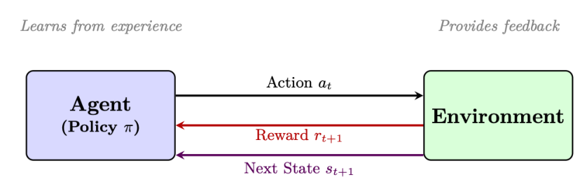
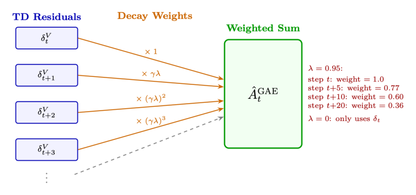

# 第 3 章 强化学习导论

强化学习(Reinforcement Learning, RL)是一种学习范式：智能体(agent)通过与环境(environment)交互来学习做出序列决策，将奖励(reward)作为反馈，并优化其策略(policy)以最大化长期累积奖励 [158]。与监督学习(需要标注的输入-输出对)不同，RL 通过试错(trial and error)来发现最优行为。



## 3.1 马尔可夫决策过程(MDP)

MDP 是一个五元组 $(S, A, P, R, \gamma)$：

- $S$：状态空间(state space)——环境所有可能的配置。
- $A$：动作空间(action space)——智能体可采取的所有动作。
- $P(s' \mid s, a)$：转移函数(transition function)——在状态 $s$ 下采取动作 $a$ 后到达状态 $s'$ 的概率。
- $R(s, a, s')$：奖励函数(reward function)——一次转移所获得的即时标量反馈。
- $\gamma \in [0, 1]$：折扣因子(discount factor)——未来奖励相对于即时奖励的权重量度。

**马尔可夫性质(Markov Property)**：未来只取决于当前状态，而不取决于历史：

$$P(s_{t+1} \mid s_t, a_t, s_{t-1}, a_{t-1}, \dots) = P(s_{t+1} \mid s_t, a_t)$$

这使得问题变得可处理。

**智能体-环境交互循环**：在每个时间步 $t$：

1. 智能体观察状态 $s_t$。
2. 智能体根据策略 $\pi(a \mid s)$ 选择动作 $a_t$。
3. 环境发生转移 $s_{t+1} \sim P(\cdot \mid s_t, a_t)$。
4. 智能体获得奖励 $r_t = R(s_t, a_t, s_{t+1})$。
5. 重复上述过程，直到到达终止状态或到达时界(horizon)$T$。

## 3.2 核心概念与定义

**策略** $\pi(a \mid s)$：从状态到动作概率的映射。确定性策略：$a = \pi(s)$。随机性策略：$a \sim \pi(\cdot \mid s)$。

**回报(Return，累积折扣奖励)**：

$$G_t = \sum_{k=0}^{\infty} \gamma^k r_{t+k} = r_t + \gamma r_{t+1} + \gamma^2 r_{t+2} + \cdots \tag{3.1}$$

**价值函数(Value Function，在策略 $\pi$ 下从状态 $s$ 出发的期望回报)**：

$$V^\pi(s) = \mathbb{E}_\pi \left[ G_t \mid s_t = s \right] = \mathbb{E}_\pi \left[ \sum_{k=0}^{\infty} \gamma^k r_{t+k} \;\middle|\; s_t = s \right] \tag{3.2}$$

**动作-价值函数(Action-Value Function，在状态 $s$ 采取动作 $a$ 后再遵循 $\pi$ 的期望回报)**：

$$Q^\pi(s, a) = \mathbb{E}_\pi \left[ G_t \mid s_t = s, a_t = a \right] \tag{3.3}$$

**优势函数(Advantage Function，动作 $a$ 相比平均水平好多少)**：

$$A^\pi(s, a) = Q^\pi(s, a) - V^\pi(s) \tag{3.4}$$

**贝尔曼方程(Bellman Equations，递归关系)**：

$$V^\pi(s) = \sum_{a} \pi(a \mid s) \sum_{s'} P(s' \mid s, a) \left[ R(s, a, s') + \gamma V^\pi(s') \right] \tag{3.5}$$

$$Q^\pi(s, a) = \sum_{s'} P(s' \mid s, a) \left[ R(s, a, s') + \gamma \sum_{a'} \pi(a' \mid s') Q^\pi(s', a') \right] \tag{3.6}$$

**最优策略与贝尔曼最优性(Bellman Optimality)**：最优策略 $\pi^*$ 满足：

$$V^*(s) = \max_{a} \sum_{s'} P(s' \mid s, a) \left[ R(s, a, s') + \gamma V^*(s') \right] \tag{3.7}$$

$$Q^*(s, a) = \sum_{s'} P(s' \mid s, a) \left[ R(s, a, s') + \gamma \max_{a'} Q^*(s', a') \right] \tag{3.8}$$

一旦求得 $Q^*$，最优策略即简单地写作：$\pi^*(s) = \arg\max_{a} Q^*(s, a)$。

## 3.3 RL 方法分类

强化学习算法可沿多条轴线进行分类。理解这一分类体系有助于针对给定问题选择合适的方法。

**关键分类维度**

**无模型(Model-Free) vs 有模型(Model-Based)**：

- 无模型：直接从经验中学习策略或价值函数，不掌握环境动力学知识。对 LLM 最实用(语言动力学难以建模)。
- 有模型：学习或使用环境转移模型 $P(s' \mid s, a)$，可前瞻规划(planning)。样本效率更高，但需要精确的模型。

**基于价值(Value-Based) vs 基于策略(Policy-Based)**：

- 基于价值：学习 $Q(s, a)$ 或 $V(s)$，将策略推导为 $\arg\max_{a} Q(s, a)$。适用于离散、较小的动作空间(如 Atari)。在连续/大动作空间上表现挣扎。
- 基于策略：直接对 $\pi_\theta(a \mid s)$ 进行参数化并优化。对连续/高维动作空间很自然。对 LLM 而言不可或缺(词表 = 32K–128K 个动作)。
- 演员-评论家(Actor-Critic)：二者结合——策略(actor，演员)提出动作，价值函数(critic，评论家)对其评估。面向 LLM 的 PPO 即为 actor-critic。

**同策略(On-Policy) vs 异策略(Off-Policy)**：

- 同策略：从当前策略生成的数据中学习。每次更新后必须重新生成数据。例如：REINFORCE、PPO、A2C。更稳定，但样本效率较低。
- 异策略：从任意策略(包括旧版本或其他智能体)生成的数据中学习，可重用过往经验。例如：Q-Learning、DQN、SAC。样本效率更高，但更难稳定。

## 3.4 时序差分(Temporal Difference, TD)学习

TD 学习 [159] 采用自举(bootstrap)——它用其他价值估计来更新价值估计，而无需等待完整回合(episode)结束。

### 3.4.1 理解 TD 误差：作为学习信号的“惊喜”

TD 误差(TD error)衡量的是智能体对未来奖励的当前估计与迈出一步后更新的新估计之间的差异。简言之，它是智能体原以为会发生的事与实际发生的事加上其后续预期之差。它代表了智能体的“惊喜(surprise)”。

**直觉：开车的类比**

设想你开车回家，预计全程 30 分钟。

- 预测：总耗时 30 分钟。
- 现实变化：10 分钟后遇到意外的道路施工。GPS 更新，显示你还需 35 分钟。
- TD 误差：总预计耗时现在变为 45 分钟(已过 10 分钟 + 剩余 35 分钟)。新估计(45 分钟)与旧估计(30 分钟)之差即为 +15 分钟的 TD 误差。你正是利用这种“惊喜”来改变下一次的路线。

正的 TD 误差意味着结果好于预期 → 提升该状态的价值。
负的 TD 误差意味着结果差于预期 → 降低该状态的价值。

### 3.4.2 TD 误差公式

$$\delta_t = R_{t+1} + \gamma V(S_{t+1}) - V(S_t) \tag{3.9}$$

- $R_{t+1}$：采取动作后收到的即时奖励。
- $\gamma V(S_{t+1})$：下一个状态的估计折扣价值(即智能体预期能从下一状态起获得的价值，并按折扣因子 $\gamma$ 缩放)。
- $V(S_t)$：当前状态价值的原始估计。

组合项 $(R_{t+1} + \gamma V(S_{t+1}))$ 被称为 **TD 目标(TD Target)**。因此：

$$\text{TD 误差} = \text{TD 目标} - \text{旧估计} \tag{3.10}$$

### 3.4.3 智能体如何使用 TD 误差

智能体调整其价值函数，以驱动 TD 误差趋向于零：

$$V(S_t) \leftarrow V(S_t) + \alpha \cdot \delta_t \tag{3.11}$$

- 若 $\delta_t > 0$：结果好于预测 → 增大 $V(S_t)$，使智能体趋向该状态。
- 若 $\delta_t < 0$：结果差于预测 → 减小 $V(S_t)$，使智能体避开该状态。
- 若 $\delta_t = 0$：预测完美 → 无需更新(收敛)。

**TD vs 蒙特卡洛(Monte Carlo)**

- 蒙特卡洛(Monte Carlo, MC)：等待回合结束，使用真实回报 $G_t$。无偏但方差大(一条完整轨迹可能不具代表性)。
- TD：每一步都用估计的未来价值 $\gamma V(s_{t+1})$ 更新。有偏(依赖于 $V$ 的准确性)但方差低得多(单步更新，不累积噪声)。
- TD($\lambda$)：在 TD(0) 与蒙特卡洛之间插值。$\lambda = 0$：纯 TD。$\lambda = 1$：纯 MC。这正是 GAE 在 PPO 中所做的事(取 $\lambda = 0.95$)。
- TD 目标：$y_t = r_t + \gamma V(s_{t+1})$——我们朝其靠拢的“更好估计”。
- 多步 TD(n-step returns)：

$$G_t^{(n)} = r_t + \gamma r_{t+1} + \cdots + \gamma^{n-1} r_{t+n-1} + \gamma^n V(s_{t+n}) \tag{3.12}$$

## 3.5 Q-Learning

Q-Learning [160] 是基础性的异策略(off-policy)、基于价值(value-based)算法。无论实际遵循的策略为何，它都直接学习最优的 $Q^*$。

**更新规则**：

$$Q(s_t, a_t) \leftarrow Q(s_t, a_t) + \alpha \left[ r_t + \gamma \max_{a'} Q(s_{t+1}, a') - Q(s_t, a_t) \right] \tag{3.13}$$

**为何 Q-Learning 是异策略的**

更新使用的是 $\max_{a'} Q(s_{t+1}, a')$——即下一状态下最优动作的价值，而无论智能体实际采取了哪个动作。这意味着目标始终是在最优策略下计算的，即使行为策略随机探索(如 $\epsilon$-greedy)。

这正是 Q-Learning 能够从经验回放缓冲区(replay buffer)、示范数据或任何经验来源中学习的原因。数据不必来自当前策略。

**SARSA** [161](同策略替代方案)：使用实际采取的动作而非最大值：

$$Q(s_t, a_t) \leftarrow Q(s_t, a_t) + \alpha \left[ r_t + \gamma Q(s_{t+1}, a_{t+1}) - Q(s_t, a_t) \right] \tag{3.14}$$

**深度 Q 网络(Deep Q-Networks, DQN)** [162]：用神经网络 $Q_\theta(s, a)$ 替代表格形式的 $Q(s, a)$。关键创新：经验回放缓冲区(异策略数据复用)、目标网络(target network，稳定性)、$\epsilon$-greedy 探索。

**DQN 损失函数**：网络通过最小化从回放缓冲区采样的 mini-batch 上的均方 TD 误差进行训练：

$$\mathcal{L}(\theta) = \mathbb{E}_{(s,a,r,s') \sim \mathcal{B}} \left[ \left( r + \gamma \max_{a'} \bar{Q}_\theta(s', a') - Q_\theta(s, a) \right)^2 \right] \tag{3.15}$$

其中 $\bar{Q}_\theta$ 是目标网络——$Q_\theta$ 的冻结副本，每 $C$ 步更新一次(如 $C = 10{,}000$)。这可防止“移动目标(moving target)”问题：若没有目标网络，预测与目标会同时漂移，导致发散。

**梯度更新**：对损失关于 $\theta$ 求梯度(注意：目标 $y$ 被视为常数——没有梯度流经 $\bar{\theta}$)：

$$\nabla_\theta \mathcal{L} = -\mathbb{E} \left[ \underbrace{\left( r + \gamma \max_{a'} \bar{Q}_\theta(s', a') - Q_\theta(s, a) \right)}_{\text{TD 误差 } \delta} \nabla_\theta Q_\theta(s, a) \right] \tag{3.16}$$

$$\theta \leftarrow \theta - \alpha \cdot \delta \cdot \nabla_\theta Q_\theta(s, a) \tag{3.17}$$

**学习流程(每个训练步骤)**：

1. **行动(Act)**：通过 $\epsilon$-greedy 选择动作——以概率 $\epsilon$ 采取随机动作，否则 $a = \arg\max_{a} Q_\theta(s, a)$。在前 100 万步中将 $\epsilon$ 从 1.0 退火(anneal)到 0.01。
2. **存储(Store)**：将转移 $(s, a, r, s', d)$ 存入回放缓冲区 $\mathcal{B}$(容量约 100 万)。
3. **采样(Sample)**：从 $\mathcal{B}$ 中均匀采样 32 个 mini-batch 转移。
4. **计算目标(Compute target)**：$y = r + \gamma(1 - d) \max_{a'} \bar{Q}_\theta(s', a')$(若为终止状态则未来价值为零)。
5. **更新(Update)**：对 $(y - Q_\theta(s, a))^2$ 做梯度下降。将梯度裁剪(clip)到 $[-1, 1]$(Huber 损失变体)。
6. **同步目标(Sync target)**：每 $C$ 步执行 $\bar{\theta} \leftarrow \theta$。

### 3.5.1 理解经验回放缓冲区

经验回放缓冲区(replay buffer) [163](experience replay)是一种数据存储机制，保存过往经验以供智能体后续重新学习。智能体不再在动作执行后立即丢弃数据，而是将转移存入一个记忆库，并随机采样 mini-batch 用于训练。

**存储内容**：每条转移是一个元组：

$$e_t = (s_t, a_t, r_t, s_{t+1}, d_t) \tag{3.18}$$

其中 $d_t$ 是布尔标志，指示回合是否结束。

**为何经验回放缓冲区不可或缺**

- **打破数据相关性**：连续步骤高度相关，神经网络在序列数据上泛化较差。从缓冲区随机采样使训练样本近似独立同分布(i.i.d.)。
- **防止灾难性遗忘(catastrophic forgetting)**：若没有缓冲区，一个通过某困难关卡的智能体，可能会在接下来 1 万步里卡在后续关卡而忘记如何通过前一关。缓冲区确保它持续练习旧场景。
- **提升样本效率**：运行环境可能很慢。回放缓冲区允许同一条转移产生多次权重更新，从每一步中榨取更多价值。

```python
import random
from collections import deque

class ReplayBuffer:
    def __init__(self, capacity):
        self.buffer = deque(maxlen=capacity)  # 有界队列

    def push(self, state, action, reward, next_state, done):
        self.buffer.append((state, action, reward, next_state, done))

    def sample(self, batch_size):
        # 通过随机选取经验来打破相关性
        return random.sample(self.buffer, batch_size)

    def __len__(self):
        return len(self.buffer)
```

**优先经验回放(Prioritized Experience Replay, PER)**

在标准缓冲区中，所有经验具有相等的采样概率。但有些经验更具“教育意义”。PER [164] 按 TD 误差幅度缩放采样概率——若某条转移造成了巨大的“惊喜”(高 $|\delta_t|$)，智能体就更频繁地采样它，以更快地修正模型。这在 Atari 基准上可加速学习 2–3 倍。

**为何 Q-Learning 对 LLM 失效**

语言生成的动作空间是整个词表($|A| = \text{32K–128K}$)，状态空间是所有可能的词元(token)序列(无穷大)。在每个词元位置上对所有 128K 个动作计算 $\max_{a} Q(s, a)$ 是不可行的。这就是 LLM 的 RL 改用基于策略的方法(PPO、GRPO)的原因。

## 3.6 策略梯度方法 —— REINFORCE

不再学习价值函数并从中推导策略，而是直接优化策略参数 $\theta$ 以最大化期望回报 [165]。

**目标**：$J(\theta) = \mathbb{E}_{\tau \sim \pi_\theta} [R(\tau)] = \mathbb{E}_{\pi_\theta} \left[ \sum_{t=0}^{T} r_t \right]$。

**策略梯度定理(Policy Gradient Theorem)**：

$$\nabla_\theta J(\theta) = \mathbb{E}_{\pi_\theta} \left[ \sum_{t=0}^{T} \nabla_\theta \log \pi_\theta(a_t \mid s_t) \cdot G_t \right] \tag{3.19}$$

**策略梯度定理 —— 形式化推导(5 步)**

**第 1 步：定义目标。** 我们希望最大化期望回报：

$$J(\theta) = \mathbb{E}_{\tau \sim \pi_\theta} \left[ \sum_{t=0}^{T} r_t \right] = \sum_{\tau} P(\tau \mid \theta) R(\tau)$$

其中 $P(\tau \mid \theta) = p(s_0) \prod_{t=0}^{T} \pi_\theta(a_t \mid s_t)\, p(s_{t+1} \mid s_t, a_t)$ 是轨迹概率。

**第 2 步：取梯度。** 只有 $\pi_\theta$ 项依赖于 $\theta$(动力学 $p$ 不依赖)：

$$\nabla_\theta J = \sum_{\tau} \nabla_\theta P(\tau \mid \theta)\, R(\tau)$$

**第 3 步：应用对数导数技巧(log-derivative trick)**：$\nabla_\theta P(\tau \mid \theta) = P(\tau \mid \theta)\, \nabla_\theta \log P(\tau \mid \theta)$：

$$\nabla_\theta J = \mathbb{E}_{\tau \sim \pi_\theta} \left[ \nabla_\theta \log P(\tau \mid \theta)\, R(\tau) \right]$$

**第 4 步：展开 $\log P(\tau \mid \theta)$。** $\log p(s_0)$ 与 $\log p(s_{t+1} \mid s_t, a_t)$ 项在 $\nabla_\theta$ 下消失：

$$\nabla_\theta \log P(\tau \mid \theta) = \sum_{t=0}^{T} \nabla_\theta \log \pi_\theta(a_t \mid s_t)$$

**第 5 步：合并。** 未来奖励不依赖过去动作(因果性)，因此每个 $\nabla \log \pi$ 仅与未来回报 $G_t = \sum_{t'=t}^{T} r_{t'}$ 配对：

$$\nabla_\theta J = \mathbb{E}_{\pi_\theta} \left[ \sum_{t=0}^{T} \nabla_\theta \log \pi_\theta(a_t \mid s_t) \cdot G_t \right]$$

**为何这很美妙**

该梯度不需要对环境动力学 $p(s' \mid s, a)$ 进行微分。对数导数技巧将其转化为一个期望，而我们只需运行策略并观察奖励即可估计它。用优势 $\hat{A}_t = G_t - V(s_t)$ 替换 $G_t$ 可在不引入偏差的同时降低方差(因为对任何依赖状态的基线都有 $\mathbb{E}[\nabla \log \pi \cdot b(s)] = 0$)。

**REINFORCE 算法** [165](Williams, 1992)：

1. 在 $\pi_\theta$ 下采样完整轨迹 $\tau = (s_0, a_0, r_0, s_1, a_1, r_1, \dots)$。
2. 对每个时间步计算回报 $G_t = \sum_{k=0}^{T-t} \gamma^k r_{t+k}$。
3. 更新：$\theta \leftarrow \theta + \alpha \sum_{t} \nabla_\theta \log \pi_\theta(a_t \mid s_t) \cdot G_t$。

**REINFORCE 直觉 —— “奖励加权最大似然”**

$\nabla_\theta \log \pi_\theta(a_t \mid s_t)$ 是增加动作 $a_t$ 出现概率的方向。乘以 $G_t$ 意味着：

- 高奖励轨迹：增大所采取的全部动作的概率(正的 $G_t$)。
- 低奖励轨迹：减小所采取动作的概率(减去基线后为负的 $G_t$)。

这相当于一种监督学习，其“标签”是你所采取的动作，并按它们最终效果的好坏进行加权。

**用基线(Baseline)降低方差**：

$$\nabla_\theta J(\theta) = \mathbb{E}_{\pi_\theta} \left[ \sum_{t=0}^{T} \nabla_\theta \log \pi_\theta(a_t \mid s_t) \cdot (G_t - b(s_t)) \right] \tag{3.20}$$

任何不依赖 $a_t$ 的基线 $b(s_t)$ 都能保持梯度无偏，同时降低方差。最佳选择：$b(s_t) = V^\pi(s_t)$。此时 $G_t - V(s_t) \approx A^\pi(s_t, a_t) = \text{优势}$。

**REINFORCE 的局限**

- **方差大**：每次梯度只用一条轨迹。需要数千样本才能稳定更新。
- **不自举**：必须等待完整回合(没有部分信用)。
- **样本效率低**：数据用一次即丢弃(同策略)。
- **无步长控制**：可能迈出灾难性的过大策略步。

这些局限促成了如下演进路线：REINFORCE → Actor-Critic → TRPO → PPO。

## 3.7 Actor-Critic 方法

将策略梯度(actor，演员)与学习到的价值函数(critic，评论家)相结合，以在保持策略优化灵活性的同时降低方差。

**架构**：

- **Actor** $\pi_\theta(a \mid s)$：策略，负责提出动作。
- **Critic** $V_\phi(s)$ 或 $Q_\phi(s, a)$：评估某状态/动作的好坏，提供低方差基线。

**Actor 更新**(使用来自 critic 的优势)：

$$\nabla_\theta J = \mathbb{E} \left[ \nabla_\theta \log \pi_\theta(a_t \mid s_t) \cdot \hat{A}_t \right], \quad \hat{A}_t = r_t + \gamma V_\phi(s_{t+1}) - V_\phi(s_t) \tag{3.21}$$

**Critic 更新**(最小化 TD 误差)：

$$\mathcal{L}_{\text{critic}} = \mathbb{E} \left[ \left( r_t + \gamma V_\phi(s_{t+1}) - V_\phi(s_t) \right)^2 \right] \tag{3.22}$$

**面向 LLM 演进到 PPO**

1. **REINFORCE** [165]：方差大、不自举 → 对 LLM 不实用。
2. **A2C/A3C** [166](Advantage Actor-Critic，优势演员-评论家)：使用基于 TD 的优势，方差更低，但步长无界。
3. **TRPO** [167]：约束策略更新间的 KL 散度，稳定但开销大(二阶方法)。
4. **PPO** [168]：裁剪策略比率，仅用一阶优化即可达到与 TRPO 类似的稳定性。这是 LLM RL 训练的标准方法。
5. **GRPO**：彻底移除 critic，使用分组统计(group statistics)作为基线。更简单，对可验证奖励(verifiable rewards)有效。

## 3.8 广义优势估计(Generalized Advantage Estimation, GAE)

**动机**：Actor-Critic 框架需要对优势 $A(s, a) = Q(s, a) - V(s)$(这一动作比平均水平好多少)的良好估计。但存在一个根本性的张力：

- **1 步 TD 优势**($r_t + \gamma V(s_{t+1}) - V(s_t)$)：方差低(只有一步随机)，但有偏——若价值函数 $V$ 不准确，优势估计就会系统性地偏离。
- **蒙特卡洛优势**($G_t - V(s_t)$)：无偏(使用真实回报)，但方差高——许多随机奖励之和在不同回合间剧烈波动。

GAE [169](Schulman 等人, 2016)通过单个参数 $\lambda \in [0, 1]$ 在这两个极端之间提供平滑插值。它对所有 $n$ 的 n-step 优势估计取指数加权平均，给出了一种有原则的以偏差换方差的方法。

**核心思想**：在每个时间步计算 1 步 TD 误差 $\delta_t$，然后用指数衰减权重 $(\gamma\lambda)^l$ 将它们混合——近期的 TD 误差获得全权重，远期的被降权：

$$\hat{A}_t^{\text{GAE}} = \sum_{l=0}^{T-t} (\gamma\lambda)^l \delta_{t+l}, \quad \delta_t = r_t + \gamma V(s_{t+1}) - V(s_t) \tag{3.23}$$



**$\lambda$ 控制什么 —— 偏差-方差权衡**

- $\lambda = 0$：$\hat{A}_t = \delta_t = r_t + \gamma V(s_{t+1}) - V(s_t)$。完全信任价值函数。方差低，但若 $V$ 不准则有偏。
- $\lambda = 1$：$\hat{A}_t = \sum_{l} \gamma^l r_{t+l} - V(s_t)$。完整的蒙特卡洛回报减去基线。无偏但方差非常高。
- $\lambda = 0.95$(标准取值)：最佳平衡点。主要信任 $V$，但用真实回报修正远期效果。之所以有效，是因为价值头在初始训练后会变得准确。

**对 LLM 而言**：$\gamma = 1.0$(无时间折扣——单轮中所有词元同等重要)，$\lambda = 0.95$。

### 3.8.1 GAE 中偏差与方差的直觉映射

在监督学习中，偏差与方差源于模型的结构性假设。而在通过 GAE 进行的强化学习中，它们源于你多大程度上信任一个有缺陷的模型，又多大程度上信任一个混沌的环境：

- **偏差(系统性错配)**：当估计器依赖于价值网络 $V_\theta$ 的结构性假设和不完美预测时产生。若 $\theta$ 训练不足或容量不够，基线猜测就会系统性出错。
- **方差(样本抖动)**：当估计器依赖于漫长的、不受约束的环境轨迹时产生。随机转移、随机种子和策略执行噪声在长时域上累积，导致经验样本奖励在不同 rollout 之间剧烈摆动。

### 3.8.2 架构谱系：边界分析

![图 3.3：GAE 中的偏差与方差：$\lambda$ 控制权衡。较小的 $\lambda$(左)通过自举得到高偏差 / 低方差；较大的 $\lambda$(右)使用完整蒙特卡洛回报得到低偏差 / 高方差。最优选择($\lambda \in [0.9, 0.95]$)在稳定训练与准确的长时域信用分配之间取得平衡。](../../images/part-i-foundations/introduction-to-reinforcement-learning/introduction-to-reinforcement-learning-p128-04.png)

超参数 $\lambda$ 充当两种根本性估计范式之间的滑动调节器。

**高偏差 / 低方差极限($\lambda = 0$)**

$$\hat{A}_t^{\text{GAE}(\gamma, 0)} = \delta V_t = r_t + \gamma V_\theta(s_{t+1}) - V_\theta(s_t) \tag{3.24}$$

- **行为**：优势在很大程度上由参数 $\theta$ 的当前状态所主导。
- **直觉**：高度有偏，因为网络是在 1 步窗口内给自己打分；若 $V_\theta$ 不准确，梯度步就被污染。方差低，因为它忽略了 $t+1$ 步以外的未来随机事件，从而带来平滑、稳定的参数更新。
- **风险**：策略陷入次优局部极小值——永远无法发现复杂的延迟奖励序列。

**低偏差 / 高方差极限($\lambda = 1$)**

当 $\lambda = 1$ 时，中间的价值项望远镜式地相消，使 GAE 退化为蒙特卡洛回报减去基线：

$$\hat{A}_t^{\text{GAE}(\gamma, 1)} = \sum_{l=0}^{\infty} \gamma^l r_{t+l} - V_\theta(s_t) \tag{3.25}$$

- **行为**：丢弃自举前瞻，把整段回合的真实现实累加起来。
- **直觉**：相对于真实环境动力学完全无偏——度量的是真实奖励而非神经网络的近似。然而方差极大：回合早期的微小扰动可能导致完全发散的总回报，使策略更新变得不稳定。
- **风险**：破坏性的梯度更新；训练爆炸。

### 3.8.3 权衡矩阵

通过选择 $\lambda \in [0.95, 0.99]$，GAE 最小化优势估计的总均方误差：

**表 3.1：GAE 参数选择的运作对比。**

| 配置 | 统计性质 | 核心依赖 | 实际风险 |
|---|---|---|---|
| $\lambda = 0$ | 高偏差，低方差 | 模型参数($\theta$) | 策略陷入次优局部极小值 |
| $\lambda \in [0.95, 0.99]$ | 均衡(最优 MSE) | 混合 | 需要根据环境随机性调参 |
| $\lambda = 1$ | 低偏差，高方差 | 经验环境 rollout | 破坏性梯度更新；训练爆炸 |

### 3.8.4 调参 $\lambda$ 的诊断方法

监控训练曲线可直接洞察是偏差还是方差占主导：

1. **高方差指标**：策略熵(strategy entropy)急剧下降，同时价值函数的已解释方差(explained variance)变得高度为负或紊乱 → 策略更新噪声大。**对策**：降低 $\lambda$ 以平滑目标更新。
2. **高偏差指标**：智能体在早期获得稳定训练，却完全无法发现复杂的延迟奖励序列 → 因自举而低估了长时域依赖。**对策**：将 $\lambda$ 调高至接近 1.0，让策略接触到真实的下游轨迹信号。

## 3.9 同策略 vs 异策略 —— 详细对比

| 维度 | 同策略(On-Policy) | 异策略(Off-Policy) |
|---|---|---|
| 数据来源 | 仅当前策略 $\pi_\theta$ | 任意策略(回放缓冲区) |
| 更新后 | 旧数据失效，必须重新生成 | 旧数据仍可用 |
| 样本效率 | 低(数据只用一次) | 高(数据复用多次) |
| 稳定性 | 更稳定(分布一致) | 可能发散(分布失配) |
| 示例 | REINFORCE、PPO、A2C、GRPO | Q-Learning、DQN、SAC、DPO |
| 对 LLM | PPO、GRPO(每步重新生成) | DPO(静态偏好数据集) |

**RLHF 方法的同策略/异策略**

PPO/GRPO 是同策略的：用当前策略生成响应，计算优势，更新，丢弃数据，再次生成。正因如此，生成占用了 60% 的算力——每一步都要重新生成。

DPO 是异策略的：在固定的偏好数据集上训练，训练期间无需生成。便宜得多，但会受分布漂移(distribution shift)之苦(随着策略改变，数据变得陈旧)。

在线 DPO(Online DPO)是混合方法：生成新数据(同策略生成)，但使用 DPO 的监督式损失(异策略式优化)。兼得两者之长。

**PPO 的巧妙之处**：使用裁剪比率 $r = \pi_{\text{new}} / \pi_{\text{old}}$，从一批同策略数据中挤出多次梯度步(4 个 epoch)，使其以受控方式“略带异策略”。

## 3.10 有模型 vs 无模型

| 维度 | 无模型(Model-Free) | 有模型(Model-Based) |
|---|---|---|
| 学习对象 | 直接学习策略 $\pi$ 和/或价值 $V / Q$ | 环境模型 $\hat{P}(s' \mid s, a)$ |
| 规划 | 无规划，反应式决策 | 可模拟未来轨迹 |
| 样本效率 | 低(必须亲历一切) | 高(可在想象中规划) |
| 精度 | 无模型偏差 | 模型误差累积 |
| 适用场景 | 复杂/未知动力学 | 简单动力学、需要效率 |
| 示例 | PPO、DQN、SAC [170] | MuZero [171]、Dreamer [172]、AlphaGo [19] |

**为何 LLM 的 RL 是无模型的**

语言生成的动力学很简单(把词元追加到序列——确定性转移)。环境的“模型”并非瓶颈。困难之处在于奖励——预测人类会偏好什么。这使得有模型方法对 LLM 的 RL 没有必要。

RLHF 中的奖励模型(reward model)在某种意义上可视为一个“模型”(它预测人类偏好)，但它是作为奖励信号使用的，而非用于规划/模拟。LLM 的 RL 本质上是无模型的策略优化。

## 3.11 奖励塑形(Reward Shaping)

奖励塑形 [173] 是一种由开发者修改或补充环境原始奖励函数的技术。其主要目标是将稀疏奖励场景(sparse reward scenario，即智能体仅在任务最终完成时才收到反馈)转化为具有中间反馈信号的密集奖励场景(dense reward scenario)，以加速收敛。

### 3.11.1 数学框架

设时间步 $t$ 的原始奖励为 $R_t(s, a, s')$。塑形后的奖励添加一个辅助塑形函数 $F$：

$$R'_t(s, a, s') = R_t(s, a, s') + F(s, a, s') \tag{3.26}$$

**朴素塑形的风险：奖励黑客(Reward Hacking)**

若 $F(s, a, s')$ 被任意设计，智能体会找到结构性漏洞来最大化辅助信号，同时忽略全局目标。

**示例**：一个因到达中间路标而获得奖励的导航智能体，可能会学会在单个检查点附近无限循环以累积无穷奖励——而永远不到达目的地。

**对 LLM**：一个因“听起来自信”而受奖励的模型，可能会学会无论准确与否都以“Absolutely!”开头。

### 3.11.2 基于势函数的奖励塑形(PBRS)

为了从数学上保证塑形不改变最优策略，使用基于势函数的奖励塑形(Potential-Based Reward Shaping, PBRS)。塑形函数 $F$ 被约束为标量势函数 $\Phi$ 在状态间的差值：

$$F(s, a, s') = \gamma \Phi(s') - \Phi(s) \tag{3.27}$$

其中 $\Phi : S \to \mathbb{R}$ 是一个实值势函数，评估某状态接近目标的期望程度，$\gamma$ 是折扣因子。

完整的 PBRS 奖励：

$$R'(s, a, s') = R(s, a, s') + \gamma \Phi(s') - \Phi(s) \tag{3.28}$$

### 3.11.3 理论保证

**PBRS 策略不变性定理(PBRS Policy Invariance Theorem)**

- **策略不变性**：塑形奖励 $R'$ 下的最优策略 $\pi^*$ 与原始奖励 $R$ 下的最优策略完全相同。塑形不会引入次优行为。
- **循环免疫**：任何起止于同一状态的循环轨迹，其净势变化恰为零($\Phi(s) - \Phi(s) = 0$)。智能体无法利用循环来欺骗奖励。
- **收敛加速**：最优策略虽然不变，但塑形后的奖励提供了更密集的梯度信号，使智能体在稀疏奖励环境中收敛速度可提升 5–50 倍。
