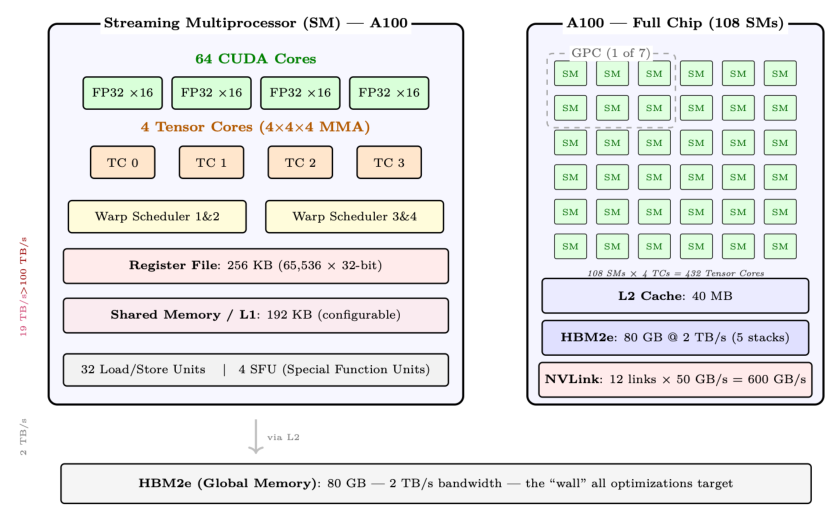
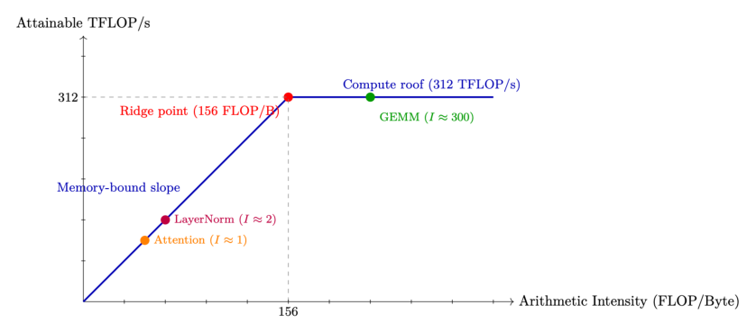
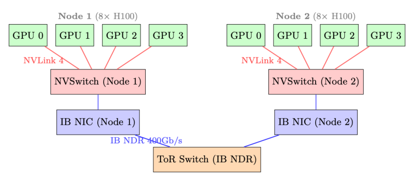
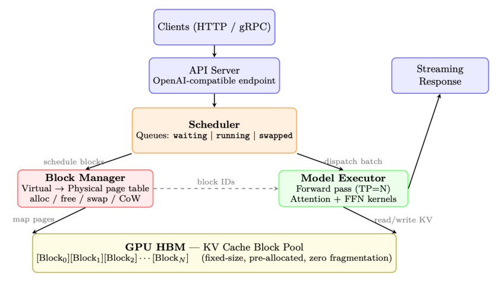

# LLM 的系统基础

## 2.1 GPU 架构——从硅片到 LLM 训练

现代大语言模型(Large Language Model, LLM)的训练和部署几乎完全依赖 GPU(图形处理器,Graphics Processing Unit)。理解 GPU 架构,对于在并行策略、内存管理、算子(kernel)优化和基础设施规模规划方面做出明智决策至关重要。本节将全面介绍与 LLM 工作负载相关的 GPU 硬件知识。

### 2.1.1 为什么深度学习要用 GPU?

GPU 和 CPU 代表了两种根本不同的硬件设计哲学。理解这一差异,就能解释为什么 LLM 训练在 GPU 上比 CPU 快 100–1000 倍。

**CPU 与 GPU——根本的设计哲学**

- **CPU 为延迟优化**——它以尽可能快的速度执行少量线程,配备大容量缓存、分支预测器和乱序执行。一块现代 CPU 拥有 8–96 个核心。
- **GPU 为吞吐量优化**——它并行执行数千个线程,每个线程只做简单的工作。一块现代 GPU 拥有数千个"核心"(执行单元),被组织成若干流多处理器(Streaming Multiprocessor, SM)。

深度学习工作负载以矩阵乘法为主(对 $O(n^2)$ 的数据执行 $O(n^3)$ 运算),这类计算天然可并行(embarrassingly parallel)。对于一个 70B 参数的模型,单次 Transformer 前向传播每个词元(token)需要约 140 TFLOP 的计算量——完美契合 GPU 的高吞吐量特性。

### 2.1.2 NVIDIA GPU 微架构世代

NVIDIA 发布了一系列 GPU 架构,每一代都为深度学习带来了关键创新:

### 2.1.3 LLM 训练与推理常用 GPU

**该选哪款 GPU?**

- **训练 70B+ 模型**:搭配 NVLink 的 H100/B200 节点(张量并行需要高速互连)。每实例至少 8×H100。
- **推理(对延迟敏感)**:H100/H200 用于高带宽场景;MI300X 适用于访存受限场景(巨大的 KV 缓存)。
- **微调 7B–13B**:A100-80GB 性价比高。单 GPU 配合 LoRA。
- **预算有限**:A100-40GB,甚至 A10(24GB)用于 7B 模型的 LoRA。

**表 2.1:NVIDIA 深度学习 GPU 微架构时间线。**

| 架构 | 年份 | 旗舰产品 | 关键深度学习创新 |
|---|---|---|---|
| Pascal | 2016 | P100 | 首款 HBM GPU;支持 FP16;NVLink 1 |
| Volta | 2017 | V100 | Tensor Core(第一代);混合精度训练 |
| Turing | 2018 | T4 | INT8 推理;RT 核心(非 ML 用途) |
| Ampere | 2020 | A100 | BF16 Tensor Core;TF32;第三代 NVLink;MIG |
| Hopper | 2022 | H100 | FP8 Tensor Core;TMA;Transformer Engine;NVLink 4 |
| Blackwell | 2024 | B200 | 第二代 Transformer Engine;NVLink 5(1.8 TB/s);FP4 |

**表 2.2:与 LLM 工作负载相关的 GPU 规格。所有带宽均为双向。**

| GPU | 架构 | HBM | BF16 TFLOPS | HBM 带宽 | NVLink | LLM 角色 |
|---|---|---|---|---|---|---|
| V100-32GB | Volta | 32 GB | 125 TF* | 900 GB/s | 300 GB/s | 旧款;小模型微调 |
| A100-40GB | Ampere | 40 GB | 312 TF | 1.5 TB/s | 600 GB/s | 预算型训练/推理 |
| A100-80GB | Ampere | 80 GB | 312 TF | 2.0 TB/s | 600 GB/s | 标准 RLHF(70B 需 8–64 块) |
| H100 SXM | Hopper | 80 GB | 990 TF | 3.35 TB/s | 900 GB/s | 训练速度提升 3 倍 |
| H200 SXM | Hopper | 141 GB | 990 TF | 4.8 TB/s | 900 GB/s | 更少 GPU 即可容纳 70B 策略+参考模型 |
| B200 SXM | Blackwell | 192 GB | 2250 TF | 8.0 TB/s | 1800 GB/s | 下一代;相对 H100 提升 2 倍 |
| **AMD 与 Google 替代方案:** | | | | | | |
| MI300X | CDNA3 | 192 GB | 1300 TF | 5.3 TB/s | N/A | 显存最大;ROCm |
| TPU v5e | Google | 16 GB | 197 TF | 1.6 TB/s | ICI 1.6 TB/s | 仅云;JAX/XLA |

### 2.1.4 GPU 内部架构——流多处理器(SM)

一块 GPU 由一组流多处理器(Streaming Multiprocessor, SM)阵列构成,每个 SM 都是一个独立的处理器,拥有自己的寄存器堆、共享内存和执行单元。理解 SM 是理解 GPU 性能的关键。



**SM 的关键组件**

- **CUDA 核心**:用于 FP32/INT32 运算的标量 ALU。A100 上每个 SM 配备 64 个。用于逐元素运算、归约和非矩阵运算。
- **Tensor Core**:专用的矩阵乘累加(MMA)单元。每个核心每周期完成一次 4×4×4 的融合乘加。A100 上每个 SM 配备 4 个,在支持的精度下吞吐量比 CUDA 核心高 16 倍。
- **寄存器堆**:最快的存储(1 个周期延迟)。被所有活跃线程共享。寄存器溢出到 L1 会导致显著的性能下降。
- **共享内存 / L1**:由程序员显式管理的片上 SRAM。这是 Flash Attention 性能的关键(计算分块完全装入共享内存)。
- **线程束调度器**:每个 SM 有 4 个线程束调度器(A100)。一个线程束(warp)= 32 个同步执行的线程(SIMT 模型)。调度器通过在线程束之间切换来隐藏访存延迟。

**SIMT 执行模型**

GPU 采用单指令多线程(Single Instruction, Multiple Threads, SIMT)执行方式。在一个线程束(32 个线程)内,所有线程执行相同指令,但作用于不同数据。当线程发生分叉(例如 if/else)时,两条路径会被串行执行——称为线程束分叉(warp divergence)。这就是 GPU 算子必须尽量减少分支的原因。

对于 LLM 工作负载,主要运算(GEMM、注意力、softmax)在所有线程间具有统一的控制流,非常适合 SIMT 执行。

### 2.1.5 各代 GPU 芯片的规模演进

NVIDIA GPU 架构的演进表明,计算密度、片上内存以及面向深度学习的专用单元都在持续扩展:

**表 2.3:各代 NVIDIA 架构的 SM 级扩展。**

| 架构 | SM 数 | TC/SM | SRAM/SM | L2 | 关键变化 |
|---|---|---|---|---|---|
| Volta (V100) | 80 | 8 | 128 KB | 6 MB | 引入 Tensor Core |
| Ampere (A100) | 108 | 4 | 192 KB | 40 MB | BF16/TF32;更大的 L2 |
| Hopper (H100) | 132 | 4 | 256 KB | 50 MB | TMA;FP8;线程块簇 |
| Blackwell (B200) | 148 | 4 | 256 KB | 128 MB | 2 倍芯片面积;FP4;TMEM;NVLink 5 |

### 2.1.6 GPU 内存层次与带宽

现代 GPU 的训练和推理性能,几乎完全取决于你如何管理数据在内存层次中的流动。理解这一层次不是可选项——它是后续各节讨论的所有优化技术的基础。

**GPU 内存层次——A100 80GB 参考数值**

| 层级 | 容量 | 带宽 | 延迟 | 位置 |
|---|---|---|---|---|
| 寄存器 | ~256 KB/SM | >100 TB/s | 1 周期 | 片上,每线程 |
| SRAM(共享) | 164 KB/SM | ~19 TB/s | ~20 周期 | 片上,每 SM |
| L2 缓存 | 40 MB(总计) | ~5 TB/s | ~200 周期 | 片上,共享 |
| HBM2e(VRAM) | 80 GB | 2 TB/s | ~200 ns | 封装内(5 堆叠) |
| CPU DRAM | 512 GB+ | ~25 GB/s | ~10 µs | 主机侧(PCIe 4) |
| NVMe SSD | TB 级 | 7 GB/s | ~100 µs | 主机存储 |

**各层之间的差距为何如此悬殊**

层次中的每一级都比上一级慢约 10 倍、大 100–1000 倍。A100 拥有 312 TFLOP/s 的 BF16 Tensor Core 吞吐量,但 HBM 带宽只有 2 TB/s。这意味着从 HBM 每加载一个字节,在下一个字节到达之前可以完成 $312 \times 10^{12} / (2 \times 10^{12}) \approx 156$ 次浮点运算。如果你的算子每字节做不到 156 次 FLOP,它就是访存受限(memory-bound)的——计算单元在空等数据。

**寄存器。** 每个 CUDA 线程都可访问一个私有寄存器堆。寄存器是芯片上最快的存储——读写在一个时钟周期内完成,无需仲裁。A100 每个 SM 配备 65,536 个 32 位寄存器。寄存器溢出到本地内存(L1/L2)是一个主要的性能隐患。

**SRAM——共享内存 / L1。** 每个 SM 在 A100 上拥有 192 KB 的合并式 L1/共享内存池(H100 上为 256 KB),A100 上最多可配置 164 KB 作为共享内存。共享内存由程序员(或在较新 CUDA 版本中由编译器)显式管理。例如,Flash Attention 的设计就完全建立在一个洞见之上:注意力的分块计算可以完全装入 SRAM。

**L2 缓存。** A100 上 40 MB 的 L2 缓存由全部 108 个 SM 共享,充当 SRAM 与 HBM 之间的暂存区。对于具有良好空间局部性的工作负载(例如权重矩阵在一个批次内被反复访问),L2 命中率可以大幅降低有效 HBM 流量。

**HBM——高带宽内存。** HBM 是直接堆叠在 GPU 封装上、通过宽中介层连接的 DRAM。A100 SXM 拥有 80 GB、带宽 2 TB/s 的 HBM2e;H100 SXM5 拥有 80 GB、带宽 3.35 TB/s 的 HBM3。这是模型权重、KV 缓存、激活值和优化器状态的主要工作内存。

**经 PCIe 连接的 CPU DRAM。** GPU HBM 与 CPU DRAM 之间的数据传输需经过 PCIe 总线。PCIe Gen4 ×16 在每个方向提供约 32 GB/s(双向 64 GB/s)带宽;Gen5 在此基础上翻倍。相比 HBM(每方向),这是约 60 倍的带宽下降。CPU 卸载(CPU offloading,ZeRO-Infinity、DeepSpeed)利用了这条链路,但必须谨慎使用,以免它成为瓶颈。

**NVMe。** NVMe SSD(如三星 990 Pro)的顺序读取可达约 7 GB/s。ZeRO-Infinity 可以把优化器状态卸载到 NVMe,但这只有在计算/IO 比值非常高时(大 batch size、训练步较慢)才可行。

### 2.1.7 算术强度与 Roofline 模型

**算术强度**

$$
I = \frac{\text{FLOPs}}{\text{从 HBM 读取的字节数}} \quad (\text{FLOPs / Byte})
$$

当一个算子的 $I < I_\text{ridge}$ 时为访存受限,$I > I_\text{ridge}$ 时为计算受限(compute-bound),其中

$$
I_\text{ridge} = \frac{\text{峰值 FLOP/s}}{\text{峰值带宽}} = \frac{312 \times 10^{12}}{2 \times 10^{12}} = 156 \;\text{FLOP/Byte} \quad (\text{A100 BF16})
$$

**注意力的算术强度**

对于一个序列长度 $n = 4096$、头维度 $d = 128$ 的单个注意力头:

- FLOPs:$Q K^\top$ 耗费 $2n^2 d$,softmax 为 $O(n^2)$,$\text{Attn} \times V$ 耗费 $2n^2 d$。总计:$\approx 4n^2 d = 4 \times 4096^2 \times 128 \approx 8.6$ GFLOP。

内存流量(标准、非 Flash 实现):

- 读取 $Q$、$K$:$2 \times n \times d \times 2 = 2$ MB
- 写入注意力分数 $S = Q K^\top$:$n^2 \times 2 = 33.5$ MB



- 读取 $S$ 用于 softmax:$n^2 \times 2 = 33.5$ MB
- 写入 softmax 输出 $P$:$n^2 \times 2 = 33.5$ MB
- 读取 $P$ 和 $V$ 用于最终矩阵乘:$n^2 \times 2 + n \times d \times 2 = 34.5$ MB
- 写入输出 $O$:$n \times d \times 2 = 1$ MB

总内存:$\approx 138$ MB(由对 $n^2$ 注意力矩阵的 4 次遍历主导)。

算术强度:

$$
I = \frac{8.6 \times 10^9}{138 \times 10^6} \approx 62 \;\text{FLOP/Byte}
$$

这只有 A100 屋脊点的 62/156 = 40%——稳稳地处于访存受限区。GPU 有 60% 的时间在空等内存。

**Flash Attention 的修复:** 通过绝不物化那个 $n \times n$ 矩阵(在 SRAM 中对 $Q$、$K$、$V$ 分块),Flash Attention 把 HBM 流量降到只需读取 $Q$、$K$、$V$ 并写入 $O$:$4 \times n \times d \times 2 = 4$ MB。每个加载的字节会在 $O(n)$ 次计算中被复用(每个查询都关注每个键),因此:

$$
I = \frac{4n^2 d}{4 \cdot n \cdot d \cdot 2} = \frac{n}{2} = \frac{4096}{2} = 2048 \;\text{FLOP/Byte}
$$

这是屋脊点(156)的 13 倍——深度计算受限。GPU 达到其峰值 312 TFLOPS,只需 312T/2048 ≈ 152 GB/s 的带宽(仅占 HBM 容量的 7.6%)。内存不再是瓶颈。

### 2.1.8 注意力是访存受限,FFN 是计算受限

**Transformer 中的两种状态**

一个 Transformer 块有两个主要组件,它们的算术强度截然不同:

- **注意力**:作用于 $n \times d$ 张量。$Q K^\top$ 乘积的 FLOPs 为 $O(n^2 d)$,但注意力分数需要 $O(n^2)$ 的内存。在长序列下,内存流量占主导——注意力是访存受限的。
- **FFN(MLP)**:两个大型线性层,权重矩阵形状为 $[d_\text{model},\, 4d_\text{model}]$。这些是算术强度很高的大型 GEMM——FFN 是计算受限的。

这就是为什么 Flash Attention(内存优化)对注意力有帮助而对 FFN 无益,而量化(降低权重大小)对 FFN 的帮助远大于对注意力的帮助。

### 2.1.9 Tensor Core

**什么是 Tensor Core?**

Tensor Core 是 Volta(2017)引入的专用矩阵乘累加(MMA)单元。每个 Tensor Core 在单个时钟周期内完成一次 4×4×4 的矩阵乘法:

$$
D = A \times B + C \quad (\text{4×4 矩阵})
$$

A100 在 108 个 SM 上共有 432 个 Tensor Core(每个 SM 4 个,每个子分区一个)。在 BF16 精度下,它们提供 312 TFLOP/s 的吞吐量——约为 FP32 CUDA 核心的 16 倍。

- **支持的精度**:FP64、TF32、BF16、FP16、INT8、FP8(H100+)。
- **累加**:内部始终以 FP32 进行,即便是 BF16 输入。这可以防止点积过程中发生灾难性抵消(catastrophic cancellation)。
- **要求**:当矩阵维度是 8(BF16)或 16(FP8)的倍数时,Tensor Core 效率最高。填充到这些倍数通常很值得。
- **WGMMA(H100)**:Hopper 引入了线程束组级(warpgroup-level)的 MMA 指令,作用于更大的分块(64×256×16),并且可以与 TMA(Tensor Memory Accelerator,张量内存加速器)的数据搬运进行流水化。

**Tensor Core 陷阱**

只有当你的算子是计算受限时,Tensor Core 才有帮助。如果你运行的是小批量(batch size 为 1 的推理),GEMM 分块很小,Tensor Core 利用率低,你又会回到访存受限的状态。这就是推理引擎会激进地对请求做批处理的原因。

### 2.1.10 通信架构——NVLink、InfiniBand 与 PCIe

分布式 LLM 训练和推理需要在 GPU、节点和存储之间搬运海量数据。对于大规模训练,通信网络往往是瓶颈。

**PCIe——主机-设备链路。**

**PCIe 各代**

| 代际 | ×16 带宽(每方向) | 双向 | 说明 |
|---|---|---|---|
| PCIe Gen3 | 16 GB/s | 32 GB/s | 旧服务器常见 |
| PCIe Gen4 | 32 GB/s | 64 GB/s | A100 PCIe,大多数现代服务器 |
| PCIe Gen5 | 64 GB/s | 128 GB/s | H100 PCIe,新兴 |

PCIe 用于:

- CPU ↔ GPU 数据传输(模型加载、CPU 卸载)
- 当 NVLink 不可用时的跨节点 GPU 通信(罕见,非常慢)
- NVMe 存储访问(经由 CPU)

**PCIe 不适合 GPU-GPU 通信**

只要有 NVLink 可用,就绝不要让 GPU 间的通信走 PCIe。PCIe 带宽(32 GB/s)比 NVLink 4(900 GB/s)低 28 倍。在没有 NVLink 的多 GPU 服务器中(例如消费级 GPU),GPU 间带宽受限于 PCIe,使得张量并行极其缓慢。

**NVLink——节点内高速互连。**

**NVLink 各代**

| 代际 | 链路数 | 总带宽 | GPU |
|---|---|---|---|
| NVLink 2 | 6 | 300 GB/s | V100 |
| NVLink 3 | 12 | 600 GB/s | A100 |
| NVLink 4 | 18 | 900 GB/s | H100 |
| NVLink 5 | 18 | 1800 GB/s | B200(Blackwell) |

NVLink 是同一节点内 GPU 之间的点对点互连。每条链路都是双向的。H100 SXM5 有 18 条 NVLink 4 链路,每条提供 50 GB/s 的双向带宽,总计 900 GB/s。

**NVSwitch。** 在 DGX H100 系统中,全部 8 块 GPU 通过 NVSwitch 互连——这是一种专用交换芯片,提供完整的二分带宽(bisection bandwidth)。这意味着任何 GPU 都能以全 NVLink 速度同时与任何其他 GPU 通信,而不仅限于环中的邻居。

**环 vs. 完整二分带宽**

在环形拓扑(8 块 GPU)中,AllReduce 要求数据沿环传递。每条链路必须承载总数据量的 $\frac{2(N-1)}{N}$,因此算法带宽为 $B_\text{link} \times \frac{N}{2(N-1)}$(对 $N=8$ 约为 $0.57 \times B_\text{link}$)。使用 NVSwitch 的完整二分带宽时,AllReduce 可以借助基于树的算法同时使用所有链路,达到接近峰值的带宽。在 DGX H100 上的实践中:环形达到约 700 GB/s 的总线带宽,NVSwitch 达到约 900 GB/s。

**InfiniBand——节点间通信。** 对于节点(服务器)之间的通信,InfiniBand 提供高带宽、低延迟、并支持直接 GPU 内存访问的网络。

**InfiniBand NDR**

- NDR 400 Gb/s = 每端口 50 GB/s(单向)
- HDR 200 Gb/s = 每端口 25 GB/s(上一代)
- RDMA:远程直接内存访问(Remote Direct Memory Access)——GPU 可以读写远端 GPU 内存,而无需远端 CPU 参与
- GPUDirect RDMA:数据直接走 HBM → NIC → 网络 → NIC → HBM,完全绕过 CPU 和系统 DRAM
- 延迟:小消息约 1–2 µs(对比 TCP/IP 约 100 µs)

**胖树(Fat-Tree)拓扑。** 大型 GPU 集群采用胖树网络拓扑。一个使用 $k$ 端口交换机的 3 层胖树,在完整二分带宽下可支持 $k^3/4$ 个节点。对于 $k=64$ 端口的 400 Gb/s NDR 交换机:$64^3/4 = 65{,}536$ 个节点。

**轨道优化(Rail-Optimized)拓扑。** 在实践中,集群采用轨道优化拓扑,即一个节点内的每块 GPU 都连接到不同的架顶(top-of-rack)交换机。这确保 AllReduce 操作(涉及所有 GPU)能同时使用所有网络链路,从而最大化带宽。

**分布式 LLM 训练中的通信模式。** 分布式训练依赖集合通信原语(collective communication primitives)。原语的选择决定了带宽需求和扩展行为。

**通信原语**

| 原语 | 用途 | 数据量 |
|---|---|---|
| AllReduce | 梯度同步(DDP、FSDP) | $2(N-1)/N \times$ 参数量 |
| AllGather | 收集分片权重(FSDP) | $(N-1)/N \times$ 参数量 |
| ReduceScatter | 分散梯度(FSDP) | $(N-1)/N \times$ 参数量 |
| AllGather | 张量并行的激活值 | 激活值大小 |
| 点对点 | 流水并行的发送/接收 | 微批次激活值 |
| Broadcast | 权重同步(新工作进程) | 完整模型大小 |

**带宽计算——70B 模型的梯度 AllReduce**

- 设置:70B 参数模型,BF16 梯度,8 节点 × 8 GPU = 64 块 GPU。数据并行度 = 64。
- 梯度大小:$70 \times 10^9 \times 2$ 字节 = 140 GB。
- 每块 GPU 的 AllReduce 数据量(环形):$2 \times (64-1)/64 \times 140 \approx 275$ GB。
- 可用节点间带宽:$8$ GPU/节点 × 50 GB/s/GPU = 400 GB/s(在轨道优化拓扑下,全部 8 个 NIC 都活跃)。
- AllReduce 时间:$275/400 \approx 0.69$ 秒/步。
- **含义**:对于一个 1 秒的计算步,通信要追加 0.69 秒(占总步时间的 41%)。

这就是为什么梯度压缩、混合精度以及 FSDP(它把通信与计算重叠)如此关键。

**网络拓扑图。** 下图展示了一个典型的双节点 GPU 集群拓扑,同时给出了节点内(NVLink)和节点间(InfiniBand)的通信路径。



**根据带宽选择并行策略**

- **张量并行(Tensor Parallelism, TP)**:每一层都需要 all-reduce——只在节点内、走 NVLink 使用。H100 DGX 节点的标准是 TP=8。
- **流水线并行(Pipeline Parallelism, PP)**:阶段之间的点对点通信——可以跨节点,但会增加流水线气泡开销。当模型对单独 TP 而言过大时使用。
- **数据并行(Data Parallelism, DP)**:梯度的 AllReduce——可通过 IB 跨节点。配合快速 IB 扩展性良好。
- **FSDP/ZeRO**:AllGather + ReduceScatter——类似 DP 但分片优化器状态。对于大模型,优先于 DP 使用。

## 2.2 vLLM——PagedAttention 与高吞吐推理

vLLM [157] 引入了 PagedAttention,它借鉴了操作系统用于 RAM 的分页抽象,并将其应用于 GPU 的 KV 缓存。在 LLM 推理期间,KV 缓存——即所有先前词元(key 和 value)的存储张量——是占主导地位的内存消费者。高效地管理它,是高吞吐推理的核心挑战。

### 2.2.1 KV 缓存碎片化问题

**KV 缓存内存公式**

对于一个有 $L$ 层、$H$ 个头、头维度 $d$ 的模型,以及一段长度为 $n$ 的词元序列:

$$
\text{KV 缓存大小} = 2 \times L \times H \times d \times n \times \text{bytes\_per\_element}
$$

对于 Llama-3 70B(BF16):$L = 80$,$H = 8$(GQA),$d = 128$:

$$
= 2 \times 80 \times 8 \times 128 \times n \times 2 = 327{,}680 \times n \;\text{字节}
$$

当 $n = 4096$ 个词元时:每条序列约 1.3 GB。

**内部碎片与外部碎片**

传统推理系统为每条序列的 KV 缓存预分配一块连续内存,大小按可能的最大序列长度计算。这会造成两类浪费:

- **内部碎片**:一条只生成 500 个词元的序列仍占着为 4096 个词元预留的块。未被使用的 3596 个词元槽位被浪费。
- **外部碎片**:当许多序列结束后,空闲内存由许多不连续的小块构成。一条新的长序列即便总空闲内存充足也无法被分配,因为没有单个连续块足够大。

在实践中,采用朴素分配时,GPU 内存利用率往往只有 20–40%。

### 2.2.2 PagedAttention——KV 缓存的虚拟内存

PagedAttention(Kwon 等人,2023)借鉴了操作系统的分页抽象。不再为每条序列分配一个连续块,KV 缓存被切成固定大小的页(block),一张间接寻址表(indirection table)——类似于 CPU 的页表——把每条序列的逻辑词元位置翻译为分散的物理 GPU 内存地址。

**PagedAttention 核心概念**

- **块大小**:通常每个块 16 个词元(可调)。每个块存储 $16 \times 2 \times L \times H \times d$ 个元素。
- **块表**:一条序列专用的、从逻辑块索引到 GPU 内存池中物理块索引的映射。
- **物理块池**:一个预分配的、由固定大小块构成的池。分配是 $O(1)$ 的——只需从空闲链表中弹出一个。
- **注意力算子**:被改造为在注意力计算期间,通过块表从非连续的物理位置收集 KV 块。

**块表示例**

设块大小 = 4 个词元,我们有两条序列:

- 序列 A(7 个词元):逻辑块 $[0,1] \rightarrow$ 物理块 $[3, 7]$
- 序列 B(5 个词元):逻辑块 $[0,1] \rightarrow$ 物理块 $[1, 5]$

物理块 3 存放序列 A 的词元 0–3。物理块 7 存放序列 A 的词元 4–6(部分填充)。序列 A 的注意力算子使用块表作为间接层,依次从物理块 3 和 7 中读取数据。

### 2.2.3 PagedAttention 的收益

**近乎零浪费。** 内部碎片被限制为每条序列最多一个部分填充的块(最后一个块)。块大小为 16 时,最坏情况下的浪费是每条序列 15 个词元——可以忽略。外部碎片被消除,因为块是固定大小且可互换的。

**动态分配。** 块在序列增长时按需分配。无需预先知道最终序列长度。这对生成式场景尤为关键,因为输出长度未知。

**前缀共享(写时复制)。** 共享公共前缀的多条序列(例如同一个系统提示)可以为该前缀共享相同的物理块。块表只需把多条序列指向同一批物理块即可。当某条序列需要写入一个共享块(从前缀处分叉)时,触发写时复制(copy-on-write)。

**前缀共享的节省**

在一个使用 1000 词元系统提示、并发服务 128 个用户的聊天机器人中:

- 不使用前缀共享:$128 \times 1000 \times 327{,}680 / 10^9 \approx 42$ GB(仅系统提示的 KV 缓存)
- 使用前缀共享:$1 \times 1000 \times 327{,}680 / 10^9 \approx 0.33$ GB
- 节省:对共享前缀部分约 128 倍

**通过交换实现的抢占(preemption)。** 当 GPU 内存耗尽时,vLLM 可以通过把某条序列的 KV 块交换(swap)到 CPU DRAM(或干脆丢弃它们、稍后重新计算)来抢占该序列。这之所以可行,正是因为块是自包含且不连续的——交换一个连续分配将需要拷贝整个缓冲区。

### 2.2.4 连续批处理(Continuous Batching)

传统的批处理("静态批处理",static batching)要等到一批中所有序列全部结束后才启动新批次。如果一条序列生成 500 个词元、另一条只生成 10 个,那么在短序列上 GPU 会空闲 490 步。这极其浪费。

**连续批处理**

连续批处理(又称迭代级调度,iteration-level scheduling)每次只处理一个解码步。每步之后:

1. 检查哪些序列已经结束(生成了 EOS 词元)
2. 从批次中移除已结束的序列,释放其 KV 块
3. 把新的等待中的序列加入,填补释放出的槽位
4. 用更新后的批次运行下一个解码步

批次的构成每步都在变——序列动态地加入和退出。这使 GPU 利用率接近 100%,并显著提升吞吐量(相对静态批处理提升 1.5–3 倍)。PagedAttention 在此不可或缺:在批次进行中增删序列需要动态的 KV 块分配/释放,而这只有在分页内存下才高效。

### 2.2.5 vLLM 中的投机解码(Speculative Decoding)

投机解码(speculative decoding)使用一个小型草稿模型(例如 1B 参数)快速提出 $k$ 个候选词元,再由大型目标模型在单次前向传播中加以验证。直到第一个被拒绝词元之前的所有词元都被接受(每个验证步的期望接受数为 3–5 个词元)。对于延迟敏感的单序列生成,这带来了 2–3 倍的加速,且没有任何质量损失。

vLLM 把投机解码与 PagedAttention 集成:

- 草稿词元被分配投机性的 KV 块
- 拒绝时,投机块被释放(分页分配下代价很低)
- 接受时,投机块被提升为主序列的一部分
- 块表更新为 $O(k)$——只需更新少数几个表项

### 2.2.6 具体内存节省——70B 模型规模化场景

**内存预算——70B BF16 推理**

- 设置:Llama-3 70B,BF16,单 A100 80GB 节点(8 块 GPU,张量并行)。
- 模型权重:$70 \times 10^9 \times 2$ 字节 = 140 GB ÷ 8 GPU = 17.5 GB/GPU。
- 剩余给 KV 缓存:$80 - 17.5 - 3$(开销)= 59.5 GB/GPU。
- 每块 GPU 每词元的 KV 缓存(TP=8,每块 GPU 持有 1/8 的头):$2 \times 80 \times 1 \times 128 \times 2 = 40{,}960$ 字节 ≈ 40 KB/词元。
- KV 缓存可容纳的最大词元数:$59.5 \times 10^9 / 40{,}960 \approx 145$ 万个词元。
- 128 条并发序列,每条 4096 个词元:$128 \times 4096 = 524{,}288$ 个词元——远在预算之内。
- 不使用 PagedAttention(每条按最大长度 4096 预分配):数学相同,但碎片化平均浪费约 50% → 只能容纳 64 条序列。

**块大小的权衡**

更大的块大小能降低块表开销、改善内存访问局部性(更少的分散读取)。更小的块大小能减少内部碎片,并支持更细粒度的前缀共享。vLLM 默认 16 词元/块,是一个良好的平衡点。对于非常长的序列(10 万+ 词元),更大的块(32–64)可能更合适。

### 2.2.7 vLLM:端到端系统

vLLM 把 PagedAttention 封装在一个完整的对外服务栈中:连续批处理、前缀缓存、投机解码以及张量并行模型分片协同工作,以最大化每 GPU 美元的吞吐量。

### 2.2.8 架构概览

### 2.2.9 核心组件

- **API 服务器**:接受 OpenAI 兼容的请求(补全、聊天)。对输入做分词,并创建"序列组"(用于 beam search 或多样采样)。
- **调度器(Scheduler)**:vLLM 的大脑。维护三个队列:
  - **waiting**:尚未开始(预填充待处理)的新请求
  - **running**:正在活跃生成词元(解码阶段)的请求
  - **swapped**:被抢占、KV 缓存已被卸载到 CPU 的请求

  每次迭代,调度器根据可用的 GPU 内存块决定运行哪些请求。



- **块管理器(Block Manager)**:为 KV 缓存实现虚拟内存抽象。把逻辑块(每序列)映射到物理块(在 GPU 内存池中)。负责处理:
  - 分配(生成新词元 → 需要新块)
  - 写时复制(用于 beam search:多个 beam 共享前缀块,仅在分叉时才拷贝)
  - 交换(抢占/恢复时的 GPU ↔ CPU 迁移)
  - 前缀缓存(当提示共享公共前缀时复用已缓存的块)
- **模型执行器(Model Executor)**:运行实际的 LLM 前向传播。跨 GPU 管理张量并行,调度从分页 KV 缓存块读取数据的注意力算子。
- **KV 缓存池**:预分配的 GPU 内存,被划分为固定大小的块(默认:每块 $16 \times \text{num\_heads} \times \text{head\_dim} \times 2$ 字节)。运行时无动态分配 → 零碎片。

### 2.2.10 请求生命周期(端到端流程)

1. **到达**:客户端发送提示。API 服务器对其分词,创建一个 SequenceGroup,放入 waiting 队列。
2. **调度**:每步,调度器执行:
   - (a) 检查是否有被交换的序列可以恢复(有足够空闲块)。
   - (b) 检查是否有等待中的序列可以开始预填充(有足够块容纳完整提示)。
   - (c) 在运行中的序列间预算剩余块(若当前块已满,每条序列每步需 1 个新块)。
   - (d) 若超出预算:抢占优先级最低的运行中序列(把 KV 交换到 CPU 或稍后重算)。
3. **预填充(prefill)**(一个请求的首次迭代):整个提示在一次前向传播中处理完毕。所有提示词元的 KV 缓存被计算并写入已分配的块。这一步是计算受限的(大批量词元)。
4. **解码(decode)**(后续迭代):每步、每条序列生成 1 个新词元。所有运行中的序列被打包在一起(连续批处理)。这一步是访存受限的(读取完整 KV 缓存,只生成 1 个词元)。
5. **块分配**:每个解码步之后,如果某条序列的最后一个块已满,块管理器会分配一个新物理块并把它映射到下一个逻辑块。
6. **完成**:当某条序列命中 EOS 或达到最大长度时,它被从 running 中移除。其物理块立即被释放 → 可供其他序列使用。响应被流式返回给客户端。

### 2.2.11 前缀缓存(自动提示缓存)

当多个请求共享公共前缀(系统提示、少样本示例)时:

1. 对每个逻辑块的词元内容做哈希。
2. 新请求到达时,检查是否已有任何前缀块在缓存中。
3. 若命中:跳过这些词元的预填充,直接复用物理 KV 块。首词元时延(Time-To-First-Token, TTFT)大幅下降。
4. 淘汰:采用 LRU 策略。已缓存的块只有在内存压力需要时才被释放。

**影响**:对于具有长系统提示(所有用户共享 2K+ 词元)的聊天应用,前缀缓存可将 TTFT 降低 60–80%。

### 2.2.12 vLLM 中的引导式(受约束)解码

vLLM 通过可插拔后端原生支持受约束解码(constrained decoding,见 1.12.11 节),从而在服务时以极小的性能开销保证结构化输出。

**支持的约束类型。** OpenAI 兼容的 API 通过 `guided_*` 参数或 `response_format` 字段接受约束:

```python
from openai import OpenAI

client = OpenAI(base_url="http://localhost:8000/v1")

# --- JSON Schema 约束 ---
response = client.chat.completions.create(
    model="meta-llama/Llama-3-70B-Instruct",
    messages=[{"role": "user",
               "content": "Extract: name, age, city from: "
                          "'John is 30 and lives in NYC'"}],
    extra_body={
        "guided_json": {
            "type": "object",
            "properties": {
                "name": {"type": "string"},
                "age": {"type": "integer"},
                "city": {"type": "string"}
            },
            "required": ["name", "age", "city"]
        }
    }
)
# 输出保证是与该 schema 匹配的合法 JSON

# --- 正则约束 ---
response = client.completions.create(
    model="meta-llama/Llama-3-70B-Instruct",
    prompt="Generate an IPv4 address: ",
    extra_body={
        "guided_regex": r"\d{1,3}\.\d{1,3}\.\d{1,3}\.\d{1,3}"
    }
)

# --- 选择约束 ---
response = client.completions.create(
    model="meta-llama/Llama-3-70B-Instruct",
    prompt="Sentiment: ",
    extra_body={"guided_choice": ["positive", "negative", "neutral"]}
)
```

**后端架构。** vLLM 把掩码(mask)计算委托给一个后端引擎:

- **XGrammar**(v0.7 起为默认):支持下推自动机(Pushdown-automaton)的引擎,支持 JSON schema、正则表达式和任意 EBNF 文法。得益于高效的 C++ 内核,对于复杂 schema 速度最快。
- **Outlines [115]**:基于有限状态机(FSM);支持 JSON 和正则。当 XGrammar 不可用时作为兜底。

掩码在模型前向传播产生 logits 之后、采样之前应用——实践中每步增加不到 1 ms,因为 FSM/PDA 的状态转移和预计算索引查找都是 $O(1)$ 的。

**性能影响。** 由于约束只掩蔽 logits(不重算注意力或 FFN),吞吐量损失可以忽略(基准测试中 < 2%)。主要开销是把 schema 编译成 FSM/PDA 索引,根据 schema 复杂度需要 0.5–5 秒。vLLM 会在请求之间缓存已编译的 schema,因此这一开销对每个唯一 schema 只需支付一次。

**结构化输出 ≠ 正确输出**

受约束解码保证输出在语法上合法(能被解析为 JSON、匹配 schema 的类型)。它并不保证语义正确——模型仍可能产生那些能正确解析但事实上错误的幻觉值。务必在下游对业务逻辑做校验。

**表 2.4:vLLM 与替代方案的性能对比(70B 模型,A100 × 4,TP=4)。**

| 指标 | vLLM | HF Generate | 原因 |
|---|---|---|---|
| 吞吐量(tok/s) | 2,500–4,000 | 300–600 | 连续批处理 + PagedAttention |
| 内存利用率 | 90–95% | 50–60% | 零碎片,动态块分配 |
| 最大并发序列数 | 200–500 | 16–32 | 分页 KV 消除每序列预留 |
| 首 token 时延(TTFT) | 100–300 ms | 500–2000 ms | 对重复的系统提示做前缀缓存 |
