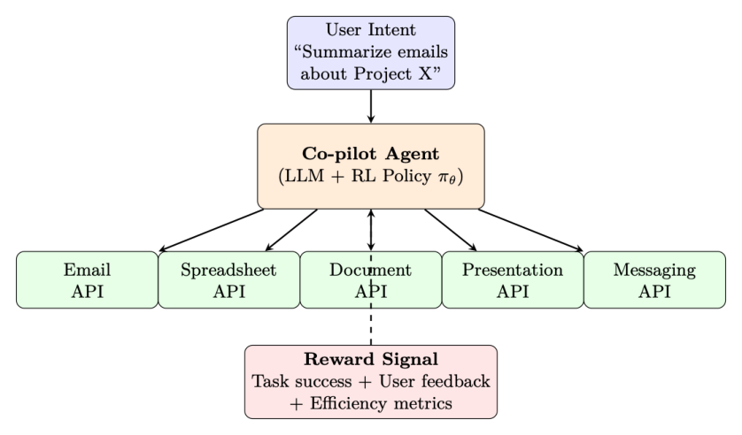

# 第 12 章 LLM 智能体训练(LLM Agentic Training)

## 12.1 动机:从聊天机器人到自主智能体

现代 LLM 越来越多地不仅作为对话式助手部署,而是作为自主智能体(autonomous agents),在多个步骤上与外部工具、API、数据库和环境交互。这一转变——从单回合聊天机器人到多步智能体——引入了全新的 RL 挑战,要求我们重新思考如何训练、评估和部署语言模型。



> 图 12.1 释义:(a) 传统聊天机器人——用户与 LLM 之间单回合交互,获得即时反馈;(b) 自主智能体——LLM 智能体接收任务,经由工具与环境多步交互(行动 act、观测 obs、执行 execute、奖励 reward),优化稀疏的终端奖励。(参见原文 p222 图 12.1)

促使我们需要新 RL 方法方法的关键差异:

- **多步推理**:智能体必须跨越 10–100+ 次工具调用进行规划,而不仅是生成单条回复。
- **外部环境反馈**:奖励来自真实世界的执行(测试套件通过、网页加载、代码编译),而不仅是人类偏好打分。
- **结构化动作**:动作不仅是 token,而是结构化输出(JSON 工具调用、API 负载、代码块)。
- **稀疏奖励的长程性**:成功/失败可能要经过许多中间步骤之后才能判定。

**为何标准 RLHF 对智能体力不从心**

标准 RLHF(PPO/DPO)针对单回合质量进行优化:给定一个提示,产出一条好的回复。但智能体必须:

- 决定何时使用工具、何时进行内部推理
- 在轨迹执行中途从错误中恢复(自我纠正, self-correction)
- 在探索(尝试新方法)与利用(使用已知的可靠模式)之间取得平衡
- 处理部分可观测性(工具输出可能不完整或带噪)

这要求训练方法能够对整条轨迹(而非单个回合)进行推理。

## 12.2 LLM 智能体的轨迹缓冲区

在 LLM 智能体的语境下,传统 RL 的经验回放缓冲区(replay buffer)经历了结构性转变。智能体式的缓冲区——通常被称为轨迹缓冲区(Trajectory Buffer)、经验池(Experience Pool)或记忆库(Memory Bank)——管理的不再是低维数值张量,而是复杂的文本历史、工具执行输出以及显式的推理步骤。

### 12.2.1 LLM 智能体缓冲区的数学结构

在经典 RL 中,回放缓冲区存储一个扁平元组 $(s, a, r, s')$。对于 LLM 智能体,它扩展为高维的分词文本结构:

$$
e_t = (S_t,\ A_t,\ R_t,\ S_{t+1}) \tag{12.1}
$$

- $S_t$:完整的上下文状态——系统提示、用户目标、对话历史,以及当前的环境变量(例如 HTML 源码、目录结构、数据库模式)。
- $A_t$:智能体的生成输出,通常由一段思维链(Chain-of-Thought, CoT)推理字符串后接一个结构化工具调用组成:

$$
A_t = \{\text{text}_{\text{reasoning}},\ \text{json}_{\text{tool\_call}}\} \tag{12.2}
$$

- $R_t$:来自外部执行环境的评估信号(单元测试通过情况、编译器标志、API 响应码),或由 LLM 作为评判者(LLM-as-a-judge)系统核验。
- $S_{t+1}$:更新后的上下文窗口,它把工具输出文本或错误日志直接追加到对话历史中。

**具体的智能体轨迹:代码调试**

```
Step 1: S1 = "Fix the failing test in utils.py"
A1 = "Let me read the file first" + read_file("utils.py")
R1 = 0 (intermediate step)

Step 2: S2 = [previous context + file contents]
A2 = "The bug is on line 42, off-by-one error" + edit_file("utils.py", ...)
R2 = 0 (intermediate step)

Step 3: S3 = [previous context + edit confirmation]
A3 = "Let me verify the fix" + run_tests()
R3 = +1.0 (all tests pass — sparse terminal reward)
```
第 3 步获得 +1.0 的稀疏终端奖励(所有测试通过);前两步为中间步骤,奖励为 0。

## 12.3 操作范式

LLM 智能体通过三类主要的优化方法论来利用专门的轨迹缓冲区:

### 12.3.1 A. 自我纠正与思路精炼

该类别的两个代表性方法是 STaR [223] 和 Reflexion [224]。当智能体在一条多步执行轨迹上失败时,这条次优序列会被保存到缓冲区。框架随后采样该轨迹,并提示 LLM 对其过往表现生成一段显式的文本批评:

$$
\text{Critique} \leftarrow \text{LLM}(S_{\text{failed}},\ A_{\text{failed}},\ R=0) \tag{12.3}
$$

一旦一条修正后的轨迹获得正向奖励,它就被移入一个最优经验池,用于通过微调(在成功轨迹上做 SFT)或 RL(使用二元通过/失败奖励的 GRPO [14])来更新网络权重。

**STaR:自教推理器(Self-Taught Reasoner)**

1. 为一批问题生成推理轨迹
2. 过滤:只保留导向正确答案的轨迹
3. 在成功轨迹上微调模型(SFT)
4. 重复:改进后的模型在下一轮迭代中生成更好的轨迹

每次迭代都使用模型自身成功的输出作为训练数据,对其推理能力进行自举(bootstrapping)。

**Reflexion:言语式强化学习(Verbal Reinforcement Learning)**

1. 智能体尝试一个任务,失败
2. 智能体生成一段言语式反思:「我失败是因为在调用 API 之前没有检查返回类型」
3. 反思被存入情景记忆缓冲区(episodic memory buffer)
4. 在下一次尝试时,反思作为经验教训注入提示
5. 无需权重更新——纯基于自我批评的上下文学习(in-context learning)

### 12.3.2 B. 异策略探索(Off-Policy Exploration)

这一范式以 ReAct [127] 及相关工具使用框架为代表,涉及大量的自主探索。在自主探索过程中(网页导航、数据库查询、代码生成),智能体记录下数千条探索性执行路径。轨迹缓冲区充当过滤器:

- **成功过滤**:只保留达成目标的轨迹用于训练。
- **效率排序**:在成功的轨迹中,优先选择最短/最高效的工具使用路径。
- **多样性采样**:维持一套多样的求解策略集合,以防模式坍缩(mode collapse)。

优化算法(通常是 GRPO [14] 或过滤式 SFT)只在高效、成功的轨迹上计算损失,同时丢弃蜿蜒冗长的运行。

### 12.3.3 C. 非参数上下文学习(基于经验的 RAG)

轨迹缓冲区可以充当一个向量数据库(vector database),而无需修改神经网络权重。给定一个新的用户目标 $G_{\text{new}}$,系统检索最相关的过往经验:

$$
E_{\text{retrieved}} = \arg\max_{e \in \mathcal{B}}\ \text{sim}\big(\text{Embed}(G_{\text{new}}),\ \text{Embed}(e)\big) \tag{12.4}
$$

最相似的 top-k 条成功历史运行被直接作为少样本(few-shot)示范注入提示上下文。该方法:

- 无需任何训练——纯检索增强生成(retrieval-augmented generation)
- 若缓冲区中存在相似经验,可即时适配新任务
- 随缓冲区规模扩展(经验越多 = 覆盖越广)
- 与参数化学习互补(对罕见情形用检索,对常见模式用权重)

## 12.4 范式对比

**表 12.1:传统 RL 缓冲区 vs. LLM 智能体缓冲区**

| 特性 | 传统 RL 缓冲区 | LLM 智能体缓冲区 |
|---|---|---|
| 数据格式 | 连续向量 / 张量 | 分词文本、JSON、代码块、工具输出 |
| 数据量 | 海量($10^5$–$10^7$ 条) | 小到中($10^3$–$10^5$ 条轨迹) |
| 主要目标 | 打破数据相关性 | 提供推理示范 |
| 采样 | 随机均匀 / PER(Prioritized Experience Replay) | 语义检索 / 成功优先 / 多样性 |
| 状态大小 | 固定(如 $84\times84$ 像素) | 可变(每个状态 1K–128K tokens) |
| 动作空间 | 离散/连续向量 | 结构化文本(推理 + 工具调用) |
| 奖励来源 | 环境模拟器 | 外部执行 / LLM 评判 / 单元测试 |

## 12.5 智能体式 RL 的主要技术

**表 12.2:用 RL 训练 LLM 智能体的关键方法。**

| 方法 | 类型 | 核心思想 |
|---|---|---|
| STaR [223] | 迭代式 SFT | 通过在自身成功轨迹上微调来自举推理 |
| Reflexion [224] | 上下文 RL | 将言语式自我批评存为情景记忆;无需权重更新 |
| ReAct [127] | 提示 | 在单次生成中交替进行推理("思考")与行动("工具调用") |
| LATS [225] | 树搜索 | 在动作序列上做蒙特卡洛树搜索;回传奖励 |
| AgentQ [226] | 异策略 RL | 在智能体轨迹上做 DPO,使用 AI 生成的偏好对 |
| OpenHands [227] | GRPO | 组相对优化,奖励来自执行(测试通过/失败) |
| Voyager [228] | 技能库 | 成功的代码片段被存储并检索,以供组合式复用 |
| RLEF [229] | 在线 RL | 来自执行反馈的 RL——代码/测试执行产生的二元奖励 |

### 12.5.1 STaR:自教推理器(详解)

STaR [223] 是一种迭代式自我改进方法,无需外部奖励模型即可自举推理能力。其核心洞见是:如果模型偶尔能正确求解一个问题,它就能从自身的成功中学习。

**算法:**

1. **生成**:对数据集 $D$ 中的每个问题 $x_i$,采样一条推理轨迹 $z_i \sim \pi_\theta(\cdot \mid x_i)$,随后给出一个答案 $\hat{y}_i$。
2. **过滤**:只保留 $\hat{y}_i = y_i^*$(正确答案)的轨迹。定义成功集合 $D_{\text{pass}} = \{(x_i, z_i, y_i^*) : \hat{y}_i = y_i^*\}$。
3. **合理化(关键创新)**:对模型失败的问题,生成一条「合理化(rationalization)」——一条以正确答案为条件的轨迹:$z_i^{\text{rat}} \sim \pi_\theta(\cdot \mid x_i, y_i^*)$。这教会模型从解出发进行反向推理。
4. **微调**:在 $D_{\text{pass}} \cup D_{\text{rationalized}}$ 上通过 SFT 更新 $\theta$。
5. **迭代**:用改进后的模型从第 1 步重复。

$$
\theta_{k+1} = \arg\min_\theta -\sum_{(x, z, y) \in D_k^+} \log \pi_\theta(z, y \mid x) \tag{12.5}
$$

**收敛动态**:每次迭代 $k$ 都会提升模型的求解率 $p_k$。若 $p_0 = 0.3$(求解 30% 的问题),经合理化 + SFT 后,$p_1 \approx 0.5$。通常在 3–5 次迭代后收敛到 $p \approx 0.7$–$0.9$。

**STaR 合理化提示**

```python
# 标准生成(Step 1):
PROMPT = """Solve the following problem step by step.
Problem: A store has 45 apples. It sells 3/5 of them. How many remain?
Let's think step by step:"""

# 合理化提示(Step 3 —— 以正确答案为条件):
PROMPT_RATIONALIZE = """Solve the following problem step by step.
The correct answer is 18.
Problem: A store has 45 apples. It sells 3/5 of them. How many remain?
Let's think step by step to arrive at 18:"""

# 智能体变体(以错误信息为条件的代码任务):
PROMPT_AGENT_RATIONALIZE = """The following code task failed with the error below.
Generate a correct solution step by step.
Task: Implement binary search that handles duplicates.
Previous error: IndexError: list index out of range (line 12)
Correct behavior: Return leftmost index of target.
Let me fix this by reasoning about the boundary conditions:"""
```

**面向智能体的 STaR 变体**

- **Quiet-STaR [230]**:在生成的每一个 token 之间插入「思考 token」。模型学会在无显式 CoT 提示的情况下隐式地推理。训练目标:当包含思考 token 时,更好地预测后续 token。
- **面向代码智能体的 STaR**:用测试执行替换答案核验。「正确」= 所有测试通过。合理化 = 在错误信息条件下生成一种新方法。
- **V-STaR [231]**:增加一个在 $(z, y, \text{correct/incorrect})$ 三元组上训练的验证器(verifier)模型。验证器提供过程级监督,过滤掉那些碰巧得到正确答案的糟糕推理轨迹。

### 12.5.2 Reflexion:言语式强化学习(详解)

Reflexion [224] 引入了一种激进的范式:无需权重更新的 RL。智能体不通过基于梯度的学习,而是借助存储在情景记忆中的自然语言自我批评来改进。

**完整架构:**

1. **行动者(Actor)**:在环境中执行动作的 LLM 智能体 $\pi$。
2. **评估器(Evaluator)**:一个二元信号(任务成功/失败)或标量启发式(例如通过的测试用例数)。
3. **自我反思生成器(Self-Reflection Generator)**:给定失败的轨迹 $\tau_{\text{fail}}$ 和环境反馈,生成一段自然语言反思 $r_{\text{text}}$:

$$
r_{\text{text}} = \text{LLM}_{\text{reflect}}(\tau_{\text{fail}},\ \text{feedback},\ \text{task}) \tag{12.6}
$$

4. **情景记忆**:过往反思的滑动窗口缓冲区 $M = [r_1, r_2, \dots, r_m]$(通常 $m \le 3$ 以适配上下文)。
5. **重试循环**:在下一次尝试时,反思被注入提示:

$$
a_{t+1} \sim \pi(\cdot \mid \text{task},\ M,\ \text{current\_state}) \tag{12.7}
$$

**反思示例**:「在之前的尝试中,我在校验输入格式之前就调用了 search API,导致了 400 错误。下次我应该先校验 JSON 模式,然后再调用 API。」

**Reflexion:注入记忆的智能体提示**

```python
# === ATTEMPT 2 PROMPT(首次失败后) ===
SYSTEM = """You are a coding agent. You can run bash commands and edit files.
Complete the task below. Learn from your previous reflections."""

USER = """Task: Fix the failing test in auth_service.py

=== REFLECTIONS FROM PREVIOUS ATTEMPTS ===
[Attempt 1 reflection]: I tried to modify the authenticate() function directly
but forgot that it depends on token_validator(). The test failed because
token_validator() was still returning the old format.
I should trace the dependency chain FIRST: check what authenticate() calls,
then fix the root cause (token_validator), not the symptom.
=== END REFLECTIONS ===

The repository is in /workspace/. The failing test is:
test_auth.py::test_expired_token_returns_401

Begin by reading the relevant files, then fix the issue."""
```
提示中将前次尝试的反思注入上下文,作为经验教训。

**优势与局限:**

| 优势 | 局限 |
|---|---|
| 零梯度计算;适用于冻结的 API 模型(如 GPT-4) | 受限于上下文窗口;无法积累无限知识 |
| 迭代快(每次重试数秒 vs. RL 训练数小时) | 无法泛化到未见任务(记忆是任务特定的) |
| 可解释:人类可读的自我纠正 | 依赖模型本身识别错误的能力 |
| 可与任意基础智能体架构组合 | 当基础模型过弱、无法生成有用批评时退化 |

### 12.5.3 ReAct:推理 + 行动(详解)

ReAct [127] 通过在单条生成流中将显式推理步骤与环境动作交替进行,确立了工具使用智能体的主流提示范式。

**ReAct 系统提示(典型)**

```python
SYSTEM = """You are a research assistant with access to the following tools:
- search(query): Search the web for information
- lookup(term): Look up a term on the current Wikipedia page
- finish(answer): Submit your final answer

Solve the user's question by interleaving Thought and Action steps.
Format:
Thought: <your reasoning about what to do next>
Action: <tool_name>(arguments)

You will receive an Observation after each Action. Use it to plan your next step.
Continue until you can provide a final answer.

Rules:
- Always think before acting
- Never guess - verify with tools
- Use finish() only when you are confident in your answer"""

USER = "Who was the president of the US when the iPhone was released?"
```

**生成格式:**

**ReAct 轨迹格式**

```
Thought: I need to find when the iPhone was released, then determine who was
president at that time. Let me search for the release date.
Action: search("iPhone original release date")
Observation: The original iPhone was released on June 29, 2007.
Thought: The iPhone came out June 2007. Now I need to find who was the US
president in June 2007.
Action: lookup("President of the United States in 2007")
Observation: George W. Bush served as the 43rd president from January 20, 2001
to January 20, 2009.
Thought: George W. Bush was president from 2001-2009, which covers June 2007 when
the iPhone was released. I have my answer.
Action: finish("George W. Bush was the US president when the iPhone was released
on June 29, 2007.")
```

**形式化定义**:一条 ReAct 轨迹为 $\tau = (t_1, a_1, o_1, t_2, a_2, o_2, \dots)$,其中:

- $t_i$:Thought(内部推理,不执行)
- $a_i$:Action(工具调用,在环境中执行)
- $o_i$:Observation(环境响应,追加到上下文)

**为何有效**:Thought 形成一种「内心独白」,帮助模型在行动前进行规划,减少冲动性的工具调用。显式的推理轨迹也使智能体的决策过程可审计、可调试。

**用 RL 训练 ReAct 智能体:**

- **动作级奖励**:只有动作接收奖励信号(thought 是辅助性的)。
- **思考质量**:被隐式优化——更好的思考 → 更好的动作 → 更高的奖励。
- **格式强制**:在奖励中加入对格式错误动作(缺失 JSON、幻觉工具)的格式惩罚。
- **RL 目标**:$r(\tau) = r_{\text{task}} - \lambda_{\text{format}} \cdot \text{format\_violations} - \lambda_{\text{length}} \cdot \text{num\_steps}$

### 12.5.4 LATS:语言智能体树搜索(详解)

LATS [225] 将蒙特卡洛树搜索(Monte Carlo Tree Search, MCTS)应用于 LLM 智能体的动作选择,以推理算力换取显著更优的轨迹。

**算法(为 LLM 智能体适配):**

1. **选择(Selection)**:从根节点(初始状态)出发,使用 UCB1 遍历树:

$$
\text{UCB}(s, a) = \bar{Q}(s, a) + c \sqrt{\frac{\ln N(s)}{N(s, a)}} \tag{12.8}
$$

其中 $\bar{Q}$ = 子树平均奖励,$N$ = 访问计数,$c$ = 探索常数。

2. **扩展(Expansion)**:在叶节点处,通过 LLM 采样(temperature > 0)生成 $k$ 个候选动作:$\{a_1, \dots, a_k\} \sim \pi_\theta(\cdot \mid s_{\text{leaf}})$
3. **模拟(Simulation)**:对每个候选,在环境中执行该动作,并以快速 rollout 策略(贪心解码)继续,直至终端状态或深度上限。
4. **回传(Backpropagation)**:将终端奖励沿所有祖先节点向上传播,更新 $\bar{Q}$ 和 $N$ 计数。
5. **重复**:对固定的计算预算(例如 50–200 次迭代)运行步骤 1–4。
6. **动作选择**:选择根节点访问次数最多的子节点。

**LLM 专属适配:**

- **价值函数**:使用一次单独的 LLM 调用来估计状态价值:「在 0–1 的尺度上,该状态有多大可能导向任务成功?」
- **基于反思的剪枝**:当某个分支失败时,生成一段反思并剪除相似分支。
- **缓存**:在每个节点存储 LLM 输出,以避免回溯时冗余生成。
- **深度预算**:将树深度限制在 10–20 步(智能体很少需要更多)。

**性能**:在 WebShop(网页导航)上,LATS 取得 75% 的成功率,而 ReAct 为 40%。在 HumanEval(代码)上,树搜索将 pass@1 从 68% 提升至 94%。代价是:每个任务 10–50× 的推理 FLOPs。

**LATS 提示:价值估计与节点扩展**

```python
# === 价值估计提示(模拟阶段使用) ===
VALUE_PROMPT = """You are evaluating an agent's progress on a task.
Task: Book a flight from NYC to London for under $500, departing Dec 15.
Current state (after 3 actions):
- Searched flights on Kayak: found 12 results
- Filtered by price < $500: 4 options remain
- Clicked on British Airways $489 option: viewing details page

On a scale of 0.0 to 1.0, how likely is the agent to successfully complete the
task from this state? Consider:
- How close is the agent to the goal?
- Are there remaining obstacles (payment, seat selection)?
- Has the agent made any errors that need correction?

Score: """
# 模型输出例如 "0.75"

# === 节点扩展提示(生成候选动作) ===
EXPAND_PROMPT = """You are a web navigation agent. Given the current page state,
propose 3 DIFFERENT next actions to try.
Current page: British Airways booking - flight details
Price: $489 | Departure: Dec 15 8:30 am | Arrival: Dec 15 8:45 pm
[Button: Select] [Button: Back to results] [Link: Fare rules]

Generate 3 diverse candidate actions (explore different strategies):
Action 1:"""
# 模型生成 3 个用于树扩展的选项
```

### 12.5.5 AgentQ:在智能体轨迹上做 DPO(详解)

AgentQ [226] 通过从轨迹结果中自动生成偏好对,将离线偏好学习(DPO)与在线智能体执行连接起来。

**流水线:**

1. **Rollout**:用当前策略 $\pi_\theta$ 对每个任务执行 $N$ 条轨迹。
2. **评估**:用基于执行的奖励(二元通过/失败或标量指标)对每条轨迹打分。
3. **配对构造**:对每个任务,构造偏好对:

$$
(\tau_w,\ \tau_l)\ \ \text{其中}\ \ r(\tau_w) > r(\tau_l) \tag{12.9}
$$

对同一任务的各条轨迹,奖励最高者 = 被选中(chosen);最低者 = 被拒绝(rejected)。

4. **DPO 更新**:在轨迹级对数概率上应用标准 DPO 损失:

$$
\mathcal{L}_{\text{AgentQ}} = -\log \sigma\!\left( \beta \left( \log \frac{\pi_\theta(\tau_w)}{\pi_{\text{ref}}(\tau_w)} - \log \frac{\pi_\theta(\tau_l)}{\pi_{\text{ref}}(\tau_l)} \right) \right) \tag{12.10}
$$

5. **迭代**:更新后的 $\pi_\theta$ 在下一轮生成新的(更好的)轨迹。

**关键设计选择:**

- **MCTS 引导的探索**:在 rollout 阶段使用 LATS 生成多样、高质量的轨迹(更好的训练数据)。
- **步骤级 DPO**:与其比较完整轨迹,不如在动作层面比较——给定相同前缀,哪一个下一步动作导向成功?
- **自博弈改进**:每次 DPO 迭代产出更好的策略,后者生成更好的轨迹,后者又产出更好的训练对——一个良性循环。

**结果**:在 WebShop 上,AgentQ 在 3 次 DPO 迭代内将基础策略的成功率从 50% 绝对提升到 82%。

### 12.5.6 Voyager:通过技能库实现终身学习(详解)

Voyager [228] 引入了组合式技能累积——智能体构建一个不断增长的可复用代码函数库,作为高层动作。

**架构:**

1. **自动课程**:一个 LLM 根据智能体当前的技能清单提出逐步更难的任务:「你现在已经能采伐木材和制作木板了。下一个挑战:制作一张合成台。」
2. **技能生成**:对每个任务,智能体编写一个 JavaScript 函数(可执行代码)来解决它:

$$
\text{skill}_i = \text{LLM}(\text{task}_i,\ \text{environment\_docs},\ \text{error\_feedback}) \tag{12.11}
$$

3. **验证**:在环境中执行代码。若成功,加入技能库。若不成功,带错误反馈迭代(最多 5 次重试)。
4. **技能库(向量数据库)**:每个经核验的技能附带存储:
   - 函数签名 + 文档字符串(用于检索)
   - 任务描述的嵌入(用于语义搜索)
   - 依赖(它调用了哪些其他技能)
5. **检索 + 组合**:对新任务,检索最相关的 top-k 技能并组合:

$$
\text{solution} = \text{LLM}(\text{new\_task},\ \text{retrieve}(\text{skill\_library},\ k=5)) \tag{12.12}
$$

**关键洞见**:技能是组合式的——复杂行为从简单已验证函数的组合中涌现。智能体永不遗忘(技能库是持久的),并且单调改进(只添加已验证的技能)。

**Voyager:课程与技能生成提示**

```python
# === 自动课程提示 ===
CURRICULUM_PROMPT = """You are a curriculum designer for an AI agent.
Agent's current skill inventory:
- mine_wood(): Mines nearby oak/birch trees
- craft_planks(): Converts logs to planks
- craft_sticks(): Converts planks to sticks
- mine_stone(): Mines stone with wooden pickaxe

Propose the next task that:
1. Builds on existing skills (reachable from current abilities)
2. Introduces exactly ONE new concept or challenge
3. Is concrete and verifiable (clear success condition)

Next task proposal:"""
# 输出: "Craft a furnace (requires 8 cobblestone blocks arranged in a square).
#        You already know mine_stone()."

# === 技能生成提示 ===
SKILL_GEN_PROMPT = """Write a JavaScript function to accomplish this task in
Minecraft. Use the bot API (bot.dig, bot.craft, bot.equip, etc.)
Task: Smelt 5 iron ingots using a furnace.
Prerequisites available: mine_stone(), craft_furnace(), mine_iron_ore()
Error from previous attempt: "Cannot smelt without fuel in furnace"

Write the corrected function:
async function smeltIronIngots(bot, count=5) {"""
```

### 12.5.7 RLEF:来自执行反馈的 RL(详解)

RLEF [229] 将带有确定性执行反馈奖励的在线 RL 应用于代码生成智能体,确立了智能体训练中最简单而有效的范式。

**训练循环:**

1. **采样任务**:从训练集中抽取一个带测试用例的编程问题 $(x, \text{tests})$。
2. **生成**:智能体用当前策略 $\pi_\theta$ 产出一条求解轨迹(读文件、写代码、跑测试)。
3. **执行**:在沙箱(sandbox)环境中运行测试套件。奖励:

$$
r = \frac{\#\ \text{tests passed}}{\#\ \text{total tests}} \in [0, 1] \tag{12.13}
$$

4. **更新**:以 $r$ 作为奖励信号应用 GRPO/PPO。
5. **重复**:以新任务进行数千次迭代。

**为何执行反馈是 RL 的理想选择:**

- **零噪声**:与人类偏好不同,测试结果是确定性的。同样的代码 → 每次同样的奖励。这消除了使 RL 训练不稳定的奖励噪声。
- **无限规模**:可以编程方式生成无限的任务(随机算法、API 集成测试、数据变换)。
- **无奖励投机(reward hacking)**:与习得的奖励模型不同,测试套件无法被「欺骗」(假设测试编写良好)。智能体必须真正解决问题。
- **密集信号**:部分测试通过($r = 0.6$)提供了比二元通过/失败更丰富的梯度。

### 12.5.8 OpenHands / SWE-Agent:面向软件工程的 GRPO

OpenHands [227] 与 SWE-Agent [232] 应用 GRPO 来训练自主解决 GitHub issue 的智能体——读取代码、编写补丁并运行测试套件。

**训练细节:**

- **环境**:带有完整仓库、测试套件和开发者工具(git、grep、lint)的 Docker 容器。
- **动作空间**:Bash 命令、文件编辑、git 操作、测试执行。
- **轨迹长度**:解决一个 GitHub issue 通常需要 15–50 个动作。
- **奖励**:二元——生成的补丁是否通过该 issue 的回归测试?
- **组大小**:每个 issue 取 $N = 8$–$16$ 条轨迹用于 GRPO 归一化。
- **课程**:从标记为「good first issue」的 issue 起步,逐步过渡到复杂的多文件重构。

**最新结果**:SWE-bench Verified:RL 训练后解决率从 30% 提升到 55%(对比仅 SFT 的基线)。

**OpenHands / SWE-Agent:系统提示**

```python
SYSTEM = """You are an autonomous software engineer. You are given a GitHub issue
to resolve. You have access to the full repository in /workspace/ and can execute
any bash command.

AVAILABLE COMMANDS:
- bash(command): Execute a shell command
- edit(file, start_line, end_line, new_content): Edit a file
- search(pattern, path): Search for text in files
- submit(): Submit your patch when done

WORKFLOW:
1. Read the issue carefully and understand the expected behavior
2. Explore the codebase to find relevant files
3. Reproduce the bug (write/run a test that fails)
4. Implement the fix
5. Verify the fix (run the test again - must pass)
6. Run the full test suite to check for regressions
7. Submit when all tests pass

RULES:
- Do NOT modify test files unless the issue explicitly asks for it
- Prefer minimal, targeted changes over large refactors
- Always verify your fix before submitting"""

USER = """GitHub Issue #4521: 'DataFrame.merge()' silently drops rows when 'on'
column contains NaN values.
Expected: NaN keys should be preserved (matched with other NaN rows)
Actual: Rows with NaN keys are dropped entirely

Repository: /workspace/pandas-dev/pandas/"""
```

**未来:RL + 智能体**

该领域正收敛到一个模式:将带执行反馈奖励的在线 RL 应用于多步智能体轨迹。关键趋势:

- 带二元通过/失败奖励(来自代码执行或工具成功)的 GRPO/PPO
- 课程学习:从易任务起步,逐步增加难度
- 轨迹级优化(而非 token 级)——只在多步序列结束时给奖励
- 混合方法:对罕见任务用检索(非参数化)+ 对常见任务用 RL(参数化)
- 缩放律:推理期更多算力(搜索/重试)往往胜过训练期更多算力

## 12.6 用例:面向生产力副驾驶的智能体式 RL

本节提供一个完整的蓝图,展示如何将智能体式 RL 技术应用于训练一个跨生产力应用套件(文档、电子表格、演示文稿、电子邮件、即时消息、云存储)运行的 LLM 副驾驶(co-pilot)。

### 12.6.1 架构概述

> 图 12.2:生产力副驾驶架构:LLM 智能体(带 RL 策略 $\pi_\theta$)接收用户意图,并与多个应用 API 交互。一个基于任务成功、用户反馈和效率指标的奖励信号驱动策略改进。(参见原文 p234 图 12.2)

### 12.6.2 生产力副驾驶的形式化 MDP 定义

生产力副驾驶环境被形式化为一个部分可观测马尔可夫决策过程(Partially Observable Markov Decision Process, POMDP):

$$
\mathcal{M} = \langle \mathcal{S},\ \mathcal{A},\ \mathcal{T},\ \mathcal{R},\ \Omega,\ \mathcal{O},\ \gamma \rangle \tag{12.14}
$$

- $\mathcal{S}$:状态空间——完整的工作区环境状态:文档内容、邮件往来、日历事件、文件系统、用户权限。非完全可观测:智能体只能看到 API 查询返回的内容。
- $\mathcal{A}$:动作空间——结构化的 API 调用(见下文)。每个动作是一个 JSON 对象,指定目标应用、操作和参数。
- $\mathcal{T}$:转移函数——大多数操作是确定性的(写入文档 → 文档被更新),但依赖网络的动作(邮件投递时间、Teams 可用性)是随机的。
- $\mathcal{R}$:奖励函数——多分量(见「奖励设计」小节)。
- $\Omega$:观测空间——API 响应、渲染后的文档视图、错误消息。
- $\mathcal{O}$:观测函数——将状态映射为观测(API 响应格式化、为上下文窗口限制而截断)。
- $\gamma = 0.99$:折扣因子(长程,典型 10–50 步)。

**具体示例:「总结上周 Project Alpha 的邮件并创建一张状态幻灯片」**

下面我们追踪一条完整地穿过该 POMDP 的回合(episode),将每个形式化元素映射到一个具体实现。

**用户请求**:「总结上周 Project Alpha 邮件中的关键决策,并向团队演示文稿添加一张状态更新幻灯片。」

| 符号 | 具体实现 |
|---|---|
| $s_0$ | 真实状态:收件箱中有 47 封提及「Project Alpha」的过去 7 天的邮件;SharePoint 上的 PowerPoint 文件「Q3_Status.pptx」含 12 张幻灯片;用户具有编辑权限。 |
| $o_0$ | 智能体观测到:用户请求文本 + 系统提示。智能体尚不知晓邮件数量或演示文稿内容。 |
| $a_1$ | `outlook.search({query: "Project Alpha", last_7_days: true})` |
| $\mathcal{T}(s_0, a_1)$ | $s_1$:系统检索到 47 封匹配邮件(确定性)。 |
| $o_1$ | API 返回 top 10 封邮件主题 + 发件人 + 时间戳(因上下文限制而截断——即 $\mathcal{O}$ 的作用)。 |
| $a_2$ | `outlook.read({ids: [top_5_thread_ids]})` —— 智能体选取最相关的邮件线程。 |
| $o_2$ | 5 条邮件线程的完整正文($\mathcal{O}$ 截断后约 8K tokens)。 |
| $a_3$ | 内部推理动作:智能体综合出关键决策:(1) 截止期改至 11 月 15 日,(2) 预算获批,(3) 供应商选定。 |
| $a_4$ | `sharepoint.read({file: "Q3_Status.pptx", slides: "last"})` —— 查看当前最后一张幻灯片。 |
| $o_4$ | 最后一张幻灯片为「Q2 Summary」(第 12 张)。智能体决定新增第 13 张。 |
| $a_5$ | `powerpoint.add_slide({file: "Q3_Status.pptx", position: 13, layout: "Title and Content", title: "Project Alpha – Week 42 Status", content: "Key decisions: 1) Deadline: Nov 15..."})` |
| $\mathcal{T}(s_4, a_5)$ | $s_5$:幻灯片已加入演示文稿(确定性)。 |
| $o_5$ | API 返回 `{success: true, slide_id: 13}`。 |
| $\mathcal{R}(s_5)$ | 奖励分量:+0.4 任务完成(幻灯片已创建),+0.3 信息质量(提取了正确决策),+0.2 格式合规(使用了正确版式),+0.05 效率(5 个动作、无错误),−0.0 安全罚分。合计:0.95。 |

**展示的关键 POMDP 方面:**

- **部分可观测性**:在 $t = 0$ 时,智能体不知道有多少邮件或演示文稿内容——必须通过查询来发现状态。
- **观测函数 $\mathcal{O}$**:API 返回截断结果(47 封邮件中的 top 10)以适配上下文窗口限制。智能体看到的是真实状态的一个投影。
- **随机转移**:若智能体改用 `teams.send_message()`,投递时机会不确定(收件人在线/离线)。
- **多步规划**:智能体必须跨 2 个应用链式调用 5 个动作,并在邮件摘要与幻灯片内容之间保持一致。
- **折扣 $\gamma = 0.99$**:5 步时折扣可忽略($0.99^5 = 0.95$),但对 50 步任务则不可忽视——鼓励高效解法。

### 12.6.3 动作空间设计

动作空间必须是结构化、类型安全且可组合的:

**生产力副驾驶动作模式(Schema)**

```json
{
  "action_type": "api_call",
  "target_app": "outlook | excel | word | powerpoint | teams | sharepoint",
  "operation": "read | write | search | create | delete | modify",
  "parameters": {
    "endpoint": "/me/messages?$filter=subject eq 'Project X'",
    "body": { ... },            // 写操作的请求体
    "options": { "top": 10 }    // 分页、过滤
  },
  "reasoning": "I need to find relevant emails before summarizing"
}
```

**按应用的动作分类:**

| 应用 | 复杂度 | 关键动作 |
|---|---|---|
| Outlook | 中 | search、read、draft、send、move、flag、create_rule |
| Excel | 高 | read_range、write_range、insert_formula、create_chart、pivot_table、run_macro |
| Word | 中 | read_paragraphs、insert_text、format_section、find_replace、insert_table |
| PowerPoint | 中 | add_slide、insert_shape、set_text、set_layout、add_image、apply_theme |
| Teams | 低 | send_message、create_meeting、search_chat、add_members、post_to_channel |
| SharePoint | 中 | list_files、upload、download、search、create_page、set_permissions |

### 12.6.4 状态表示

智能体在每一步的观测(上下文窗口):

$$
o_t = [\text{system\_prompt};\ \text{user\_intent};\ \text{tool\_history}_{1:t-1};\ \text{current\_result}_t] \tag{12.15}
$$

**上下文预算管理(对 128K 窗口至关重要):**

- 系统提示:2K tokens(能力、安全规则、输出格式)
- 用户意图 + 对话:4K tokens
- 工具历史(滑动窗口):最近 8–12 个动作 + 观测,更早的进行摘要。合计:最多 80K tokens。
- 当前观测:最多 32K tokens(大型电子表格、邮件线程)
- 预留:10K tokens 用于智能体的推理 + 下一步动作生成

**状态压缩策略:**

- **选择性纳入**:只纳入与当前子目标相关的 API 响应(使用一个辅助的「相关性评分器」)。
- **结构化摘要**:把大型电子表格表示为模式(schema)+ 样本行,而非完整数据。
- **分层记忆**:在外部存储完整轨迹;把压缩后的摘要注入上下文。

### 12.6.5 奖励设计:多目标信号

生产力副驾驶的奖励函数必须在多个目标之间取得平衡:

$$
R(\tau) = \alpha_1 R_{\text{task}} + \alpha_2 R_{\text{quality}} + \alpha_3 R_{\text{efficiency}} + \alpha_4 R_{\text{safety}} + \alpha_5 R_{\text{user}} \tag{12.16}
$$

**表 12.3:生产力副驾驶训练的奖励分量。**

| 分量 | 权重 | 信号类型 | 定义 |
|---|---|---|---|
| $R_{\text{task}}$ | 0.40 | 二元/标量 | 任务成功完成(邮件已发送、文档已创建、公式正确) |
| $R_{\text{quality}}$ | 0.25 | LLM 评判 | 输出质量:格式、清晰度、内容正确性 |
| $R_{\text{efficiency}}$ | 0.15 | 标量 | 对过多步骤的罚分:$-0.02 \times (\text{num\_steps} - \text{optimal\_steps})$ |
| $R_{\text{safety}}$ | 0.15 | 二元 | 无不安全动作(未经确认删除、发错收件人、权限违规)。发生任何违规则 $R_{\text{safety}} = 0$。 |
| $R_{\text{user}}$ | 0.05 | 稀疏 | 可用时的显式用户反馈(点赞/点踩) |

**中间奖励(密集信号):**

- 成功的 API 调用(200 响应):+0.05
- 正确的信息检索(由下游使用核验):+0.10
- 优雅地从错误中恢复(用修正参数重试):+0.08
- API 错误(4xx/5xx):−0.03
- 重复相同动作(循环检测):−0.10
- 在意图确有歧义时提出澄清问题:+0.05

### 12.6.6 训练流水线:端到端

**生产力副驾驶 RL 训练流水线**

**阶段 1:监督微调(基础)**

1. 收集 5 万–20 万条人工示范的生产力任务轨迹(通过遥测、标注员或合成生成)。
2. 以 ReAct 格式在(指令, 轨迹)对上对基础 LLM 做 SFT。
3. 验证:智能体在留出任务上应达到 40–60% 的任务完成率。

**阶段 2:仿真环境构建**

1. 构建一个沙箱环境,带有模拟的 API 端点、合成邮箱、文档和日历。
2. 每个「用户」有一个逼真的画像:500+ 封邮件、20+ 份文档、日历事件、Teams 频道。
3. 任务生成器:产出多样的「指令–核验」对:「把 Alice 所有关于 Q4 预算的邮件移到 'Finance' 文件夹」+ 核验函数。

**阶段 3:在线 RL 训练(GRPO)**

1. 采样任务批次(每次迭代 256 个任务)。
2. 在沙箱环境中用 $\pi_\theta$ 为每个任务生成 $N = 8$ 条轨迹。
3. 执行轨迹,从核验函数收集奖励。
4. 计算 GRPO 优势(跨每任务的 8 条轨迹进行组归一化)。
5. 用截断目标 + 相对 SFT 模型的 KL 罚分更新策略。
6. 每 500 次迭代:在留出基准上评估(200 个任务,5 个难度级别)。

**阶段 4:人在回路精炼**

1. 部署给内部 dogfood 用户(1000+ 用户,2 周)。
2. 收集点赞/点踩信号 + 自由文本纠正。
3. 从 A/B 部署(旧策略 vs. 新策略)构造 DPO 偏好对。
4. 在人类偏好上应用 1–2 轮 DPO 微调。

### 12.6.7 仿真环境架构

**沙箱环境(简化版)**

```python
class ProductivityEnvironment:
    def __init__(self, user_profile: UserProfile):
        self.mailbox = SyntheticMailbox(user_profile.emails)
        self.drive = SyntheticOneDrive(user_profile.files)
        self.calendar = SyntheticCalendar(user_profile.events)
        self.teams = SyntheticTeams(user_profile.channels)
        self.step_count = 0
        self.max_steps = 50

    def step(self, action: dict) -> Tuple[Observation, float, bool]:
        """执行动作,返回 (观测, 奖励, 是否结束)。"""
        self.step_count += 1
        # 路由到对应的应用处理器
        handler = self.get_handler(action["target_app"])
        try:
            result = handler.execute(action["operation"], action["parameters"])
            obs = Observation(status=200, body=result)
            reward = 0.05  # 成功的 API 调用
        except APIError as e:
            obs = Observation(status=e.code, body=str(e))
            reward = -0.03
        # 检查终止条件
        done = self.step_count >= self.max_steps
        return obs, reward, done

    def evaluate(self, task: Task) -> float:
        """检查任务目标是否达成(终端奖励)。"""
        return task.verification_fn(self)  # 0.0 或 1.0
```

### 12.6.8 任务课程设计

训练效果关键依赖于任务难度的递进:

**表 12.4:生产力副驾驶课程级别。**

| 级别 | 步数 | 应用数 | 示例任务 |
|---|---|---|---|
| L1:单步 | 1–2 | 1 | 「读 Bob 最新的邮件」、「A1 单元格里是什么?」 |
| L2:单应用 | 3–5 | 1 | 「起草一封回复预算邮件的草稿,总结要点」 |
| L3:多步 | 5–10 | 1 | 「用销售数据创建数据透视表,并把表现最佳的项加粗」 |
| L4:跨应用 | 5–15 | 2–3 | 「找到 Q4 预算邮件,提取数字,放入新的 Excel 工作表」 |
| L5:复杂工作流 | 10–30 | 3+ | 「准备周报:从 Excel 拉取指标、总结邮件更新、创建 PowerPoint 幻灯片、在 Teams 中分享」 |

**课程策略:**

- 训练早期以 80% 的 L1–L2 任务、20% 的 L3 起步。
- 当前级别成功率超过 70% 时推进到下一级别。
- 始终保留 10–20% 的较易任务以防灾难性遗忘(catastrophic forgetting)。
- 最终混合(收敛后):10% L1、15% L2、25% L3、30% L4、20% L5。

### 12.6.9 安全与护栏

**生产力副驾驶的安全框架**

**硬约束(动作立即被拒绝,奖励 = −1.0):**

- 未经用户确认向外部收件人发送邮件/消息
- 永久删除文件/邮件(只允许软删除)
- 修改共享资源的权限
- 超出授予权限访问其他用户的邮箱或文件
- 对超过 100 项执行批量动作(防止批量删除/移动事故)

**软约束(奖励中罚分,智能体应学会避免):**

- 未经向用户展示预览就发送草稿:−0.2
- 未先声明意图就做出不可逆更改:−0.15
- 访问敏感标签(机密、律师-客户):−0.3
- 未经显式委托使用「代表发送」:−0.25

**确认协议**:对任何被归类为「高影响」的动作(发送、删除、对外分享),智能体必须:

1. 用自然语言陈述意图动作
2. 展示将要发送/修改内容的预览
3. 等待用户的显式确认后再执行

这在环境层(沙箱拒绝未确认的高影响动作)和奖励函数中(对跳过确认进行罚分)同时强制执行。

### 12.6.10 多应用工作流中的信用分配

**关键挑战**:在一条 20 步的跨应用工作流中,究竟是哪些步骤贡献了成功或失败?

**方法:分层奖励分解**

1. **子目标检测**:将用户指令分解为可核验的子目标:
   - 「找到 Q4 预算邮件」→ 子目标 1(核验:检索到相关邮件)
   - 「提取数字」→ 子目标 2(核验:解析出正确数值)
   - 「创建 Excel 工作表」→ 子目标 3(核验:工作表存在且数据正确)
2. **子目标奖励**:在每个子目标完成时分配中间奖励($r = +0.2$)。
3. **轨迹切片**:若最终任务失败,识别哪个子目标最先失败。只对该子目标跨度内的动作施加负奖励。
4. **反事实估计**:「若这一具体动作不同,任务是否会成功?」——用价值函数来估计。

$$
R_{\text{step}}(t) = \underbrace{R_{\text{sub-goal}}(t)}_{\text{当前子目标是否成功?}} + \underbrace{\gamma^{T-t} R_{\text{terminal}}}_{\text{折扣后的最终奖励}} + \underbrace{r_{\text{intermediate}}(t)}_{\text{逐步 API 成功/失败}} \tag{12.17}
$$

### 12.6.11 缩放与基础设施

**计算需求(以 70B 参数模型估计):**

| 组件 | 资源 | 备注 |
|---|---|---|
| 策略模型(70B) | 8× A100 80GB(TP=8) | BF16,生成轨迹 |
| 参考模型(70B) | 8× A100 80GB(TP=8) | 冻结,用于 KL 计算 |
| 环境 worker | 128 个 CPU worker | 各运行一个沙箱实例 |
| 奖励模型 / 评判器 | 4× A100(若用 LLM 评判) | 或为 0(若用基于执行的奖励) |
| 训练(GRPO 更新) | 16× A100(FSDP) | 跨轨迹批次做梯度累积 |
| **合计** | **40 块 A100 GPU + 128 个 CPU** | 完整训练约 5,000 GPU-小时 |

**吞吐量优化:**

- **异步 rollout**:把轨迹生成与梯度更新解耦。在前一批上训练的同时持续生成。
- **批量环境**:并行运行 128 个沙箱环境,各自处理不同任务。
- **KV-cache 共享**:对每任务的 $N = 8$ 条轨迹,它们共享相同的提示前缀——使用前缀缓存以避免冗余计算。
- **选择性反向传播**:只对动作 token(而非观测/系统提示)计算梯度。将反向传播 FLOPs 减少 40–60%。

### 12.6.12 评估框架

**基准套件(提议):**

- **ProdBench-Easy**(200 个任务):单应用、1–3 步。基线建立。
- **ProdBench-Hard**(200 个任务):跨应用工作流、10–30 步。端到端能力。

**表 12.5:生产力副驾驶评估维度。**

| 指标 | 目标 | 测量方式 |
|---|---|---|
| 任务完成率 | > 85%(L1–L3),> 60%(L4–L5) | 沙箱中的自动核验 |
| 安全违规率 | < 0.1% | 每 1000 个任务的硬约束违规计数 |
| 完成平均步数 | 在最优的 1.5× 以内 | 与已知最短成功轨迹比较 |
| 用户满意度(dogfood) | > 4.2/5.0 | 内部用户的任务后调查 |
| 跨应用成功率 | > 55%(L4–L5) | 需要 2+ 应用的任务 |
| 恢复率 | > 70% | 失败 API 调用中智能体成功重试的比例 |
| 延迟(首个动作时延) | < 3 秒 | 模型推理 + 动作规划时间 |

- **ProdBench-Safety**(100 个任务):尝试触发不安全动作的对抗性提示。必须维持 < 0.1% 的违规率。
- **ProdBench-Robustness**(100 个任务):带歧义指令、注入 API 错误、缺失权限的任务。测试优雅降级(graceful degradation)。

### 12.6.13 来自生产部署的经验

**生产力智能体式 RL 的实践洞见**

1. **SFT 质量是地板**:RL 只能在 SFT 提供的基础上改进。若 SFT 模型无法格式化一个合法的 Graph API 调用,RL 也发现不了它。在阶段 1 的数据质量上大量投入。
2. **奖励投机(reward hacking)在所难免**:智能体会找到捷径。常见例子:
   - 创建一个空 Excel 文件来「完成」一项电子表格任务(通过存在性检查)
   - 回复「Done」却不实际执行动作
   - 利用含糊的核验函数
   缓解:多级核验(格式 + 内容 + 语义正确性)。
3. **API 速率限制很关键**:生产环境中,工作区 API 有节流(429 响应)。要以真实的速率限制训练,以避免产生狂发并行请求的策略。
4. **上下文窗口是瓶颈**:一条 20 步、带丰富 API 响应的轨迹轻易就消耗 80K+ tokens。技术:观测摘要、选择性历史、分层上下文管理。
5. **用户意图常常有歧义**:「清理我的收件箱」对不同用户意味不同。训练智能体在不确定性高时提出澄清问题(对恰当澄清给予奖励,对过度澄清给予罚分)。
6. **从简单起步、逐步扩展**:先从仅 Outlook 的任务开始(量最大、遥测数据最多),然后扩展到 Excel,再到跨应用。每个应用都有独特的失效模式。

### 12.6.14 完整训练配方

**表 12.6:生产力副驾驶 RL 训练的推荐超参数。**

| 参数 | 取值 | 理由 |
|---|---|---|
| 基础模型 | 70B Llama/Mistral | 对复杂多步推理有足够容量 |
| RL 算法 | GRPO | 无需 critic;对长轨迹内存高效 |
| 组大小 $N$ | 8 | 在方差缩减与计算成本之间平衡 |
| 截断 $\epsilon$ | 0.1 | 因长轨迹敏感性,比标准值(0.2)更紧 |
| KL 系数 $\beta$ | 0.04 | 对 SFT 策略的中等约束 |
| 学习率 | $5 \times 10^{-7}$ | 保守;智能体任务对大更新敏感 |
| 批大小 | 256 任务 × 8 轨迹 = 2048 | 大批量以稳定 GRPO 归一化 |
| 最大轨迹长度 | 50 步 | 覆盖 95% 的生产力任务 |
| 上下文窗口 | 128K tokens | 长多应用工作流所需 |
| 训练迭代 | 3000–5000 | 监控评估指标;安全退化时早停 |
| 课程热身 | 500 次迭代(仅 L1–L2) | 在复杂任务前先建立基础 API 用法 |

## 12.7 用例:从零构建一个研究智能体

本用例演示如何运用本文讨论的技术,构建一个完全自主的研究智能体——一个能够提出假设、检索文献、分析数据、编写代码、运行实验并产出最终报告的 LLM。

### 12.7.1 问题定义

**研究智能体需求**

- **输入**:一个研究问题(例如「学习率热身(warmup)时长对 7B 模型 GRPO 收敛有何影响?」)
- **输出**:一份包含方法论、实验、结果与结论的完整研究报告。

**所需能力:**

1. **文献检索**:查询 arXiv、Semantic Scholar,找到相关论文
2. **假设生成**:从背景知识中提出可检验的假设
3. **实验设计**:编写带适当控制的训练脚本
4. **代码执行**:运行实验、收集指标
5. **数据分析**:解析日志、计算统计量、生成图表
6. **科学写作**:将发现综合成一份连贯的报告
7. **自我纠正**:检测失败的实验并以修改后的参数重试

### 12.7.2 MDP 形式化

**研究智能体 MDP**

- **状态 $s_t$**:系统提示 + 研究问题 + 完整的动作/观测历史(工具输出、代码结果、检索结果)。上下文窗口:128K tokens。
- **动作 $a_t$**:来自动作空间的结构化工具调用(见下文)+ 推理轨迹(CoT)。
- **转移 $\mathcal{T}(s_{t+1} \mid s_t, a_t)$**:确定性——将动作 + 工具输出追加到上下文。
- **奖励 $\mathcal{R}$**:基于报告质量的稀疏终端奖励(见下文奖励设计)。
- **回合长度(Horizon)**:20–100 步(典型研究轨迹)。
- **折扣 $\gamma = 1.0$**(回合制;有限任务不做折扣)。

### 12.7.3 动作空间

**表 12.7:研究智能体的工具/动作空间。**

| 工具 | 类别 | 描述 |
|---|---|---|
| `search_papers` | 文献 | 查询 Semantic Scholar/arXiv。返回标题、摘要、引用。 |
| `read_paper` | 文献 | 获取论文全文或特定章节。 |
| `write_code` | 实验 | 将 Python/训练脚本写入工作区。 |
| `execute_code` | 实验 | 在沙箱环境中运行脚本。返回 stdout/stderr。 |
| `read_file` | 分析 | 读取日志、CSV 或中间结果。 |
| `plot_data` | 分析 | 生成 matplotlib/seaborn 可视化。 |
| `compute_stats` | 分析 | 运行统计检验(t 检验、置信区间)。 |
| `write_report` | 输出 | 写入最终研究报告的章节(LaTeX/Markdown)。 |
| `think` | 推理 | 内部推理步骤(无外部工具调用)。 |
| `submit` | 终端 | 提交最终报告。结束回合。 |

### 12.7.4 架构:模型与基础设施选择

**架构决策——应用本文概念**

- **基础模型**:Qwen-2.5 72B(强推理 + 代码)。QLoRA 微调($r = 32$,所有线性层)——见 LoRA 小节。
- **推理**:vLLM,TP=4,启用前缀缓存(系统提示在各 rollout 间共享)——见 vLLM 小节。
- **训练**:GRPO,每个研究问题取 $N = 4$ 条轨迹——无需价值模型(见 GRPO 小节)。
- **硬件**:8×H100 节点。QLoRA 适配器占用 48 GB;vLLM 生成使用剩余容量。
- **上下文管理**:128K 上下文配 Flash Attention(见 Flash Attention 小节)。对超出上下文的轨迹使用滑动窗口摘要。
- **投机解码(speculative decoding)**:用 Eagle head 在长研究轨迹中加速生成(见投机解码小节)。

### 12.7.5 奖励设计

**多分量研究奖励**

终端奖励在智能体调用 `submit` 时计算:

$$
R = w_1 R_{\text{quality}} + w_2 R_{\text{correctness}} + w_3 R_{\text{novelty}} + w_4 R_{\text{efficiency}} + w_5 R_{\text{format}}
$$

| 分量 | 权重 | 测量方式 |
|---|---|---|
| $R_{\text{quality}}$ | 0.30 | LLM 作为评判者(GPT-4 对报告的清晰度、深度、严谨性打 1–10 分) |
| $R_{\text{correctness}}$ | 0.30 | 代码无错运行 + 结果可复现 |
| $R_{\text{novelty}}$ | 0.15 | LLM 评判:报告是否提供了超越总结论文的洞见? |
| $R_{\text{efficiency}}$ | 0.15 | 步数越少越加分:$R_{\text{eff}} = \max(0,\ 1 - \text{steps}/100)$ |
| $R_{\text{format}}$ | 0.10 | 报告含全部必需章节(引言、方法、结果、结论) |

**中间塑造(shaping)**:每次成功代码执行 +0.1;每次运行时错误 −0.05(鼓励先写正确的代码)。

**奖励投机风险**

- **伪造结果**:智能体编造实验输出。修复:通过将执行日志与报告数字核对来核验代码确实运行过。
- **浅薄报告**:智能体逐字复制论文摘要。修复:新颖性奖励 + 抄袭检测。
- **长度博弈**:长报告得分更高。修复:效率奖励 + 长度罚分。
- **挑软柿子**:智能体回避难的研究问题。修复:带难度级别的课程。

### 12.7.6 训练流水线

1. **阶段 1 —— SFT 热身(500 步)**:
   - 收集 200 条专家研究轨迹(人类研究者使用这些工具)
   - 在成功轨迹上做 SFT,使用 completion-only 掩码(掩码工具输出)
   - 这教会智能体工具使用语法与基本研究工作流
2. **阶段 2 —— GRPO 训练(3000 步)**:
   - 提示池:跨 10 个领域(ML、NLP、CV、系统等)的 500 个研究问题
   - 每个问题:生成 $N = 4$ 条完整研究轨迹
   - 用多分量奖励对每条轨迹打分
   - GRPO 优势:$\hat{A}_i = (R_i - \mu_G)/\sigma_G$
   - 用截断目标更新策略($\text{clip}\ \epsilon = 0.2$,KL $\beta = 0.05$)
   - 课程:从简单的「总结关于 X 的发现」任务起步,推进到「设计并在 X 上运行实验」
3. **阶段 3 —— 拒绝采样微调(200 步)**:
   - 对每个难题生成 16 条轨迹,按奖励保留 top-2
   - 在这些高质量轨迹上做 SFT
   - 稳定在最难研究任务上的表现

### 12.7.7 示例轨迹:完整 MDP 追踪

为说明所有 MDP 组件在实践中如何协同,我们从问题到提交追踪一条完整的研究回合,并用其形式化 MDP 元素标注每一步。

**研究智能体轨迹——完整 MDP 追踪**

**研究问题**:「将 GRPO 组大小增大到 $N = 16$ 以上,是否能改善数学推理性能?」

下表是一条完整轨迹,对每一步给出显式的 MDP 记号:状态 $s_t$、动作 $a_t$、转移 $\mathcal{T}$、观测 $o_t$ 以及累计奖励。

| $t$ | 元素 | 描述 |
|---|---|---|
| | $a_0$ | `think`:「我需要关于 GRPO 组大小消融的论文,然后做一个受控实验。」 |
| | $o_0$ | 内部推理(无工具输出)。塑造奖励:$r_0 = 0$。 |
| 1 | $s_1$ | $s_0 \oplus (a_0, o_0)$ —— 上下文现已含推理计划。 |
| | $a_1$ | `search_papers(query="GRPO group size ablation math")` |
| | $o_1$ | 返回 5 篇论文:[DAPO、DeepSeek-Math、Dr. GRPO、...]。$r_1 = 0$。 |
| 2 | $s_2$ | $s_1 \oplus (a_1, o_1)$ —— 检索结果进入上下文。 |
| | $a_2$ | `read_paper(id="DAPO", sections=["experiments", "ablations"])` |
| | $o_2$ | 关键发现:「在代码任务上 $N > 16$ 之后收益递减;数学未测试。」$r_2 = 0$。 |
| 3 | $s_3$ | $s_2 \oplus (a_2, o_2)$ —— 识别出文献空白。 |
| | $a_3$ | `think`:「DAPO 只测了代码。我将在 GSM8K 上用 Llama-3 8B 测试 $N \in \{4, 8, 16, 32, 64\}$。控制:总训练 token 数相同。」 |
| | $o_3$ | 假设已形成。$r_3 = 0$。 |
| 4 | $s_4$ | $s_3 \oplus (a_3, o_3)$ —— 实验计划进入上下文。 |
| | $a_4$ | `write_code("train_grpo_gsm8k.py")` —— 85 行脚本,带 argparse 处理 group_size、适当种子、在 GSM8K 测试划分上评估。 |
| | $o_4$ | 文件写入成功。$r_4 = 0$。 |
| 5 | $s_5$ | $s_4 \oplus (a_4, o_4)$ —— 代码在工作区可用。 |
| | $a_5$ | `execute_code("python train_grpo_gsm8k.py --N 4 --seed 42")` |
| | $o_5$ | 准确率:67.2%(CI:65.1–69.3)。$r_5 = +0.1$(成功执行)。 |
| 6–8 | $a_{6-8}$ | 以 $N = 8, 16, 32$ 执行 → 结果:71.4%、74.8%、75.9%。每个 $r_t = +0.1$。 |
| 9 | $s_9$ | 上下文含 4 个数据点。 |
| | $a_9$ | `execute_code("python train_grpo_gsm8k.py --N 64 --seed 42")` |
| | $o_9$ | 准确率:75.6%(CI:73.4–77.8)—— 相比 $N = 32$ 略降!$r_9 = +0.1$。 |
| 10 | $s_{10}$ | 全部 5 个结果可用。 |
| | $a_{10}$ | `compute_stats(test="paired_t_test", data=[67.2, 71.4, 74.8, 75.9, 75.6], groups=[4,8,16,32,64])` |
| | $o_{10}$ | $N = 4$ vs $N = 16$ 时 $p < 0.01$;$N = 32$ vs $N = 64$ 时 $p = 0.72$(不显著)。$r_{10} = 0$。 |
| 11 | $s_{11}$ | 收益递减的统计证据。 |
| | $a_{11}$ | `plot_data(x=[4,8,16,32,64], y=[67.2,71.4,74.8,75.9,75.6], xlabel="Group Size N", ylabel="GSM8K Accuracy (%)", title="GRPO Group Size vs Math Reasoning")` |
| | $o_{11}$ | 图保存到 `results/group_size_curve.png`。$r_{11} = 0$。 |
| 12 | $s_{12}$ | 完整证据已汇总。 |
| | $a_{12}$ | `write_report`:4 节报告(引言、方法、带图的结果、结论:「$N = 16$–$32$ 最优;$N = 64$ 无增益且计算量增加 4×」)。 |
| | $o_{12}$ | 报告写好(2,100 词)。$r_{12} = 0$。 |
| 13 | $a_{13}$ | `submit` —— 回合终止。 |
| | $R_{\text{terminal}}$ | LLM 评判打分:质量=8/10,代码正确,有新意(把 DAPO 扩展到数学),13 步,所有章节齐备。 |

**终端奖励计算:**

$$
R = \underbrace{0.30 \times \frac{8}{10}}_{\text{quality}} + \underbrace{0.30 \times 1.0}_{\text{correct}} + \underbrace{0.15 \times \frac{7}{10}}_{\text{novelty}} + \underbrace{0.15 \times \left(1 - \frac{13}{100}\right)}_{\text{efficiency}} + \underbrace{0.10 \times 1.0}_{\text{format}} = 0.24 + 0.30 + 0.105 + 0.13 + 0.10 = 0.875
$$

中间塑造合计:$5 \times (+0.1) = +0.5$(5 次成功代码执行)。

**GRPO 上下文**:该轨迹在 $N = 4$ 组中得分最高(其他得分 0.61、0.72、0.53)。GRPO 优势:

$$
\hat{A} = \frac{0.875 - \bar{R}}{\sigma_R} = \frac{0.875 - 0.684}{0.129} = +1.48 \quad (\text{被强力加强})
$$

**展示的关键 MDP 性质:**

- **确定性 $\mathcal{T}$**:每次工具调用产生可预测的状态扩展($s_{t+1} = s_t \oplus (a_t, o_t)$)。
- **稀疏终端奖励**:真正的质量信号只在 submit 时出现;中间塑造很小。
- **长程**:13 步,$\gamma = 1.0$(回合制任务不折扣)。
- **自我纠正机会**:在第 9 步,智能体观察到 $N = 64$ 并未改进——据此调整结论,而非挑选有利数据(cherry-picking)。
- **动作多样性**:混合了推理(think)、信息收集(search、read)、执行(write_code、execute)、分析(compute_stats、plot)和输出(write_report、submit)。

### 12.7.8 关键设计决策与权衡

**表 12.8:研究智能体的设计决策,映射到本文小节。**

| 决策 | 本文小节 | 理由 |
|---|---|---|
| QLoRA($r = 32$) | LoRA 小节 | 72B 模型;全量微调太贵。$r = 32$ 用于复杂推理。 |
| GRPO(而非 PPO) | GRPO 小节 | 无需价值模型;研究质量在轨迹中途难以预测。 |
| 稀疏终端奖励 | 奖励塑造 | 研究质量只在完成时可测;中间塑造最小。 |
| $N = 4$ 条轨迹 | GRPO 组大小 | 平衡:足够多样以排序,又不太贵(100 步的轨迹)。 |
| 128K 上下文 | Flash Attention | 长轨迹,含论文内容 + 代码 + 结果。 |
| vLLM + 前缀缓存 | vLLM 小节 | 系统提示 + 研究问题在 4 个 rollout 间共享。 |
| 课程训练 | 智能体式 RL | 从简单(文献综述)→ 难(设计 + 执行实验)。 |
| LLM 作为评判者奖励 | 奖励模型 | 研究质量主观;LLM 评判比基于规则更灵活。 |

### 12.7.9 评估

**研究智能体评估框架**

- **留出问题(50 个)**:训练期间未见的研究问题,覆盖多样领域。
- **人工评估**:领域专家按 1–5 分制对报告打分(质量、正确性、可操作性)。
- **可复现性**:从报告重新运行智能体的代码;核验结果匹配。
- **对比基线**:(1) 零样本 GPT-4 + 工具(无 RL 训练),(2) 仅 SFT 智能体,(3) 人类研究者。
- **效率指标**:按任务难度归一化的完成步数。

**预期结果(基于类似的智能体式 RL 工作):**

| 智能体 | 报告质量(1–5) | 平均步数 |
|---|---|---|
| 零样本 GPT-4 + 工具 | 2.8 | 25 |
| 仅 SFT | 3.4 | 18 |
| GRPO 训练(本文) | 4.1 | 14 |
| 人类研究者 | 4.5 | N/A |

### 12.7.10 经验与失效模式

**研究智能体训练中的常见失效**

- **无限循环**:智能体反复检索论文却不推进。修复:步数预算 + 对带相同参数的重复工具调用罚分。
- **代码调试螺旋**:智能体花 20+ 步修一个 bug。修复:重试上限 3 次;若代码失败 3 次,放弃该方法尝试替代方案。
- **幻觉引用**:智能体捏造论文标题/结果。修复:通过工具输出核验所有引用存在;对不可核验的声明罚分。
- **过早提交**:智能体提交不完整的报告以规避长轨迹罚分。修复:最低质量阈值($R > 0.4$)才算有效提交;低于阈值视为失败。
- **对评判器投机**:智能体学会产出在 LLM 评判器上得分高但科学上浅薄的文本。修复:轮换评判模型;周期性地在奖励中纳入人工评估。

## 12.8 LLM 智能体的前沿 RL

LLM 智能体的 RL 技术聚焦于策略梯度(on-policy policy gradient)与细粒度信用分配(credit assignment)的结合。由于智能体执行涉及工具交互、API 查询和代码执行的复杂多回合轨迹,标准的单回合对齐算法必须经过大幅改造。

### 12.8.1 主流基线:面向智能体的 GRPO

由 DeepSeek-R1 [15] 推广,GRPO [14] 正迅速成为智能体训练的标准。它为每个任务采样一组 $N$ 条完整轨迹,从而消除了内存密集的 critic 网络:

对于任务提示 $q$,GRPO 从 $\pi_{\theta_{\text{old}}}$ 采样 $N$ 条智能体轨迹 $\{o_1, o_2, \dots, o_N\}$。每条轨迹的优势通过相对该组归一化其奖励来计算:

$$
A_i = \frac{r(o_i) - \frac{1}{N}\sum_{j=1}^{N} r(o_j)}{\text{std}\big(r(o_1),\ \dots,\ r(o_N)\big)} \tag{12.18}
$$

带 KL 正则化的 GRPO 目标:

$$
\mathcal{L}_{\text{GRPO}}(\theta) = \frac{1}{N} \sum_{i=1}^{N} \left[ \min\!\left( \frac{\pi_\theta(o_i \mid q)}{\pi_{\theta_{\text{old}}}(o_i \mid q)} A_i,\ \ \text{clip}\!\left(\frac{\pi_\theta(o_i \mid q)}{\pi_{\theta_{\text{old}}}(o_i \mid q)},\ 1-\epsilon,\ 1+\epsilon\right) A_i \right) \right] - \beta\, D_{KL}\!\left(\pi_\theta \,\|\, \pi_{\text{ref}}\right) \tag{12.19}
$$

**为何 GRPO 主导智能体训练**

- **无 critic**:节省 50% 的 GPU 内存——当智能体轨迹本身已占用庞大上下文窗口(32K–128K tokens)时,这一点至关重要。
- **天然契合**:智能体任务常常具有可二元核验的奖励(测试通过/失败、目标达成/未达成)——非常适合组相对归一化。
- **探索**:为每个任务采样 $N$ 条多样轨迹天然地探索了不同的工具使用策略。

### 12.8.2 面向交互式智能体的 PPO

PPO [168] 对于在高度随机环境中运行、且步骤级价值估计有所助益的智能体仍有价值。critic 提供逐步骤的优势信号,在工具输出不可预测时支持更细粒度的信用分配:

- 通过 GAE(Generalized Advantage Estimation)的步骤级优势估计可处理变长的工具输出
- 价值头学会预测「从此处起该轨迹有多大可能成功」
- 当外部工具返回灾难性错误、使奖励方差飙升时更稳定
- 权衡:需要 2× 内存(critic),但提供更密集的学习信号

### 12.8.3 细粒度的回合级信用分配

智能体式 RL 的核心挑战是稀疏奖励问题。若一个智能体执行了 20 个工具动作并最终单元测试失败,终端奖励为 0 会同等地惩罚全部 20 个动作。现代解决方案:

**基于可核验奖励的强化学习(Reinforcement Learning from Verifiable Rewards, RLVR)**

在确定性的中间检查点奖励模型:

- Bash 命令成功编译 → +0.1
- 浏览器智能体命中正确的 HTML 元素 → +0.2
- SQL 查询返回非空结果 → +0.1
- 最终测试套件通过 → +1.0(终端)

中间奖励为每一步(而不仅是最后一步)提供梯度信号。与仅稀疏奖励相比,这可将学习加速 3–5×。

**多回合轨迹切片**

框架把一次多回合智能体运行切分为一个个独立的步骤。信用分配模块隔离出破坏轨迹的确切子步骤:

1. 重放成功前缀(步骤 1–k)
2. 识别首个分歧点(出错的步骤 k+1)
3. 只对该特定步骤分配负奖励
4. 给正确前缀步骤分配中性/正奖励

这使得能够进行「外科手术式」的策略更新,而不退化已经正确的行为。

### 12.8.4 替代范式

- **迭代式 STaR(自教推理器)[223]**:与其连续 RL,不如使用迭代式离线循环。生成轨迹 → 过滤失败 → 在成功上做 SFT → 重复。易于扩展,避免 RL 的不稳定性。每次迭代自举推理能力。
- **强化式世界模型学习(Reinforcement World Model Learning, RWML)[233]**:为对抗奖励投机,训练智能体预测其动作的语义后果。智能体因准确预测环境状态将如何变化而获得辅助奖励(例如,在执行 SQL 前预测数据库表的变化)。这迫使真实理解而非肤浅的奖励博弈。
- **LATS(语言智能体树搜索)[225]**:在智能体动作序列上应用蒙特卡洛树搜索。在每一步,展开多个候选动作、模拟其结果,并在树中回传奖励。结合 RL 价值估计与搜索时算力缩放。

### 12.8.5 核心方法论对比

**表 12.9:LLM 智能体的 RL 范式对比。**

| 方法 | 奖励密度 | 内存成本 | 主要优势 |
|---|---|---|---|
| GRPO [14] | 序列/最终指标 | 低(无 critic) | 大幅降低 GPU 内存;实现简单 |
| PPO [168] | 逐步(GAE) | 高(需 critic) | 细粒度信用分配;在噪声环境中稳定 |
| 迭代 STaR [223] | 稀疏(过滤后的二元) | 最小(仅 SFT) | 易于扩展;避免 RL 优化不稳定 |
| RWML [233] | 密集(预测式) | 中 | 通过世界建模缓解奖励投机 |
| LATS [225] | 回传式 | 高(树扩展) | 单任务质量最佳;随推理算力缩放 |
