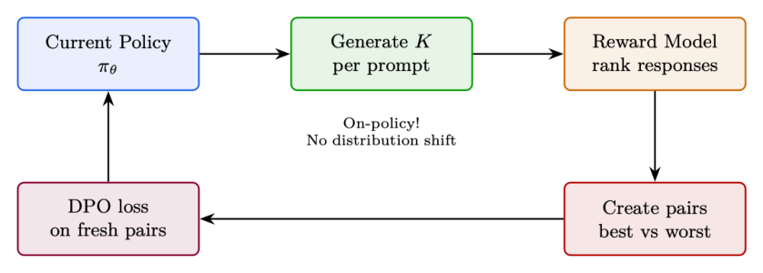

# 第 8 章 偏好优化变体(Preference Optimization Variants)

本章涵盖一系列对 DPO 进行扩展或替换的方法,它们采用不同的目标函数、数据假设或架构权衡。每一种都针对标准离线 DPO 的某一具体局限:分布漂移(Online DPO)、需要成对数据(KTO)、对噪声标签过拟合(IPO)、参考模型的内存开销(ORPO)、或训练复杂度(Best-of-N)。

## 8.1 Online DPO

### 8.1.1 动机

标准 DPO 的主要局限在于:偏好数据是由另一个不同的模型(通常是一个较早的检查点(checkpoint),甚至属于不同的模型族)生成的。随着训练推进,策略会生成与训练对完全不相像的文本 → 损失在无关的分布上进行优化。

Online DPO 的解决方案 [195]:每一步都从当前策略生成全新的偏好对,用奖励模型(reward model)对它们进行评判,然后施加 DPO 损失。

### 8.1.2 算法

1. 从当前 $\pi_\theta$ 为每个提示(prompt)生成 $K$ 个回答
2. 用奖励模型 $r_\phi$ 为所有回答打分
3. 构造偏好对:得分最高者 = chosen(被选中),得分最低者 = rejected(被拒绝)
4. 在这些新对上施加 DPO 损失
5. 重复(每一步都重新生成)

**Online DPO = 两全其美**

- 取自 DPO:简单的监督损失,无价值函数(value function),无 GAE,优化稳定
- 取自 PPO:同策略(on-policy)数据,能在数据集之外自我改进,无分布漂移
- 与 GRPO 的关键区别:使用 DPO 损失(基于偏好对),而非 PPO 损失(基于逐样本优势)

权衡:需要奖励模型(DPO 不需要),但不需要价值头(PPO 需要)。复杂度居中。

### 8.1.3 TRL 实现

下面给出一个使用 HuggingFace TRL 的最小可用示例。

```python
from trl import OnlineDPOConfig, OnlineDPOTrainer
from transformers import AutoModelForCausalLM, AutoModelForSequenceClassification

model = AutoModelForCausalLM.from_pretrained(
    "meta-llama/Llama-3.1-8B-Instruct", torch_dtype=torch.bfloat16
)
reward_model = AutoModelForSequenceClassification.from_pretrained(
    "RLHFlow/ArmoRM-Llama3-8B-v0.1", torch_dtype=torch.bfloat16
)

online_dpo_config = OnlineDPOConfig(
    output_dir="./online_dpo_output",
    learning_rate=5e-7,
    beta=0.1,                       # DPO beta(含义与标准 DPO 相同)
    num_generations=4,              # 每个提示生成 K 个回答
    per_device_train_batch_size=4,
    gradient_accumulation_steps=4,
    max_new_tokens=512,
    temperature=0.7,
    bf16=True,
    num_train_epochs=1,
    logging_steps=10,
)

trainer = OnlineDPOTrainer(
    model=model,
    reward_model=reward_model,
    args=online_dpo_config,
    train_dataset=prompt_dataset,
    tokenizer=tokenizer,
)
trainer.train()
```

### 8.1.4 Online DPO 对比 Offline DPO 对比 PPO

| 方法 | 数据 | 模型数 | 损失 | 适用场景 |
|---|---|---|---|---|
| Offline DPO | 静态偏好对 | 2(策略 + 参考) | DPO | 快速对齐,算力有限 |
| Online DPO | 从 $\pi_\theta$ 新生成 | 3(策略 + 参考 + 奖励模型) | DPO | 当 DPO 停滞、需要探索时 |
| PPO | 从 $\pi_\theta$ 新生成 | 4(策略 + 参考 + 奖励模型 + 价值头) | PPO clip | 极致质量,复杂推理 |

## 8.2 KTO —— 卡尼曼-特沃斯基优化(Kahneman-Tversky Optimization)

### 8.2.1 动机

DPO 需要成对偏好:对于同一个提示,需要同时有一个好回答和一个坏回答。而在实际中,绝大多数反馈是**非成对**的:用户对单个回答给出点赞/点踩(thumbs up/down),并不存在匹配的配对。

KTO 的洞见 [11]:借鉴行为经济学中的**前景理论(prospect theory)**。人类对损失的痛感强于对收益的快感。一个「点踩」应当产生比一个「点赞」更强的梯度。

### 8.2.2 损失函数

$$
\mathcal{L}_{\text{KTO}} = \mathbb{E}_{y_w}\big[\lambda_w\,(1 - v(x, y_w))\big] + \mathbb{E}_{y_l}\big[\lambda_l \cdot v(x, y_l)\big] \quad (8.1)
$$

其中

$$
v(x, y) = \sigma\!\left( \beta \log \frac{\pi_\theta(y \mid x)}{\pi_{\text{ref}}(y \mid x)} - z_{\text{ref}} \right),
$$

而 $z_{\text{ref}}$ 是期望 KL 散度(一个滑动更新的基线)。

**KTO 通过前景理论获得的直觉**

- **期望回答($y_w$)**:模型通过提高其概率获得「效用」。但收益递减 —— 一旦该回答已经相当可能,就不必再加大力度。
- **非期望回答($y_l$)**:损失厌恶(loss aversion)意味着生成坏文本的惩罚,权重要强于生成好文本的奖励。默认值:$\lambda_l = 1.0,\ \lambda_w = 1.0$,但可以设置 $\lambda_l > \lambda_w$。

**关键优势**:每个训练样本相互独立!无需寻找匹配的偏好对,可直接使用点赞/点踩数据。

**KTO 的数据格式**

与 DPO 需要的 `{"prompt": ..., "chosen": ..., "rejected": ...}` 不同,KTO 只需要:

```
{"prompt": ..., "completion": ..., "label": true/false}
```

这意味着你可以使用:

- 生产流量中的点赞/点踩数据
- 论坛上的赞/踩
- 人类评分二值化(4–5 星 = 好,1–2 星 = 坏)
- 任何逐回答(per-response)的质量信号

### 8.2.3 TRL 实现

下面给出一个使用 HuggingFace TRL 的最小可用示例。

```python
from trl import KTOConfig, KTOTrainer

# 数据集格式:{"prompt": str, "completion": str, "label": bool}
# label=True 表示期望(desirable),label=False 表示非期望(undesirable)
kto_dataset = [
    {"prompt": "What's 2+2?", "completion": "The answer is 4.", "label": True},
    {"prompt": "What's 2+2?", "completion": "It might be 5.", "label": False},
]

kto_config = KTOConfig(
    output_dir="./kto_output",
    beta=0.1,
    desirable_weight=1.0,           # 好样本的权重
    undesirable_weight=1.0,         # 坏样本的权重(增大可体现损失厌恶)
    learning_rate=5e-7,
    max_length=2048,
    per_device_train_batch_size=4,
    gradient_accumulation_steps=4,
    num_train_epochs=1,
    bf16=True,
)

trainer = KTOTrainer(
    model=model,
    ref_model=ref_model,            # 或使用 LoRA 时设为 None
    args=kto_config,
    train_dataset=kto_dataset,
    tokenizer=tokenizer,
)
trainer.train()
```

### 8.2.4 何时选择 KTO

- 你只有二元反馈,但没有匹配的偏好对
- 大规模的生产点赞/点踩数据
- 某一类样本占多数(例如 90% 好、10% 坏)—— KTO 对不均衡处理得更好
- 用噪声标签快速迭代(比 DPO 对噪声更鲁棒)

## 8.3 IPO —— 恒等偏好优化(Identity Preference Optimization)

### 8.3.1 动机

DPO 存在一个退化解(degenerate solution):它可以通过让 chosen 与 rejected 之间的间隔趋向无穷大来实现零损失。在实际中,这意味着 DPO 会过拟合 —— 把 chosen 的概率推到 1、rejected 的概率压到 0,从而记住训练数据。

IPO 的修正 [12]:不再使用 log-sigmoid(它会饱和),而是改用一个**以特定间隔为目标的平方损失**。该损失在一个**有限**的间隔处达到最小,而非在无穷远处。

### 8.3.2 损失函数

$$
\mathcal{L}_{\text{IPO}} = \mathbb{E}\left[ \left( \log \frac{\pi_\theta(y_w \mid x)}{\pi_{\text{ref}}(y_w \mid x)} - \log \frac{\pi_\theta(y_l \mid x)}{\pi_{\text{ref}}(y_l \mid x)} - \frac{1}{2\beta} \right)^2 \right] \quad (8.2)
$$

**IPO 对比 DPO:通过目标间隔进行正则化**

- **DPO**:$\sigma(\text{margin}) \to 1$ 是最优的,间隔 → $\infty$。没有自然的停止点。
- **IPO**:间隔 → $\dfrac{1}{2\beta}$ 是最优的。平方损失同时惩罚过小和过大的间隔。

结果:IPO 对噪声标签更鲁棒(一对标错的样本只会产生有界影响),且泛化更好,因为它不会死记硬背训练数据。

### 8.3.3 TRL 实现

下面给出一个使用 HuggingFace TRL 的最小可用示例。

```python
from trl import DPOConfig, DPOTrainer

# IPO 在 TRL 中作为 DPO 的一个 loss_type 变体实现
ipo_config = DPOConfig(
    output_dir="./ipo_output",
    beta=0.1,
    loss_type="ipo",                # 关键区别!
    learning_rate=5e-7,
    max_length=2048,
    per_device_train_batch_size=4,
    gradient_accumulation_steps=8,
    bf16=True,
    num_train_epochs=1,
)

trainer = DPOTrainer(
    model=model, ref_model=None, args=ipo_config,
    train_dataset=pref_dataset, tokenizer=tokenizer, peft_config=lora_config,
)
trainer.train()
```

### 8.3.4 何时选择 IPO 而非 DPO

- 噪声偏好数据(众包标注、AI 评判有误)
- 观察到 DPO 过拟合(训练损失 → 0 但评估指标退化)
- 想要更保守、更鲁棒的对齐
- 需要训练多个 epoch(DPO 在第 1 个 epoch 后退化;IPO 更稳定)

## 8.4 ORPO —— 赔率比偏好优化(Odds Ratio Preference Optimization)

### 8.4.1 动机

目前为止的所有方法都需要一个参考模型 —— 要么作为一份独立的副本(内存翻倍),要么通过 LoRA 隐式实现。ORPO [13] 通过在单一损失中**同时**完成 SFT 和偏好对齐,**完全消除了参考模型**。

核心洞见:用生成 chosen 相对 rejected 的**赔率比(odds ratio)**作为偏好信号。SFT 分量自然地防止模型坍塌(collapsing),无需 KL 正则化。

### 8.4.2 损失函数

$$
\mathcal{L}_{\text{ORPO}} =
\underbrace{\mathcal{L}_{\text{SFT}}(y_w)}_{\text{在 chosen 上的标准 NLL}}
\;-\; \lambda \cdot \underbrace{\log \sigma\!\left( \log \frac{\text{odds}_\theta(y_w \mid x)}{\text{odds}_\theta(y_l \mid x)} \right)}_{\text{通过赔率比进行偏好对齐}} \quad (8.3)
$$

其中

$$
\text{odds}_\theta(y \mid x) = \frac{P_\theta(y \mid x)}{1 - P_\theta(y \mid x)}.
$$

**ORPO:一步完成 SFT + 对齐**

- **SFT 项**:训练模型把 chosen 回答生成好(标准语言建模)。
- **赔率比项**:额外地推动模型在 chosen 与 rejected 之间偏好前者。赔率比是一种自然的对比(contrast),无需参考模型。

**为什么不需要参考模型?**:SFT 损失已将模型锚定在合理文本上,扮演了与其它方法中「KL-to-reference」相同的角色。一个模型、一次前向传播、一个损失。内存节省 50%!

### 8.4.3 TRL 实现

下面给出一个使用 HuggingFace TRL 的最小可用示例。

```python
from trl import ORPOConfig, ORPOTrainer

orpo_config = ORPOConfig(
    output_dir="./orpo_output",
    beta=0.1,                       # 赔率比权重(lambda)
    learning_rate=5e-7,
    max_length=2048,
    per_device_train_batch_size=2,
    gradient_accumulation_steps=8,
    bf16=True,
    num_train_epochs=1,
    gradient_checkpointing=True,
)

trainer = ORPOTrainer(
    model=model,                    # 不需要 ref_model!
    args=orpo_config,
    train_dataset=pref_dataset,     # 与 DPO 相同的格式:prompt/chosen/rejected
    tokenizer=tokenizer,
    peft_config=lora_config,
)
trainer.train()
```

### 8.4.4 何时选择 ORPO

- 内存受限:无法承担参考模型的副本(对 70B 模型节省 70–140GB)
- 从基座模型(base model)起步(尚未做过 SFT)—— ORPO 会同时进行 SFT
- 想要尽可能简单的流水线:一个模型、一个损失、一次训练
- 一开始就有高质量的偏好数据可用

**ORPO 的局限**

- 相比 DPO/PPO 研究较少 —— 在 70B+ 规模上经过验证的方案更少
- SFT 分量意味着它需要高质量的 chosen 回答(不仅仅是相对偏好)
- 更难调试:两个损失分量可能相互冲突

**另见:SimPO**

SimPO [183] 是另一种无需参考模型的偏好方法,它使用长度归一化的对数概率作为隐式奖励,从而完全消除参考模型。由于它与这些方法共享「无参考模型」的理念,在第 6.9.8 节与其他 DPO 扩展一起讨论。

## 8.5 Best-of-N 采样(拒绝采样,Rejection Sampling)

### 8.5.1 动机

有时最简单的方法反而奏效。Best-of-N [196] 在 RL 阶段**完全不需要训练** —— 只需生成多个候选并挑出最好的那个。

### 8.5.2 算法

1. 对每个提示,从策略生成 $N$ 个回答(通常 $N = 4$–$64$)
2. 用奖励模型为所有回答打分
3. 选出得分最高的回答
4. (可选)将选中的回答作为下一轮迭代的 SFT 数据

Best-of-N 的回答为

$$
y^{*} = \arg\max_{y_i \sim \pi_\theta(\cdot \mid x)}\; r_\phi(x, y_i) \quad (8.4)
$$

**为什么 Best-of-N 是一种名副其实的「RL」方法**

- **在推理时(inference time)**:Best-of-N 无需改变模型权重即可提升输出质量。当 $N = 64$ 时,胜率(win-rate)相对贪心解码提升 10–20%,有时能匹敌甚至超过 PPO。
- **作为一种训练方法(拒绝采样微调 / Rejection Sampling Fine-Tuning,RFT)**:
  1. 生成大量回答,选出最好的若干个
  2. 在选中的回答上做 SFT
  3. 重复(迭代式精炼)

许多生产模型就是这样训练出来的:比 PPO 更简单,效果几乎相当,且完全稳定。

**理论联系 [197]**:Best-of-N 实现了一个隐式的 KL 约束策略:

$$
\pi_{\text{BoN}}(y \mid x) \;\propto\; \pi_\theta(y \mid x)^{1 - 1/N} \cdot r(x, y)^{1/N}.
$$

### 8.5.3 TRL 实现

下面给出一个使用 HuggingFace TRL 的最小可用示例。

```python
from transformers import pipeline
import numpy as np

# 推理时的 Best-of-N(手动实现)
gen_pipeline = pipeline("text-generation", model=model, tokenizer=tokenizer)

def best_of_n(prompt, n=16, temperature=0.8):
    """生成 N 个候选并返回奖励最高的那个。"""
    candidates = gen_pipeline(
        prompt, num_return_sequences=n,
        temperature=temperature, do_sample=True, max_new_tokens=512,
    )
    scores = [reward_model.score(prompt, c["generated_text"]) for c in candidates]
    return candidates[np.argmax(scores)]["generated_text"]

best_response = best_of_n(prompt, n=16)

# 训练:拒绝采样微调(Rejection Sampling Fine-Tuning,RFT)
from trl import SFTConfig, SFTTrainer

# 第 1 步:生成并筛选
all_responses = []
for prompt in prompts:
    candidates = [generate(prompt, temp=0.9) for _ in range(16)]
    scores = [reward_model.score(prompt, c) for c in candidates]
    best_idx = np.argmax(scores)
    if scores[best_idx] > threshold:      # 质量闸门
        all_responses.append({"prompt": prompt, "completion": candidates[best_idx]})

# 第 2 步:在最优回答上做 SFT
sft_config = SFTConfig(output_dir="./rft_output", learning_rate=2e-5,
                       num_train_epochs=2, max_seq_length=2048)
trainer = SFTTrainer(model=model, args=sft_config, train_dataset=all_responses,
                     tokenizer=tokenizer)
trainer.train()

# 第 3 步:用更新后的模型从第 1 步开始重复(迭代式 RFT)
```

### 8.5.4 Best-of-N 的缩放规律

| $N$ | 质量提升 | 成本 | 说明 |
|---|---|---|---|
| 1 | 基线 | 1× | 标准采样 |
| 4 | +5–8% 胜率 | 4× | 有用的最小值,性价比好 |
| 16 | +10–15% 胜率 | 16× | 表现强劲,常能匹敌 PPO 质量 |
| 64 | +15–20% 胜率 | 64× | 边际收益开始递减 |
| 256 | +18–22% 胜率 | 256× | 仅用于关键应用 |

**将 Best-of-N 作为基线**

永远要在**相同算力预算**下,把你的 RL 方法与 Best-of-N 做比较。如果消耗 64 GPU 小时的 PPO 还打不过消耗 64 GPU 小时生成算力的 Best-of-N,那你的 PPO 一定有 bug。

## 8.6 小结:如何选择对齐方法

到目前为止,我们已经纵览了偏好优化与基于 RL 的对齐方法的完整图景。本节把关键权衡汇总成一份参考资料,帮助从业者根据自身约束选出合适的方法。

**表 8.1:各种对齐方法的横向对比。**

| 方法 | 模型数 | 数据 | 算力 | 稳定性 | 适用场景 |
|---|---|---|---|---|---|
| PPO | 4 | 在线(生成) | 非常高 | 低 | 极致质量,复杂推理 |
| GRPO | 2(无 critic) | 在线(生成) | 高 | 中 | 数学/代码(可验证奖励) |
| DPO | 2 | 离线偏好对 | 低 | 高 | 风格/安全,算力有限 |
| Online DPO | 3 | 在线(生成) | 中 | 中-高 | 无分布漂移的 DPO |
| KTO | 2 | 非成对二元 | 低 | 高 | 生产反馈,点赞/点踩 |
| IPO | 2 | 离线偏好对 | 低 | 非常高 | 噪声标签,抗过拟合 |
| ORPO | 1 | 离线偏好对 | 非常低 | 高 | 内存受限,SFT + 对齐合一 |
| Best-of-N | 1 + RM | 在线(生成) | 中 | 完美 | 强基线,数据生成 |



**决策树:该用哪种方法?**

1. 你有可验证奖励吗?(数学/代码) → **GRPO**
2. 你需要在复杂任务上达到极致质量吗? → **PPO**
3. 你有成对偏好吗? → **DPO**(若有噪声则选 IPO)
4. 只有非成对的二元反馈? → **KTO**
5. 内存受限,且从基座模型起步? → **ORPO**
6. DPO 已停滞,想要同策略数据? → **Online DPO**
7. 需要快速得到一个强基线? → **Best-of-N / RFT**
