# 第 11 章 大规模系统架构与基础设施

基于人类反馈的强化学习(Reinforcement Learning from Human Feedback, RLHF)训练大语言模型(Large Language Model, LLM),既是一个算法挑战,也是一个系统工程挑战。与标准的监督微调(Supervised Fine-Tuning, SFT)——它只涉及单个模型、一次前向-反向传播、且扩展规律已被充分理解——不同,RLHF 需要同时加载多个模型(策略模型、参考模型、奖励模型、价值头),通过复杂的"采样-打分-训练"循环加以协调,并分布到几十乃至数百张 GPU 上。本章覆盖使大规模 RLHF 训练成为可能的系统级细节:内存预算、并行策略(数据并行、张量并行、流水线并行、序列并行及其组合)、生成瓶颈、解耦架构、权重同步、容错,以及生产监控。

## 11.1 四模型内存挑战

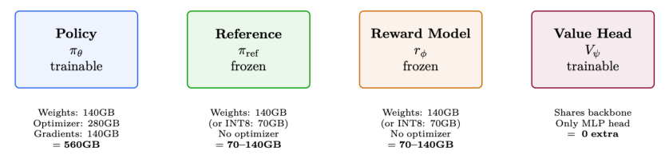

**70B BF16 内存预算真实账本**

| 项目 | 占用 |
|---|---|
| 策略权重(BF16) | 140 GB |
| FP32 主权重 | 280 GB |
| Adam 优化器状态(m + v,FP32) | 560 GB |
| 梯度(BF16) | 140 GB |
| 参考模型 | 140 GB(或 INT8 下 70 GB) |
| 奖励模型 | 140 GB(或 INT8 下 70 GB) |
| 激活值(batch=128, seq=2048) | 50–100 GB |
| 生成的 KV cache | 20–60 GB |
| **合计** | **1470–1560 GB** |

除以每张 GPU 80 GB,至少需要 19–20 张 A100(且尚未计入任何并行开销)。

## 11.2 并行策略详解

训练大语言模型需要将计算分布到大量 GPU 上。并行化存在若干本质上不同的维度,每个维度都有各自独特的权衡。本节针对每种策略给出数学公式、图示与实用指导。

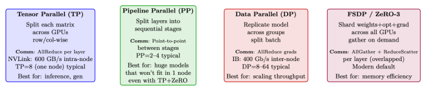

### 11.2.1 数据并行(DP)与分布式数据并行(DDP)

数据并行(Data Parallelism, DP)是最简单也最常见的分布式训练形式 [205]。每张 GPU 持有完整的模型副本,处理不同的 mini-batch,并同步梯度。

**朴素 DP(PyTorch DataParallel)。** 单进程方案:一个"主"GPU 负责分发输入、收集输出、广播梯度。受限于 Python GIL 和通往主 GPU 的 PCIe 带宽。

**分布式数据并行(Distributed Data Parallelism, DDP,DistributedDataParallel)。** 多进程:每张 GPU 运行各自独立的进程。梯度在后台通过 ring-AllReduce [206] 同步,与反向计算重叠进行。

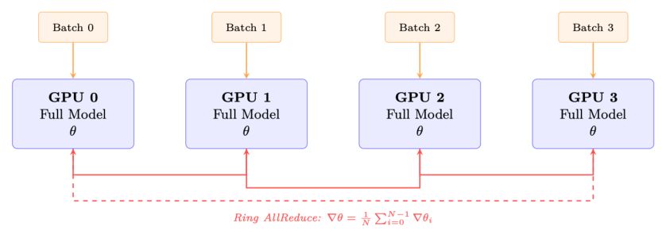

DDP 的关键特性:

- **内存**:每张 GPU 存储完整模型 + 优化器 + 梯度。对于 70B BF16:约 560 GB/GPU——不做内存优化根本不可能。
- **通信**:每步对梯度张量做一次 AllReduce。大小 = 模型参数量 × 2 字节(BF16)。Ring AllReduce 代价:每张 GPU 传输 $2 \cdot \frac{N-1}{N} \cdot M$ 字节。
- **扩展性**:在约 64 张 GPU 以内接近线性;超过后通信开始占据主导。
- **梯度分桶(Gradient bucketing)**:DDP 将参数分组为桶(默认 25 MB),一旦某个桶的梯度就绪便立即启动 AllReduce——从而让通信与反向计算重叠。

```python
import torch.distributed as dist
from torch.nn.parallel import DistributedDataParallel as DDP

dist.init_process_group(backend="nccl")          # NCCL 用于 GPU 间通信
model = model.to(local_rank)
model = DDP(
    model,
    device_ids=[local_rank],
    gradient_as_bucket_view=True,                 # 内存优化
    static_graph=True,                            # 启用通信优化
)
```

> **DP vs DDP —— 始终使用 DDP**
>
> PyTorch 的遗留版 DataParallel(DP)绝不可用于 LLM 训练:
> - 单进程,受 Python GIL 限制
> - 所有梯度都汇聚到 GPU 0(瓶颈)
> - 即便在单节点上也比 DDP 慢 2–3 倍
> - 无法扩展到单机之外
>
> DDP 是最低限度的并行策略。对于 7B 以上的 LLM,优先使用 FSDP/ZeRO。

### 11.2.2 张量并行(TP)

张量并行(Tensor Parallelism, TP,Megatron-LM 风格 [207])将单个权重矩阵沿某维度切分到多张 GPU 上。每张 GPU 计算部分结果,再由一个 AllReduce 合并。

**按列并行的线性层(Column-Parallel Linear Layer)。** 权重矩阵 $W \in \mathbb{R}^{d \times h}$ 按列切分到 $T$ 张 GPU:

$$
W = [W_0 \mid W_1 \mid \cdots \mid W_{T-1}], \quad W_i \in \mathbb{R}^{d \times h/T}
\tag{11.1}
$$

每张 GPU $i$ 独立计算 $Y_i = X W_i$(无需通信)。输出沿隐藏维度被切分。

**按行并行的线性层(Row-Parallel Linear Layer)。** 权重矩阵按行切分:$W = [W_0; W_1; \dots; W_{T-1}]$,其中 $W_i \in \mathbb{R}^{d/T \times h}$。输入 $X$ 也必须被切分。每张 GPU 计算部分和,再由一个 AllReduce 得到最终输出。

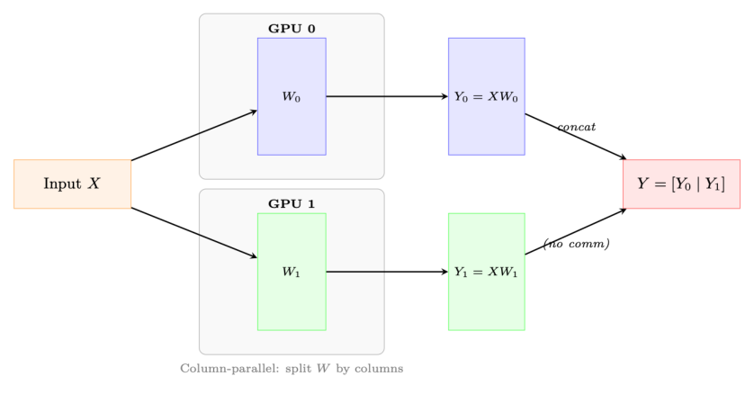

**带 TP 的 Transformer 块。** 在一个 Transformer 层中,Megatron-LM 按如下方式施加 TP:

1. **MLP**:第一个线性层($h \to 4h$)按列并行,第二个($4h \to h$)按行并行。在按行并行的层之后做一次 AllReduce。
2. **Attention**:Q、K、V 投影按列并行(将注意力头切分到各 GPU)。输出投影按行并行。在输出投影之后做一次 AllReduce。
3. **合计**:每个 Transformer 层需要 2 次 AllReduce(一次用于注意力,一次用于 MLP)。

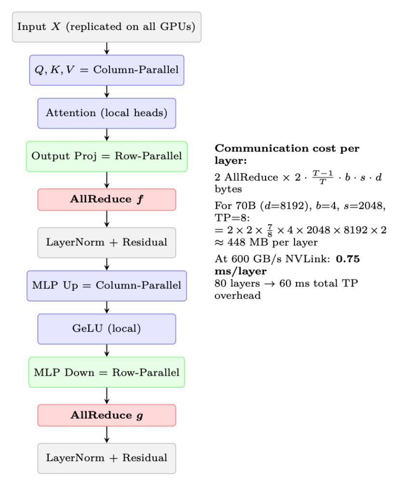

**为什么 TP 被限制在节点内**

每个 Transformer 层需要 2 次 AllReduce 操作(即上文标记的 f 与 g)。对于一个有 80 层的 70B 模型,一次前向传播就是 160 次 AllReduce(算上反向共 320 次)。在 NVLink 速度(600 GB/s)下,每次 AllReduce 耗时 <0.5 ms;但经 InfiniBand(50 GB/s)时,同样操作约需 4 ms,使总开销达 $160 \times 4 = 640$ ms——比计算本身还长。

> **规则:TP 度 ≤ 单节点 GPU 数(通常 TP ≤ 8)。跨节点扩展请使用 DP/FSDP。**

**TP 度的选择**

- **TP=1**:不做张量并行。模型可装入单张 GPU(典型为 BF16 下 ≤13B)。
- **TP=2**:最小切分。适合 2 张 GPU 上 13–34B 的推理。开销低(<5%)。
- **TP=4**:34–70B 推理的标准配置。开销 8–12%。
- **TP=8**:整节点。70B+ 训练所需。开销 12–18%。
- **TP>8**:跨节点 TP。极少使用——仅当 PP 单独不足以支撑 200B+ 模型时采用。开销 30–50%。

> **重要**:注意力头数必须能被 TP 度整除。对于 LLaMA-70B(64 头),合法的 TP = 1, 2, 4, 8, 16, 32, 64。

### 11.2.3 序列并行(SP)

序列并行(Sequence Parallelism, SP)[208] 解决了张量并行单独无法解决的内存瓶颈:LayerNorm 和 Dropout 层中的激活内存。

**问题。** 在 TP 下,权重内存被切分到各 GPU 上。但 LayerNorm 和 Dropout 作用于完整的隐藏维度,在每个 GPU 上都有一份副本。它们的激活值(反向传播需要)消耗的内存正比于 $b \times s \times d$——在每张 GPU 上都相同,不被 TP 减少。

**解决方案。** 对于不需要跨 GPU 通信的操作(LayerNorm、Dropout、残差连接),沿序列维度切分。每张 GPU 对这些操作处理序列的 $s/T$ 切片,仅在需要处(注意力、线性层)才收集完整序列。

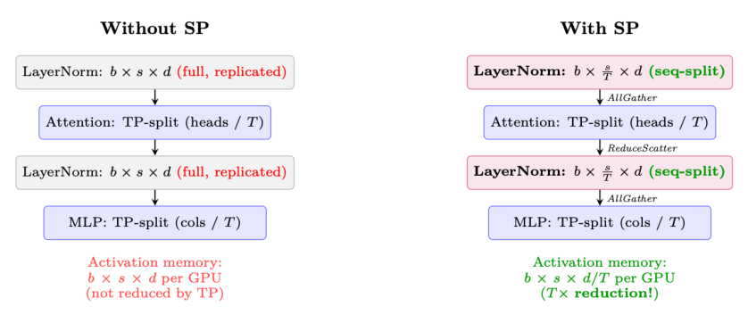

**SP 的通信是"免费"的**

标准 TP 在每个子层后使用 AllReduce,它等价于 ReduceScatter + AllGather。SP 只是重新排列了这些原语:

- **不带 SP 的 TP**:AllReduce(= ReduceScatter + AllGather)→ 所有 GPU 上数据相同 → 在完整张量上做 LayerNorm(浪费)。
- **带 SP 的 TP**:ReduceScatter → 每张 GPU 持有序列的 1/T → 在部分张量上做 LayerNorm → 下一个 TP 层前 AllGather。

总通信量完全相同!SP 纯粹是一种内存优化,额外通信开销为零。在使用 TP 时应始终启用。

来自 SP 的内存节省(70B 模型,TP=8,batch=4,seq=2048):

$$
\text{激活节省} = (T - 1) \times b \times s \times d \times n_{\text{layers}} \times 2 \text{ 字节}
= 7 \times 4 \times 2048 \times 8192 \times 80 \times 2 \approx 59 \text{ GB/GPU}
\tag{11.2}
$$

### 11.2.4 流水线并行(PP)

流水线并行(Pipeline Parallelism, PP)按层将模型纵向切分,把连续的层组分配给不同设备(阶段)。激活前向流过各阶段,梯度反向流回。

**气泡问题(The Bubble Problem)。** 朴素的流水线执行会产生"气泡"——阶段等待前一阶段的输入或后一阶段梯度时的空闲时间:

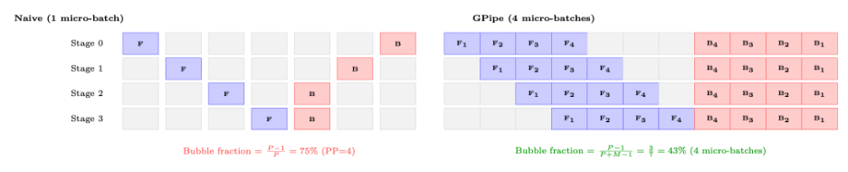

**气泡占比公式。** 对于 $P$ 个流水线阶段和每步 $M$ 个 micro-batch:

$$
\text{气泡占比} = \frac{P - 1}{P + M - 1} \approx \frac{P - 1}{M} \quad (\text{当 } M \gg P)
\tag{11.3}
$$

要让气泡开销 <10%,需要 $M \ge 10 \cdot (P - 1)$。对于 PP=4:至少 30 个 micro-batch。

**表 11.1:流水线调度策略**

| 调度 | 气泡 | 内存 | 特点 |
|---|---|---|---|
| GPipe | $\frac{P-1}{M+P-1}$ | $M \times$ 激活 | 简单;全部前向后再全部反向 [209] |
| 1F1B | $\frac{P-1}{M+P-1}$ | $P \times$ 激活 | 交错;稳态内存有界 [210] |
| Interleaved 1F1B | $\frac{P-1}{M \cdot V + P - 1}$ | $P \times$ 激活 | 虚拟阶段(V);进一步减小气泡 [211] |
| Zero-Bubble(ZB-H1) | $\approx 0$ | $P \times$ 激活 | 将反向拆分为 B 与 W 两个阶段 [212] |

**流水线调度。**

**1F1B:生产标准**

1F1B(一次前向一次反向,one-forward-one-backward)调度 [210] 被大多数生产系统使用(Megatron-LM [211]、DeepSpeed [213]):

- **预热(Warmup)**:前向传播填满流水线($P-1$ 个 micro-batch)。
- **稳态(Steady state)**:每个时间槽交替执行一次前向和一次反向。这将峰值激活内存限定为 $P$ 个 micro-batch(相比 GPipe 的 $M$)。
- **排空(Cooldown)**:剩余的反向传播排干流水线。

内存优势:GPipe 必须同时存储全部 $M$ 个 micro-batch 的激活;1F1B 在稳态只存储 $P$ 组激活——当 $M = 32$ 但 $P = 4$ 时至关重要。

**PP 中的通信。** 与 TP(AllReduce)不同,PP 仅需相邻阶段之间激活的点对点通信:

$$
\text{每次传输数据量} = b_{\text{micro}} \times s \times d \times 2 \text{ 字节(BF16)}
\tag{11.4}
$$

对于 micro-batch=4、seq=2048、$d=8192$:$4 \times 2048 \times 8192 \times 2 = 128$ MB 每次传输。在 InfiniBand 50 GB/s 下:每次 2.6 ms——相对每阶段的计算量很小。

**负载均衡。** 并非所有层的计算量都相同:

- 嵌入层:非常廉价(查表)。
- Transformer 块:计算量均匀。
- 最终 LM head:中等(词表投影的大矩阵乘)。

将更多 Transformer 层分配给中间阶段,首尾阶段分配较少,以均衡计算。

### 11.2.5 全分片数据并行(FSDP / ZeRO-3)

FSDP [214](PyTorch)与 ZeRO-3 [213](DeepSpeed)解决 DDP 中固有的内存冗余:不再让每张 GPU 都持有参数、梯度、优化器状态的完整副本,而是让每张 GPU 仅拥有 1/N 的切片,在需要时按需重构完整张量。

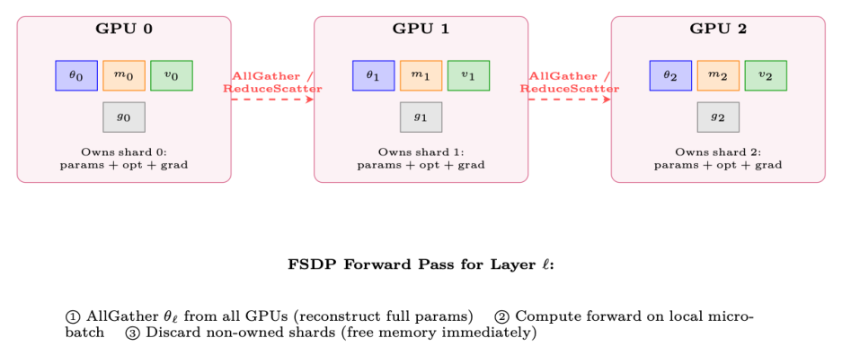

每层 FSDP 的执行流程:

1. **前向**:AllGather 参数 → 计算 → 丢弃非自有分片。
2. **反向**:再次 AllGather 参数 → 计算梯度 → ReduceScatter 梯度(每张 GPU 得到自己的梯度分片)→ 丢弃非自有参数分片。
3. **优化器步**:每张 GPU 仅用自己的梯度分片和优化器状态更新自己拥有的分片。

```python
from functools import partial
from torch.distributed.fsdp import (
    FullyShardedDataParallel as FSDP,
    ShardingStrategy, MixedPrecision, BackwardPrefetch,
)
from torch.distributed.fsdp.wrap import transformer_auto_wrap_policy
from transformers.models.llama.modeling_llama import LlamaDecoderLayer
```

**表 11.2:DDP 与 FSDP/ZeRO 各阶段的内存对比(70B 模型,8 张 GPU)。基线:BF16 参数(140 GB)+ BF16 梯度(140 GB)+ FP32 主权重+m+v(840 GB)= 每张 GPU 1120 GB。**

| 策略 | 分片对象 | 每张 GPU 内存 | 通信 |
|---|---|---|---|
| DDP(不分片) | 无 | 1120 GB ✗ | AllReduce(仅梯度) |
| ZeRO-1 | 优化器状态 | 385 GB ✗ | AllReduce(梯度) |
| ZeRO-2 | 优化器 + 梯度 | 368 GB ✗ | AllReduce(梯度) |
| ZeRO-3 / FSDP | 一切 | 140 GB ✓ | AllGather + ReduceScatter(逐层) |

```python
# 用 FSDP 包裹模型
auto_wrap = partial(
    transformer_auto_wrap_policy,
    transformer_layer_cls={LlamaDecoderLayer},
)
mp_policy = MixedPrecision(
    param_dtype=torch.bfloat16,
    reduce_dtype=torch.bfloat16,
    buffer_dtype=torch.bfloat16,
)
model = FSDP(
    model,
    sharding_strategy=ShardingStrategy.FULL_SHARD,        # ZeRO-3
    mixed_precision=mp_policy,
    auto_wrap_policy=auto_wrap,                           # 逐层包裹 Transformer
    use_orig_params=True,                                 # torch.compile 兼容性所需
    limit_all_gathers=True,                               # 限制峰值内存(同时仅 1 个 AllGather 在飞)
    forward_prefetch=True,                                # 在当前层前向时预取下一层参数
    backward_prefetch=BackwardPrefetch.BACKWARD_PRE,      # 反向时预取
)
```

**FSDP 通信量**

FSDP 每步传输的数据是 DDP 的 3 倍:

- **DDP**:1 次梯度的 AllReduce = 全环共 $2M$ 字节($M$ 为模型大小,单位字节)。
- **FSDP**:2 次 AllGather(前向 + 反向)+ 1 次 ReduceScatter = $3M$ 字节。

这就是内存-通信权衡。FSDP 在以下情形值得:(a) 模型用 DDP 装不进 GPU 内存;或 (b) 通信与计算能良好重叠(现代框架可达 70–90% 重叠)。

### 11.2.6 3D 并行:组合多种策略

大规模生产系统(70B+)会同时组合 TP、PP、DP/FSDP:

> **生产配方:64 张 A100-80GB(8 节点)训练 70B**
>
> - **节点内(NVLink 600GB/s)**:生成用 TP=8,节点内训练用 FSDP。
> - **节点间(InfiniBand 400Gb/s)**:跨节点 FSDP(8 路数据并行)。
> - **结果**:每张 GPU 持有约 70GB;策略权重在前向/反向时逐层 AllGather。
> - **流水线并行**:仅当模型超过 100B+ 且 TP+ZeRO 装不下时使用。增加复杂度(气泡开销 10–20%)和调度麻烦。

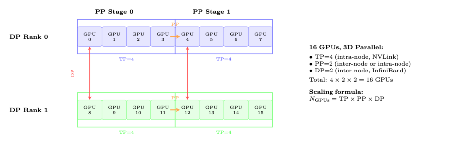

决策流程:

1. 模型能装入单张 GPU?→ 使用 DDP。
2. 能用 FSDP 装入单节点?→ 使用 FSDP(ZeRO-3)。
3. 能用 TP+FSDP 装入单节点?→ 使用 TP(节点内)+ FSDP(节点间)。
4. 还是装不下?→ 跨节点加入 PP。这是最后的手段。

**表 11.3:并行策略对比汇总**

| 策略 | 切分对象 | 通信 | 扩展上限 | 开销 | 适用场景 |
|---|---|---|---|---|---|
| DP/DDP | batch | AllReduce(梯度) | ~64 GPU | 5–10% | 模型装入单 GPU |
| FSDP | 参数+优化器+梯度 | AllGather+RS | 数百 GPU | 10–20% | >13B 的默认选择 |
| TP | 权重矩阵 | AllReduce(2/层) | 8 GPU(1 节点) | 12–18% | 大模型推理+训练 |
| SP | 激活(序列) | 复用 TP 通信 | 同 TP | 额外 ≈0% | 始终与 TP 同用 |
| PP | 层(阶段) | 点对点 | ~16 阶段 | 15–30% | 仅 100B+ 模型 |

## 11.3 生成瓶颈:定量分析

**屋顶线分析:为什么生成是内存受限的**

A100 规格:312 TFLOPS(BF16 张量核心),2 TB/s HBM 带宽。屋顶线交叉点:$312\text{T}/2\text{T} = 156$ FLOP/字节。低于 156 FLOP/字节的操作都是内存受限的。

自回归生成:对每个 token,读取全部权重(70B 为 140GB)并执行 $2 \times 70\text{B} = 140\text{G}$ FLOPs 每 token(batch=1)。

- **算术强度(arithmetic intensity)**:$140\text{G FLOP} / 140\text{GB} = 1$ FLOP/字节。这比屋顶线低 156 倍!
- **利用率**:$1/156 = 0.6\%$ 的峰值 FLOPS 被利用。GPU 99.4% 的时间在空闲,等待内存读取。
- **token 速率**:$2\text{TB/s} / 140\text{GB} = 14.3$ tokens/秒(单流,batch=1)。
- 对于 512 个 token:$512/14.3 = 35.8$ 秒每条响应(batch=1, TP=1)。

批处理有帮助:batch=64 配 TP=4 → 只读一次权重,并行生成 64 个 token。算术强度:$64 \times 1 = 64$ FLOP/字节。好一些,但仍低于屋顶线!

**表 11.4:70B 模型生成吞吐量(512 token,多种配置)**

| 配置 | batch | 每批时间 | Tok/s/GPU | 备注 |
|---|---|---|---|---|
| TP=1, batch=1 | 1 | 36s | 14 | 基线,最坏情况 |
| TP=4, batch=1 | 1 | 9s | 57 | 生成部分 TP 线性扩展 |
| TP=4, batch=32 | 32 | 15s | 1092 | 接近最优批处理 |
| TP=4, batch=128, vLLM | 128 | 45s | 1456 | 连续批处理 |
| TP=4, batch=128, INT8 | 128 | 25s | 2621 | 2 倍带宽节省 |

**优化栈(累计加速)**:

1. **vLLM + PagedAttention [157](2–4×)**:消除 KV cache 碎片,支持更大 batch。
2. **连续批处理(Continuous batching)[215](1.5–2×)**:不必等待最长序列完成;在其他序列结束时即启动新序列。
3. **投机解码(Speculative decoding)[143](2–3×)**:小草稿模型提议 5 个 token,大模型一次前向验证。平均接受 3–4 个。
4. **生成用 INT8/FP8 权重(2×)**:带宽需求减半。由于我们是采样(而非为训练计算精确 logits),质量损失极小。
5. **CUDA graphs(1.1–1.3×)**:消除固定形状操作的 kernel 启动开销。
6. **前缀缓存(prefix caching,共享前缀提示时 1.5×)**:不重复计算系统提示的 KV cache。

```python
# 生产级 vLLM 生成配置
from vllm import LLM, SamplingParams

engine = LLM(
    model="./policy_checkpoint",
    tensor_parallel_size=4,                  # 每实例 TP=4
    gpu_memory_utilization=0.92,             # 为 KV cache 留出余量
    max_num_batched_tokens=16384,            # 在飞 token 上限
    max_num_seqs=256,                        # 最大并发序列数
    dtype="bfloat16",
    enable_prefix_caching=True,              # 缓存系统提示 KV
    speculative_model="./draft_1B",          # 投机解码
    num_speculative_tokens=5,
    block_size=16,                           # PagedAttention 块大小
    swap_space=4,                            # 抢占用 GB swap 空间
)

# 为 RLHF batch 生成响应
sampling_params = SamplingParams(
    temperature=0.7, top_p=0.9,
    max_tokens=512,
    logprobs=1,                              # PPO ratio 计算需要 log-prob
)
outputs = engine.generate(prompts, sampling_params)
# 提取:每个 token 的 responses、log_probs(PPO/GRPO 需要)
```

## 11.4 解耦架构:生产设计

生产级 RLHF 系统(如 DeepSpeed-Chat [216] 和 OpenRLHF [217])采用解耦架构,将生成、打分、训练分离为可独立扩展的集群。

**为何解耦?**

- 生成是内存带宽受限(需要快速 HBM,浪费算力)。
- 训练是计算受限(需要张量核心,反向传播期间浪费带宽)。
- 同一硬件无法同时优化两者:若把一切放在一起,要么在生成时浪费算力,要么在训练时浪费带宽。解耦让每个集群使用最优的硬件/配置。

实际收益:

- 独立扩展生成与训练
- 生成集群无状态 → 容错极简单
- 可将 gen(第 N+1 步)与训练(第 N 步)重叠 → 加速 30–40%
- 不同的量化:生成用 INT8(带宽),训练用 BF16(精度)

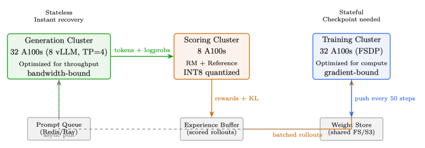

## 11.5 权重同步策略

| 策略 | 滞后 | 带宽 | 质量影响 |
|---|---|---|---|
| 同步(每步) | 0 步 | 140 GB/步 | 完美但太慢 |
| 周期性(每 50 步) | 平均 25 步 | 摊销后 2.8 GB/步 | 质量损失 <2% |
| 增量压缩(INT8) | 平均 25 步 | 0.4 GB/步 | 质量损失 <3% |
| 异步流式 | 5–10 步 | 14 GB/步(后台) | 质量损失 <1% |

**为什么滞后对 PPO/GRPO 可接受**

PPO 的裁剪目标函数本就是为离策略(off-policy)数据设计的!裁剪区间 $[1 - \epsilon, 1 + \epsilon]$ 限制了陈旧数据的影响。对于 10–50 步的滞后:

- 每步策略变化约 0.1–1%(在合适的学习率下)
- 50 步内:约 5% 的策略漂移
- PPO 裁剪设计上可处理高达 20% 的漂移
- 经验上:50 步滞后时质量损失 <2%

带宽算术:70B BF16 = 140GB。InfiniBand 400Gb/s = 50GB/s → 全量同步 2.8 秒。增量压缩下:<0.5 秒。异步 = 免费(在后台运行)。

## 11.6 内存优化技术

| ZeRO 阶段 | 分片对象 | 每张 GPU 内存(70B,8 GPU) |
|---|---|---|
| 无(数据并行) | 无(完整副本) | 560GB(不可能) |
| ZeRO-1 | 仅优化器状态 | 175GB |
| ZeRO-2 | 优化器状态 + 梯度 | 105GB |
| ZeRO-3(FSDP) | 优化器 + 梯度 + 参数 | 70GB(可装入 A100-80GB!) |

其他技术:

- **梯度检查点(Gradient checkpointing)[218]**:不存储全部激活值,在反向传播时重算。节省约 60% 激活内存,代价约 33% 额外计算。选择性使用:仅对注意力层(内存密集)做检查点,保留 FFN 激活(重算代价高)。
- **混合精度(Mixed precision)[219]**:前向用 BF16(每参数 2 字节),优化器状态用 FP32(m、v 各 4 字节)。主权重用 FP32 做累加。
- **CPU 卸载(CPU offloading,ZeRO-Infinity [220])**:将优化器状态移至 CPU RAM。节省 50% 内存但慢 2–3 倍(PCIe 64GB/s 瓶颈)。
- **激活卸载(Activation offloading)**:前向时将激活移至 CPU,反向时取回。仅在内存确实紧张时使用。
- **Flash Attention [7, 82]**:注意力内存 $O(n)$ 而非 $O(n^2)$。长序列下快 2–4 倍 + 大幅节省内存。

### 11.6.1 Flash Attention 对 RLHF 的影响

**为什么 Flash Attention 对 RLHF 至关重要**

RLHF 涉及生成长序列(rollout)并基于其训练。没有 Flash Attention 时:

- 4K-token、32 头的序列,仅注意力矩阵就需要约 4 GB
- 这严重限制了 PPO/GRPO 训练时的 batch 大小
- 注意力激活的梯度检查点代价昂贵

有 Flash Attention 时:

- 注意力内存为 $O(n)$——由 Q、K、V、O 张量主导
- 同样的 GPU 内存下,更长的 rollout(8K–32K token)变得可行
- 反向传播从 Q、K、V(已存储)即时重算注意力分块,无需存储 $n^2$ 矩阵
- 这是长上下文 RLHF(如推理模型)的关键使能技术

**Flash Attention 与梯度检查点**

Flash Attention 的反向传播从存储的 Q、K、V 即时重算注意力分块。这意味着 Flash Attention 已经为 $O(n^2)$ 注意力矩阵实现了一种激活重算。你无需额外对注意力层做检查点——那样会不必要地重算 Q、K、V。

```python
# 70B RLHF 训练的 DeepSpeed ZeRO-3 配置
ds_config = {
    "bf16": {"enabled": True},
    "zero_optimization": {
        "stage": 3,
        "overlap_comm": True,                # 通信与计算重叠
        "contiguous_gradients": True,        # 更好的内存布局
        "reduce_scatter": True,              # 比 allreduce 更高效
        "reduce_bucket_size": 5e7,           # 每桶 50M 参数
        "prefetch_bucket_size": 5e7,         # 预取下一桶
        "param_persistence_threshold": 1e5,  # 小参数保留在所有 GPU
        "offload_optimizer": {"device": "cpu", "pin_memory": True},  # CPU 卸载
        "sub_group_size": 1e9,               # 减少碎片
    },
    "gradient_accumulation_steps": 4,
    "gradient_clipping": 1.0,
    "train_micro_batch_size_per_gpu": 2,
    "wall_clock_breakdown": True,
}
```

## 11.7 大规模容错

**硬件故障现实**

- 单张 GPU 的 MTBF(平均故障间隔):约 10,000 小时。
- 512-GPU 集群 MTBF:$10000/512 \approx 20$ 小时。但算上软件/网络:现实约为 4–8 小时。
- 多日训练:会遇到 5–15 次故障。没有容错,一次故障就会毁掉一切。

生产级容错栈:

1. **检测**:NCCL 超时(60s),GPU 心跳(10s),NVML 健康监测,ECC 错误计数。
2. **检查点**:每 50–100 步异步保存。非阻塞(后台线程)。保存内容:模型权重、优化器状态(Adam m/v)、调度器状态、RNG 状态、KL 系数、replay buffer。保留最近 3 个检查点。耗时:70B 约 30s(并行写 NVMe)。
3. **恢复**:(a) 生成集群无状态,重启并加载最新权重即可。(b) 训练集群:加载检查点,重建排除故障节点的 NCCL 进程组,重新分发 FSDP 分片,从上次检查点继续。
4. **弹性训练**:Torch Elastic / Kubernetes 自动伸缩。几分钟内替换故障节点。训练临时以 N-1 张 GPU 继续。
5. **预防**:GPU 健康预筛(启动前跑 GEMM 压力测试)。热备件待命。冗余网络路径(双轨 InfiniBand)。

## 11.8 端到端延迟分解

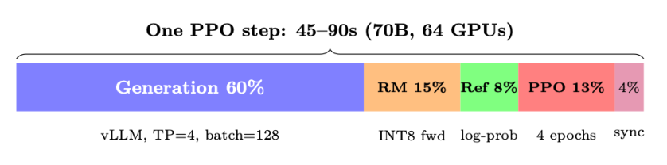

| 阶段 | 时间(70B) | 受限于 | 优化 |
|---|---|---|---|
| 生成(128×512 tok) | 30–45s | 内存带宽 | vLLM、投机解码、INT |
| 奖励打分 | 5–8s | 计算(batch 前向) | INT8 RM,batch=128 |
| 参考 log-prob | 4–6s | 计算(batch 前向) | INT8 ref,或 LoRA(免费) |
| PPO 更新(4 epochs) | 8–12s | 计算(反向) | FSDP、Flash Attention |
| 权重同步 | 0–3s | 网络(异步) | 增量压缩、异步 |
| **合计(整体式)** | **50–75s** | | |
| **合计(解耦,重叠)** | **35–50s** | | 生成与前一步训练重叠 |

## 11.9 监控与可观测性

**RLHF 训练期间需要跟踪的关键指标**

质量指标(每 10 步记录):

- 平均奖励(应先上升后趋于平台)
- 与参考的 KL 散度(应维持在 3–10)
- 响应长度分布(注意长度欺骗,length hacking)
- 熵(应缓慢下降,而非坍缩)

系统指标(每步记录):

- GPU 利用率(目标:训练时 >80%,生成时 >60%)
- 每张 GPU 的内存水位(在 OOM 发生前捕捉)
- 生成吞吐(tokens/sec,应稳定)
- 梯度范数(尖峰 = 即将失稳)
- NCCL 通信时间(检测网络劣化)

## 11.10 网络拓扑与通信模式

高效的分布式训练需要理解连接 GPU 的层次化通信结构。现代集群采用两层架构:超快的节点内链路,以及较慢但可扩展的节点间网络。

### 11.10.1 节点内:NVLink 与 NVSwitch

**表 11.5:NVLink 各代及其对 LLM 训练的影响**

| 代次 | 每链带宽 | 每张 GPU 链数 | 总带宽 | 平台 |
|---|---|---|---|---|
| NVLink 3.0 | 50 GB/s | 12 | 600 GB/s | A100(DGX A100) |
| NVLink 4.0 | 50 GB/s | 18 | 900 GB/s | H100(DGX H100) |
| NVLink 5.0 | 100 GB/s | 18 | 1800 GB/s | B200(DGX B200) |

在单个节点内(通常 8 张 GPU),NVSwitch 在所有 GPU 对之间提供全二分带宽(full-bisection bandwidth)。这意味着任意一张 GPU 都能同时以全 NVLink 速度与任意其他 GPU 通信——对张量并行至关重要,因为每一层都需要在全部 8 张 GPU 间做一次 AllReduce。

**NVSwitch vs PCIe 拓扑**

- 有 NVSwitch(DGX/HGX):8 张 GPU 以 600–1800 GB/s 全互连。TP 的 AllReduce 每层约 0.2ms。
- 无 NVSwitch(纯 PCIe 服务器):GPU 经 CPU PCIe 根复合体以 32–64 GB/s 通信。8 GPU 上的 TP 慢 10–30 倍。纯 PCIe 系统上绝不要用 TP>2。

### 11.10.2 节点间:InfiniBand 与 RoCE

对于跨节点的 FSDP/ZeRO-3 AllGather 与 ReduceScatter 操作,节点间网络占主导。

**表 11.6:LLM 训练集群的节点间网络选项**

| 技术 | 带宽 | 延迟 | 备注 |
|---|---|---|---|
| InfiniBand NDR | 400 Gb/s(50 GB/s) | 1–2 µs | 黄金标准,RDMA,无损 |
| InfiniBand NDR(双轨) | 800 Gb/s(100 GB/s) | 1–2 µs | 用于 H100 集群 |
| RoCE v2 | 100–400 Gb/s | 2–5 µs | 更便宜,需要 PFC/ECN 调优 |
| Ethernet(TCP) | 100–400 Gb/s | 10–50 µs | 不适用于 >16 GPU 的训练 |

### 11.10.3 通信原语及其代价

理解每种集合通信的使用时机有助于诊断瓶颈:

**表 11.7:分布式 LLM 训练中的 NCCL 集合通信操作**

| 集合操作 | 数据传输量 | 使用方 | 时机 |
|---|---|---|---|
| AllReduce | $2 \cdot \frac{N-1}{N} \cdot M$ | TP、DP | 跨 GPU 求和梯度或激活 |
| AllGather | $\frac{N-1}{N} \cdot M$ | FSDP 前向 | 矩阵乘前重构完整参数张量 |
| ReduceScatter | $\frac{N-1}{N} \cdot M$ | FSDP 反向 | 反向传播后分发梯度分片 |
| Broadcast | $M$ | PP | 发送激活到下一流水线阶段 |
| Send/Recv | $M$ | PP | 相邻阶段间的点对点 |

其中 $M$ 为消息大小(字节),$N$ 为参与方数量。

**通信-计算重叠**

现代框架(FSDP、DeepSpeed)激进地将通信与计算重叠:

- **前向传播**:当第 $i$ 层计算时,AllGather 预取第 $i+1$ 层的参数。第 $i$ 层完成后其参数立即丢弃("前向后释放")。
- **反向传播**:当第 $i$ 层计算梯度时,ReduceScatter 发送第 $i+1$ 层的梯度。

调优得当时,这种重叠可隐藏 70–90% 的通信延迟。调优旋钮:`prefetch_factor`(提前预取多少层)、`reduce_bucket_size`(梯度归约的粒度)、`backward_prefetch`("pre" vs "post" 反向预取策略)。

### 11.10.4 网络拓扑设计

生产集群使用胖树(fat-tree)或轨道优化(rail-optimized)拓扑:

- **胖树**:每一层都有全二分带宽。任意节点都能以全速与任意其他节点通信。昂贵(交换机多)但灵活性最大。
- **轨道优化**:每个节点的第 $i$ 号 GPU 连接到同一个叶交换机("轨道 $i$")。同一轨道内 AllReduce 很便宜;跨轨道流量昂贵。用于 Meta 的 RSC 和 Google 的 TPU pods。
- **3D torus / Dragonfly**:用于 HPC 集群(Frontier、Aurora)。拓扑感知的作业放置至关重要。

> **作业放置很重要**
>
> 在 512-GPU 集群上,随机的节点分配可能因网络拥塞导致 2–3× 的减速。始终请求连续的节点块。生产调度器(Slurm、Kubernetes)应强制局部性:一个训练作业的所有节点应位于同一叶交换机或相互在一跳之内。

## 11.11 训练吞吐量与模型 FLOPs 利用率

### 11.11.1 衡量训练效率:MFU

模型 FLOPs 利用率(Model FLOPs Utilization, MFU)[221] 是训练效率的标准指标:

$$
\text{MFU} = \frac{\text{实测吞吐(tokens/sec)} \times \text{每 token FLOPs}}{\text{峰值硬件 FLOPS}}
\tag{11.5}
$$

对于一个有 $P$ 个参数、序列长度 $s$、batch 大小 $b$ 的 transformer:

$$
\text{每 token FLOPs} \approx 6P + 12 \cdot n_{\text{layers}} \cdot d_{\text{model}} \cdot s
\tag{11.6}
$$

系数 6 来自:$2$(乘加) $\times$ $3$(前向 + 反向,其中反向约为前向的 $2\times$)。第二项对应注意力的 $O(s^2)$ 代价。

**为什么 MFU 随规模下降**

更大的模型需要更多并行,从而引入:

1. **通信开销**:FSDP 的 AllGather/ReduceScatter(64 GPU 时约 10–15%)。
2. **流水线气泡**:PP 在 micro-batch 的开始/结束引入空闲(PP=4 时约 15–25%)。
3. **辅助模型内存**:参考/RM 占用本可装更大 batch 的 GPU 内存。
4. **负载不均**:并非所有层计算量相同(嵌入层 vs Transformer 块)。

**表 11.8:跨规模与硬件的 MFU 基准**

| 模型 | 硬件 | MFU | Tokens/sec/GPU | 配置 |
|---|---|---|---|---|
| LLaMA-7B | 8×A100 | 57% | 3,200 | FSDP、FlashAttn、BF16 |
| LLaMA-13B | 16×A100 | 52% | 1,750 | FSDP、FlashAttn、BF16 |
| LLaMA-70B | 64×A100 | 45% | 380 | FSDP+TP=8、FlashAttn |
| GPT-4(估) | 10,000+ H100 | 40–50% | — | 3D 并行 |
| PaLM-540B | 6144 TPUv4 | 46% | — | DP+TP+PP |

**经验法则**:训练时目标 MFU > 40%。若低于 30%,用 profiling 诊断。

### 11.11.2 计算最优 batch 大小

有效 batch 大小与硬件利用率之间的相互作用并不直观:

$$
\text{有效 batch 大小} = \text{micro\_batch} \times \text{grad\_accum} \times \text{DP 度}
\tag{11.7}
$$

- **太小**:GPU 利用不足(算术强度低),通信占主导。
- **太大**:每 token 学习收益递减(超出临界 batch 大小),浪费算力。
- **最优点**:临界 batch 大小 $B_{\text{crit}}$,即梯度噪声等于梯度信号处。对 LLM,$B_{\text{crit}} \sim 1\text{–}4\text{M}$ tokens [222]。

对 RLHF 而言,batch 包含 rollout(不仅是 token):

$$
\text{RLHF batch} = N_{\text{prompts}} \times K_{\text{generations}} \times L_{\text{avg response length}}
\tag{11.8}
$$

典型生产值:$N = 128$ 提示,$K = 1\text{–}4$ 生成,$L = 256\text{–}512$ token → 每步 32K–256K token。

### 11.11.3 性能分析与瓶颈诊断

关键 profiling 工具及其揭示的内容:

| 工具 | 捕获内容 | 最适合 |
|---|---|---|
| torch.profiler | kernel 计时、内存 | 找慢操作、内存泄漏 |
| NVIDIA Nsight Systems | 完整 GPU 时间线 | 可视化重叠、kernel 间间隙 |
| nccl_debug=INFO | 集合通信大小/时间 | 诊断通信瓶颈 |
| torch.cuda.memory_stats | 分配模式 | 找碎片、峰值用量 |
| DeepSpeed Flops Profiler | 逐层 FLOPs | 识别负载不均 |
| py-spy / scalene | CPU profiling | 数据加载、分词瓶颈 |

**诊断低 MFU 的检查清单**

1. GPU 利用率 < 80%?→ 数据加载瓶颈(检查 CPU、I/O)。
2. kernel 间有大间隙?→ Python 开销、同步点。用 CUDA graphs。
3. 通信 > 步时间的 20%?→ 降低 TP 度、增大 batch、检查网络健康。
4. 内存达 99%?→ 无法增大 batch。尝试梯度检查点、卸载。
5. 生成时 OOM?→ KV cache 过大。减小生成的 max_seq_len 或 batch。

## 11.12 成本分析与云端部署

理解 RLHF 训练的经济学对规划至关重要。

### 11.12.1 硬件成本对比

**表 11.9:RLHF 训练的近似云端 GPU 成本(2024–2025 价格)**

| GPU | 按需/小时 | Spot/小时 | 内存 | 用途 |
|---|---|---|---|---|
| A100 80GB | $2.50–3.50 | $1.00–1.50 | 80 GB HBM2e | 预算训练、生成集群 |
| H100 80GB | $4.00–6.00 | $2.00–3.00 | 80 GB HBM3 | 生产训练 |
| H200 141GB | $6.00–8.00 | — | 141 GB HBM3e | 长上下文、少 GPU 配置 |
| MI300X 192GB | $3.50–5.00 | $1.50–2.50 | 192 GB HBM3 | 性价比之选 |

### 11.12.2 RLHF 训练成本估算

$$
\text{Cost} = N_{\text{steps}} \times \frac{T_{\text{step}}}{3600} \times N_{\text{GPUs}} \times C_{\text{GPU/hr}}
\tag{11.9}
$$

**成本示例:70B 模型 RLHF(10K 步)**

| 项目 | 值 |
|---|---|
| 步数 | 10,000 |
| 每步时间(解耦) | 45 秒 |
| 总训练时间 | $10000 \times 45/3600 = 125$ 小时 |
| GPU(生成 + 训练) | 64 张 A100-80GB |
| 每 GPU-小时成本(spot) | $1.20 |
| 总成本 | $125 \times 64 \times \$1.20 = \$9{,}600$ |

按阶段分解:

- 生成集群(32 GPU):$4,800(占 60% 时间)
- 训练集群(32 GPU):$4,800(可重叠 → 有效 $3,400)
- 打分(与生成 GPU 共享):已包含在上方

带重叠时:对 70B 模型做完整 RLHF 对齐,有效成本约 $7,500。

### 11.12.3 成本优化策略

- **Spot/可抢占实例**:节省 50–70%。需要健壮的检查点(每 5 分钟保存一次)。
- **按需选型(Right-sizing)**:不要用 H100 做生成(内存带宽受限);推理时 A100 在 tokens/$ 上与 H100 相当。
- **量化推理**:生成和打分用 INT8/FP8 可使这些集群的 GPU 数减半。
- **渐进式训练**:先用 8B 代理模型做奖励工程/调试(约 $200),再扩展到 70B。
- **无参考模型的 LoRA**:完全消除参考模型(内存减少 50%)。
- **先用更短序列**:课程式地从 256→512→1024 token 生成,可节省 40% 算力。

## 11.13 分布式检查点

在大规模下,朴素检查点会成为瓶颈。带优化器状态的 70B 模型每次检查点需保存约 840 GB(FP32 主权重 + Adam m + v)。

### 11.13.1 检查点策略

**表 11.10:大规模 RLHF 的检查点方法**

| 策略 | 保存时间(70B) | 存储/检查点 | 特点 |
|---|---|---|---|
| 同步(所有 rank) | 30–60s(阻塞) | 420 GB | 简单,但阻塞训练 |
| 异步(后台拷贝) | <1s(非阻塞) | 420 GB | 与下一步重叠 |
| 增量(delta) | <1s | 5–20 GB | 仅保存变化参数 |
| 分片(FSDP 原生) | 5–10s | 420 GB 分片 | 每个 rank 保存自己的分片 |

### 11.13.2 使用 torch.distributed.checkpoint 的生产级检查点

```python
import torch.distributed.checkpoint as dcp
from torch.distributed.checkpoint.state_dict import (
    get_state_dict, StateDictOptions,
)

# 保存:每个 rank 并行写自己的分片
state_dict = {
    "model": get_state_dict(
        model, options=StateDictOptions(full_state_dict=False)
    )
}
dcp.save(
    state_dict=state_dict,
    storage_writer=dcp.FileSystemWriter("/mnt/checkpoints/step_5000"),
    planner=dcp.DefaultSavePlanner(),       # 自动处理 FSDP 分片
)

# 异步保存:非阻塞,在后台线程运行
future = dcp.async_save(
    state_dict=state_dict,
    storage_writer=dcp.FileSystemWriter("/mnt/checkpoints/step_5000"),
)
# 训练立即继续;future.result() 仅在需要时才阻塞
```

**RLHF 的检查点规范**

RLHF 检查点必须捕获比标准预训练更多的内容:

- 策略模型权重 + 优化器状态(标准)
- KL 系数($\beta$)及其调度器状态
- Replay buffer 内容(用于离策略修正)
- 所有 GPU 的 RNG 状态(可复现性)
- Prompt 迭代器位置(避免重复处理提示)
- 奖励模型版本标签(可审计性)
- Wandb/metrics run ID(用于持续日志)

## 11.14 硬件选型指南

根据模型大小、预算和训练阶段选择合适的硬件。

**表 11.11:按模型规模与训练阶段的硬件推荐**

| 模型大小 | 训练阶段 | 推荐配置 | 说明 |
|---|---|---|---|
| ≤7B | SFT + RLHF | 1–2× A100 | 单节点,无需并行 |
| 7–13B | SFT + RLHF | 4–8× A100 | FSDP,生成可选 TP=2 |
| 13–34B | SFT + RLHF | 8–16× A100/H100 | FSDP + 生成 TP=4 |
| 70B | RLHF(全参) | 32–64× A100/H100 | 解耦,FSDP + TP=8 |
| 70B | RLHF(LoRA) | 8–16× A100/H100 | 无参考模型,LoRA 适配器 |
| >100B | RLHF | 128+× H100 | 3D 并行(TP+PP+DP) |

**H100 vs A100:何时升级值得?**

H100 提供:

- 约 1.6× 峰值 FLOPS(BF16 含稀疏性时 989 vs 624 TFLOPS;不含稀疏性时 495 vs 312)。
- 约 2× 内存带宽(3.35 vs 2.0 TB/s)。
- FP8 支持(推理额外 2×)。
- NVLink 4.0(900 vs 600 GB/s)。

- **训练**:端到端约快 1.8–2.2×(FP8 支持与更高带宽放大了原始 FLOPS 优势)。
- **生成**:约快 1.7×(带宽受限,故 2× BW ≈ 1.7× 吞吐,含开销)。
- **性价比**:在 1.5× 价格下,H100 对训练几乎总是更划算。对纯推理(生成集群),spot 定价的 A100 可能更经济。

## 11.15 强化训练的优化器配置

RL 训练(PPO、GRPO、DPO)对优化器的要求与预训练或 SFT 不同。损失景观是非平稳的(策略改变了所生成数据),梯度更嘈杂(奖励信号方差大),训练更容易出现灾难性遗忘或奖励欺骗(reward hacking)。本节汇总 RL 专属的优化器指导,默认使用 AdamW [80]。

### 11.15.1 为什么 RL 需要不同的优化器设置

**RL vs SFT 优化的关键差异**

- **非平稳数据分布**:SFT 数据集固定,而 RL 每次迭代生成新的 rollout——数据分布随策略漂移。
- **高梯度方差**:奖励信号稀疏且嘈杂;梯度方差远高于在精选数据上的交叉熵。
- **需要更小的更新**:策略必须紧贴参考模型(KL 约束),故学习率比 SFT 小 10–100×。
- **无权重衰减(weight decay)**:正则来自 KL 惩罚,而非权重衰减。在 KL 之上再加 WD 会与 KL 约束对抗。
- **更短预热**:RL 从已收敛的 SFT 检查点开始——优化器状态几乎不需要预热。

### 11.15.2 按 RL 方法推荐的超参数

**表 11.12:RL 训练阶段的优化器设置。均使用 $\beta_1 = 0.9$、$\beta_2 = 0.95$、$\epsilon = 10^{-8}$、max_grad_norm=1.0、BF16。**

| 方法 | 优化器 | LR | WD | 预热 | 调度 |
|---|---|---|---|---|---|
| DPO | AdamW | 5e-7 | 0.0 | 50 步 | 恒定或线性 |
| PPO(策略) | AdamW | 1e-6 | 0.0 | 20 步 | 恒定 |
| PPO(critic) | AdamW | 1e-6 | 0.0 | 20 步 | 恒定 |
| GRPO | AdamW | 1e-6 | 0.0 | 20 步 | 恒定 |

**为什么 RL 用恒定调度?**

余弦与线性衰减调度假设存在固定的训练时长且损失单调下降。RL 训练两者皆无:奖励可能平台化、尖峰或不可预测地振荡。恒定 LR(简短预热后)使优化器在整个训练中保持响应。若必须衰减,使用非常温和的线性调度,且最低 LR 比例较高(≥0.5)。

### 11.15.3 RL 中 $\beta_2 = 0.95$:更快适应

默认 Adam $\beta_2 = 0.999$ 给二阶矩很长的记忆(约 1000 步的有效窗口)。在 RL 训练中,损失景观随策略演化快速变化——1000 步前的梯度方差已无意义。用 $\beta_2 = 0.95$ 将窗口缩短到约 20 步,使自适应学习率快速响应变化的梯度统计。

**当 beta2 = 0.95 有害时**

对非常小的 batch(如在线 RL 的 batch=1),$\beta_2 = 0.95$ 会使二阶矩估计过于嘈杂。此时用 $\beta_2 = 0.99$ 作为折中,或通过梯度累积增大有效 batch。

### 11.15.4 RL 的混合精度:FP32 主权重至关重要

RL 训练对数值精度尤为敏感:

- 梯度更嘈杂——小幅更新必须跨多步准确累积。
- 学习率非常小($10^{-6}$–$10^{-7}$),使得 $\Delta\theta \ll \theta$。
- BF16 尾数(7 位 ≈ 0.8% 相对精度)无法表示相对于量级 100 的权重、量级 $10^{-6}$ 的更新。

RL 训练务必使用 FP32 主权重。仅 BF16 训练(无 FP32 副本)在 PPO/GRPO 中可靠地在 100–500 步后导致奖励坍缩。

### 11.15.5 梯度裁剪对 RL 至关重要

在 PPO 和 GRPO 中,奖励信号可能高度可变,尤其训练初期。单个坏 batch 可能产生范数 > 100 的梯度,彻底摧毁模型权重。`max_grad_norm=1.0` 是标准设置。对 SFT,裁剪虽没那么关键但仍推荐。

> **切勿为 RL 禁用梯度裁剪**
>
> 与 SFT 中梯度范数通常稳定(0.1–1.0 范围)不同,RL 梯度有尖峰,因为:(1) 奖励方差经策略梯度传播;(2) 罕见的高奖励轨迹产生超大更新;(3) 策略漂移时 KL 惩罚项可产生大梯度。单个 $\lVert\nabla\rVert > 50$ 的未裁剪步可抹掉数百步训练成果。

### 11.15.6 诊断 RL 训练失稳

**RL 优化的危险信号与修复**

| 症状 | 可能原因与修复 |
|---|---|
| 奖励先升后坍缩 | LR 过高或 KL 系数过低。将 LR 降低 2–5× 或增大 $\beta_{\text{KL}}$。 |
| 梯度范数持续处于裁剪阈值 | 更新过激。降低 LR(裁剪意味着每步都在丢失梯度方向信息)。 |
| KL 散度爆炸(>15 nats) | LR 过高。降低 10× 或加入自适应 KL 惩罚。 |
| 奖励卡在基线 | LR 过低,或奖励模型信号弱。尝试 2–5× 更高 LR。检查奖励模型校准。 |
| 100+ 步后 Loss 为 NaN | 缺少 FP32 主权重,或梯度范数溢出。启用 FP32 主权重;核验 BF16 模式。 |

### 11.15.7 RL 的 HuggingFace TRL 配置

TRL 库 [176] 为 LLM 提供生产级 PPO、DPO 等 RL 方法实现。

```python
from trl import PPOConfig, PPOTrainer, DPOConfig, DPOTrainer

# --- PPO 配置 ---
ppo_config = PPOConfig(
    # 优化器(AdamW,RL 专属设置)
    learning_rate=1e-6,             # 比 SFT 小 10-100x
    # PPO 专属
    ppo_epochs=4,                   # 每个 rollout 的 mini-batch 更新次数
    mini_batch_size=16,
    batch_size=64,                  # rollout batch 大小
    # 梯度控制
    max_grad_norm=1.0,
    # KL 惩罚(取代权重衰减作为正则)
    init_kl_coef=0.2,               # 初始 KL 惩罚系数
    adap_kl_ctrl=True,              # 自适应 KL 目标
    target_kl=6.0,                  # 目标 KL 散度
    # 混合精度
    bf16=True,                      # BF16 计算,FP32 主权重
)
ppo_trainer = PPOTrainer(
    model=model,
    ref_model=ref_model,
    config=ppo_config,
    tokenizer=tokenizer,
    dataset=dataset,
)

# --- DPO 配置 ---
dpo_config = DPOConfig(
    output_dir="./dpo_output",
    # 优化器
    learning_rate=5e-7,             # 比 PPO 还小
    optim="adamw_torch",
    adam_beta1=0.9,
    adam_beta2=0.95,                # RL 更短记忆
    weight_decay=0.0,               # 无 WD——KL 提供正则
    # 调度
    lr_scheduler_type="constant_with_warmup",
    warmup_steps=50,
    # 梯度控制
    max_grad_norm=1.0,
    # DPO 专属
    beta=0.1,                       # KL 约束强度
    loss_type="sigmoid",            # 标准 DPO 损失
    # 混合精度
    bf16=True,
    # 训练
    num_train_epochs=1,             # DPO 通常 1 epoch
    per_device_train_batch_size=4,
    gradient_accumulation_steps=8,
)
dpo_trainer = DPOTrainer(
    model=model,
    ref_model=ref_model,
    args=dpo_config,
    train_dataset=dataset,
    tokenizer=tokenizer,
)
dpo_trainer.train()
```

> **代码清单 11.1:使用 TRL 的完整 PPO 与 DPO 优化器配置。**

### 11.15.8 RL 训练的 MoE 注意事项

**RLHF 中的 MoE**

混合专家(Mixture-of-Experts, MoE)模型 [109] 在 RLHF 中使用日益增多:

- **优势**:相同算力下 3–4× 的容量。更适合奖励模型(更多判断容量)。
- **挑战**:专家并行需要 all-to-all 通信(token 跨 GPU 路由)。这与流水线并行冲突。
- **MoE 上的 GRPO**:效果好,因为生成代价由激活参数(而非总参数)主导。
- **MoE 的 LoRA**:可仅对 router + 共享层应用 LoRA,或对所有专家应用(昂贵)。

> **RL 优化器箴言**
>
> 对 RL 微调:小 LR、无权重衰减、恒定调度、FP32 主权重、激进裁剪。让 KL 惩罚处理正则——优化器的职责只是跟随策略梯度而不超调。
