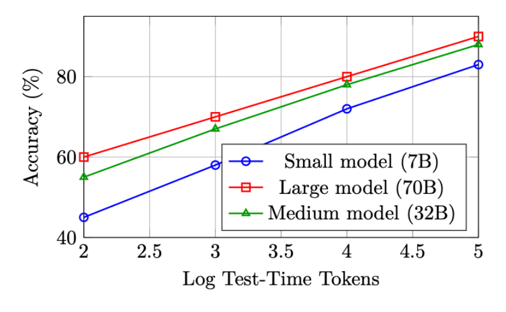
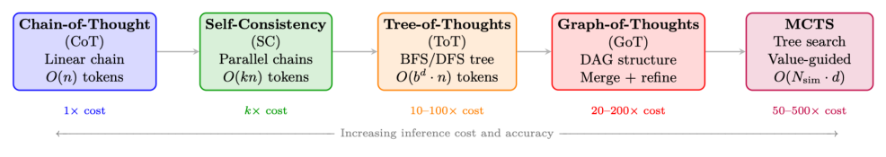
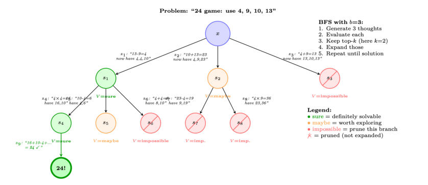
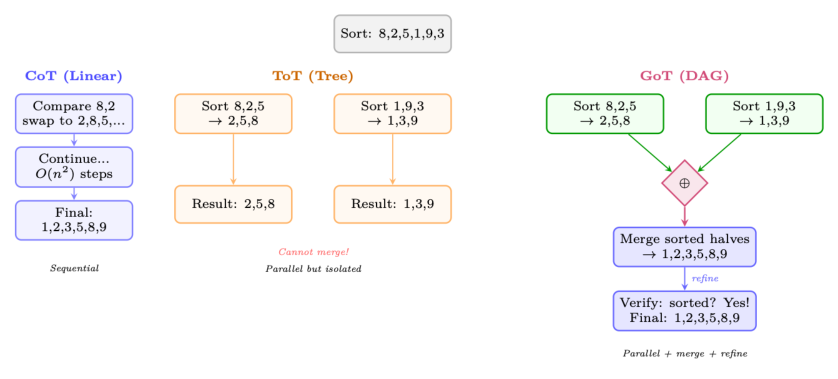
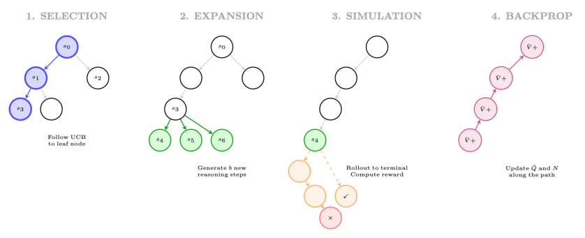

# 第 13 章 大型推理模型的强化学习

大型推理模型(large reasoning model)的出现是现代 AI 最重要的发展之一。标准的语言模型训练旨在优化下一个词元(token)的预测,而聚焦于推理的强化学习(Reinforcement Learning, RL)则教会模型在回答之前先思考——在推理(inference)阶段分配额外的计算资源,用于探索、验证和精炼中间步骤。本章对支撑这一范式的方法、架构和缩放定律(scaling law)给出全面的技术阐述。

## 13.1 动机与背景

### 13.1.1 为什么推理需要不同的 RL 方法

标准的 RLHF(参见 4.3 节)在一条完整回复上优化一个标量奖励。对于需要多步推理的任务——数学、形式化验证、竞赛编程、科学推导——这一建模之所以不足,有以下几个原因:

- **稀疏奖励(sparse rewards)**:一道数学题可能需要 20 个中间步骤;单一的结局奖励无法为导致错误的中间步骤提供任何梯度信号。
- **长程依赖(long horizons)**:推理链可能跨越数百到数千个 token,造成严重的信用分配(credit assignment)问题。
- **组合搜索(combinatorial search)**:合法的推理路径空间是指数级庞大的;模型必须学会高效地搜索这一空间。
- **可验证性(verifiability)**:与主观的文本质量不同,数学和逻辑上的正确性是客观可验证的,从而可以在没有人工标注的情况下自动计算奖励。

**关键洞见:把推理视为搜索问题**

多步推理可以被刻画为在一棵部分解构成的树上的搜索问题。树中每个节点是一个推理状态(思维链的前缀),每条边是一个推理步骤(一个 token 或一句话),叶子节点是最终答案。面向推理的 RL 教会模型高效地遍历这棵树——探索有希望的分支、从死胡同中回溯,并将计算资源分配到最关键的位置。

### 13.1.2 思维链:涌现行为 vs. 训练获得的能力

思维链(Chain-of-Thought, CoT)推理最初是作为足够大的语言模型的一种涌现能力被观察到的 [122]:当用逐步示例去提示(prompt)时,大模型(通常参数量 $\geq 100\text{B}$)会自发地产生能提升准确率的中间推理步骤。这引出了一个根本性问题:CoT 是规模带来的涌现属性,还是可以被显式训练出来的?

正如 DeepSeek-R1 及相关工作所证明的,答案二者皆是——但有一些重要的细微差别:

- **涌现的 CoT** 源于上下文学习(in-context learning),并且需要大型基座模型。它脆弱、对 prompt 敏感,且难以稳健地泛化。
- **训练得到的 CoT**(通过 RL)产生的模型会在生成过程中内在地产生推理链,与 prompt 的风格无关。这些链更长、更具探索性,并展现出定性上不同的行为(自我修正、回溯、验证)。

**"顿悟时刻"(Aha Moment)现象(DeepSeek-AI et al. 2025)**

在推理模型的 RL 训练过程中,DeepSeek 的研究者观察到了一种引人注目的涌现行为:在训练的某个时刻,模型会自发地开始在链中段重新审视自己最初的思路,使用诸如 "Wait, let me reconsider..."(等等,让我重新考虑一下)或 "Actually, I think I made an error..."(其实,我觉得我犯了个错误)这样的措辞。这种自我修正行为并未被显式训练,完全是从最大化最终答案准确率这一 RL 目标中涌现出来的。这表明,RL 能够发现对求解困难问题有工具性价值的元认知(meta-cognitive)策略。

### 13.1.3 测试时计算的缩放定律

驱动推理模型研究的核心经验发现是:测试时计算(test-time compute)与性能之间存在可预测的缩放关系。记 $C_\text{train}$ 为训练计算量(FLOPs),$C_\text{test}$ 为推理计算量(生成的 token 数)。关键的观察是:

$$
\text{Accuracy}(C_\text{train}, C_\text{test}) \approx f(\alpha \log C_\text{train} + \beta \log C_\text{test}) \quad (13.1)
$$

其中 $f$ 是某个单调函数,$\alpha, \beta > 0$ 是常数。这意味着:一个拥有更多推理计算量的小模型,可以匹敌一个推理计算量更少的大模型——这是计算-性能权衡上的一次根本性转变。



其现实意义极为深远:推理模型用训练计算去换取推理计算。与其总是部署可能的最大模型,人们可以部署一个更小、具备推理能力的模型,并在困难问题上分配更多 token 去"思考"。

## 13.2 测试时缩放方法

上述缩放定律表明,在推理阶段投入更多计算可以显著提升推理性能。本节系统性地介绍将测试时缩放付诸实践的方法——从简单的思维链到复杂的树搜索和图搜索算法。这些方法构成一个谱系,在推理成本与准确率之间权衡,理解它们的结构对于设计现代推理系统至关重要。



### 13.2.1 思维链(CoT)

思维链提示 [122] 是所有测试时缩放方法的基础。模型不再直接输出答案,而是生成中间推理步骤,把复杂问题分解为可管理的子问题。

**零样本 CoT(Zero-Shot CoT)。** Kojima 等人 [123] 证明,在 prompt 末尾追加 "Let's think step by step"(让我们一步一步来思考),无需任何示例即可激发推理行为。这个简单的触发器能激活足够大模型(参数量 $\geq 100\text{B}$)中潜在的推理能力。

**少样本 CoT(Few-Shot CoT)。** Wei 等人 [122] 表明,提供少量带有显式推理轨迹的示例,能让较小的模型也有效地推理:

$$
\text{Prompt} = [(x_1, z_1, y_1), (x_2, z_2, y_2), \dots, (x_k, z_k, y_k), (x_\text{test}, ?)] \quad (13.2)
$$

其中 $z_i$ 是示例 $(x_i, y_i)$ 的手写推理轨迹。

**形式化刻画。** CoT 把单步预测 $p(y \mid x)$ 转化为多步顺序生成:

$$
p(y \mid x) = \sum_{z} p(y \mid x, z) \cdot p(z \mid x) \approx p(y \mid x, z^*) \cdot p(z^* \mid x) \quad (13.3)
$$

其中 $z^* = (z_1, z_2, \dots, z_T)$ 是贪心选择的推理链。对所有可能的链求和是不可行的;标准 CoT 只取一个采样(贪心或带温度采样)。

**局限。** 单链 CoT 很脆弱:如果某个早期推理步骤出错,后续所有步骤都建立在有缺陷的基础上,且没有任何恢复机制。

### 13.2.2 自洽性(多数投票)

自洽性(Self-Consistency)[124] 通过采样多条独立的推理链,并对最终答案进行多数投票,来缓解 CoT 单链脆弱的问题:

$$
\hat{y} = \arg\max_{y} \sum_{i=1}^{N} \mathbf{1}[y_i = y], \quad \text{其中 } (z_i, y_i) \sim p(\cdot \mid x),\ T > 0 \quad (13.4)
$$

**关键性质:**

- 使用温度 $T > 0$ 的采样来生成多样化的链(通常 $T = 0.7 \sim 1.0$)
- 链与链之间无交互——完全可并行
- 准确率随 $N$ 单调提升($N \approx 40$ 后收益递减)
- 在 GSM8K 上:CoT = 56.5%,Self-Consistency($N=40$)= 74.4%(使用 PaLM-540B [221])
- 等价于带结局奖励的 Best-of-N(多数投票充当隐式 ORM)

**为什么多数投票有效**

如果模型生成正确推理链的概率为 $p > 0.5$,那么由大数定律,对 $N$ 个独立样本做多数投票,在 $N \to \infty$ 时准确率趋近于 100%。即使 $p = 0.3$(模型通常答错),只要正确答案集中在一个值上而错误答案分散,多数投票仍能恢复出正确答案。这就是测试时缩放的统计学基础。

### 13.2.3 思维树(ToT)

思维树(Tree-of-Thoughts, ToT)[234] 将 CoT 从线性链推广到树结构,使模型能够探索多条推理路径、评估中间状态、并从无希望的分支回溯。这把有意识的规划引入了推理过程。

**核心抽象。** 一个推理问题被分解为对一棵树的搜索,其中:

- **根节点**:初始问题描述 $x$
- **节点**:部分推理状态 $s = (x, z_1, \dots, z_k)$
- **边**:单个推理步骤("想法") $z_{k+1}$
- **叶子**:带有最终答案的完整解
- **价值函数**:$V(s)$ 估计一个部分解有多大希望

**形式化定义。**

$$
\text{ToT} = (G, E, V, \pi_\theta, \text{Search}) \quad (13.5)
$$

其中:

- $G$:想法生成器——产生 $b$ 个候选的下一步想法:$\{z^{(1)}, \dots, z^{(b)}\} \sim \pi_\theta(\cdot \mid s)$
- $E$:状态评估器——为部分解打分:$V(s) \in \{\text{sure, maybe, impossible}\}$ 或 $V(s) \in [0, 1]$
- $\pi_\theta$:生成想法的语言模型
- $\text{Search}$:搜索算法(BFS 或 DFS)

**搜索算法。** BFS(广度优先搜索):

1. 为当前深度的每个节点生成 $b$ 个候选想法
2. 用 $V(\cdot)$ 评估所有候选
3. 保留最有希望的 $k$ 个状态(beam search)
4. 将所有 $k$ 个状态推进到下一层



5. 重复,直到找到解或达到深度上限

DFS(深度优先搜索):

1. 为当前状态生成 $b$ 个候选想法
2. 评估:若 $V(s) = \text{impossible}$,立即回溯
3. 若 $V(s) = \text{sure/maybe}$,向更深处递归(选最有希望的)
4. 若达到深度上限仍未找到解,则回溯
5. 继续,直到找到解或所有分支都被探索

**ToT:价值评估 prompt**

```python
# LLM 评估部分推理状态:
EVAL_PROMPT = """Evaluate if this partial solution can reach 24.
Numbers remaining: [4, 4, 10]
Steps so far: 13 - 9 = 4
Can these remaining numbers (4, 4, 10) be combined using +,-,*,/ to make 24?
Analysis: 4 * (10 - 4) = 4 * 6 = 24. Yes!
Judge: sure/maybe/impossible
Answer: sure"""

# 想法生成 prompt:
GEN_PROMPT = """Input: 4 9 10 13
Possible next steps:
1. 13 - 9 = 4 (left: 4 4 10)
2. 10 + 13 = 23 (left: 4 9 23)
3. 9 - 4 = 5 (left: 5 10 13)
..."""
```

**计算成本。** 对于分支因子为 $b$、深度为 $d$、束宽为 $k$ 的 ToT:

$$
\text{LLM calls (BFS)} = \underbrace{k \cdot b}_{\text{generation}} + \underbrace{k \cdot b}_{\text{evaluation}} = 2kb \text{ per level} \implies \text{Total} = 2kbd \quad (13.6)
$$



对 24 点游戏:$b = 3$、$k = 2$、$d = 3 \implies 36$ 次 LLM 调用,而标准 CoT 只需 1 次。

**结果。** 在 24 点(一项有挑战性的算术推理任务)上,ToT 取得了 74% 的成功率,而 CoT 仅 4%——这是在相同基座模型(GPT-4)上通过结构化搜索获得的巨大提升。

### 13.2.4 思维图(GoT)

思维图(Graph-of-Thoughts, GoT)[235] 将 ToT 从树扩展为有向无环图(directed acyclic graph, DAG),引入了一项关键能力:合并来自不同分支的部分解。这使模型能够把多条推理路径上的洞见综合成一个单一的精炼解。

**关键操作。** GoT 在 ToT 之外引入了三种操作:

- **Generate(生成)**:从一个状态产生新的想法(与 ToT 相同)
- **Aggregate/Merge(聚合/合并)**:把多个想法合并成一个精炼后的想法——这在树中是不可能的
- **Refine(精炼)**:根据反馈迭代改进一个想法
- **Score(打分)**:评估想法质量(与 ToT 的价值函数相同)

**图操作(形式化)。** 设 $V = \{v_1, \dots, v_n\}$ 为想法顶点集,$E \subseteq V \times V$ 为有向边集。GoT 支持:

$$
\text{Generate}(v) : v \to \{v_{c_1}, \dots, v_{c_b}\} \quad (\text{创建子节点}) \quad (13.7)
$$

$$
\text{Aggregate}(v_1, \dots, v_k) \to v_\text{merged} \quad (\text{把 } k \text{ 个想法合并为一个}) \quad (13.8)
$$

$$
\text{Refine}(v, n) \to v' \quad (\text{通过 } n \text{ 次迭代改进 } v) \quad (13.9)
$$

$$
\text{Score}(v) \to s \in [0, 1] \quad (\text{评估想法质量}) \quad (13.10)
$$

Aggregate 操作是关键的差异化之处:它创建了从多个父节点到一个子节点的边,从而形成 DAG 而非树。这带来了:

- **分治**:拆分问题 $\to$ 并行求解子问题 $\to$ 合并解
- **集成式推理**:生成多种视角,再综合出最好的想法
- **迭代精炼**:把评估结果反馈回去以改进较早的想法

**结果。** 在排序(一项需要合并的任务)上,GoT 在同等质量下比 ToT 降低 62% 成本。在集合求交和关键词计数上,得益于合并操作带来的更高效分解,GoT 以减少 30–40% 的 LLM 调用达到与 ToT 相当的质量。

### 13.2.5 带奖励模型的 Best-of-N

Best-of-N(BoN)[196, 236] 是最简单的缩放方法,使用一个学习得到的奖励模型在候选解中选择:

$$
y^* = \arg\max_{y \in \{y_1, \dots, y_N\}} R_\phi(x, y), \quad y_i \sim \pi_\theta(\cdot \mid x) \quad (13.11)
$$

**按奖励模型类型划分的变体:**

- **BoN + ORM**:对完整解打分,选得分最高者。当 ORM 近似于正确性检查时,等价于 Self-Consistency。
- **BoN + PRM**:在每个推理步骤打分;选最小步骤得分最高的解(任意步骤最不可能出错)。
- **加权 BoN**:按奖励对候选加权:$y^* \sim \text{softmax}(R(y_1)/\tau, \dots, R(y_N)/\tau)$。

**BoN 缩放定律**

对单样本准确率为 $p$ 的模型,$N$ 次尝试中至少有一个正确样本的概率:

$$
P(\text{success with BoN}) = 1 - (1 - p)^N \quad (13.12)
$$

在拥有完美奖励模型(总能正确选择的 oracle)时:

- $p = 0.3$, $N = 10$:成功率 = 97%
- $p = 0.1$, $N = 50$:成功率 = 99.5%

实践中,不完美的奖励模型会限制有效的 $N$——超过 $N \approx 64 \sim 256$ 后,奖励模型误差占主导,准确率趋于平稳甚至下降(奖励黑客,reward hacking)。

### 13.2.6 用于推理的蒙特卡洛树搜索(MCTS)

MCTS [19, 237] 把 ToT 的结构化探索与学习得到的价值估计、访问计数统计相结合,以最优地分配推理计算。它最初为博弈开发(AlphaGo [19]),后被包括 AlphaProof [238] 和 rStar [239] 在内的系统改造用于 LLM 推理。

**算法(为 LLM 推理改造)。** 每次 MCTS 迭代包含四个阶段。

**用于推理的 UCB。** 节点选择使用 PUCT(应用于树的 Predictor + UCB):

$$
a^* = \arg\max_{a} \left[ Q(s, a) + c_\text{puct} \cdot P(s, a) \cdot \frac{\sqrt{\sum_{b} N(s, b)}}{1 + N(s, a)} \right] \quad (13.13)
$$

其中 $P(s, a) = \pi_\theta(a \mid s)$ 是 LLM 从状态 $s$ 生成步骤 $a$ 的先验概率。这把探索偏向于 LLM 本身认为可能性较高的步骤,而 UCB 项鼓励尝试尚未充分探索的替代方案。

**用于数学推理的 MCTS:运行示例**

问题:证明 $\sqrt{2}$ 是无理数。

迭代 1(选择 $\to$ 根节点,扩展):



- 生成 3 个候选的首步:
  1. "Assume for contradiction that $\sqrt{2} = p/q$ in lowest terms."(假设 $\sqrt{2} = p/q$,$p/q$ 已约分为最简形式。)($P = 0.7$)
  2. "Consider the decimal expansion of $\sqrt{2} = 1.414...$"(考察 $\sqrt{2}$ 的小数展开。)($P = 0.15$)
  3. "Use the fundamental theorem of arithmetic."(使用算术基本定理。)($P = 0.10$)
- 从 $z_1$ 做 rollout:4 步内到达正确证明 $\to$ $r = 1.0$
- 从 $z_2$ 做 rollout:失败(小数无法证明无理性)$\to$ $r = 0.0$
- 回传:$Q(s_0, z_1) = 1.0$, $N(s_0, z_1) = 1$

迭代 2(选择:由 UCB 选出 $z_1$):

- 从状态 "Assume $\sqrt{2} = p/q$..." 扩展:
  1. "Then $2 = p^2/q^2$, so $p^2 = 2q^2$."($P = 0.8$)
  2. "Then $p$ and $q$ share no common factors."($P = 0.15$)
- 从 $z_4$ 做 rollout:正确的延续 $\to$ $r = 1.0$
- 回传:$Q(s_0, z_1) = 1.0$, $Q(s_1, z_4) = 1.0$

20 次迭代后:树已探索了 8 条不同的推理路径。被访问最多的路径被选为最终证明:$z_1 \to z_4 \to z_6 \to z_8$(经典的、通过奇偶论证的反证法)。

**比较:ToT vs. MCTS。**(见 13.2.9 节表 13.1。)

### 13.2.7 推理步骤上的束搜索

束搜索——长期以来在 NMT(神经机器翻译)和文本生成中是标准做法——可以应用在推理步骤层级而非 token 层级。我们不跟踪 top-$k$ 的 token 序列,而是跟踪 top-$k$ 的推理前缀:

$$
\mathcal{B}_d = \text{top-}k \left( (s_1, \dots, s_d) : \sum_{i=1}^{d} \log \pi_\theta(s_i \mid s_{<i}) + \lambda \cdot V_\phi(s_1, \dots, s_d) \right) \quad (13.14)
$$

其中打分综合了 LLM 的对数概率(流畅性)与价值模型的估计(正确性)。这本质上是带学习价值函数(而非 prompt 触发)的 ToT-BFS。

**表 13.1:推理上的思维树 vs. 蒙特卡洛树搜索。**

| 维度 | ToT | MCTS |
|---|---|---|
| 价值估计 | LLM prompt("sure/maybe/impossible") | 学习得到的价值网络 + rollout 统计 |
| 探索 | 固定束宽;不重访 | UCB 自适应地把预算分配给有希望的节点 |
| 计算分配 | 在各深度层级上均匀 | 聚焦:对更难的子问题做更多模拟 |
| 训练集成 | 无训练;纯提示 | 可把 MCTS 策略蒸馏进基座模型 [19] |
| 最适用于 | 简单分叉问题(24 点) | 需要深度探索的复杂问题(证明、代码) |

### 13.2.8 迭代精炼与自我修正

迭代精炼不探索广度(多条并行链),而是把计算投入到深度——反复改进一个解:

$$
y^{(t+1)} = \text{LLM}\left(\text{"Improve this solution:"},\ y^{(t)},\ \text{"Errors found:"},\ e^{(t)}\right) \quad (13.15)
$$

其中 $e^{(t)}$ 可来自:

- **自我验证**:让模型检查自己的答案
- **外部验证**:运行代码、对数学做符号化检查
- **评判模型(critic model)**:用一个独立模型识别错误

值得注意的方法:Self-Refine [240](迭代式自我反馈)、Reflexion [224](通过存储在记忆中的反思进行的言语式 RL)、以及 LATS [225](树搜索 + 基于反思的剪枝)。

### 13.2.9 方法比较与选择指南

**表 13.2:测试时缩放方法的全面比较。**

| 方法 | 结构 | LLM 调用 | 可并行 | 需要 RM? | 最适用于 |
|---|---|---|---|---|---|
| CoT [122] | 链 | 1 | 不适用 | 否 | 简单至中等难度问题 |
| Self-Consistency [124] | 并行链 | $N$ | 完全可 | 否(多数投票) | 答案离散的数学题 |
| Best-of-N + ORM | 并行链 | $N + 1$ | 完全可 | 是(ORM) | 拥有好 RM 的通用任务 |
| Best-of-N + PRM | 并行链 | $N + N \cdot K$ | 完全可 | 是(PRM) | 复杂的多步推理 |
| ToT [234] | 树(BFS/DFS) | $O(kbd)$ | 部分可 | LLM 作为评判者 | 结构化搜索问题 |
| GoT [235] | DAG | $O(kbd)$ | 部分可 | LLM 作为评判者 | 可分解问题 |
| MCTS [237] | 树 + 价值 | $O(N_\text{sim} \cdot d)$ | 部分可 | 是(价值网络) | 困难证明、编程 |
| Self-Refine [240] | 线性(迭代) | $2T$ | 否 | 自我评判 | 开放式生成 |
| LATS [225] | 树 + 反思 | $O(N \cdot d)$ | 部分可 | LLM 作为评判者 | 智能体任务 |

**何时用哪种方法**

- **预算 < 5× 基线成本**:用 CoT 或 Self-Consistency。性价比最高。
- **预算 5–50×**:用带 PRM 的 Best-of-N(如果有好的奖励模型)或 $b = 3$、$k = 2$ 的 ToT-BFS。
- **预算 50–500×**:用带训练价值函数的 MCTS。这正是 DeepSeek-R1 和 OpenAI o1 所处的区间——长推理链配以隐式树搜索。
- **要求并行**:Self-Consistency 和 Best-of-N 完全可并行;ToT/MCTS 需要顺序的深度扩展。
- **没有奖励模型**:用 Self-Consistency(多数投票)或以 LLM 作为评判者来评估的 ToT。
- **可分解问题**:当问题具有自然的子问题时(排序、多文档综合、含模块的代码),GoT 表现出色。

**推理模型中的隐式测试时缩放**

现代推理模型(DeepSeek-R1 [15]、OpenAI o1/o3 [241, 242])通过生成长思维链来进行隐式测试时缩放。它们的"思考"token 发挥着类似于 MCTS rollout 的作用:模型探索多种方法、回溯("Wait, let me reconsider...")、验证中间步骤,并把更多 token 分配给更难的子问题。R1/o1 训练的关键洞见在于,GRPO/RL 教会模型在单次生成内完成这种隐式搜索,从而无需外部编排(ToT 提示、MCTS 基础设施)。模型自身就成了它的搜索算法。

## 13.3 DeepSeek-R1

DeepSeek-R1 [15] 是首个在主要基准上匹敌甚至超越 OpenAI o1 的完全开源大型推理模型。其训练流程在技术上是透明的,已成为基于 RL 的推理的事实上的参考实现。

### 13.3.1 两阶段训练流水线

**第 1 阶段:冷启动监督微调。** 基座模型(DeepSeek-V3)先在一个小而精心筛选的长思维链示例数据集上做微调。这一"冷启动"阶段有两个目的:

1. **格式初始化**:模型学会在给出最终答案之前,以 `<think>...</think>` 格式产生推理。
2. **稳定性**:如果没有冷启动 SFT,直接在基座模型上从零开始做纯 RL 会产生不稳定的训练动态和退化输出(例如,语言混杂、重复循环)。

冷启动数据集只包含数千个示例,刻意保持小规模,以避免过度约束 RL 后续将要发现的推理风格。

**第 2 阶段:基于 GRPO 的强化学习。** 在冷启动 SFT 之后,模型使用群体相对策略优化(Group Relative Policy Optimization, GRPO)进行大规模 RL。R1 所用的完整 GRPO 目标在 13.3.3 节中描述。

**R1 训练流水线摘要**

1. 基座模型:DeepSeek-V3(671B MoE,37B 激活参数)
2. 冷启动 SFT:数千个长 CoT 示例,格式:`<think>...</think><answer>...</answer>`
3. RL 阶段:在数学 + 代码问题上使用带可验证奖励的 GRPO
4. 拒绝采样(rejection sampling):生成多个解,保留正确的
5. 在 RL 输出上做 SFT:在高质量 RL 生成的链上做微调
6. 最终 RL:用于对齐 + 有用性的第二轮 RL 阶段

### 13.3.2 奖励设计:准确率奖励与格式奖励

R1 的一个关键设计选择是不使用过程奖励模型(process reward model)。相反,R1 使用两个简单、可自动计算的奖励:

**准确率奖励**

对于答案可验证的数学题:

$$
r_\text{acc}(y, y^*) = \begin{cases} 1 & \text{若 } \text{verify}(y, y^*) = \text{True} \\ 0 & \text{其他} \end{cases} \quad (13.16)
$$

其中 $y$ 是模型的最终答案(从 `<answer>` 标签中提取),$y^*$ 是真值答案。verify 函数使用符号化数学比较(如 SymPy)来处理等价形式。

对于代码题,准确率奖励由通过的测试用例决定:

$$
r^\text{code}_\text{acc}(y, T) = \frac{1}{|T|} \sum_{t \in T} \mathbf{1}[\text{execute}(y, t) = \text{expected}(t)] \quad (13.17)
$$

**格式奖励**

用于强制执行 `<think>...</think>` 结构:

$$
r_\text{fmt}(y) = \begin{cases} 1 & y \text{ 含有合法的 } \texttt{<think>} \text{ 与 } \texttt{<answer>} \text{ 标签} \\ 0 & \text{其他} \end{cases} \quad (13.18)
$$

**组合奖励**

$$
r(y, y^*) = r_\text{acc}(y, y^*) + \lambda_\text{fmt} \cdot r_\text{fmt}(y) \quad (13.19)
$$

其中原始实现中 $\lambda_\text{fmt} = 0.1$(小到不足以主导,又大到足以防止格式坍塌)。

**没有过程奖励模型**

R1 一个值得注意且令人惊讶的发现是:不需要过程奖励模型(PRM)。尽管推理链很长,仅基于结局的奖励已足以让 RL 发现高质量的推理策略。作者推测,数学/代码奖励的可验证本质已提供了充分信号,而 PRM 会引入其自身的失效模式(步骤级别的奖励黑客)。这与 OpenAI 的做法(参见 13.4 节)形成对比。

### 13.3.3 R1 的 GRPO 公式化

GRPO [14] 是一种策略梯度方法,它通过从一组采样响应中估计优势(advantage),来避免训练单独的价值网络。对于问题 $q$,GRPO 从当前策略 $\pi_\theta$ 采样 $G$ 个响应 $\{y_1, y_2, \dots, y_G\}$,并相对群体均值计算优势。

**群体采样与优势归一化**

给定问题 $q$,采样 $G$ 个输出:

$$
\{y_i\}_{i=1}^{G} \sim \pi_\theta(\cdot \mid q) \quad (13.20)
$$

用式 (13.19) 的奖励函数计算奖励 $\{r_i\}_{i=1}^{G}$。响应 $i$ 的归一化优势为:

$$
\hat{A}_i = \frac{r_i - \mu_r}{\sigma_r + \epsilon} \quad (13.21)
$$

其中 $\mu_r = \frac{1}{G} \sum_{i=1}^{G} r_i$,$\sigma_r = \sqrt{\frac{1}{G} \sum_{i=1}^{G}(r_i - \mu_r)^2}$,$\epsilon = 10^{-8}$ 用于数值稳定性。

**GRPO 目标**

GRPO 目标对概率比进行裁剪(如同 PPO),并加上相对参考策略 $\pi_\text{ref}$ 的 KL 惩罚:

$$
\mathcal{L}_\text{GRPO}(\theta) = -\mathbb{E}_{q \sim D,\ \{y_i\} \sim \pi_\theta(\cdot \mid q)} \left[ \frac{1}{G} \sum_{i=1}^{G} \frac{1}{|y_i|} \sum_{t=1}^{|y_i|} \min\left( \rho_{i,t} \hat{A}_i,\ \text{clip}(\rho_{i,t}, 1-\varepsilon, 1+\varepsilon) \hat{A}_i \right) - \beta\, D_\text{KL}[\pi_\theta \| \pi_\text{ref}] \right] \quad (13.22)
$$

其中:

- $\rho_{i,t} = \dfrac{\pi_\theta(y_{i,t} \mid q, y_{i,<t})}{\pi_{\theta_\text{old}}(y_{i,t} \mid q, y_{i,<t})}$ 是逐 token 的概率比
- $\varepsilon \in \{0.1, 0.2\}$ 是 PPO 裁剪参数
- $\beta > 0$ 控制 KL 惩罚强度
- $|y_i|$ 是响应 $i$ 的长度(长度归一化可避免偏向短响应)

**KL 惩罚公式化**

KL 散度项逐 token 计算:

$$
D_\text{KL}[\pi_\theta \| \pi_\text{ref}] = \mathbb{E}_{y \sim \pi_\theta(\cdot \mid q)} \left[ \sum_{t=1}^{|y|} \log \frac{\pi_\theta(y_t \mid q, y_{<t})}{\pi_\text{ref}(y_t \mid q, y_{<t})} \right] \quad (13.23)
$$

实践中,R1 使用 KL 的一个无偏估计,通过如下近似避免在每一步都计算 $\pi_\text{ref}$:

$$
D_\text{KL}[\pi_\theta \| \pi_\text{ref}] \approx \frac{\pi_\text{ref}(y_t \mid q, y_{<t})}{\pi_\theta(y_t \mid q, y_{<t})} - \log \frac{\pi_\text{ref}(y_t \mid q, y_{<t})}{\pi_\theta(y_t \mid q, y_{<t})} - 1 \quad (13.24)
$$

该估计恒非负,且在 $\pi_\theta = \pi_\text{ref}$ 时为零。

**GRPO 实践:群体规模与稳定性**

在 R1 的训练中,每个问题采样 $G = 8$ 个响应。这是一个关键超参数:

- 太小($G = 2$):优势估计方差大;训练嘈杂。
- 太大($G = 32$):计算成本线性增长;收益递减。
- $G = 8$:经验上在方差缩减与计算成本之间取得平衡。

群体采样还提供了自然的课程信号:随着训练推进,模型的平均奖励 $\mu_r$ 上升,方差 $\sigma_r$ 下降。所有 $G$ 个响应全对(或全错)的问题贡献零梯度,从而自然地把学习聚焦在模型能力前沿上的问题上。

### 13.3.4 蒸馏:R1-Distill 系列

R1 的一项重要实践贡献是证明:通过对 R1 生成的链做监督微调,推理能力可以被蒸馏(distill)到小得多的模型中。R1-Distill 系列(1.5B、7B、8B、14B、32B、70B 参数)的训练方式为:

1. 使用 R1(671B)对大量问题集生成长 CoT 解
2. 过滤,只保留正确的解
3. 在这些解上微调较小的基座模型(Qwen2.5、Llama-3)

**小模型上蒸馏 vs. RL**

一个引人注目的发现:在小模型上,蒸馏优于从零开始的 RL 训练。DeepSeek-R1-Distill-Qwen-7B 在 MATH 基准上的得分,高于直接用 GRPO 训练的 7B 模型。这表明:

- 小模型缺乏通过 RL 探索发现推理策略的能力
- 但它们能学会模仿大模型发现的推理策略
- 小模型的瓶颈在于探索,而非表示能力

蒸馏方法引出了关于推理本质的一个重要问题:小模型是真的在"推理",还是仅仅在匹配推理链的表面形式?经验上,蒸馏模型对新颖的问题类型表现出一定的泛化,这表明它们对推理策略有真正的内化,而非纯粹的死记硬背。

## 13.4 OpenAI o1/o3 系列

OpenAI 的 o1 [241](2024 年 9 月发布)及随后的 o3/o4-mini [242] 模型代表了推理模型开发的商业前沿。虽然完整的技术细节仍是专有的,但已发布的系统卡片(system card)、技术报告和经验观察为我们提供了对其方法论的相当了解。

### 13.4.1 带隐藏推理 token 的思维链 RL

o1 的标志性架构选择是使用隐藏推理 token:模型生成一条内部思维链(称为"推理轨迹"或"思考 token"),不向用户展示。只返回最终答案。这一设计有几层含义:

- **无格式约束**:隐藏推理可以使用任何格式,包括草稿区(scratchpad)记法、伪代码,甚至非英文推理。
- **风格上无奖励黑客**:由于用户永远看不到推理,也就不存在让其"看起来好看"而非"真正有用"的压力。
- **专有保护**:推理过程不暴露,从而防止被直接模仿。

其训练流程被描述为"用 RL 训练模型去推理",RL 目标应用于完整的(隐藏推理 + 最终答案)序列,且仅在最终答案的质量上给予奖励。

### 13.4.2 过程奖励模型 vs. 结局奖励模型

据信 OpenAI 的方法在结局奖励之外还使用了过程奖励模型(Process Reward Models, PRM)[243],这与 DeepSeek-R1 仅基于结局的做法不同。这一推断基于 OpenAI 发表的 PRM 研究(PRIM800K 数据集、"Let's Verify Step by Step")以及 o1 系统卡片中对在推理链上做 RL 训练的描述,尽管确切的 o1/o3 训练配方并未公开。

**结局奖励模型(Outcome Reward Model, ORM)**

ORM 对完整响应 $(q, y)$ 打分:

$$
R_\text{ORM}(q, y) \in [0, 1] \quad (13.25)
$$

对于可验证的任务(数学、代码),这退化为精确匹配验证。对于开放式任务,则使用学习得到的奖励模型。

**过程奖励模型(Process Reward Model, PRM)**

PRM 为链 $y = (s_1, s_2, \dots, s_K)$ 中的每个推理步骤 $s_k$ 赋予奖励:

$$
R_\text{PRM}(q, y) = \sum_{k=1}^{K} \gamma^{K-k} \cdot r_k(q, s_1, \dots, s_k) \quad (13.26)
$$

其中 $r_k \in [0, 1]$ 是步骤级奖励,$\gamma \in (0, 1]$ 是折扣因子。步骤级奖励 $r_k$ 估计部分解 $(s_1, \dots, s_k)$ 通向正确最终答案的概率:

$$
r_k(q, s_1, \dots, s_k) = P(\text{correct final answer} \mid q, s_1, \dots, s_k) \quad (13.27)
$$

**PRM vs. ORM:信用分配的权衡**

ORM 提供干净、无歧义的奖励,但存在严重的信用分配问题:在一条 50 步的链中,早期一个错误步骤所获得的零奖励,与一个完全随机的响应所获得的零奖励相同。

PRM 提供密集奖励,直接解决信用分配,但也引入了新的挑战:

- **训练数据**:步骤级标签需要人工标注或自动生成(Math-Shepherd,见 13.6.2 节)。
- **奖励黑客**:模型可能学会产生让 PRM 看起来正确、实则并不正确的步骤。
- **分布偏移**:在一种推理链分布上训练的 PRM,可能无法泛化到 RL 产生的新颖链。

经验证据表明,PRM 对搜索(在候选解中做选择)是有益的,但它们对训练的益处则不那么明朗。

### 13.4.3 推理时计算的缩放

o1 技术报告展示了一条清晰的缩放定律:更多的思考 token 在困难推理任务上单调地提升性能。这是通过一个"思考预算"(thinking budget)参数来实现的,它控制隐藏推理 token 的最大数量。

设 $T$ 为思考 token 预算。观察到的经验缩放定律近似为:

$$
\text{Pass@1}(T) \approx a - b \cdot T^{-c} \quad (13.28)
$$

其中常数 $a, b, c > 0$,$a$ 代表渐近的准确率天花板,$c$ 表征改进速率。在 AIME 2024 上,满思考预算的 o1 达到约 83% 的准确率,而 GPT-4o(不使用扩展思考)仅约 13%。

### 13.4.4 训练计算 vs. 测试时计算

o1/o3 系列的一个根本洞见是计算等价原理:在训练计算 $C_\text{train}$ 与测试时计算 $C_\text{test}$ 之间存在一条权衡曲线,使得曲线上的点达到相近的性能:

$$
\text{Performance}(C_\text{train}, C_\text{test}) = g\left(\alpha C_\text{train}^p + \beta C_\text{test}^q\right) \quad (13.29)
$$

经验上,对于推理任务 $p \approx q$,这表明训练计算与测试时计算大致可相互替代。这对部署有深远意义:一个更小、更便宜的模型配合扩展思考,可以在困难问题上匹敌更大的模型,代价是更高的延迟。

### 13.4.5 o3 与 o4-mini 的架构洞见

虽然 o3 和 o4-mini 的细节在很大程度上仍属专有,但已出现若干观察:

- **o3**:思考预算远大于 o1;在 ARC-AGI 上达到接近人类的表现(高算力下 87.5%)。据信在推理时使用了更复杂的搜索策略。
- **o4-mini**:证明了经 RL 训练推理的小模型也能极具竞争力。在 AIME 2025 上配以扩展思考达到 93%,表明对数学而言,模型规模不如推理能力重要。
- **工具使用**:o3/o4-mini 把工具使用(代码执行、网络搜索)整合进推理过程,使模型能够以程序化方式验证中间步骤。

## 13.5 QwQ 与 Qwen 推理模型

阿里巴巴的 Qwen 团队开发了一系列推理模型(QwQ-32B [244]、Qwen3 [245]),与 DeepSeek-R1 并列代表开源前沿。其方法在若干关键方面有所不同。

### 13.5.1 多阶段 RL 流水线

Qwen 的推理流水线采用更精细的多阶段方法:

1. **基座预训练**:具备强大数学和编程能力的 Qwen2.5 基座模型
2. **在多样化推理上做 SFT**:在广泛的推理任务混合(数学、代码、科学、逻辑)上微调
3. **拒绝采样微调(Rejection sampling Fine-Tuning, RFT)**:每题生成 $N$ 个解,保留正确的,做微调
4. **RL 阶段 1**:在数学和代码上用带可验证奖励的 GRPO
5. **RL 阶段 2**:更广泛的 RL,包括指令遵循和安全性

### 13.5.2 拒绝采样 + RL 的组合

Qwen 方法的一项关键创新是拒绝采样与 RL 的迭代式组合:

1. **初始化**:从 SFT 模型得到策略 $\pi_0$。
2. **拒绝采样**:采样 $N$ 个解:$\{y_i\}_{i=1}^{N} \sim \pi_{k-1}(\cdot \mid q)$。保留正确的解:$Y_+(q) = \{y_i : r(y_i, y^*) = 1\}$。
3. **SFT 更新**:$\pi_k^\text{SFT} \leftarrow \text{SFT}(\pi_{k-1}, \bigcup_q Y_+(q))$
4. **RL 更新**:$\pi_k \leftarrow \text{GRPO}(\pi_k^\text{SFT}, D)$
5. 重复步骤 2–4 共 $K$ 轮,得到最终策略 $\pi_K$。

拒绝采样步骤提供了高质量的正面示例来锚定策略,而 RL 则在当前分布之外探索。这一组合比纯 RL 更稳定,又比纯 SFT 更具能力。

### 13.5.3 工具集成推理

QwQ-32B 和 Qwen3 模型支持工具集成推理:模型可以在推理链中调用外部工具(Python 解释器、搜索引擎、计算器)。这是通过特殊 token 实现的:

```xml
<think>
Let me solve this step by step.
First, I'll compute the eigenvalues of the matrix.
<tool_call>
{"name": "python", "arguments": {"code": "import numpy as np\nA = np.array([[2,1],[1,3]])\neigenvalues = np.linalg.eigvals(A)\nprint(eigenvalues)"}}
</tool_call>
<tool_response>
[1.38196601 3.61803399]
</tool_response>
The eigenvalues are approximately 1.382 and 3.618.
These are (5 +/- sqrt5)/2, which are the golden ratio and its conjugate ...
</think>
<answer>The eigenvalues are (5 +/- sqrt5)/2</answer>
```

**代码清单 13.1:QwQ 中的工具集成推理格式。**

RL 训练奖励在最终答案上计算,但由于工具使用能提高得到正确答案的概率,模型会学会策略性地使用工具。

## 13.6 关键方法及其数学基础

### 13.6.1 用于推理的蒙特卡洛树搜索

蒙特卡洛树搜索(Monte Carlo Tree Search, MCTS)为"推理即树搜索"提供了原则性的框架。在 AlphaProof [238] 及相关系统中,MCTS 是在推理步骤而非博弈着法上进行的。

**状态与动作空间**

- **状态 $s_k$**:部分推理链 $(q, r_1, r_2, \dots, r_k)$,其中 $r_i$ 是推理步骤
- **动作 $a$**:下一个推理步骤(一句话或一段话)
- **终止状态**:包含最终答案的状态
- **奖励**:$R(s_\text{terminal}) = r_\text{acc}$(式 13.16)

**部分解的价值函数**

价值函数 $V(s_k)$ 估计从部分状态 $s_k$ 通向正确答案的概率:

$$
V(s_k) = P(\text{correct answer} \mid s_k) \approx \frac{1}{M} \sum_{m=1}^{M} R(\text{rollout}_m(s_k)) \quad (13.30)
$$

其中 $\text{rollout}_m(s_k)$ 是从 $s_k$ 出发、用当前策略到终止状态的蒙特卡洛 rollout。

**UCB 探索**

节点选择使用为推理改造的置信度上界(Upper Confidence Bound, UCB)公式:

$$
\text{UCB}(s_k, a) = Q(s_k, a) + c_\text{puct} \cdot \pi_\theta(a \mid s_k) \cdot \frac{\sqrt{N(s_k)}}{1 + N(s_k, a)} \quad (13.31)
$$

其中:

- $Q(s_k, a) = \dfrac{1}{N(s_k, a)} \sum_\text{visits} V(s_{k+1})$ 是子状态的平均价值
- $\pi_\theta(a \mid s_k)$ 是策略先验(语言模型给出步骤 $a$ 的概率)
- $N(s_k)$ 是状态 $s_k$ 的访问计数
- $N(s_k, a)$ 是 $(s_k, a)$ 这条边的访问计数
- $c_\text{puct}$ 是探索常数

**MCTS 引导的训练**

MCTS 可用于生成高质量训练数据:

$$
\mathcal{L}_\text{MCTS}(\theta) = -\sum_{k} \sum_{a} \pi_\text{MCTS}(a \mid s_k) \log \pi_\theta(a \mid s_k) \quad (13.32)
$$

其中 $\pi_\text{MCTS}(a \mid s_k) \propto N(s_k, a)^{1/\tau}$ 是 MCTS 策略(带温度 $\tau$ 的访问计数分布)。

### 13.6.2 过程奖励模型

**Math-Shepherd:自动化 PRM 训练**

Math-Shepherd [246] 提出了一种无需人工步骤级标注即可训练 PRM 的自动化方法。其关键洞见是使用基于结局的估计:如果从 $s_k$ 出发存在一种能到达正确答案的补全,就把步骤 $s_k$ 标记为正确。

形式上,对部分解 $(s_1, \dots, s_k)$:

$$
\hat{r}_k = \mathbf{1}\left[\exists (s_{k+1}, \dots, s_K) : \text{verify}(s_K, y^*) = 1\right] \quad (13.33)
$$

实践中,通过从 $s_k$ 采样 $M$ 个补全并检查是否有正确的来估计:

$$
\hat{r}_k \approx \mathbf{1}\left[ \sum_{m=1}^{M} \text{verify}(\text{complete}_m(s_k), y^*) > 0 \right] \quad (13.34)
$$

然后用二元交叉熵训练 PRM:

$$
\mathcal{L}_\text{PRM}(\phi) = -\sum_{k=1}^{K} \left[ \hat{r}_k \log r_\phi(s_k) + (1 - \hat{r}_k) \log(1 - r_\phi(s_k)) \right] \quad (13.35)
$$

**用于 Best-of-N 选择的 PRM**

PRM 的一个主要应用是 Best-of-N 选择:生成 $N$ 个候选解,选 PRM 得分最高的:

$$
y^* = \arg\max_{y \in \{y_1, \dots, y_N\}} R_\text{PRM}(q, y) \quad (13.36)
$$

这比(用 ORM 的)多数投票更有效,因为 PRM 能够区分通过不同质量推理路径达到相同答案的解。

### 13.6.3 结局奖励模型与多数投票

**多数投票(自洽性)**

测试时计算缩放最简单的形式是多数投票 [124]:生成 $N$ 个解,返回最常见的答案:

$$
y^* = \arg\max_{a} \sum_{i=1}^{N} \mathbf{1}[y_i = a] \quad (13.37)
$$

在每个解以概率 $p > 0.5$ 独立正确的假设下,多数投票正确的概率为:

$$
P(\text{majority correct}) = \sum_{k=\lceil N/2 \rceil}^{N} \binom{N}{k} p^k (1-p)^{N-k} \xrightarrow{N \to \infty} 1 \quad (13.38)
$$

**用 ORM 加权的多数投票**

ORM 可以通过按置信度对投票加权来改进多数投票:

$$
y^* = \arg\max_{a} \sum_{i=1}^{N} R_\text{ORM}(q, y_i) \cdot \mathbf{1}[y_i = a] \quad (13.39)
$$

### 13.6.4 用于推理的自我博弈

自我博弈(self-play)方法让模型同时扮演生成器和验证器两个角色来生成训练数据。

**STaR:自教推理器(Self-Taught Reasoner)**

STaR [223] 迭代地自举(bootstrap)推理能力:

1. 为一个问题集生成推理链
2. 保留通向正确答案的链(拒绝采样)
3. 在保留的链上做微调
4. 用改进后的模型重复

其关键洞见在于模型能够"合理化"正确答案:即便它无法从零开始解决一个问题,只要给它答案,它也能生成一条貌似合理的推理链,而这可以作为训练数据。

**自我博弈 RL**

在用于推理的自我博弈 RL 中,模型同时生成问题和解:

$$
\mathcal{L}_\text{self-play}(\theta) = \mathbb{E}_{q \sim \pi^\text{gen}_\theta}\ \mathbb{E}_{y \sim \pi^\text{solve}_\theta(\cdot \mid q)} \left[ r(y, y^*) \right] \quad (13.40)
$$

其中 $\pi^\text{gen}_\theta$ 生成问题,$\pi^\text{solve}_\theta$ 求解问题。生成器因产生既有挑战性又可解的问题而获得奖励。

### 13.6.5 基于可验证奖励的强化学习(RLVR)

RLVR [247] 是一个以真值验证作为奖励信号的框架,适用于任何正确性可被自动检查的领域。

**可验证领域**

- **数学**:通过 SymPy、Lean 或 Isabelle 做符号化验证
- **代码**:单元测试执行
- **形式逻辑**:证明检查
- **事实型 QA**:数据库查询
- **博弈**:胜负结局

**RLVR 目标**

$$
\mathcal{L}_\text{RLVR}(\theta) = -\mathbb{E}_{(q, y^*) \sim D}\ \mathbb{E}_{y \sim \pi_\theta(\cdot \mid q)} \left[ \text{verify}(y, y^*) \right] + \beta\, D_\text{KL}[\pi_\theta \| \pi_\text{ref}] \quad (13.41)
$$

RLVR 相对 RLHF 的关键优势在于没有奖励模型误差:由于奖励由确定性的验证器而非学习得到的模型计算,不存在针对有缺陷奖励模型的奖励黑客。唯一的失效模式是模型找到通过验证但并非真正正确的解(例如,在代码评估中利用测试用例的弱点)。

**用于代码的 RLVR:奖励黑客的挑战**

在代码生成中,验证器是测试套件。用 RLVR 训练的模型可能学会:

- **硬编码测试输出**:对每个测试输入直接返回期望输出,而不实现真正的算法
- **利用弱测试**:通过所有给定测试,但在边界情况上失败

缓解措施包括:使用庞大且多样的测试套件;纳入对抗性测试用例;使用基于执行的奖励来惩罚硬编码(例如,检查解的运行时间是 $O(n \log n)$)。

### 13.6.6 旅程学习(Journey Learning)

旅程学习 [248] 提议在完整的推理轨迹(包括失败的尝试和修正)上训练,而非只在成功的最终解上训练。

**动机**

标准的拒绝采样丢弃失败的尝试。但失败的尝试蕴含宝贵信息:

- 哪些思路行不通(负样本)
- 如何识别并从错误中恢复(修正模式)
- 问题空间的结构(探索数据)

**旅程学习目标**

给定一条可能包含回溯的轨迹 $\tau = (s_0, a_0, s_1, a_1, \dots, s_T)$:

$$
\mathcal{L}_\text{journey}(\theta) = -\sum_{t=0}^{T} w_t \log \pi_\theta(a_t \mid s_t) \quad (13.42)
$$

其中权重 $w_t$ 被设计为强调:

- 通向最终成功的步骤($w_t > 1$)
- 错误之后的修正步骤($w_t > 1$)
- 失败分支中的步骤($w_t < 1$,但 $> 0$)

### 13.6.7 Quiet-STaR:在每个 token 上推理

Quiet-STaR [230] 把推理范式推广到每一个 token 位置:模型不再只在最终答案之前生成一条推理链,而是在每个 token 位置都生成一个"想法"。

**公式化**

对每个 token 位置 $t$,模型在预测下一个 token $x_{t+1}$ 之前生成一个隐藏想法 $z_t$:

$$
P(x_{t+1} \mid x_{\leq t}) = \mathbb{E}_{z_t \sim \pi_\theta(\cdot \mid x_{\leq t})} \left[ \pi_\theta(x_{t+1} \mid x_{\leq t}, z_t) \right] \quad (13.43)
$$

实践中,通过混合有无想法的预测来近似:

$$
P(x_{t+1} \mid x_{\leq t}) = \alpha \cdot \pi_\theta(x_{t+1} \mid x_{\leq t}, z_t) + (1 - \alpha) \cdot \pi_\theta(x_{t+1} \mid x_{\leq t}) \quad (13.44)
$$

**用 REINFORCE 训练**

由于想法 $z_t$ 是离散隐变量,梯度用 REINFORCE 估计:

$$
\nabla_\theta \mathcal{L}_\text{QS} = \mathbb{E}_{z_t} \left[ \nabla_\theta \log \pi_\theta(z_t \mid x_{\leq t}) \cdot \left( \log P(x_{t+1} \mid x_{\leq t}, z_t) - b_t \right) \right] \quad (13.45)
$$

其中 $b_t$ 是基线(例如,无想法预测的对数 $\log \pi_\theta(x_{t+1} \mid x_{\leq t})$)。

**Quiet-STaR 的计算成本**

Quiet-STaR 把推理成本增加 $L_z + 1$ 倍,其中 $L_z$ 是想法长度,且作用于每个 token 位置。对长度为 $T$ 的序列、想法长度 $L_z = 8$,这是 9 倍的计算增长。这使得 Quiet-STaR 在没有重大工程优化(例如,对想法做投机解码(speculative decoding)、缓存)的情况下,对长序列并不实用。

## 13.7 推理的缩放定律

近期工作 [249, 250] 已经确立了测试时计算与推理性能之间存在可预测的缩放关系,把经典的缩放定律 [251] 扩展到了推理阶段。

### 13.7.1 训练计算 vs. 测试时计算的权衡

推理模型的根本缩放问题是:给定固定的总计算预算 $C_\text{total} = C_\text{train} + N \cdot C_\text{test}$(其中 $N$ 是查询数),计算应如何分配?

设 $A(C_\text{train}, C_\text{test})$ 表示用 $C_\text{train}$ FLOPs 训练、每次查询给 $C_\text{test}$ FLOPs 推理的模型的准确率。经验上:

$$
A(C_\text{train}, C_\text{test}) \approx 1 - \exp\left(-a \cdot C_\text{train}^\alpha \cdot C_\text{test}^\beta\right) \quad (13.46)
$$

其中 $a, \alpha, \beta > 0$ 为常数。固定总预算下的最优分配满足:训练与推理之间每 FLOP 的边际回报相等:

$$
\frac{\partial A}{\partial C_\text{train}} = \frac{1}{N} \cdot \frac{\partial A}{\partial C_\text{test}} \quad (13.47)
$$

直观地说:1 FLOP 的训练惠及全部 $N$ 次查询,而 1 FLOP 的测试时计算只惠及一次查询。在最优点,测试时计算的每次查询边际价值是训练计算的 $N$ 倍(因为训练被摊销)。把这一点应用到式 (13.46),可得最优训练计算占比:

$$
\frac{C^*_\text{train}}{C_\text{total}} = \frac{\alpha}{\alpha + \beta} \quad (13.48)
$$

对于特定的预算结构 $C_\text{total} = C_\text{train} + N \cdot C_\text{test}$,在乘性准确率模型下该占比与 $N$ 无关。然而实践中 $\alpha$ 和 $\beta$ 是与问题相关的:对大流量部署(大 $N$),基座模型即便是微小的改进也占主导,有利于训练投入;对低流量、高风险的查询(小 $N$),测试时计算更具性价比。

### 13.7.2 何时投资更长的链 vs. 更好的基座模型

**推理链长度 vs. 模型容量**

容量为 $C$ 的模型在难度为 $D$ 的问题上的最优推理链长度 $L^*$ 满足:

$$
L^* \propto \frac{D}{C^\gamma} \quad (13.49)
$$

对某个 $\gamma > 0$。这意味着:

- 困难问题不论模型大小都需要更长的链
- 对相同难度的问题,更大的模型需要更短的链
- 收益递减:超过 $L^*$ 后,额外的 token 没有益处,甚至可能有害(过度思考,overthinking)

"过度思考"现象——拥有极长推理链的模型表现不如链长适中的模型——已被经验观察到,并被归因于:

- 长链中错误的累积(误差传播)
- 对主求解路径的分心
- 对错误中间结论的过度自信

### 13.7.3 最优 token 预算分配

对有固定 token 预算 $B$ 的模型,"思考"token $T_\text{think}$ 与"作答"token $T_\text{answer}$ 的分配应满足:

$$
T^*_\text{think} = \arg\max_{T} A(T,\ B - T) \quad (13.50)
$$

经验上,最优切分与问题相关:

- 简单问题:$T^*_\text{think}/B \approx 0.3$(30% 用于思考)
- 困难问题:$T^*_\text{think}/B \approx 0.8$(80% 用于思考)
- 极难问题:$T^*_\text{think}/B \approx 0.95$(95% 用于思考,作答极少)

这激发了自适应思考预算:把更多 token 分配给更难的问题,而难度可由模型对初始求解尝试的不确定性来估计。

## 13.8 推理模型比较

**表 13.3:推理模型训练方法学的比较。**

| 方法 | PRM | ORM | MCTS | 蒸馏 | 工具 | 开源 |
|---|---|---|---|---|---|---|
| OpenAI o1/o3 | ✓ | ✓ | 未知 | – | ✓ | × |
| DeepSeek-R1 | × | ✓ | × | ✓ | × | ✓ |
| QwQ / Qwen3 | 部分 | ✓ | × | × | ✓ | ✓ |
| AlphaProof | ✓ | ✓ | ✓ | – | ✓ | × |
| Math-Shepherd | ✓ | ✓ | × | – | × | ✓ |
| STaR / Quiet-STaR | × | ✓ | × | – | × | ✓ |

## 13.9 小结与开放问题

面向推理模型的 RL 这一领域进展极为迅速。若干关键经验已经浮现:

1. **可验证奖励已足够**:对于存在真值验证的领域(数学、代码),仅基于结局的奖励已足以让 RL 发现复杂的推理策略,无需过程奖励模型。
2. **测试时计算是一个新维度**:推理模型引入了一个新的缩放维度——推理计算——它在困难推理任务上与训练计算大致可相互替代。
3. **蒸馏极为有效**:大型推理模型可以通过在生成链上做监督微调,把自身能力迁移到小得多的模型,且往往优于对小模型直接做 RL 训练。
4. **涌现的元认知**:在推理任务上的 RL 训练产生了并未被显式训练的、涌现的自我修正与验证行为。

**RL 用于推理的开放问题**

若干根本性问题仍然开放:

- **泛化**:在数学/代码上训练出的推理能力能否迁移到其他领域(科学推理、规划、社会推理)?
- **忠实性**:生成的推理链是否因果地决定了最终答案,还是事后的合理化(rationalization)?
- **最优搜索**:推理时的最优搜索策略是什么——束搜索、MCTS,还是别的?
- **奖励设计**:对于没有真值验证器的领域,我们如何为推理设计可靠的奖励信号?
- **过度思考**:模型如何学会分配恰到好处的思考量——既不过少,也不过多?
- **组合式推理**:经 RL 训练的推理模型能否解决需要组合多种不同推理技能的问题?

推理模型的发展代表了一次范式转变:从"知道事情"的语言模型,到"能搞清楚事情"的语言模型。本节所述的 RL 方法是驱动这一转变的主要引擎,其持续发展有望成为未来数年 AI 研究的核心焦点。
