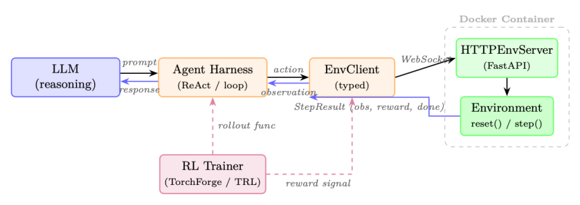
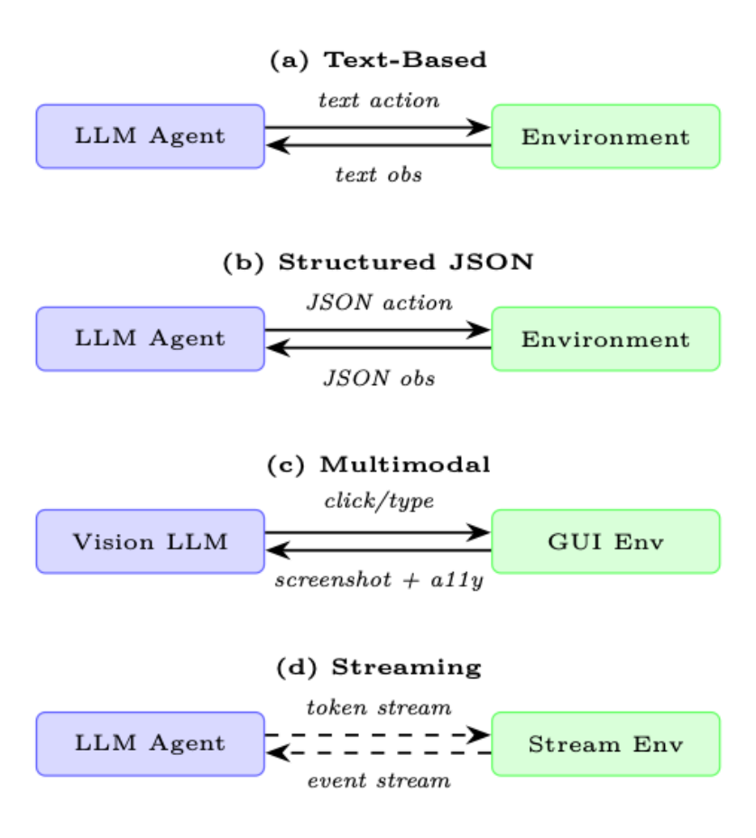

# 第 20 章 智能体环境与基准(Agentic Environments and Benchmarks)

## 20.1 动机:为什么智能体需要环境(Motivation: Why Agents Need Environments)

对话式语言模型的评估,原则上很直接:给出一个提示(prompt),收集回复,然后对照参考答案或由人类判断来打分。而智能体(agent)的评估在根本上是不同的。一个智能体必须在一个世界中行动、观察后果,并在一系列步骤中调整自己的行为。任何单一回复都无法刻画这一点;只有结构化的环境才能做到。

> **范围说明(Scope)**。本文所用的「环境」取强化学习(Reinforcement Learning)之义:智能体与之交互、用于训练或评估的世界——而不是在服务时承载智能体的生产基础设施(运行框架 harness、编排器 orchestrator)。执行沙箱(sandbox)之所以在此讨论,是因为它们支撑了这类环境;而智能体运行框架本身在第 18 章讨论。

### 聊天机器人与智能体评估之间的鸿沟(The Chatbot–Agent Evaluation Gap)

聊天机器人评估衡量的是单次生成的质量:流畅度、事实准确性、有用性。智能体评估衡量的则是一条策略(policy)的质量:智能体能否在多样的、长程(long-horizon)任务中可靠地达成目标?这一鸿沟不仅是量上的,更要求一套不同的基础设施。

三股力量推动了对专用智能体环境(specialized agentic environment)的需求:

- **安全探索(Safe Exploration)**。真实世界系统——生产数据库、线上网站、金融 API——无法承受训练中智能体的探索性试错行为。沙箱化环境提供了一个忠实的高保真副本,智能体可以在其中失败、恢复并学习,而不会造成不可逆的损害。安全隔离(例如 Docker 容器、网络受限的虚拟机)不是可选项,而是一等的设计需求。

- **可复现评估(Reproducible Evaluation)**。基准测试(benchmarking)要求每个智能体在相同条件下面对相同的任务。环境必须能按需确定、可版本化、可分发,以便一个实验室报告的结果能在另一个实验室复现。历史上正是缺乏这一性质,才使智能体基准难以横向比较。

- **课程式学习(Curriculum Learning)**。从零开始在困难任务上训练智能体,样本效率(sample efficiency)很低。能够呈现难度课程(curriculum)的环境——随着智能体能力提升逐步增加任务复杂度——能大幅减少达到目标性能水平所需的环境交互次数。这与人类学习方式相通:先掌握子技能,再掌握整体。

### 作为 LLM 强化学习「健身房」的环境(Environments as the RL "Gym" for LLMs)

正如 OpenAI Gym [344] 标准化了强化学习算法与仿真控制任务之间的接口,智能体环境也标准化了基于 LLM 的智能体与其必须解决的各种任务之间的接口。

这一类比是严密的:`reset()` 初始化一个新回合(episode);`step(action)` 推进世界并返回一个观测(observation)与奖励(reward);而 `render()` 生成当前状态的人类可读视图。

## 20.2 环境设计原则(Environment Design Principles)

一个设计良好的智能体环境会暴露四条正交的设计轴:观测空间(observation space)、动作空间(action space)、奖励信号(reward signal)与回合结构(episode structure)。每一条都做对是必要的;四者同时做对才是环境工程的技艺所在。

### 20.2.1 观测空间设计(Observation Space Design)

观测是智能体在每一步所看到的内容。对基于 LLM 的智能体而言,观测几乎总是被渲染为文本,但原始素材却多种多样:

- **纯文本(Pure text)**:终端输出、文件内容、API 响应、错误信息。对任何 LLM 的兼容性最强,但会丢失空间与视觉结构。
- **结构化(Structured, JSON/XML)**:机器可读的状态表示。能实现精确的接地(grounding),但要求智能体解析结构,而不是阅读散文式文本。
- **多模态(Multimodal)**:截图、无障碍树(accessibility tree)、渲染后的 HTML。GUI 与网页任务必需;需要具备视觉能力的模型或独立的感知模块。
- **混合(Hybrid)**:截图配合无障碍树(OSWorld 与 VisualWebArena 所采用),既提供视觉上下文又提供结构化的元素标识符,融合两种模态的优势。

#### 观测泄露(Observation Leakage)

一种常见的设计错误是:把智能体本不该获得的信息纳入观测——例如真值答案(ground truth)、奖励值或未来的任务步骤。观测泄露会虚高基准分数,并培养出在缺少这类信息的真实环境中部署时灾难性失败的智能体。

### 20.2.2 动作空间设计(Action Space Design)

动作空间定义了智能体能做什么。对 LLM 智能体而言,动作通常是一段文本字符串,由环境解析并执行。常见动作类型包括:

- **工具调用(Tool calls)**:对外部函数(搜索、计算器、日历)的结构化调用。通常格式化为 JSON 或 XML 的函数调用语法。
- **代码执行(Code execution)**:智能体编写代码并在沙箱中运行;stdout/stderr 作为下一个观测返回。这是表达力最强的动作类型。
- **API 交互(API interactions)**:对 Web 服务的 HTTP 请求、数据库查询、shell 命令。
- **GUI 动作(GUI actions)**:`click(x,y)`、`type("text")`、`scroll(direction)`、`key("Enter")`。用于计算机使用(computer-use)环境。
- **自然语言(Natural language)**:面向另一个智能体、人类或子任务规划器的自由文本。

### 20.2.3 奖励信号设计(Reward Signal Design)

奖励设计是环境工程中最难的一环。奖励必须满足:

1. **对齐(Aligned)**:高奖励应对应真正的任务完成,而非表面化的代理指标(superficial proxy)。
2. **可学(Learnable)**:信号必须足够稠密,使智能体能取得进展;在长程任务上纯稀疏奖励若没有额外的奖励塑形(shaping),往往无法学习。
3. **防篡改(Tamper-proof)**:智能体不应能在不真正完成任务的情况下获得高奖励(即避免奖励作弊 / reward hacking)。

**表 20.1**:智能体环境的奖励信号类型及其取舍。

| 奖励类型 | 优点 | 缺点 |
|---|---|---|
| 稀疏(结束时 0/1) | 对齐,难以作弊 | 难学习 |
| 稠密(逐步) | 易学习 | 易产生塑形伪影(shaping artifact) |
| 内在(好奇心) | 驱动探索 | 可能偏离任务 |
| LLM 充当裁判(LLM-as-judge) | 灵活、细致 | 昂贵、不一致 |
| 执行式(Execution-based) | 真值 | 仅适用于可验证的任务 |

### 20.2.4 回合结构(Episode Structure)

回合可以按若干方式组织:

- **定长(Fixed-length)**:智能体恰好走 T 步。实现简单;但在已经解决的任务上浪费算力。
- **提前终止(Early termination)**:当智能体发出完成信号或达到终止状态时回合结束。更高效,但需要可靠的终止检测器。
- **开放式(Open-ended)**:无固定视界;智能体一直运行直到某个资源预算(词元 token 数、API 调用数、墙上时间 wall time)耗尽。最接近真实部署,但最难评估。

#### 自适应回合长度与提前终止(Adaptive episode length and early termination)

近期工作挑战了「回合长度必须在训练开始前就固定」这一假设:

- **视界上的课程(Curriculum over horizon)**。AELA [345] 从短回合开始,随着智能体能力(以策略熵 policy entropy 收敛度衡量)的增长逐步延长视界。早期短回合能让每个训练样本暴露更多样的初始状态。

- **截断作为强化学习惩罚(Truncation as RL penalty)**。DLER [346] 表明,最简单的长度控制——硬截断——在与分批次奖励归一化(batch-wise reward normalization)以及动态采样(避免丢失被截断 rollout 的奖励信号)配合时,对推理模型效果良好。

- **学习何时停止(Learned stopping)**。模型自身可以学会何时停止推理,而非采用固定预算。[347] 提出三种策略:当连续的推理步骤收敛到同一答案时停止;提升「思考结束」词元的概率;或在隐藏状态激活上训练一个轻量级分类器来预测最佳停止点。

- **部分 rollout 回收(Partial-rollout recycling)**。APRIL [348] 超量供给 rollout 请求,并在达到目标批次数量后即终止;未完成的回复被回收为后续步骤的暖启动前缀(warm-start prefix),消除了少数慢样本拖垮整个批次的长尾停滞(吞吐量提升 20–35%)。TLT [349] 通过即时训练一个自适应草稿模型来对掉队者(straggler)进行投机解码(speculative decoding),从而解决同一瓶颈(端到端 1.7 倍加速,无损)。

### 20.2.5 难度课程与自适应环境(Difficulty Curriculum and Adaptive Environments)

静态基准度量的是智能体能力的某个固定快照。自适应环境更进一步:它们在线监测智能体表现,并调整任务难度,以把智能体保持在「最近发展区」(zone of proximal development)——足够难以从中学习,又足够易以偶尔成功。相关技术包括:

- **过程式生成(Procedural generation)**:任务从参数化分布中采样;难度参数依据近期成功率进行调整。优先级关卡回放(Prioritized Level Replay)[350] 按每个生成关卡的估计学习潜力(例如 GAE 幅值)打分,并更频繁地回放高价值关卡。

- **自博弈 / 对抗式环境设计(Self-play / adversarial environment design)**:PAIRED [351] 训练一个对手来提出能最大化「主角」(protagonist)与「反派」(antagonist)智能体之间遗憾值(regret)的环境,从而无需手工设计难度排程,就产生一条复杂度自然递增的课程。

- **后见之见重标注(Hindsight relabeling)**:把失败轨迹重新标注为智能体实际达成的目标,即便从失败中也能提供学习信号(后见经验回放,Hindsight Experience Replay,HER)[322]。

- **面向 LLM 的难度定向数据选择**:在 RLVR 训练中,并非所有题目提供同等信号。近期工作优先选择中等难度的题目——即模型大约在 30–70% 概率上能解出的那些——这些题目能产出最高的梯度信息 [352]。ADCL [353] 会随着模型进步周期性地重新估计难度,避免课程陈旧。

## 20.3 智能体环境的类型(Types of Agentic Environments)

### 20.3.1 代码执行沙箱(Code Execution Sandboxes)

对 LLM 而言最基础的智能体环境是代码执行沙箱:智能体编写代码,沙箱运行它,输出被返回。这个简单循环支撑了相当大一部分真实世界智能体部署。

基于 Docker 的隔离是最常见的做法。每个回合从一个已知镜像派生一个全新容器,在其中执行智能体编写的代码,并在回合结束时销毁容器。网络访问、文件系统写入与进程派生都可以在容器层面加以控制。^1

E2B(Environments to Benchmarks)^2 提供了托管的云沙箱 API:智能体通过 HTTP 发送代码,E2B 在一个启动时间不到 200 毫秒的隔离 Firecracker microVM 中执行,并返回 stdout/stderr。E2B 承担了容器生命周期管理的基础设施复杂性,从而易于集成进智能体训练循环。

Modal^3 提供了类似的托管执行模型,且对 GPU 的支持更强,适合那些需要把机器学习工作负载作为任务一部分运行的智能体。

#### 沙箱逃逸与安全(Sandbox Escape and Security)

代码执行沙箱是一类主要攻击面。一个能力足够强的智能体(或一段提示注入 payload)可能试图通过内核漏洞利用、网络数据外泄或资源耗尽来逃逸沙箱。纵深防御(defense-in-depth)至关重要:把容器隔离与 seccomp profile、只读根文件系统、网络出口过滤,以及 CPU/内存 cgroups 结合使用。绝不要以宿主级权限运行智能体生成的代码。

### 20.3.2 网页环境(Web Environments)

网页环境给智能体一个浏览器,要求它在真实或仿真的网站上完成任务。

WebArena [267] 提供了一个自托管的测试床,包含四个功能完整的网页应用——一个电商商店、一个社交论坛、一个 GitLab 实例和一个 CMS——外加一个地图服务,合计 812 个长程任务。智能体通过浏览器自动化 API 交互;任务要求多步导航、表单填写与信息检索。人类表现约为 78%;最先进的(state-of-the-art)LLM 智能体约为 35–45%。

VisualWebArena [354] 在 WebArena 之上扩展了视觉接地任务,要求解读网页上的图片。观测是一张截图配合一棵无障碍树;智能体必须把动作同时建立在两种模态上。

Mind2Web [355] 是一个大规模数据集,通过人类演示采集了跨越 137 个真实网站的 2,000 个任务。与 WebArena 不同,Mind2Web 聚焦于对未见网站的泛化能力,因此是一个更难的分布外(out-of-distribution)测试。

#### WebArena 任务示例(WebArena Task Example)

任务:「在电商网站上找到 50 美元以下最便宜的红色连衣裙,并加入购物车。」

智能体轨迹:

1. 导航到服装类目。
2. 应用颜色筛选:红色。
3. 按价格升序排序。
4. 锁定第一件 50 美元以下的商品。
5. 点击「加入购物车」。
6. 核对购物车内容。

环境把最终购物车状态与真值商品核对;若正确奖励为 1,否则为 0。

### 20.3.3 计算机使用环境(Computer Use Environments)

计算机使用环境(computer use environment)让智能体掌控一台完整的桌面操作系统,通过截图和/或无障碍 API 进行观测。

OSWorld [356] 在三种操作系统(Ubuntu、Windows、macOS)上测试桌面自动化,共 369 个任务,覆盖生产力应用(LibreOffice、VS Code、Chrome、GIMP 等)。智能体观测截图,并通过 pyautogui 风格的鼠标与键盘命令行动。人类与智能体之间的鸿沟十分悬殊:标注员在约 72% 的任务上成功,而最强的 LLM 智能体仅约 18%,凸显了像素级 GUI 控制的困难。

WindowsAgentArena [357] 专门针对 Windows 11,在 19 个应用上有 154 个任务。它强调企业工作流:Excel 公式、PowerPoint 编辑、Outlook 邮件管理。

#### 截图瓶颈(The Screenshot Bottleneck)

计算机使用智能体面临一个根本性挑战:截图是高维的(典型为 1920 × 1080 × 3 像素),但其中大部分信息与当前动作无关。高效的智能体会学会关注屏幕的局部区域,借助无障碍树按名称(而非像素坐标)识别可交互元素,并维护一份关于已访问 UI 状态的紧凑工作记忆。

### 20.3.4 软件工程环境(Software Engineering Environments)

软件工程(Software Engineering,SWE)环境要求智能体解决真实世界的编程任务:修 bug、实现功能、写测试。

SWE-bench [266] 取材自 12 个广泛使用的 Python 项目(Django、Flask、scikit-learn 等)的 2,294 个真实拉取请求(pull request)。每个实例把一个 issue 描述与一份留出的(held-out)测试套件配对,只有应用了正确补丁后测试才通过。智能体必须理解仓库结构、定位相关代码、实现修复,并用测试套件验证。SWE-bench Verified 子集(500 个 issue)经人工核验正确性,是标准的评估目标。

SWE-agent [232] 既是基准环境,也是智能体框架。它引入了智能体-计算机接口(Agent-Computer Interface,ACI):一组针对 LLM 智能体优化的 shell 命令(例如 `search_file`、`open`、`edit`),与原始 bash 相比降低了动作空间复杂度。

#### SWE-bench 工作流(SWE-bench Workflow)

- **输入**:一份 GitHub issue 描述,以及在该 issue 提交时的完整仓库。
- **智能体动作**:`find_file`、`view`、`edit`、`python -m pytest tests/`。
- **奖励**:若智能体打补丁后所有目标测试通过则为 1,否则为 0。没有部分计分。

### 20.3.5 科研环境(Scientific Research Environments)

科研环境把智能体推向自主的知识生产:阅读论文、提出假设、设计实验、解读结果。

PaperQA2 [358] 是一个检索增强(retrieval-augmented)智能体,通过搜索 PDF 语料库、抽取相关段落、综合带引用的答案来回答科学问题。它既是工具,也是文献接地推理的基准。

AI Scientist [359] 是一个端到端的研究自动化系统:给定一个研究方向,智能体生成假设、编写并运行实验、解读结果,并产出论文初稿。环境包含一个 Python 执行沙箱、一个文献检索 API 与一个 LaTeX 编译器。

MLAgentBench [360] 在机器学习工程任务上评估智能体:在给定算力预算内提升模型在给定数据集上的精度。智能体可以读取数据、编写训练脚本、运行实验并迭代。

### 20.3.6 游戏与仿真环境(Game and Simulation Environments)

游戏提供丰富的、长程的环境,具有定义明确的奖励信号,且没有真实世界后果。

NetHack [361] 是一款过程式生成的类 Rogue 游戏,状态空间极其庞大,要求长期规划、物品栏管理与对意外事件的适应。NetHack 学习环境(NetHack Learning Environment,NLE)提供与 Gym 兼容的接口。

Voyager / Minecraft [228] 用 Minecraft 游戏引擎作为开放式环境。Voyager 引入一条难度逐级递增的课程(采集木头 → 制作工具 → 搭建庇护所 → 探索下界 Nether),以及一个跨回合积累可复用代码片段的技能库(skill library)。

GAIA [362] 提出 466 个问题,要求链式工具使用——网页搜索、代码执行、文件解析——并按所涉及的推理步骤数划分为三个难度等级。该基准鲜明地暴露了人类能力(约 92% 准确率)与当前 LLM 智能体之间的鸿沟(GPT-4 配合插件在发布时约 15%;后来的系统达到约 30%)。

### 20.3.7 多智能体环境(Multi-Agent Environments)

多智能体环境涉及两个或更多 LLM 智能体相互之间交互,和/或与一个共享世界交互。

- **协商(Negotiation)**:拥有私有效用函数的智能体必须通过对话达成协议。经典环境包括 DealOrNoDeal [363] 与 CaSiNo [364]。
- **辩论(Debate)**:两个智能体分别论证对立立场;一个裁判智能体(或人类)评估论据质量。用于通过对抗压力激发出忠实的推理。
- **协作式任务完成(Collaborative task completion)**:能力互补的智能体(规划器 planner、执行器 executor、评审者 critic)必须协调完成任何一方都无法单独解决的任务。相关框架包括 AutoGen [338]、CrewAI [341] 与 MetaGPT [365]。
- **竞争式博弈(Competitive games)**:智能体参与零和博弈(国际象棋、围棋、扑克),其中对手本身也是 LLM 智能体。在这些环境中的自博弈已在狭窄领域产生超人表现。

## 20.4 OpenEnv:标准化的智能体环境接口(OpenEnv: Standardized Agentic Environment Interfaces)

智能体环境的激增造成了碎片化问题:每个环境暴露不同的 API、采用不同的观测格式、需要不同的脚手架。OpenEnv [366] 是由 Hugging Face 推出的一个近期开源框架,直接应对这一问题:它为智能体执行环境提供了 Gymnasium 风格 [367] 的接口(`step()`、`reset()`、`state()`),并通过 WebSocket 与基于 Docker 的隔离部署通信。OpenEnv 补充了更广泛的标准 化努力,例如提供跨多种环境的 LLM 智能体统一格式平台的 AgentGym [368],以及为网页智能体基准标准化观测与动作空间的 BrowserGym [369]。下文的设计原则正是从这些项目中提炼出的趋同最佳实践。



### 20.4.1 标准化的智能体-环境接口(Standardized Agent–Environment Interface)

OpenEnv 为智能体执行环境定义了一套带类型的接口。其设计借鉴了 Gymnasium 的简洁性,但面向通过 HTTP/WebSocket 与工具交互的 LLM 智能体:

- `env.reset() → StepResult`:开始一个新回合;返回初始观测。
- `env.step(action) → StepResult(observation, reward, done)`:执行一个动作并返回结果观测、标量奖励与终止标志。
- `env.state() → 当前环境状态`(回合 ID、步数、环境专有字段)。
- `env.close()`:释放资源(停止容器、关闭连接)。

动作与观测都是强类型的 Python dataclass,具体到每个环境。例如,一个编码环境定义 `CodeAction(code=...)` 并返回一个含 stdout、stderr、exit_code 的观测;一个游戏环境定义自己的动作/观测类型。这种「每环境一套类型」在保持三个核心方法(`reset`、`step`、`state`)通用性的同时,为智能体提供了结构化、可预测的接口。

**架构(Architecture)**。每个环境都是一个继承自 `Environment`(实现 `reset()` 与 `step()`)的 Python 类。它通过 `HTTPEnvServer` 在一个 Docker 容器内提供服务,后者暴露一个 FastAPI/WebSocket 端点。客户端使用环境专有的 `EnvClient` 子类来处理序列化与连接生命周期。容器可以通过 `from_docker_image()` 在本地启动,也可以通过一个 base URL 远程连接:

```python
from coding_env import CodeAction, CodingEnv

# 选项 1:在本地启动一个 Docker 容器
client = CodingEnv.from_docker_image("coding-env:latest")

# 选项 2:连接到一个远程部署
# client = CodingEnv(base_url="http://localhost:8000")

# 与环境交互
result = client.reset()
print(result.observation.stdout)
print(result.observation.stderr)
print(result.observation.exit_code)

result = client.step(CodeAction(code="print(2 + 2)"))
print(result.observation.stdout)
# "4\n"
print(result.observation.exit_code)
# 0
print(result.reward, result.done)

# 检查状态
state = client.state()
print(state.episode_id, state.step_count)

client.close()
```

**环境即服务器(Environment as a server)**。创建一个新环境只需实现 `Environment` 基类:

```python
from openenv.core.env_server import Environment, create_app
from dataclasses import dataclass

@dataclass
class MyAction:
    text: str

@dataclass
class MyObservation:
    response: str
    reward: float = 0.0
    done: bool = False

class MyEnvironment(Environment):
    def reset(self) -> MyObservation:
        return MyObservation(response="Ready")

    def step(self, action: MyAction) -> MyObservation:
        return MyObservation(response=f"Echo: {action.text}",
                             reward=1.0, done=False)

app = create_app(MyEnvironment(), MyAction, MyObservation)
# 运行:uvicorn module:app --host 0.0.0.0 --port 8000
```

**运行框架集成(实验性,Harness integration, experimental)**。RFC 0054 引入了一个面向运行框架的层:强化学习训练框架通过 MCP 风格的工具调用与环境交互。一个 `build_harness_rollout_func()` 辅助函数产生一个与 TRL 兼容的 rollout 函数,把 OpenEnv 直接桥接到现有的训练流水线(如 TorchForge [370])中。

**治理(Governance)**。OpenEnv 由一个技术委员会公开治理,成员包括 Meta-PyTorch、NVIDIA、Unsloth、Modal、Prime Intellect、Reflection 与 Hugging Face——确保该标准在广泛的行业输入下演进,而非由单一厂商的议程主导。

### 20.4.2 环境注册中心与发现(Environment Registries and Discovery)

OpenEnv 环境可以部署为 Hugging Face Spaces 或本地 Docker 镜像,从而无需手工安装即可被发现和使用。无论部署目标如何,同一套客户端接口都适用:

```python
from echo_env import EchoAction, EchoEnv

# 连接到一个远程 HF Space 部署
client = EchoEnv(base_url="https://openenv-echo-env.hf.space")

result = client.reset()
print(result.observation.echoed_message)
# "Echo environment ready!"

result = client.step(EchoAction(message="Hello!"))
print(result.observation.echoed_message)
# "Hello!"
print(result.reward)

client.close()
```

OpenEnv 生态已经涵盖 70+ 个环境(OpenSpiel 游戏、Atari、BrowserGym、编码沙箱、金融强化学习、交通仿真等)。RFC 0025 提出一套正式的工具发现协议,使智能体能在运行时查询一个陌生环境接受哪些动作。

### 20.4.3 组合式环境(Compositional Environments)

真实的智能体部署很少只使用单一工具。OpenEnv 支持富环境(rich environment),通过带类型的动作暴露多种能力。例如,一个编码环境在单个沙箱化会话内同时支持代码执行、文件 I/O 与 shell 命令:

```python
from coding_env import CodeAction, CodingEnv

client = CodingEnv.from_docker_image("coding-env:latest")
result = client.reset()

# 执行代码
result = client.step(CodeAction(code="x = 42\nprint(x)"))
print(result.observation.stdout)
# "42"
print(result.observation.exit_code)
# 0

# 在一个回合内,状态跨步保持(持久)
result = client.step(CodeAction(code="print(x + 1)"))
print(result.observation.stdout)
# "43"

state = client.state()
print(state.step_count)
# 2

client.close()
```

对于需要多样工具访问(代码 + 网页 + 文件)的智能体,OpenEnv 的 RFC 0036 提出 MCP 集成,允许把任何兼容 MCP 的工具服务器包装为一个 OpenEnv 环境。此外,`openenv` 命令行工具可以用单条命令脚手架化、构建并把新环境部署到 Hugging Face Spaces。

### 20.4.4 环境版本化与可复现性(Environment Versioning and Reproducibility)

基准完整性要求环境行为在评估时被冻结。最佳实践包括:

- **语义版本化(Semantic versioning)**:WebArena-v1.2.0 保证在同一个 minor 版本内向后兼容。
- **Docker 镜像钉定(Docker image pinning)**:环境运行时被打包为一个带内容寻址哈希的 Docker 镜像。
- **基于种子的确定性(Seed-based determinism)**:所有随机要素(过程式生成、网络响应)都带种子并被记录,使得任何轨迹都能被精确回放。
- **排行榜快照(Leaderboard snapshots)**:公开排行榜在记录分数的同时记录环境版本,防止基准悄悄漂移。

## 20.5 构建自定义环境(Building Custom Environments)

### 20.5.1 面向 LLM 智能体的 Gymnasium 风格 API(Gymnasium-Style API for LLM Agents)

Gymnasium API [367]^7(OpenAI Gym 的后继者)是强化学习环境事实上的标准。把它适配到 LLM 智能体需要两点改动:(1)观测与动作是字符串(或包含字符串的字典),而非数值数组;(2)`step` 方法必须处理异步工具执行。

### 20.5.2 奖励函数工程(Reward Function Engineering)

面向 LLM 智能体环境的奖励函数通常是执行式的:环境在每个回合后运行一个验证器(verifier),若任务被解决则返回 1,否则返回 0。对于没有明确验证器的任务,可选方案包括:

- **LLM 充当裁判(LLM-as-judge)**:由另一个 LLM 对照任务描述对智能体的最终状态打分。
- **基于评分量规(Rubric-based scoring)**:一份结构化量规(rubric)把任务分解为若干子准则,各自独立打分。
- **人工标注(Human annotation)**:由人类评估者对轨迹的随机样本打分;这些分数用于校准一个自动化代理。

### 20.5.3 状态管理与检查点(State Management and Checkpointing)

长程任务可能耗费数小时的墙上时间。环境应当支持:

- **状态序列化(State serialization)**:完整的环境状态(文件系统、浏览器 cookie、数据库内容)可被序列化到磁盘并恢复。
- **回合中检查点(Mid-episode checkpointing)**:智能体可在任意步骤保存检查点并从中恢复,从而支持树搜索式探索。
- **轨迹日志(Trajectory logging)**:每个观测、动作与奖励都被记录到结构化文件中,用于离线分析与奖励模型训练。

### 20.5.4 训练数据收集的并行化(Parallelization for Training Data Collection)

通过强化学习训练 LLM 智能体需要数百万次环境交互。并行化策略包括:

- **进程级并行(Process-level parallelism)**:派生 N 个相互独立的环境进程;并行收集轨迹。
- **异步 rollout 工作者(Async rollout workers)**:使用异步事件循环(例如 asyncio),把 LLM 推理延迟与环境执行重叠起来。
- **向量化环境(Vectorized environments)**:把多个环境打包进一次 `step` 调用,摊薄 Python 开销。
- **云原生扩展(Cloud-native scaling)**:使用作业调度器(Ray、SLURM)把环境工作者分发到一个集群,由一个中央回放缓冲区(replay buffer)汇聚轨迹。

## 20.6 环境-智能体接口模式(Environment–Agent Interface Patterns)

图 20.2 展示了实践中常用的四种主要接口模式。



**基于文本的观测/动作(Text-Based Observation/Action)**。智能体接收一个字符串观测并产生一个字符串动作。环境解析动作(例如从 `<tool>...</tool>` 块中抽取工具调用)并以字符串形式返回结果。这是兼容性最强的模式:任何 LLM 都无需特殊架构即可参与。

**结构化 JSON 的观测/动作(Structured JSON Observation/Action)**。观测与动作是具有已定义 schema 的 JSON 对象。这能实现严格校验(在执行前拒绝格式错误的动作)、结构化日志,以及更易于程序化分析的轨迹。代价是智能体必须可靠地产出合法 JSON,这要么需要微调,要么需要受约束的解码(constrained decoding)。

**多模态(截图 + 无障碍树,Multimodal: Screenshot + Accessibility Tree)**。用于计算机使用与网页环境。观测是一个元组 `(screenshot: PIL.Image, a11y_tree: dict)`。截图提供视觉上下文;无障碍树提供元素标识符,使动作无需指定像素级坐标即可引用。这种混合方式比纯截图控制更鲁棒。

**流式 vs 基于回合的交互(Streaming vs. Turn-Based Interaction)**。当前多数环境采用基于回合的模型:智能体产出一个完整动作,环境执行它,再返回下一个观测。流式环境则允许智能体在数据到达时就接收部分观测(例如一条长时间运行命令的输出),并可在中途打断或重定向执行。这更接近人类与计算机交互的方式,但要求更复杂的智能体架构。

## 20.7 评估运行框架设计(Evaluation Harness Design)

评估运行框架(evaluation harness)是跨一个基准套件运行智能体、收集结果并产出汇总统计的基础设施。好的运行框架设计与好的环境设计同等重要。

### 20.7.1 确定性环境 vs 随机环境(Deterministic vs. Stochastic Environments)

- **确定性环境(Deterministic environments)**:对相同动作序列产生相同观测序列。易于调试与复现,但可能不反映真实世界的变异性。
- **随机环境(Stochastic environments)**:引入随机性(过程式生成、网络延迟、用户仿真)。需要对每个任务进行多次运行以估计平均性能与置信区间。

#### 多少次运行才够?(How Many Runs Are Enough?)

对于一个有 $N$ 个任务、奖励为二值的基准,平均成功率的标准误为 $\sqrt{p(1-p)/N}$。取 $N = 500$、$p = 0.4$ 时,95% 置信区间约为 ±4.3%。对于随机环境,需再乘以 $\sqrt{k}$,其中 $k$ 是每个任务的独立运行次数。常见做法是对随机基准每个任务运行 3–5 次。

### 20.7.2 留出测试环境(Held-Out Test Environments)

基准完整性要求在环境层面(而非仅任务层面)进行严格的训练/测试划分。一个曾在 WebArena 任务上训练过的智能体,应当在一组训练时未使用的留出任务上被评估。理想情况下,留出集应覆盖与训练集不同的网站、任务类型与难度级别。

### 20.7.3 跨环境泛化(Cross-Environment Generalization)

对智能体的终极考验,是它在某个环境中学到的技能能否迁移到另一个环境。跨环境评估协议度量:

- **零样本迁移(Zero-shot transfer)**:在环境 A 上训练,在环境 B 上测试且不做任何微调。
- **少样本适配(Few-shot adaptation)**:在评估前先提供来自环境 B 的 k 个示例。
- **持续学习(Continual learning)**:依次在环境 A、B、C 上训练;在 C 上训练完成后,度量在三者上的性能。

### 20.7.4 人类基线采集(Human Baseline Collection)

每个基准都应把人类表现作为参考点纳入。人类基线有三重用途:

1. 它们确立了任务难度的上界。
2. 它们揭示某项任务究竟是否可解(一些基准任务结果证明是含糊的或不可能完成的)。
3. 它们为解读智能体分数提供校准点(「该智能体达到人类表现的 40%」)。

人类基线应当从具备领域专长的工作人员处采集(例如 SWE-bench 应采集自软件工程师,而非众包工人),并应包含任务耗时度量,以便进行效率比较。

## 20.8 代码示例:最小自定义 LLM 智能体环境(Code Example: Minimal Custom LLM Agent Environment)

### 最小自定义 LLM 智能体训练环境(Minimal Custom Environment for LLM Agent Training)

下面的 Python 类实现了一个文件编辑环境:智能体必须修改一个 Python 文件,使一个原本失败的测试通过。它遵循适配 LLM 智能体后的 Gymnasium API。

```python
"""
minimal_env.py
-- A minimal file-editing environment for LLM agents.
The agent receives a Python file with a bug and a failing test.
It must edit the file until the test passes.
Reward: 1.0 if all tests pass, 0.0 otherwise.
"""
from __future__ import annotations
import subprocess, shutil, tempfile, textwrap
from pathlib import Path
from dataclasses import dataclass, field
from typing import Any

# ---------------------------------------------------------------------------
# 数据结构
# ---------------------------------------------------------------------------
@dataclass
class StepResult:
    observation: str            # 喂给 LLM 的文本
    reward: float               # 0.0 或 1.0
    terminated: bool            # 回合结束(任务解决或达到最大步数)
    truncated: bool             # 回合被截断(预算超限)
    info: dict[str, Any] = field(default_factory=dict)

# ---------------------------------------------------------------------------
# 环境
# ---------------------------------------------------------------------------
class FileEditEnv:
    """
    A Gymnasium-style environment for LLM-based code repair.
    Observation space : str (file contents + test output)
    Action space     : str (one of: view, edit, run_tests, submit)
    Reward           : 1.0 on passing all tests, 0.0 otherwise
    """
    MAX_STEPS = 20              # 回合硬上限
    TIMEOUT = 30                # 每次测试运行的秒数

    def __init__(self, buggy_code: str, test_code: str,
                 task_description: str):
        self.buggy_code = buggy_code
        self.test_code = test_code
        self.task_description = task_description
        self._workdir: Path | None = None
        self._step_count = 0

    # ------------------------------------------------------------------
    # 核心 API
    # ------------------------------------------------------------------
    def reset(self, seed: int | None = None) -> tuple[str, dict]:
        """Initialise a fresh episode; return (observation, info)."""
        if self._workdir and self._workdir.exists():
            shutil.rmtree(self._workdir)
        self._workdir = Path(tempfile.mkdtemp(prefix="fileenv_"))
        self._step_count = 0
        # 写入初始文件
        (self._workdir / "solution.py").write_text(self.buggy_code)
        (self._workdir / "test_solution.py").write_text(self.test_code)
        obs = self._build_observation(
            action_taken="[Episode start]",
            test_output=self._run_tests()
        )
        return obs, {"step": 0}

    def step(self, action: str) -> StepResult:
        """Execute one agent action; return StepResult."""
        self._step_count += 1
        action = action.strip()

        # --- 解析并派发动作 ---
        if action.startswith("view"):
            result_text = self._action_view()
        elif action.startswith("edit"):
            result_text = self._action_edit(action)
        elif action.startswith("run_tests"):
            result_text = self._run_tests()
        elif action.startswith("submit"):
            result_text = self._run_tests()
        else:
            result_text = (
                f"Unknown action: {action!r}\n"
                "Valid actions: view | edit <new_content> | "
                "run_tests | submit"
            )

        test_output = self._run_tests()
        passed = "passed" in test_output and "failed" not in test_output
        reward = 1.0 if passed else 0.0
        terminated = passed or action.startswith("submit")
        truncated = self._step_count >= self.MAX_STEPS
        obs = self._build_observation(action, test_output)
        return StepResult(obs, reward, terminated, truncated,
                          {"step": self._step_count, "passed": passed})

    def render(self) -> str:
        """Return a human-readable summary of the current state."""
        if self._workdir is None:
            return "[Environment not initialised]"
        code = (self._workdir / "solution.py").read_text()
        return f"=== solution.py ===\n{code}\n"

    def close(self) -> None:
        """Release resources."""
        if self._workdir and self._workdir.exists():
            shutil.rmtree(self._workdir)
        self._workdir = None

    # ------------------------------------------------------------------
    # 私有辅助方法
    # ------------------------------------------------------------------
    def _action_view(self) -> str:
        code = (self._workdir / "solution.py").read_text()
        return f"Current solution.py:\n```\n{code}\n```"

    def _action_edit(self, action: str) -> str:
        # 期望格式:edit\n```\n<code>\n```
        try:
            new_code = action.split("```\n")[1].split("\n```")[0]
            (self._workdir / "solution.py").write_text(new_code)
            return "File updated successfully."
        except IndexError:
            return "Edit failed: wrap new code in ``` ... ```"

    def _run_tests(self) -> str:
        result = subprocess.run(
            ["python", "-m", "pytest", "test_solution.py",
             "-v", "--tb=short", "--no-header"],
            cwd=self._workdir,
            capture_output=True, text=True,
            timeout=self.TIMEOUT
        )
        return result.stdout + result.stderr

    def _build_observation(self, action_taken: str,
                           test_output: str) -> str:
        code = (self._workdir / "solution.py").read_text()
        return textwrap.dedent(f"""
            TASK: {self.task_description}
            STEP: {self._step_count}/{self.MAX_STEPS}
            --- Last action ---
            {action_taken}
            --- Current solution.py ---
            {code}
            --- Test output ---
            {test_output}
            --- Available actions ---
            view              # show current file
            edit\n```\n<code>\n```   # replace file contents
            run_tests         # run pytest
            submit            # finalise and end episode
        """).strip()

# ---------------------------------------------------------------------------
# 用法示例
# ---------------------------------------------------------------------------
if __name__ == "__main__":
    BUGGY = "def add(a, b):\n    return a - b\n"   # bug: 用了减号而非加号
    TESTS = (
        "from solution import add\n"
        "def test_add(): assert add(2, 3) == 5\n"
    )
    env = FileEditEnv(BUGGY, TESTS, "Fix the add() function.")
    obs, _ = env.reset(seed=0)
    print(obs)

    # 模拟一次正确的编辑
    fix = "edit\n```\ndef add(a, b):\n    return a + b\n```"
    result = env.step(fix)
    print(f"\nReward: {result.reward} | Terminated: {result.terminated}")
    env.close()
```

**清单 20.1**:遵循 Gymnasium API 的最小 LLM 智能体环境。

### 示例环境中的设计决策(Design Decisions in the Example Environment)

- **纯文本接口**:观测与动作都是普通字符串,兼容任何 LLM。
- **执行式奖励**:奖励由实际运行测试套件得到,而非来自 LLM 裁判。这使得奖励防篡改且完美对齐。
- **隔离的子进程**:测试在带超时的独立进程中运行,防止无限循环拖垮训练循环。
- **兼容 Gymnasium**:`reset`/`step`/`render`/`close` 遵循标准 API,可即插即用地配合强化学习训练框架。

## 20.9 主要智能体环境比较(Comparison of Major Agentic Environments)

表 20.2 汇总了本节所讨论的主要智能体环境的关键属性。

**表 20.2**:面向 LLM 智能体的主要智能体环境比较。「SoTA」指截至写作时已发表的最佳 LLM 智能体结果;在可得处给出人类表现。

| 环境 | 观测类型 | 动作空间 | 领域 | 任务数 | 人类 | SoTA LLM |
|---|---|---|---|---|---|---|
| WebArena | 文本 + DOM | 浏览器 API | 网页导航 | 812 | 78% | ~45% |
| VisualWebArena | 截图 + DOM | 浏览器 API | 视觉网页 | 910 | 88% | ~35% |
| Mind2Web | 截图 + DOM | 浏览器 API | 真实网站 | 2,000 | — | ~30% |
| OSWorld | 截图 | 鼠标 + 键盘 | 桌面 OS | 369 | 72% | ~18% |
| WindowsAgentArena | 截图 | 鼠标 + 键盘 | Windows 应用 | 154 | 75% | ~20% |
| SWE-bench Verified | 文本(仓库) | Shell + 编辑器 | 代码修复 | 500 | 100% | ~50% |
| GAIA(Level 1) | 文本 + 文件 | 工具调用 | 通用 QA | 165 | 92% | ~55% |
| GAIA(Level 3) | 文本 + 文件 | 工具调用 | 困难 QA | 42 | 92% | ~10% |
| NetHack(NLE) | 文本 + glyph | 离散动作 | 类 Rogue 游戏 | — | >10k 分 | ~5k 分 |
| Voyager(Minecraft) | 文本 + 代码 | 代码执行 | 开放世界游戏 | 课程 | — | 15+ 科技树 |
| MLAgentBench | 文本 + 代码 | Shell + 编辑器 | ML 工程 | 13 | — | ~40% |

### 解读比较表(Reading the Comparison Table)

人类表现与 SoTA LLM 表现之间的鸿沟,在计算机使用任务上最大(OSWorld:72% vs 18%),在代码修复上最小(SWE-bench:100% vs 50%)。这一规律反映了动作空间的成熟度:LLM 接受过海量代码训练,但相对缺乏基于截图交互的数据。随着计算机使用训练数据的积累,这一鸿沟预计会收窄。

## 20.10 小结(Summary)

智能体环境是 LLM 智能体在其中被训练与评估的基底。本节的关键要点是:

1. **环境不是可选项**。安全探索、可复现评估与课程式学习都需要结构化的环境。聊天机器人与智能体评估之间的鸿沟,没有它就无法弥合。

2. **谨慎设计全部四条轴**。观测空间、动作空间、奖励信号与回合结构各有自己的失效模式,任何一个都可能使整份基准失效。

3. **图景丰富但碎片化**。代码沙箱、网页环境、计算机使用环境、软件工程环境、科研环境、游戏与多智能体竞技场,各自检验不同能力。没有任何单一环境是充分的。

4. **标准化很重要**。OpenEnv [366] 提供了 Gymnasium 风格的 API,配以 Docker 隔离与以 Hugging Face Spaces 为注册中心——降低了构建新环境、并在环境之间比较智能体的成本。

5. **人类鸿沟真实存在且正在收窄**。当前 LLM 智能体在多数基准上达到人类表现的 20–50%。进展最快的是训练数据充沛的领域(代码),最慢的是需要细粒度感知的领域(GUI 控制)。

### 智能体环境中的开放研究问题(Open Research Questions in Agentic Environments)

- 如何为那些正确性是主观的或依赖于上下文的任务设计奖励函数?
- 单一智能体架构能否在无需任务专有微调的情况下,跨基于文本的与多模态的环境泛化?
- 用于训练的环境保真度,恰当的层次是什么?在简化仿真器上训练能否迁移到真实部署?
- 当 LLM 在日益庞大的、可能包含基准解答的网页语料库上训练时,我们如何防止基准污染(contamination)?
