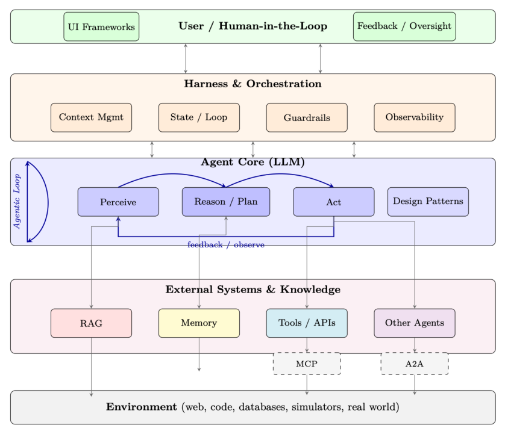

# 第 15 章 智能体 AI 导论(Introduction to Agentic AI)

前面的部分已为我们装备了算法工具箱——如何训练、对齐并让 LLM 进行推理。我们介绍了 Transformer 架构与 GPU 系统(第一部分)、将模型与人类意图对齐的强化学习(Reinforcement Learning)方法(第二部分)、由 RL 训练涌现出的推理能力(第三部分),以及评估方法学(第四部分)。本部分转向现代 AI 工程的核心问题:我们如何把这些模型部署为能在开放环境中感知(perceive)、规划(plan)、行动(act)并学习(learn)的自主智能体(agent)?

智能体 AI(Agentic AI)系统是指 LLM 在一个循环(loop)中运行:它从环境中接收观测(用户消息、工具输出、传感器数据),推理下一步该做什么,采取行动(工具调用、代码执行、API 请求),并不断迭代,直到目标达成或它明确请求人类介入。这与「单轮聊天机器人」范式形成对比——后者只产生一个回复然后等待。

从聊天机器人到智能体的转变带来了若干根本性挑战,这些挑战是单次模型调用无法解决的:

- **持久性(Persistence)**:智能体必须记住自己做过什么、什么失败了、建立了什么上下文——跨越多个轮次、会话甚至数天。
- **接地(Grounding)**:智能体必须访问训练数据中未包含的、最新的、领域专有的知识。
- **行动(Action)**:智能体必须通过定义良好的接口与外部系统交互——数据库、API、文件系统、浏览器。
- **协作(Coordination)**:复杂任务往往超出单个智能体的能力;多个专精的智能体必须协作、委派与协商。
- **安全(Safety)**:自主行动需要护栏(guardrail)、人类监督,以及在智能体不确定时优雅降级(graceful degradation)。

为应对这些挑战,生产级智能体系统采用分层架构(layered architecture)构建。每一层解决一个特定问题,后续章节自底向上覆盖整个技术栈:

- **第 16 章:RAG(检索增强生成,Retrieval-Augmented Generation)**——知识层。RAG 通过在查询时检索相关文档,让智能体获得动态外部知识。这解决了接地问题:智能体可以回答关于专有数据、近期事件或领域专有内容的问题,而这些是模型在训练时从未见过的。我们将介绍嵌入(embedding)模型、向量数据库、分块(chunking)策略、混合检索,以及智能体自主决定何时检索、检索什么的高级模式——智能体式 RAG(agentic RAG)。

- **第 17 章:记忆(Memory)**——持久层。记忆使智能体能够跨交互召回信息——从单个任务内的短期工作记忆(working memory),到跨越数月的长期情景记忆(episodic memory)。我们将介绍记忆架构(缓冲、摘要、向量索引、知识图谱)、记忆巩固(memory consolidation),以及如何设计能在不淹没上下文窗口的前提下扩展的记忆系统。

- **第 18 章:运行框架与编排(Harness & Orchestration)**——运行时层。编排运行框架(orchestration harness)是智能体的「操作系统」:它管理智能体循环、上下文窗口预算、工具分发、错误恢复、状态持久化与可观测性(observability)。我们将介绍上下文管理策略(摘要、滑动窗口、层级化)、执行控制(顺序、并行、分支)、护栏,以及人在回路(human-in-the-loop)模式。

- **第 19 章:设计模式(Design Patterns)**——架构层。用于组织智能体的经典模式:ReAct(推理 + 行动的交错)、先规划后执行、反思循环(reflection loop)、工具增强生成(tool-augmented generation),以及多步工作流。我们将分析每种模式适用的场景、其失效模式(failure mode),以及如何为复杂的真实世界任务组合使用它们。

- **第 20 章:环境与基准(Environments & Benchmarks)**——评估层。在哪里以及如何评估智能体行为。我们将介绍网页导航基准、编程环境、工具使用评估套件,以及评估多步自主系统的独特挑战(部分计分、轨迹质量、安全违规)。

- **第 21 章:MCP(模型上下文协议,Model Context Protocol)**——工具集成标准。MCP 标准化了智能体发现与调用工具的方式——类比于硬件领域的 USB。我们将介绍协议规范、服务器/客户端架构、资源管理,以及 MCP 如何消除智能体与工具之间的 N×M 集成问题。

- **第 22 章:智能体技能(Agent Skills)**——能力层。智能体如何获取并组合超越基础工具使用的专有能力,包括技能库(skill library)、技能选择,以及组合式任务求解。

- **第 23 章:A2A(智能体间通信,Agent-to-Agent Communication)**——智能体间协议。当任务需要多个专才时,A2A 提供了用于智能体发现、任务委派、进度流式传输与结果聚合的标准化协议——使异构智能体(来自不同厂商、框架或组织)能够协作。

- **第 24 章:多智能体系统(Multi-Agent Systems)**——协作层。多智能体协作的架构:层级式委派、对等协商、辩论与共识、群体智能(swarm intelligence),以及涌现行为(emergent behaviour)。我们将介绍何时使用单智能体设计而非多智能体设计,以及如何调试协作失败。

- **第 25 章:框架(Frameworks)**——实现层。实现上述概念的生产级工具包:LangGraph(有状态的、基于图的编排)、CrewAI(基于角色的多智能体)、OpenAI Agents SDK、AutoGen 等。我们将比较它们的取舍、架构决策,以及对不同用例的适用性。

- **第 26 章:智能体 UI(Agentic UI)**——交互层。用户如何与智能体交互并进行监督:流式界面、渐进式披露(progressive disclosure)、审批工作流、状态仪表板,以及在自主系统中建立恰当信任的 UX 模式。

这些层并非孤立运作——它们构成一个紧密集成的系统,其中每个组件相互依赖、相互增强:

- 智能体核心(一个具备第二、第三部分所述推理能力的 LLM)位于中心,执行感知—推理—行动(perceive–reason–act)循环。
- RAG 在每次推理步骤之前为智能体提供相关知识,而记忆则在步骤与会话之间提供连续性。
- 编排运行框架协调一切:它决定何时检索、何时调用工具、何时委派给子智能体、何时向人类寻求指导。
- MCP 提供标准化接口,使智能体得以访问所有外部工具;A2A 则为智能体间通信提供对等的接口。
- 设计模式定义了高层策略(ReAct、先规划后执行、反思),而框架则提供这些模式的具体实现。
- UI 层将智能体重新连接到人类,从而闭合回路——用于监督、纠错与协作式问题求解。

贯穿全书,我们始终秉持系统视角:智能体 AI 不仅仅是关于提示(prompt)——它要求在每一层都精心工程化上下文管理、错误处理、安全护栏与可观测性。下图展示了这些组件在架构上如何组合在一起。

