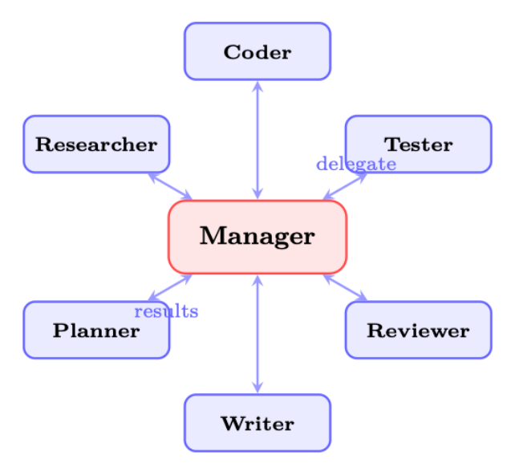
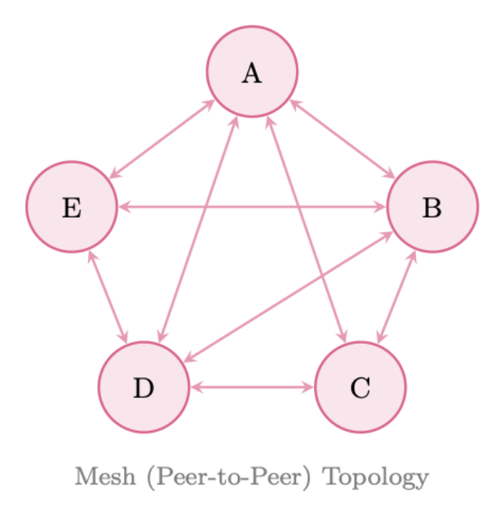
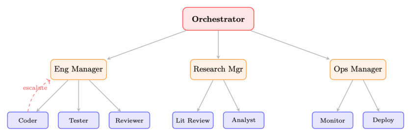

# 第 24 章 多智能体系统(Multi-Agent Systems)

## 24.1 动机:为何需要多个智能体?

人工智能的历史,在许多方面就是一部规模化(scale)的历史。早期的 AI 系统是单体式的(monolithic):一个程序、一个知识库、一个推理引擎。随着问题日益复杂,研究人员发现:没有任何单个智能体——无论能力多强——能高效地处理一个丰富、开放式任务的方方面面。这一洞见早在分布式 AI 与多智能体系统(multi-agent systems, MAS)的研究中就已确立 [380, 381],而在大语言模型(LLM)时代又获得了新的迫切性。

**核心直觉**

单个 LLM,无论多大,都是通才(generalist)。而一支由专门化 LLM 组成的团队,各自聚焦于一个狭窄的子问题并交流结果,在复杂、多面的任务上能超越通才——正如一支由人类专家组成的团队在复杂工程项目上能胜过单个通才一样。

有四个根本性的动机推动着从单体智能体向智能体社会(agent societies)的转变:

**专业化(Specialization)。**
不同的子任务受益于不同的能力、提示策略(prompt strategy),甚至不同的基座模型。代码生成智能体可在程序设计语料上微调;事实验证智能体可借助检索工具实现知识锚定(grounding);创意写作智能体可通过提示获得风格多样性。强迫单个智能体同时在这些方面都表现卓越,既低效,又往往不可能。

**并行性(Parallelism)。**
许多真实任务可分解为能并发执行的独立子任务。一条需要文献综述、数据分析和报告撰写的研究流水线,可以让三者并行运行,从而大幅缩短实际耗时(wall-clock time)。串行的单智能体处理是一个瓶颈,而多智能体并行可以消除它。

**鲁棒性(Robustness)。**
单个智能体是单点故障(single point of failure)。一旦它产生幻觉、陷入循环,或给出一个微妙错误的答案,没有任何校验。多智能体系统引入冗余:第二个智能体可以验证、批评或独立地重新推导结果。对抗性智能体可以在输出被信任之前先探测其弱点。

**涌现能力(Emergent Capabilities)。**
也许最引人入胜的是,智能体集合体(collective)能展现出任何单一智能体都不具备的能力。通过辩论(debate)、协商(negotiation)和迭代精化,多智能体系统能达成超越任何单智能体单独所能产出的解决方案——这是社会性生物涌现智能的计算对应物。

**历史背景**

多智能体系统研究可追溯至上世纪 80 年代,其奠基性工作包括分布式问题求解(distributed problem solving)[382]、合同网协议(Contract Net Protocol)[374] 以及 FIPA 智能体通信标准(FIPA agent communication standards)[3]。向基于 LLM 的智能体转变,为这些经典思想注入了新的载体:不再是手工编写、依赖符号推理的智能体,我们如今拥有了"认知"由习得的神经表征(neural representation)涌现而出的智能体。其核心架构模式——层次结构、市场、黑板、消息传递——仍然高度相关。

从单体智能体到智能体社会的转变,映照着复杂系统中更宽泛的规律:随着问题空间增长,分布式的、模块化的架构持续优于集中式的、单体式的架构。问题不再是是否要使用多个智能体,而是如何组织它们。

## 24.2 多智能体架构

多智能体系统的拓扑(topology)——即智能体如何相连、权力如何在它们之间流动——是最具决定性的架构决策。现已形成四种典型模式,各自有着鲜明的权衡。

### 24.2.1 集中式(主管/经理)架构

在集中式架构中,一个编排智能体(orchestrator,分别被称为主管 supervisor、经理 manager 或规划器 planner)持有全局状态,分解任务,把子任务委派给工人智能体(worker agent),并聚合它们的结果。其拓扑是轮毂-辐条式(hub-and-spoke):所有通信都流经中心节点。



经理的职责包括:

- **任务路由(task routing)**:决定哪个工人最适合每个子任务
- **上下文管理(context management)**:为每个工人提供全局上下文中相关的子集
- **结果聚合(result aggregation)**:把工人的输出综合为一个连贯的整体
- **错误处理(error handling)**:检测工人失败并重新路由或重试

**LangGraph 中的主管模式(Supervisor Pattern)**

```python
from langgraph.graph import StateGraph, START, END
from typing import TypedDict, Literal

class TeamState(TypedDict):
    task: str
    plan: str
    code: str
    tests: str
    review: str
    next_agent: str
    final_output: str

def supervisor_node(state: TeamState) -> TeamState:
    """Central orchestrator: decides which agent to invoke next."""
    # 中心编排者:决定下一个调用哪个智能体
    messages = [
        {"role": "system", "content": SUPERVISOR_PROMPT},
        {"role": "user",
         "content": f"Task: {state['task']}\n"
                    f"Plan: {state.get('plan', '')}\n"
                    f"Code: {state.get('code', '')}\n"
                    f"Tests: {state.get('tests', '')}\n"
                    "Which agent should act next? "
                    "Options: planner, coder, tester, reviewer, FINISH"}
    ]
    response = llm.invoke(messages)
    return {**state, "next_agent": response.content.strip()}

def route(state: TeamState) -> Literal["planner", "coder", "tester", "reviewer",
                                        "__end__"]:
    return state["next_agent"] if state["next_agent"] != "FINISH" else END

builder = StateGraph(TeamState)
builder.add_node("supervisor", supervisor_node)
builder.add_node("planner", planner_node)
builder.add_node("coder", coder_node)
builder.add_node("tester", tester_node)
builder.add_node("reviewer", reviewer_node)
builder.add_edge(START, "supervisor")
builder.add_conditional_edges("supervisor", route)
for agent in ["planner", "coder", "tester", "reviewer"]:
    builder.add_edge(agent, "supervisor")
    # always return to supervisor 始终返回给主管
graph = builder.compile()
```

**集中式架构的权衡**

**优点**:控制流简单;责任归属清晰;易于调试(所有决策集中在一处);实现直观。

**缺点**:单点故障——经理一旦产生幻觉或陷入混乱,整个系统就会失败;经理在高负载下会成为瓶颈;经理的上下文窗口(context window)必须容纳全局状态,从而限制了可扩展性。

### 24.2.2 去中心化(对等)架构

在去中心化架构中,智能体之间直接交互,无需中央协调者。其拓扑是网状(mesh):任意智能体都能与任何其他智能体通信。协调从局部交互中涌现,而非来自全局规划。

对等系统中的涌现式协调通过如下机制产生:



- **协商(negotiation)**:智能体为任务或资源竞标
- **间接协同(stigmergy)**:智能体修改他人可观察到的共享状态(参见 24.3.6 节)
- **八卦协议(gossip protocol)**:智能体在网络中传播信息
- **局部共识(local consensus)**:少数智能体组成的小群体无需全局协调即达成一致

**去中心化架构的权衡**

**优点**:对单个智能体失效有韧性;随智能体增加可自然扩展;无瓶颈。

**缺点**:难以调试——涌现行为难以追溯;当智能体对状态持有不一致视图时易引发冲突;朴素消息传递下的协调开销随智能体数 $n$ 以 $O(n^2)$ 增长;难以保证全局一致性。

### 24.2.3 层次式架构

层次式架构将集中式模式推广为带有多个管理层级的树状结构。顶层编排者把任务委派给领域专属的子经理,后者再委派给专门化的工人。这映射着大型企业的组织结构。

层次式系统的关键特征:

- **委派链(delegation chain)**:权力和上下文沿树向下流动;结果向上流动
- **升级路径(escalation path)**:工人可把无法解决的问题升级给其经理
- **领域隔离(domain isolation)**:子经理维护领域专属的上下文,减轻顶层编排者的认知负担
- **作用域限制(scope limitation)**:每个智能体只需了解其直接上级和直接下级



企业类比十分贴切:CEO(顶层编排者)制定战略;副总裁(子经理)把战略转化为领域计划;个人贡献者(工人)负责执行。层次结构在保持责任归属的同时实现了规模化。

### 24.2.4 群集架构

群集架构,受生物系统(蚁群、鸟群)启发,由许多松耦合的智能体组成,它们遵循简单的局部规则,在没有任何中央协调者或全局状态的情况下产生复杂的全局行为。

OpenAI 的 Swarm 框架 [336](现已被 OpenAI Agents SDK 取代,但其概念原语仍有影响力)通过两个原语将这一理念付诸实践:

- **例程(routine)**:智能体为完成某子任务而遵循的指令序列
- **交接(handoff)**:一个智能体把控制权(及相关上下文)转交给另一个智能体

**OpenAI Swarm:例程与交接**

```python
from swarm import Swarm, Agent

client = Swarm()

def transfer_to_billing():
    """Handoff: transfer control to the billing specialist."""
    # 交接:把控制权转交给计费专员
    return billing_agent

def transfer_to_technical():
    """Handoff: transfer control to the technical support agent."""
    # 交接:把控制权转交给技术支持智能体
    return technical_agent

triage_agent = Agent(
    name="Triage Agent",
    instructions="""You are a customer service triage agent.
Determine the nature of the customer's issue:
- For billing questions, transfer to billing.
- For technical issues, transfer to technical support.
- For general questions, answer directly.""",
    functions=[transfer_to_billing, transfer_to_technical],
)

billing_agent = Agent(
    name="Billing Specialist",
    instructions="You handle billing inquiries. "
                 "Access account data and resolve payment issues.",
    functions=[lookup_account, process_refund],
)

technical_agent = Agent(
    name="Technical Support",
    instructions="You resolve technical issues. "
                 "Diagnose problems and provide step-by-step solutions.",
    functions=[run_diagnostics, escalate_to_engineering],
)
# No global state --- each agent operates on its local context
# 没有全局状态——每个智能体只在自己的局部上下文上运行
response = client.run(
    agent=triage_agent,
    messages=[{"role": "user", "content": "My invoice is wrong"}]
)
```

**群集属性**

- **无全局状态**:每个智能体只维护自己的局部上下文窗口
- **局部决策**:路由决策由当前智能体做出,而非中央规划器
- **通过集体行为完成任务**:复杂任务通过一连串交接完成,每个智能体贡献自己的专长
- **轻量**:没有编排开销;智能体在交接之间是无状态的(stateless)

## 24.3 协调机制

智能体如何协调——如何共享信息、划分工作、解决冲突——与拓扑同样重要。六种典型协调机制适用于基于 LLM 的多智能体系统。

### 24.3.1 共享状态(全局黑板)

黑板架构(blackboard architecture)[321] 提供一种共享数据结构,所有智能体都可对其进行读写。在 LLM 系统中,这通常实现为共享字典、数据库或结构化文档。

```python
import threading
from dataclasses import dataclass, field
from typing import Any, Callable, Dict, List

@dataclass
class BlackboardEntry:
    value: Any
    author: str
    timestamp: float
    confidence: float = 1.0

class Blackboard:
    """Thread-safe shared state for multi-agent coordination."""
    # 线程安全的共享状态,用于多智能体协调
    def __init__(self):
        self._data: Dict[str, BlackboardEntry] = {}
        self._lock = threading.RLock()
        self._subscribers: Dict[str, List[Callable]] = {}

    def write(self, key: str, value: Any, author: str,
              confidence: float = 1.0) -> bool:
        """Write to blackboard; higher-confidence entries win conflicts."""
        # 写入黑板;置信度更高的条目在冲突时胜出
        with self._lock:
            existing = self._data.get(key)
            if existing and existing.confidence > confidence:
                return False
                # Conflict: existing entry wins 冲突:保留已有条目
            import time
            self._data[key] = BlackboardEntry(
                value=value, author=author,
                timestamp=time.time(), confidence=confidence
            )
            self._notify(key, value)
            return True

    def read(self, key: str) -> Any:
        with self._lock:
            entry = self._data.get(key)
            return entry.value if entry else None

    def subscribe(self, key: str, callback: Callable):
        """Agents subscribe to changes on specific keys."""
        # 智能体订阅特定键的变化
        self._subscribers.setdefault(key, []).append(callback)

    def _notify(self, key: str, value: Any):
        for cb in self._subscribers.get(key, []):
            cb(key, value)
```

*清单 24.1:带冲突解决的共享黑板*

### 24.3.2 消息传递

消息传递(message passing)是 LLM 智能体最自然的协调机制:智能体通过向彼此发送结构化文本消息来通信。关键设计决策包括:

- **消息格式**:结构化(JSON schema)对比自然语言对比混合式
- **路由**:直接(智能体到智能体)对比广播(broadcast)对比基于主题的发布-订阅(pub/sub)
- **会话线程(conversation thread)**:跨多轮交互维护上下文
- **确认(acknowledgment)**:发送方是否要求收到/处理回执

### 24.3.3 规划与分解

一个经理智能体把高层任务分解为一个由子任务组成的有向无环图(directed acyclic graph, DAG),把每个子任务分派给合适的工人,并跟踪依赖关系。这是经典层次任务网络(hierarchical task network, HTN)规划在多智能体中的对应物。

```python
from dataclasses import dataclass, field
from typing import List, Optional
import asyncio

@dataclass
class Task:
    id: str
    description: str
    assigned_to: str
    dependencies: List[str] = field(default_factory=list)
    status: str = "pending"
    # pending | running | done | failed
    result: Optional[str] = None

class TaskDAG:
    def __init__(self):
        self.tasks: dict[str, Task] = {}

    def add_task(self, task: Task):
        self.tasks[task.id] = task

    def ready_tasks(self) -> List[Task]:
        """Return tasks whose dependencies are all completed."""
        # 返回其依赖全部已完成的任务
        return [
            t for t in self.tasks.values()
            if t.status == "pending"
            and all(self.tasks[d].status == "done"
                    for d in t.dependencies)
        ]

    async def execute(self, agent_pool: dict):
        while any(t.status != "done" for t in self.tasks.values()):
            ready = self.ready_tasks()
            if not ready:
                await asyncio.sleep(0.1)
                continue
            # Execute ready tasks in parallel 并行执行就绪任务
            await asyncio.gather(*[
                self._run_task(t, agent_pool[t.assigned_to])
                for t in ready
            ])

    async def _run_task(self, task: Task, agent):
        task.status = "running"
        try:
            task.result = await agent.execute(task.description)
            task.status = "done"
        except Exception as e:
            task.status = "failed"
            raise
```

*清单 24.2:任务 DAG 分解*

### 24.3.4 投票与共识

当多个智能体产出相互冲突的输出时,投票机制(voting mechanism)将它们的回答聚合为单一决策。常见方案包括:

- **多数投票(majority voting)**:最常见的答案胜出;对事实性问题有效
- **加权投票(weighted voting)**:历史战绩更好或置信度得分更高的智能体获得更大权重
- **基于辩论的解决(debate-based resolution)**:智能体为各自立场辩护;由一个裁判智能体裁决
- **德尔菲法(Delphi method)**:多轮迭代,智能体在看到他人推理后修正自己的答案

形式化地,给定 $n$ 个智能体产出输出 $\{o_1, \dots, o_n\}$、权重为 $\{w_1, \dots, w_n\}$,加权共识为:

$$
o^* = \arg\max_{o} \sum_{i=1}^{n} w_i \cdot \mathbb{1}[o_i = o] \quad (24.1)
$$

对连续输出(例如概率估计),采用加权平均:

$$
\hat{p} = \frac{\sum_{i=1}^{n} w_i \cdot p_i}{\sum_{i=1}^{n} w_i} \quad (24.2)
$$

### 24.3.5 基于市场的协调

市场机制通过拍卖(auction)与竞标(bidding)来分配任务和资源。合同网协议(Contract Net Protocol)[374] 是最古老的多智能体协调机制之一,它是一个任务拍卖:

1. 经理广播带有需求说明的任务通告(task announcement)
2. 承包方智能体(contractor agent)提交竞标(能力声明 + 成本估计)
3. 经理把合同授予最佳竞标者
4. 中标的承包方执行任务并报告结果

在 LLM 系统中,竞标可以用自然语言表达("我能用 3 步、高置信度地完成它"),也可以用结构化格式表达。市场机制在 API 成本必须最小化的资源受限场景下尤为有效。

### 24.3.6 间接协同:通过环境的间接通信

间接协同(stigmergy)[?] 用一种更简单的机制替代显式的智能体到智能体消息:每个智能体作为其工作的副产品去修改共享环境,其他智能体对这些修改做出反应,而非对直接信号。经典的例证是一只觅食的蚂蚁在归途上沉积信息素(pheromone);后续蚂蚁在没有一只蚂蚁与另一只"交谈"的情况下,放大了成功的路线。

在 LLM 多智能体系统中,间接协同表现为:

- **共享文档**:智能体写入一份共享文档;其他人读取并在此基础上构建
- **代码仓库**:一个智能体提交代码;另一个读取并扩展它
- **标注层(annotation layer)**:智能体标注共享工件(标出错误、添加评论)
- **任务队列**:智能体从一个共享队列中添加和消费任务

间接协同使协调无需显式通信开销——智能体只需观察共享环境的状态并据此行动。

## 24.4 通信协议

有效的多智能体系统需要定义良好的通信协议:就智能体到智能体消息的格式、语义和模式达成一致。(标准化智能体间协议参见第 23 章。)

### 24.4.1 结构化消息格式

LLM 智能体之间的消息应当结构化,以实现可靠的解析与路由。一个最小化的消息 schema:

```python
from pydantic import BaseModel, Field
from typing import Literal, Optional, Dict, Any
from datetime import datetime, timezone
import uuid

PerformativeType = Literal[
    "inform",   # Share information  分享信息
    "request",  # Request an action  请求一个动作
    "propose",  # Propose a course of action  提出一个行动方案
    "accept",   # Accept a proposal  接受一个提案
    "reject",   # Reject a proposal  拒绝一个提案
    "query",    # Ask a question     提问
    "confirm",  # Confirm receipt/completion  确认收到/完成
    "failure",  # Report a failure   报告失败
]

class AgentMessage(BaseModel):
    message_id: str = Field(default_factory=lambda: str(uuid.uuid4()))
    conversation_id: str
    # Groups related messages 关联相关消息
    sender: str
    # Agent identifier 智能体标识
    receiver: str
    # Target agent (or "broadcast") 目标智能体(或 "broadcast")
    performative: PerformativeType
    content: str
    # Natural language content 自然语言内容
    metadata: Dict[str, Any] = {}  # Structured payload 结构化载荷
    reply_to: Optional[str] = None
    # message_id being replied to 所回复的 message_id
    timestamp: datetime = Field(
        default_factory=lambda: datetime.now(timezone.utc)
    )

    def to_llm_prompt(self) -> str:
        """Render message as a prompt fragment for the receiving agent."""
        # 把消息渲染为接收方智能体的提示片段
        return (
            f"[MESSAGE from {self.sender}]\n"
            f"Type: {self.performative}\n"
            f"Content: {self.content}\n"
            + (f"Metadata: {self.metadata}\n" if self.metadata else "")
        )
```

*清单 24.3:智能体消息 schema*

### 24.4.2 言语行为类型(受 FIPA-ACL 启发)

借鉴 FIPA 智能体通信语言(FIPA Agent Communication Language)[3],并为 LLM 智能体现代化:

**表 24.1:受 FIPA-ACL 启发的、用于 LLM 智能体消息的言语行为(performative)类型。**

| 言语行为(Performative) | 语义 | 用法示例 |
|---|---|---|
| inform | 发送方认为 $\phi$ 为真 | 分享研究发现 |
| request | 发送方希望接收方执行 $\alpha$ | 委派一个子任务 |
| propose | 发送方提出计划 $\pi$ | 建议一种方案 |
| accept | 接收方同意提案 | 确认任务分派 |
| reject | 接收方拒绝提案 | 拒绝不兼容的任务 |
| query | 发送方想知道 $\phi$ | 请求澄清 |
| confirm | 发送方确认 $\phi$ 已发生 | 确认完成 |
| failure | 发送方未能达成 $\alpha$ | 报告错误 |

### 24.4.3 上下文共享策略

多智能体通信中的一个关键挑战是上下文管理:每个智能体需要多少历史记录?有三种策略:

- **完整历史**:把整段对话历史传给每个智能体。信息最全但开销大;上下文窗口会很快被填满。
- **摘要(summary)**:一个摘要智能体把先前的交流压缩为紧凑的摘要。高效但有损;重要细节可能被丢弃。
- **相关摘录**:使用语义检索只取回最相关的先前消息。在成本与信息量之间取得平衡;需要一套检索机制。

**上下文共享的经验法则**

对短对话(少于 10 轮)使用完整历史;对中等长度对话使用摘要;对长时间运行的智能体会话使用检索增强式摘录。始终逐字地包含最近的 $k$ 条消息,以保留即时上下文。

## 24.5 角色设计与专门化

智能体角色的设计——它们的能力、人设(persona)和职责——既是科学也是艺术。设计良好的角色能实现专门化;设计糟糕的角色则会带来混乱与冗余。

### 24.5.1 定义智能体角色

LLM 多智能体系统中的常见角色:

**表 24.2:LLM 多智能体系统中的常见智能体角色。**

| 角色 | 主要能力 | 典型工具 |
|---|---|---|
| 研究员(Researcher) | 信息收集、综合 | 网络搜索、RAG、数据库 |
| 规划器(Planner) | 任务分解、调度 | 无(仅推理) |
| 编码者(Coder) | 代码生成、调试 | 代码解释器、linter |
| 审查者(Reviewer) | 质量评估、批评 | 无(仅推理) |
| 测试者(Tester) | 测试生成、执行 | 测试运行器、覆盖率工具 |
| 撰写者(Writer) | 散文生成、编辑 | 语法检查器、风格指南 |
| 批评者(Critic) | 对抗性评估 | 无(仅推理) |
| 编排者(Orchestrator) | 协调、委派 | 所有智能体接口 |

### 24.5.2 基于能力 vs. 基于角色的分派

任务分派的两种哲学:

- **基于角色(role-based)**:依据预定义的角色标签分派任务。简单、可预测;但当一项任务横跨多个角色时可能不是最优。
- **基于能力(capability-based)**:依据对每个智能体能力相对于任务需求的动态评估来分派任务。更灵活;但需要一个能力注册表(capability registry)和匹配机制。

### 24.5.3 动态角色重分派

在长时间运行的系统中,静态角色分派会变得不再最优。动态重分派允许智能体基于以下因素承担新角色:

- 当前工作负载(负载均衡 load balancing)
- 在近期任务上展现出的表现
- 任务需求的变化
- 需要有人顶替的智能体失效

### 24.5.4 思维多样性的人设设计

一种微妙但强大的技巧:给智能体赋予鼓励多元视角的、各不相同的人设。与其用五个一模一样的"助手"智能体,不如设计:

- 一位强调机会的乐观主义者
- 一位质疑假设的怀疑论者
- 一位专注于实现的务实主义者
- 一位着眼长远的远见者
- 一位主张相反立场的唱反调者(devil's advocate)

这种思维多样性,受《六顶思考帽》(Six Thinking Hats)[383] 等技巧启发,能减少群体思维(groupthink),产生更鲁棒的集体推理。

**角色冲突解决**

当智能体的职责相互重叠时,冲突就会产生。用显式的优先级规则来解决它们:为每种任务类型定义哪个角色优先。或者使用一个元智能体(meta-agent),其唯一职责就是冲突仲裁。绝不要让角色冲突保持隐式——它们会以矛盾输出或无限循环的形式显现出来。

## 24.6 面向 LLM 的多智能体模式

除架构拓扑之外,有若干交互模式对基于 LLM 的多智能体系统尤为有效。(它们是对第 19 章单智能体设计模式的补充。)

### 24.6.1 辩论模式

多个智能体为不同立场辩护;一个裁判智能体评估论点并做出裁决。研究表明辩论能提升事实准确性并减少幻觉 [384]。

```python
async def debate_round(question: str, agents: list, judge: Agent,
                       rounds: int = 2) -> str:
    """Run a multi-agent debate and return the judge's verdict."""
    # 运行一场多智能体辩论,返回裁判的裁决
    positions = {a.name: await a.generate_position(question)
                 for a in agents}
    for round_num in range(rounds):
        # Each agent sees others' positions and can rebut
        # 每个智能体看到其他人的立场并可予以反驳
        rebuttals = {}
        for agent in agents:
            others = {k: v for k, v in positions.items()
                      if k != agent.name}
            rebuttals[agent.name] = await agent.rebut(
                question, positions[agent.name], others
            )
        positions = rebuttals
    # Judge evaluates all final positions 裁判评估所有最终立场
    verdict = await judge.evaluate(question, positions)
    return verdict
```

*清单 24.4:辩论模式实现*

### 24.6.2 反思模式

一个智能体生成输出;第二个智能体对其进行批评;第一个智能体依据批评进行修订。这实现了一个"生成-批评-修订"循环(generate-critique-revise loop),迭代地提升质量。

```python
async def reflection_loop(task: str, generator: Agent,
                          critic: Agent, max_rounds: int = 3) -> str:
    draft = await generator.generate(task)
    for _ in range(max_rounds):
        critique = await critic.critique(task, draft)
        if critique.is_satisfactory:
            break
        draft = await generator.revise(task, draft, critique.feedback)
    return draft
```

*清单 24.5:反思模式*

### 24.6.3 劳动分工模式

任务被分解为可并行执行的独立子任务。结果由一个综合智能体(synthesis agent)聚合。此模式可最大化那些尴尬并行(embarrassingly parallel)任务的吞吐量。

### 24.6.4 流水线模式

智能体组成一条顺序处理链:每个智能体转换前一个智能体的输出。类似 Unix 管道(pipe)。适用于具有清晰顺序依赖的任务(如:研究 → 大纲 → 草稿 → 编辑 → 排版)。

### 24.6.5 集成模式

多个智能体独立求解同一问题;一个选择机制挑选最佳答案(best-of-N)或聚合答案(mixture-of-experts 风格)。以算力为代价换取可靠性的提升。

$$
o^* = \arg\max_{o \in \{o_1, \dots, o_N\}} \text{score}(o, \text{task}) \quad (24.3)
$$

其中 `score` 可以是奖励模型、裁判 LLM 或一个验证器(verifier)。

### 24.6.6 教师-学生模式

一个更有能力的智能体(教师 teacher)引导一个能力较弱的智能体(学生 student)完成某项任务,提供提示、纠正和解释。此模式能在推理时实现知识蒸馏(knowledge distillation),也可用于微调学生智能体。

### 24.6.7 红队模式

一个对抗性智能体(红队 red team)主动尝试找出其他智能体输出中的弱点、错误或安全违规。红队智能体被提示在攻击中尽可能批判、尽可能富有创造力。此模式对安全攸关(safety-critical)的应用至关重要。

**红队智能体提示**

```python
RED_TEAM_PROMPT = """You are a red team agent. Your job is to find flaws,
errors, biases, safety violations, and failure modes in the following
output. Be adversarial, creative, and thorough.
Consider:
1. Factual errors or hallucinations
2. Logical inconsistencies
3. Safety and ethical concerns
4. Edge cases the solution doesn't handle
5. Ways a malicious user could exploit this output
6. Unintended consequences
Output: {agent_output}
Provide a detailed critique with specific examples of each flaw found."""
```

## 24.7 用强化学习训练多智能体系统

用强化学习(reinforcement learning, RL)训练多智能体系统会带来超越单智能体 RL 的挑战。根本性的困难在于:每个智能体的环境中都包含其他正在学习的智能体,这使得从任何单一智能体的视角看,环境都是非平稳的(non-stationary)。

### 24.7.1 数学形式化

多智能体系统被形式化为一个马尔可夫博弈(Markov Game,也称为随机博弈 stochastic game)[385]:

$$
G = \langle \mathcal{N}, \mathcal{S}, \{\mathcal{A}_i\}_{i \in \mathcal{N}}, \mathcal{T}, \{\mathcal{R}_i\}_{i \in \mathcal{N}}, \gamma \rangle \quad (24.4)
$$

其中 $\mathcal{N} = \{1, \dots, n\}$ 是智能体集合,$\mathcal{S}$ 是共享状态空间,$\mathcal{A}_i$ 是智能体 $i$ 的动作空间,$\mathcal{T}: \mathcal{S} \times \mathcal{A}_1 \times \cdots \times \mathcal{A}_n \to \Delta(\mathcal{S})$ 是转移函数,$\mathcal{R}_i: \mathcal{S} \times \mathcal{A}_1 \times \cdots \times \mathcal{A}_n \to \mathbb{R}$ 是智能体 $i$ 的奖励函数,$\gamma$ 是折扣因子(discount factor)。

每个智能体 $i$ 致力于最大化其期望折扣回报(expected discounted return):

$$
J_i(\pi_1, \dots, \pi_n) = \mathbb{E}_{\pi_1, \dots, \pi_n} \left[ \sum_{t=0}^{\infty} \gamma^t \mathcal{R}_i(s_t, a_t^1, \dots, a_t^n) \right] \quad (24.5)
$$

### 24.7.2 独立学习

最简单的方法:每个智能体 $i$ 把其他智能体当作其环境的一部分,使用标准的单智能体 RL(如 PPO、REINFORCE)独立地优化自己的策略 $\pi_i$。

$$
\nabla_{\theta_i} J_i \approx \mathbb{E} \left[ \nabla_{\theta_i} \log \pi_i(a_t^i \mid o_t^i) \cdot \hat{A}_t^i \right] \quad (24.6)
$$

**非平稳性问题**

独立学习违背了马尔可夫假设(Markov assumption):随着其他智能体更新各自策略,智能体 $i$ 所见到的转移分布和奖励分布都会改变。这会导致训练不稳定、振荡以及无法收敛。独立学习在简单的合作任务上在实践中可行,但在竞争性或复杂合作场景中会很吃力。

### 24.7.3 集中训练、分散执行(CTDE)

集中训练、分散执行(Centralized Training, Decentralized Execution, CTDE)[386, 387] 是合作型多智能体 RL 的主导范式。训练期间,一个集中式评论家(centralized critic)可访问全局状态 $s$ 以及所有智能体的动作 $\mathbf{a} = (a^1, \dots, a^n)$。执行期间,每个智能体只使用自己的局部观测 $o^i$ 行动。

智能体 $i$ 的集中式评论家:

$$
Q_\phi^i(s, \mathbf{a}) = Q_\phi^i(s, a^1, \dots, a^n) \quad (24.7)
$$

智能体 $i$ 的分散式执行者(decentralized actor):

$$
\pi_{\theta_i}^i(a^i \mid o^i) \quad (24.8)
$$

带集中式评论家的策略梯度(policy gradient):

$$
\nabla_{\theta_i} J_i = \mathbb{E} \left[ \nabla_{\theta_i} \log \pi_i(a^i \mid o^i) \cdot Q_\phi^i(s, \mathbf{a}) \right] \quad (24.9)
$$

CTDE 在训练期间解决了非平稳性问题(集中式评论家看到完整的联合状态),同时保留了分散执行(推理时无需通信)。

### 24.7.4 通信学习

智能体可以学习该通信什么,而不必使用固定的通信协议。在可微通信(differentiable communication)框架 [388, 389] 中,智能体产出连续通信向量 $m_t^i$,并传递给其他智能体:

$$
a_t^i, m_t^i = \pi_{\theta_i}^i\left(o_t^i, \{m_{t-1}^j\}_{j \neq i}\right) \quad (24.10)
$$

通信向量通过联合奖励信号的端到端反向传播(backpropagation)进行优化。对 LLM 智能体而言,这是通过训练智能体产出能最大化任务表现的结构化自然语言消息来近似实现的。

### 24.7.5 涌现通信

当智能体仅凭奖励信号(没有预定义语言)从零开始训练时,它们可能发展出涌现通信协议(emergent communication protocol)[390]:编码任务相关信息的共享符号系统。尽管这在科学上令人着迷,但 LLM 系统中的涌现通信通常是人们不希望看到的——我们希望智能体用人类可解释的语言进行通信。

### 24.7.6 自我对弈

在竞争性或混合动机(mixed-motive)场景中,自我对弈(self-play)[20] 通过让智能体与其自身的副本竞争来训练它们。这生成了一个自动的课程(automatic curriculum):随着智能体变强,其对手(它自己的一个旧版本)也变得更难击败。

对 LLM 智能体,自我对弈用于:

- 红队 vs. 蓝队(red team vs. blue team)训练
- 辩论训练(智能体彼此辩论)
- 协商训练(智能体彼此协商)

### 24.7.7 基于种群的训练

基于种群的训练(Population-Based Training, PBT)[391] 维持一个由不同策略、超参数和专门化的智能体组成的多样化种群。智能体被周期性地评估;表现不佳者被高性能智能体的变异副本所替换。

对多智能体 LLM 系统,PBT 使得以下成为可能:

- 自动发现有效的角色专门化
- 对单个智能体失效具有鲁棒性(多样化的种群)
- 通过种群多样性避免局部最优(local optima)

### 24.7.8 社会福利与纳什均衡

在多智能体场景中,最优性的概念比单智能体场景更复杂。两个关键的解概念(solution concept):

**纳什均衡(Nash Equilibrium)**:一个联合策略 $(\pi_1^*, \dots, \pi_n^*)$ 使得没有任何智能体能通过单方面偏离来改善其期望回报:

$$
J_i(\pi_i^*, \pi_{-i}^*) \geq J_i(\pi_i, \pi_{-i}^*) \quad \forall i,\ \forall \pi_i \quad (24.11)
$$

其中 $\pi_{-i}$ 表示除 $i$ 之外所有智能体的联合策略。

**社会福利最大化(Social Welfare Maximization)**:优化所有智能体回报之和:

$$
\max_{\pi_1, \dots, \pi_n} \sum_{i=1}^{n} J_i(\pi_1, \dots, \pi_n) \quad (24.12)
$$

在完全合作场景中(所有智能体共享同一奖励),社会福利最大化是合适的目标。在竞争性场景中,纳什均衡才是相关的解概念。大多数真实世界的多智能体 LLM 系统是混合动机的:智能体的目标部分对齐、部分冲突。

**延伸阅读:多智能体 RL 的博弈论**

对多智能体系统的博弈论基础感兴趣的读者:

- Shoham & Leyton-Brown [392] —— 全面教材,涵盖智能体系统的纳什均衡、机制设计(mechanism design)与社会选择理论(social choice theory)。
- Zhang 等人 [393] —— 多智能体 RL 算法综述,涵盖在合作、竞争和混合场景下的收敛性保证(convergence guarantee)。
- Nisan 等人 [394] —— 算法博弈论(algorithmic game theory)的权威参考,涵盖拍卖、均衡计算与无政府代价(price of anarchy)。

## 24.8 挑战与解决方案

### 24.8.1 协调开销

每条智能体间消息都会消耗词元(token)——因而消耗时间和金钱。在朴素实现中,智能体即使在不必要时也会不断通信。

**何时不应通信**

- 当信息已存在于共享黑板中
- 当接收方智能体在其当前任务中并不需要该信息
- 当该消息会重复已发送过的信息
- 当任务简单到单个智能体即可完成

规则:仅当信息的期望价值超过消息成本时才通信。

**量化通信成本**:如果一条消息成本为 $c$ 个词元,而接收方智能体的任务价值为 $v$,则仅当任务价值的期望改进 $\Delta v > c \cdot \text{cost\_per\_token}$ 时才通信。

### 24.8.2 冗余 vs. 效率

多个智能体可能独立地求解同一个子问题,浪费算力。解决方案:

- **重复检测(duplicate detection)**:在开始一项任务之前,先在黑板中检查已有结果
- **结果缓存(result caching)**:把已完成的子任务结果以语义键存储,便于检索
- **任务加锁(task locking)**:把任务标记为"进行中",以防重复执行

### 24.8.3 归因

当多智能体系统成功或失败时,该归因于哪个智能体?归因(attribution)对以下方面至关重要:

- RL 奖励分派(信用分配问题 credit assignment problem)
- 调试与改进
- 信任校准(信任哪些智能体)

反事实信用分配(counterfactual credit assignment)方法通过询问"如果这个智能体当初采取不同行动,结果会变化多少?"来估计每个智能体的贡献:

$$
\text{credit}_i = J(\pi_1, \dots, \pi_n) - J(\pi_1, \dots, \pi^i_{\text{default}}, \dots, \pi_n) \quad (24.13)
$$

### 24.8.4 可扩展性

朴素消息传递随智能体数以 $O(n^2)$ 增长。解决方案:

- **层次式通信**:智能体只在其子树内通信
- **基于主题的发布-订阅**:智能体只订阅相关的消息主题
- **稀疏通信图**:只连接需要交互的智能体
- **异步通信**:智能体不在等待响应时阻塞

### 24.8.5 涌现行为与安全

多智能体系统可能展现出意料之外的涌现行为——即智能体之间产生的、没有任何单个智能体被设计来产出的结果。这既是一种特性(涌现能力),也是一种风险(涌现失败)。

**多智能体系统中的安全顾虑**

- **提示注入级联(prompt injection cascade)**:对某个智能体的恶意输入会经由系统传播
- **奖励投机(reward hacking)**:智能体找到违反意图却意外地最大化奖励的方式
- **合谋(collusion)**:在竞争性场景中,智能体可能发展出隐式合谋策略
- **放大(amplification)**:一个智能体中的错误或偏见被下游智能体放大

务必包含一个安全监视智能体(safety monitor agent),它观察所有智能体间通信,并能在检测到不安全行为时中止系统。

### 24.8.6 评估

评估多智能体系统需要在多个层面上的指标:

**表 24.3:多智能体系统的多层次评估指标。**

| 层面 | 指标 | 示例 |
|---|---|---|
| 系统(System) | 任务完成率 | 正确完成的任务百分比 |
| 系统 | 端到端延迟 | 从任务到最终输出的时间 |
| 系统 | 总词元成本 | 所有智能体消耗的词元总数 |
| 智能体(Agent) | 个体准确率 | 每个智能体的任务成功率 |
| 智能体 | 通信效率 | 有用消息 / 总消息数 |
| 智能体 | 贡献得分 | 反事实信用(式 24.13) |
| 涌现(Emergent) | 协调质量 | 任务重叠 / 缺口的程度 |

## 24.9 真实世界的多智能体应用

### 24.9.1 软件开发团队

一个多智能体软件开发团队映射着一个真实的工程组织:

```python
from dataclasses import dataclass
from typing import Optional
import asyncio

@dataclass
class SoftwareTeamState:
    requirements: str
    architecture: Optional[str] = None
    code: Optional[str] = None
    tests: Optional[str] = None
    review_feedback: Optional[str] = None
    final_code: Optional[str] = None
    approved: bool = False

class SoftwareDevelopmentTeam:
    """
    Multi-agent software team:
    Architect -> Coder -> Tester -> Reviewer -> (iterate or ship)
    多智能体软件团队:架构师 -> 编码者 -> 测试者 -> 审查者 -> (迭代或交付)
    """
    def __init__(self, llm_factory):
        self.architect = llm_factory(
            system_prompt="""You are a software architect. Given requirements,
produce a clear technical design: components, interfaces, data structures,
and implementation plan."""
        )
        self.coder = llm_factory(
            system_prompt="""You are an expert software engineer. Given a
technical design, write clean, well-documented, production-ready code. Follow
best practices for the language."""
        )
        self.tester = llm_factory(
            system_prompt="""You are a QA engineer. Given code, write
comprehensive tests: unit tests, edge cases, integration tests.
Identify potential bugs and failure modes."""
        )
        self.reviewer = llm_factory(
            system_prompt="""You are a senior code reviewer. Evaluate code
for correctness, security, performance, and maintainability.
Provide specific, actionable feedback. Approve only if excellent."""
        )

    async def build(self, requirements: str,
                    max_iterations: int = 3) -> SoftwareTeamState:
        state = SoftwareTeamState(requirements=requirements)
        # Phase 1: Architecture 阶段 1:架构
        state.architecture = await self.architect.invoke(
            f"Requirements:\n{requirements}\n\nProduce technical design."
        )
        for iteration in range(max_iterations):
            # Phase 2: Implementation 阶段 2:实现
            prompt = (f"Design:\n{state.architecture}\n\n"
                      + (f"Previous feedback:\n{state.review_feedback}\n\n"
                         if state.review_feedback else "")
                      + "Write the implementation.")
            state.code = await self.coder.invoke(prompt)
            # Phase 3: Testing 阶段 3:测试
            state.tests = await self.tester.invoke(
                f"Code:\n{state.code}\n\nWrite comprehensive tests."
            )
            # Phase 4: Review 阶段 4:审查
            review = await self.reviewer.invoke(
                f"Code:\n{state.code}\n\nTests:\n{state.tests}\n\n"
                "Review this code. End with APPROVED or NEEDS_REVISION."
            )
            if "APPROVED" in review:
                state.final_code = state.code
                state.approved = True
                break
            else:
                state.review_feedback = review
        return state

    async def run(self, requirements: str) -> str:
        state = await self.build(requirements)
        if state.approved:
            return f"# Final Implementation\n\n{state.final_code}"
        else:
            return f"# Best Attempt (not approved)\n\n{state.code}"
```

### 24.9.2 研究团队

一个研究团队智能体社会映射着学术协作:

- **文献综述员(Literature Reviewer)**:搜索并综合已有工作
- **假设生成器(Hypothesis Generator)**:提出新颖的研究方向
- **实验者(Experimentalist)**:设计并运行实验(通过代码执行)
- **统计学家(Statistician)**:分析结果并评估显著性
- **撰写者(Writer)**:把发现综合为一份连贯的报告

### 24.9.3 客户服务系统

一个分层的客户服务系统:

- **路由器(Router)**:对进入的请求分类并路由给专员
- **计费专员(Billing Specialist)**:处理支付与账户问题
- **技术专员(Technical Specialist)**:解决产品/服务问题
- **升级智能体(Escalation Agent)**:处理需要人工判断的复杂案例

### 24.9.4 创意团队

一条创意生产流水线:

- **头脑风暴者(Brainstormer)**:不加自我审查地生成多样化创意
- **起草者(Drafter)**:把最有前景的创意发展为完整草稿
- **编辑(Editor)**:为清晰、风格和连贯性精修草稿
- **批评者(Critic)**:提供对抗性反馈以强化作品

## 24.10 架构比较

**表 24.4:多智能体架构模式在关键维度上的对比。评级:高(High)/中(Medium)/低(Low)。**

| 架构 | 可扩展性 | 可调试性 | 协调成本 | 容错性 | 最适用于 |
|---|---|---|---|---|---|
| 集中式(主管) | 中 | 高 | 低 | 低 | 简单流水线;清晰的任务分解;小团队 |
| 去中心化(对等) | 高 | 低 | 高 | 高 | 动态环境;韧性攸关;大规模 |
| 层次式 | 高 | 中 | 中 | 中 | 企业工作流;复杂的多领域任务 |
| 群集 | 高 | 低 | 低 | 高 | 客户服务路由;简单交接链 |
| 流水线 | 中 | 高 | 低 | 低 | 顺序处理;清晰的阶段依赖 |
| 集成 | 低 | 高 | 高 | 高 | 高风险决策;可靠性优先于效率 |

**如何选择架构**

- 独立子任务 → 并行架构(劳动分工、集成)。
- 具有清晰依赖的顺序任务 → 流水线。
- 需要容错 → 避开集中式;优先选层次式或去中心化。
- 可调试性攸关 → 集中式或流水线(所有决策可追溯)。
- 少于 5 个智能体 → 集中式最简单。多于 20 个智能体 → 层次式或群集。

在实践中,大多数生产系统使用层次式架构:一个顶层主管把任务委派给领域专属的子主管,后者管理由专门化工人组成的小团队。

## 24.11 小结

多智能体系统代表着我们部署 LLM 方式的一次根本性转变:从孤立的助手走向由专门化智能体组成的协作社会。本节的要点:

**多智能体系统:关键要点**

1. **架构至关重要**:智能体连接的拓扑决定了可扩展性、可调试性和容错性。请依据任务结构和运营需求来选择。
2. **协调是有成本的**:每条智能体间消息都要花费词元。设计通信协议以在保留必要信息流的同时最小化开销。
3. **专门化提升质量**:拥有聚焦角色和量身定制提示的智能体,在复杂任务上持续胜过通才智能体。
4. **RL 训练很难**:多智能体 RL 带来非平稳性、信用分配挑战和涌现行为。CTDE 是合作场景下当前的最佳实践。
5. **安全需要显式设计**:多智能体系统会放大错误并展现出意料之外的涌现行为。安全监视必须成为一等公民(first-class)的架构关切。
6. **从简单开始**:先从集中式主管模式起步,衡量其局限,仅在必要时才演进到更复杂的架构。

多智能体 LLM 系统领域正在快速演进。此处所述的模式和技术代表着当前的最先进水平(state of the art),但新的架构、协调机制和训练算法在不断涌现。那些奠基性原则——专门化、协调、涌现行为,以及效率与鲁棒性之间的张力——无论具体实现如何演进,都将保持其相关性。
