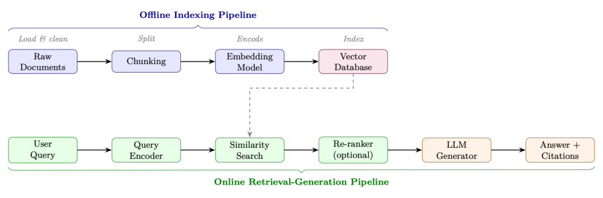
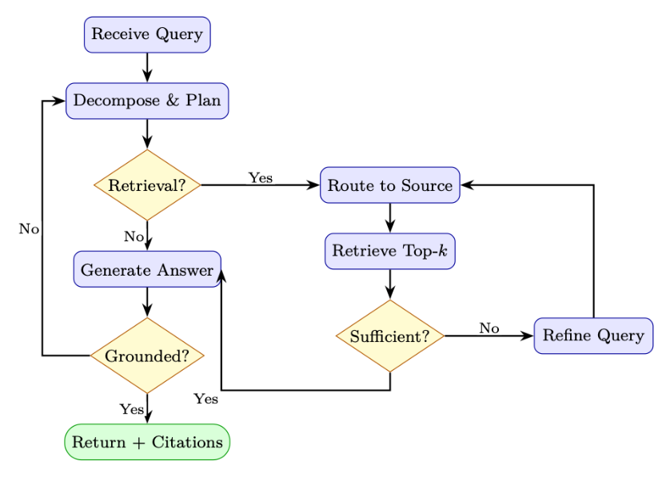

# 第 16 章 检索增强生成(RAG)

检索增强生成(Retrieval-Augmented Generation, RAG)[128] 已成为将大语言模型(Large Language Model, LLM)部署到生产环境中最具实际影响力的技术之一。RAG 不再仅仅依赖训练阶段编码进模型权重中的知识,而是为 LLM 配备了一种动态、可更新的外部记忆——从而在各类知识密集型任务上提供准确、有据可查且可验证的回答。

## 16.1 动机与问题陈述

### 为什么 LLM 需要外部知识

大语言模型以参数化方式存储知识——在训练过程中压缩进数十亿个权重之中。这带来了三个根本性局限:

1. 幻觉(Hallucination):当查询超出模型的可靠知识边界时,模型会自信地生成听起来合理但实际上在事实上错误的陈述。
2. 知识时效性(Knowledge Staleness):训练数据存在截止日期;模型无法知晓训练之后发生的事件、论文或产品更新。
3. 领域特异性(Domain Specificity):通用模型对专有代码库、内部文档、专门法规或企业数据缺乏深入的知识。

### 16.1.1 参数化与非参数化知识

我们可以把这两种知识来源之间的区别形式化。令 $M_\theta$ 表示参数为 $\theta$ 的语言模型,令 $D = \{d_1, d_2, \dots, d_N\}$ 为外部文档语料库。在每种范式下,给定查询 $q$ 时生成答案 $a$ 的概率为:

$$
P_\text{parametric}(a \mid q) = P_{M_\theta}(a \mid q) \tag{16.1}
$$

$$
P_\text{RAG}(a \mid q, D) = \sum_{d \in D} P_{M_\theta}(a \mid q, d)\, P_\text{ret}(d \mid q, D) \tag{16.2}
$$

其中 $P_\text{ret}(d \mid q, D)$ 是文档上的检索分布。RAG 通过对检索到的证据进行边际化(marginalize),将生成过程建立在非参数化知识之上。

> **图书馆的类比**
>
> 可以把参数化 LLM 想象成一位背诵了一整座巨型图书馆、但已经毕业多年的学者。RAG 则给这位学者发了一张借书证——他可以实时查阅资料、引用出处,并在需要核实参考而不是凭记忆猜测时,坦然承认自己需要查证。

### 16.1.2 何时使用 RAG、微调与长上下文

表 16.1:决策指南:RAG vs. 微调 vs. 长上下文

| 判断标准 | RAG | 微调 | 长上下文 | RAG + FT |
|---|---|---|---|---|
| 知识频繁更新 | ✓ | × | × | ✓ |
| 需要引用/依据 | ✓ | × | ✓ | ✓ |
| 专有大型语料 | ✓ | × | × | ✓ |
| 适配风格/格式 | × | ✓ | × | ✓ |
| 教授新的推理能力 | × | ✓ | × | ✓ |
| 语料可装入上下文窗口 | × | × | ✓ | × |
| 要求低延迟 | × | ✓ | × | × |

> **常见误解**
>
> RAG 并非微调(fine-tuning)的替代品。微调教模型如何推理和回应;RAG 提供推理的对象(资料)。二者是互补的。一个经过良好指令微调的模型,会比基座模型更有效地利用检索到的上下文。

## 16.2 RAG 核心架构

一个标准的 RAG 系统包含两个阶段:一条离线索引流水线(处理并存储文档)和一条在线检索-生成流水线(响应查询)。

### 16.2.1 完整流水线示意



### 16.2.2 索引流水线

**文档加载(Document Loading)。** 文档以异构格式(PDF、HTML、Markdown、DOCX、代码)到达。加载器提取干净的文本并保留元数据(来源 URL、页码、节标题、时间戳),这些元数据将与嵌入(embedding)一起存储,以便后续过滤和引用。

**分块(Chunking)。** 长文档必须切分成既能装入嵌入模型上下文窗口(通常为 512 个 token)、又在语义上连贯的分块(chunk)。分块策略是 RAG 系统设计中影响最大的决策之一(见 16.4 节)。

**嵌入(Embedding)。** 每个分块 $c_i$ 被嵌入模型 $f_\phi$ 编码为一个稠密向量 $e_i = f_\phi(c_i) \in \mathbb{R}^d$。这些向量连同原始文本和元数据一起存储到向量数据库中。

### 16.2.3 检索

给定查询 $q$,检索步骤将其编码为 $\mathbf{q} = f_\phi(q)$,并通过余弦相似度找到 $k$ 个最相似的分块:

$$
\text{sim}(\mathbf{q}, e_i) = \frac{\mathbf{q} \cdot e_i}{\lVert \mathbf{q} \rVert\, \lVert e_i \rVert} \tag{16.3}
$$

返回 top-$k$ 分块 $C_k = \{c_{(1)}, \dots, c_{(k)}\}$ 作为上下文。

### 16.2.4 生成

检索到的分块被注入到提示(prompt)模板中:

```python
SYSTEM_PROMPT = """You are a helpful assistant. Answer the
question using ONLY the provided context. If the context
does not contain enough information, say so explicitly. Cite your
sources using [Doc N] notation."""

def build_rag_prompt(query: str, chunks: list[dict]) -> str:
    context_str = "\n\n".join(
        f"[Doc {i+1}] (Source: {c['source']}, Page: {c.get('page', 'N/A')})\n{c['text']}"
        for i, c in enumerate(chunks)
    )
    return f"""{SYSTEM_PROMPT}
Context:
{context_str}
Question: {query}
Answer:"""
```

代码清单 16.1:标准 RAG 提示模板

## 16.3 检索方法

### 16.3.1 稀疏检索:BM25 与 TF-IDF

稀疏检索(sparse retrieval)方法将文档和查询表示为词表(vocabulary)上的高维稀疏向量。给定含词条 $t_1, \dots, t_n$ 的查询 $q$,文档 $d$ 的经典 BM25 打分函数 [273] 为:

$$
\text{BM25}(d, q) = \sum_{i=1}^{n} \text{IDF}(t_i) \cdot \frac{f(t_i, d) \cdot (k_1 + 1)}{f(t_i, d) + k_1 \cdot \left(1 - b + b \cdot \frac{|d|}{\text{avgdl}}\right)} \tag{16.4}
$$

其中 $f(t_i, d)$ 是词频(term frequency),$|d|$ 是文档长度,avgdl 是平均文档长度,$k_1 \in [1.2, 2.0]$、$b = 0.75$ 是可调参数。

> **稀疏检索依然胜出的情形**
>
> - 精确关键词匹配:产品代码、错误代码、专有名词、罕见词条
> - 低资源领域:稠密模型训练数据不足
> - 可解释性:容易调试某篇文档为何被检索到
> - 速度:无需 GPU;借助倒排索引可扩展到数十亿文档
> - 词表外(OOV)词条:嵌入训练时未曾见过的新术语

### 16.3.2 稠密检索:DPR

稠密段落检索(Dense Passage Retrieval, DPR)[274] 使用两个独立的基于 BERT 的编码器——查询编码器 $E_Q$ 和段落编码器 $E_P$——通过对比损失(contrastive loss)训练,将相关的查询-段落对在嵌入空间中拉近。

**双编码器(Bi-Encoder)架构。**

$$
\text{sim}(q, p) = E_Q(q)^\top E_P(p) \tag{16.5}
$$

**基于批次内负样本的训练。** 给定一个含 $B$ 个查询-段落对的批次 $\{(q_i, p_i^+)\}_{i=1}^{B}$,对比损失将批次中其余所有段落视为负样本:

$$
\mathcal{L}_\text{DPR} = -\frac{1}{B} \sum_{i=1}^{B} \log \frac{\exp\left(E_Q(q_i)^\top E_P(p_i^+) / \tau\right)}{\sum_{j=1}^{B} \exp\left(E_Q(q_i)^\top E_P(p_j) / \tau\right)} \tag{16.6}
$$

其中 $\tau$ 是温度超参数。难负样本(hard negatives,即字面相似但语义无关的段落)对训练强检索器至关重要。

**近似最近邻搜索。** 在大规模场景下,对数百万嵌入做穷举搜索不可行。FAISS [275](Facebook AI Similarity Search)提供了高效的近似最近邻(Approximate Nearest Neighbor, ANN)搜索,常用技术包括:

- IVF(倒排文件索引,Inverted File Index):将向量聚类到 Voronoi 单元中;只搜索单元附近的区域
- HNSW(分层可导航小世界图,Hierarchical Navigable Small World)[276]:基于图的索引,$O(\log N)$ 搜索复杂度
- PQ(乘积量化,Product Quantization):压缩向量以降低内存占用

### 16.3.3 混合检索与倒数排名融合

混合检索(hybrid retrieval)结合稀疏与稠密得分。一种简单的线性组合为:

$$
s_\text{hybrid}(d, q) = \alpha \cdot s_\text{dense}(d, q) + (1 - \alpha) \cdot s_\text{sparse}(d, q) \tag{16.7}
$$

然而,来自不同系统的得分并不可直接比较。倒数排名融合(Reciprocal Rank Fusion, RRF)[277] 通过对排名(而非得分)操作来规避这一问题:

$$
\text{RRF}(d) = \sum_{r \in R} \frac{1}{k + \text{rank}_r(d)} \tag{16.8}
$$

其中 $R$ 是排名列表的集合(例如 BM25 排名和稠密检索排名),$\text{rank}_r(d)$ 是文档 $d$ 在列表 $r$ 中的排名,$k = 60$ 是平滑常数,用于减弱排名极高的文档的影响。

> **RRF 计算示例**
>
> 假设 BM25 将文档 $d$ 排在第 3 位,稠密检索将其排第 7 位。取 $k = 60$:
>
> $$\text{RRF}(d) = \frac{1}{60 + 3} + \frac{1}{60 + 7} = \frac{1}{63} + \frac{1}{67} \approx 0.0159 + 0.0149 = 0.0308$$
>
> 一份在两个列表中都排第 1 的文档,得分约为 $\frac{1}{61} + \frac{1}{61} \approx 0.0328$。

### 16.3.4 学习型稀疏检索:SPLADE 与 SPLADEv2

**为什么需要 SPLADE?**

传统稀疏检索(BM25)依赖精确的词面匹配——当查询说"car"而文档说"automobile"时它就会失败。稠密检索(DPR)能捕获语义,但丧失了可解释性、查询时需要 GPU,且索引很大。SPLADE 兼得两者之长:既有稀疏向量(像 BM25 一样可快速用倒排索引查找),又具备学习到的语义扩展能力(像稠密模型一样处理同义词和相关概念)。

**SPLADE(v1)——核心思想。** SPLADE(Sparse Lexical and Expansion Model,稀疏词法与扩展模型)[278] 使用预训练的掩码语言模型(masked language model,如 BERT/DistilBERT),为每个文档或查询在整个词表上生成一个稀疏向量。关键洞见在于:MLM(masked language model)头部已经知道哪些词与文本中每个位置在语义上相关——SPLADE 把这一知识重新用作词项重要性权重。

**架构。** 给定输入文本 $x = [x_1, \dots, x_n]$:

1. 通过 Transformer 编码器,经 MLM 头得到上下文表征 $H \in \mathbb{R}^{n \times |V|}$
2. 跨位置聚合并施加一个饱和激活函数:

$$
w_t(x) = \log\left(1 + \text{ReLU}\left(\max_{i \in [1, n]} H_i[t]\right)\right) \tag{16.9}
$$

其中 $H_i[t]$ 是在输入位置 $i$ 处词表词条 $t$ 的 MLM logit。

- $\log(1 + \cdot)$ 的饱和防止任何单一词项占主导(类似 BM25 中的 TF 饱和)
- ReLU 保证稀疏性——大多数词表词条权重为零
- 跨位置的 max pooling 捕获每个词项从文本任意位置来的最强信号
- 扩展(Expansion):即便原文中不存在的词项也可能得到非零权重(例如,一篇关于"neural networks"的文档可能为"deep learning""AI""backpropagation"获得权重)

**打分。** 查询与文档各自被映射为稀疏向量 $w_q, w_d \in \mathbb{R}^{|V|}$。相关性得分是简单的点积:

$$
s(q, d) = \sum_{t \in V} w_q^t \cdot w_d^t \tag{16.10}
$$

由于两个向量都很稀疏(在 30K 词表中通常只有 20–200 个非零项),这一计算可以用标准倒排索引(Lucene、Anserini)高效完成——查询时无需 GPU。

**训练。** SPLADE 用对比学习(批次内负样本 + 难负样本)外加两个正则项训练:

$$
\mathcal{L} = \mathcal{L}_\text{contrastive} + \lambda_q \lVert w_q \rVert_1 + \lambda_d \lVert w_d \rVert_1 \tag{16.11}
$$

对查询和文档表征的 L1 惩罚鼓励稀疏性——若没有它们,模型会学出稠密表征,从而违背初衷。

**SPLADEv2——关键改进。** SPLADEv2 [279] 引入了若干显著提升效率与效果的改进:

1. **从交叉编码器蒸馏:** SPLADEv2 不再仅在二元相关性标签上训练,而是用交叉编码器(cross-encoder)教师模型(如 MonoT5 [280])提供软相关性得分。这给出更丰富的训练信号:

$$
\mathcal{L}_\text{distill} = \text{KL}\left(\sigma(s_\text{student}) \,\|\, \sigma(s_\text{teacher})\right) \tag{16.12}
$$

2. **分离的查询/文档编码器:** SPLADEv2 对查询与文档使用不同的稀疏目标。查询被鼓励更稀疏(查找更快),而文档可以略稠密(离线预计算):

$$
\lambda_q > \lambda_d \quad (\text{例如 } \lambda_q = 3 \times 10^{-4},\ \lambda_d = 1 \times 10^{-4}) \tag{16.13}
$$

3. **FLOPS 正则化:** SPLADEv2 不再使用简单 L1,而是引入一个 FLOPS 感知的正则项,直接惩罚预期的检索开销:

$$
\mathcal{L}_\text{FLOPS} = \sum_{t \in V} (a_q^t)^2 + \sum_{t \in V} (a_d^t)^2 \tag{16.14}
$$

其中 $a_t$ 是词条 $t$ 在整个批次上的平均激活。这惩罚那些在许多文档中都非零的词条(高倒排表长度 = 检索慢)。

4. **高效骨干网络:** 使用 DistilBERT(66M 参数)而非 BERT-base(110M),在质量损失极小的情况下将编码时间减半。

表:SPLADE vs. SPLADEv2 对比

| 方面 | SPLADE (v1) | SPLADEv2 |
|---|---|---|
| 训练信号 | 二元相关性 + 难负样本 | 交叉编码器蒸馏 |
| 稀疏性控制 | L1 正则化 | FLOPS 感知正则化 |
| 查询/文档对称性 | 相同编码器,相同 λ | 非对称(查询更稀疏) |
| 骨干网络 | BERT-base (110M) | DistilBERT (66M) |
| MRR@10(MS MARCO [281]) | 34.0 | 36.8 |
| 平均非零词条/文档 | ~200 | ~120(稀疏度高 40%) |

> **何时使用 SPLADE**
>
> - 在以下情形使用 SPLADE/v2:查询时无需 GPU 即可做语义检索;基础设施已有倒排索引(Elasticsearch、Lucene);或需要可解释的相关性得分(可以查看哪些扩展词条命中)。
> - 在以下情形偏好稠密检索:有 GPU 预算用于查询编码;需要多语言支持(稠密模型迁移更好);或查询非常短(1–2 个词,扩展帮助不大)。
> - 最佳实践:把 SPLADEv2 作为第一阶段检索器 + 交叉编码器对 top-$k$ 做重排序。这样在更低延迟下达到或超过稠密检索流水线的效果。

### 16.3.5 ColBERT:后交互

ColBERT [282] 将查询和文档编码为词元级(token-level)嵌入的集合,并使用 MaxSim 算子打分:

$$
s(q, d) = \sum_{i \in |q|} \max_{j \in |d|} q_i^\top d_j \tag{16.15}
$$

这种后交互(late interaction)机制比单向量双编码器更具表达力,同时比交叉编码器快得多——因为文档嵌入是离线预计算的。

**架构。** 查询编码器 $E_Q$ 和文档编码器 $E_D$ 都是基于 BERT 的模型,产生逐词元的嵌入(而非单一的 [CLS] 向量)。每个词元嵌入通过一个线性层投影到更低维度(通常为 128):

$$
q_i = \text{Linear}(E_Q(q)_i) \in \mathbb{R}^{128}, \quad i = 1, \dots, |q| \tag{16.16}
$$

$$
d_j = \text{Linear}(E_D(d)_j) \in \mathbb{R}^{128}, \quad j = 1, \dots, |d| \tag{16.17}
$$

**训练。** ColBERT 在正样本与负样本段落上用成对的 softmax 交叉熵损失训练。给定查询 $q$、正样本段落 $d^+$ 和一组负样本段落 $\{d_1^-, \dots, d_N^-\}$:

$$
\mathcal{L}_\text{ColBERT} = -\log \frac{\exp(s(q, d^+))}{\exp(s(q, d^+)) + \sum_{k=1}^{N} \exp(s(q, d_k^-))} \tag{16.18}
$$

其中 $s(q, d)$ 是公式 16.15 的 MaxSim 得分。负样本来源:

- 批次内负样本:同一训练批次中的其他段落(免费、丰富)
- 难负样本:BM25 检索得到的字面相似但语义无关的段落(对质量影响最大)
- 蒸馏负样本(ColBERTv2 [283]):用交叉编码器教师挖掘最难的负样本,并将其得分蒸馏进 ColBERT

**索引与服务化。** 索引时,所有文档词元嵌入被预计算并存储(ColBERTv2 中可选残差量化压缩)。查询时,只对查询词元做实时编码,MaxSim 在存储的文档嵌入上计算。这种分离带来:

- 离线文档编码:编码一次,服务多次查询
- PLAID 索引 [283]:对文档嵌入聚类,用质心做初始候选检索,再仅对候选计算精确 MaxSim——将延迟降低 5–10 倍
- 索引大小:每篇文档 $|d| \times 128$ 个浮点数(比单向量方法大,但量化后可压缩到约 2 字节/维)

### 16.3.6 检索方法对比

表 16.2:跨关键维度的检索方法对比

| 方法 | 延迟 | 准确率 | 索引大小 | GPU | 最适合 |
|---|---|---|---|---|---|
| TF-IDF [284] | 极低 | 低 | 小 | 否 | 基线、精确匹配 |
| BM25 [273] | 极低 | 中 | 小 | 否 | 关键词搜索、罕见词条 |
| DPR / 双编码器 [274] | 低 | 高 | 大 | 是 | 语义相似度 |
| SPLADE [278] | 低 | 高 | 中 | 是 | 兼顾准确率与速度 |
| ColBERT [282] | 中 | 很高 | 很大 | 是 | 高准确率检索 |
| 交叉编码器 [285] | 高 | 最高 | N/A | 是 | top-k 重排序 |
| 混合(RRF)[277] | 低 | 很高 | 大 | 是 | 生产系统 |

## 16.4 分块策略

分块(chunking)是把文档切分成片段的过程,这些片段需要:(1) 足够小,能装入嵌入模型的上下文窗口;(2) 在语义上连贯;(3) 包含足够的上下文,以便单独被检索到时仍然有用。

### 16.4.1 带重叠的定长分块

最简单的策略:每隔 $W$ 个 token 切分,并在相邻分块之间保留 $O$ 个 token 的重叠。

```python
from langchain.text_splitter import RecursiveCharacterTextSplitter

splitter = RecursiveCharacterTextSplitter(
    chunk_size=512,         # 每个分块的 token 数
    chunk_overlap=64,       # 重叠以保留跨边界的上下文
    length_function=len,
    separators=["\n\n", "\n", ". ", " ", ""]
)
chunks = splitter.split_documents(documents)
```

代码清单 16.2:带重叠的定长分块

重叠公式:对于一个长度为 $L$ 个 token 的文档,分块数为:

$$
N_\text{chunks} = \left\lceil \frac{L - O}{W - O} \right\rceil \tag{16.19}
$$

### 16.4.2 语义分块

语义分块(semantic chunking)不在固定间隔切分,而是通过测量相邻句子之间的嵌入相似度,在检测到的主题边界处切分:

```python
from langchain_experimental.text_splitter import SemanticChunker
from langchain_openai import OpenAIEmbeddings

chunker = SemanticChunker(
    embeddings=OpenAIEmbeddings(),
    breakpoint_threshold_type="percentile",   # 或 "standard_deviation"
    breakpoint_threshold_amount=95,           # 在相似度差异最大的前 5% 处切分
)
chunks = chunker.split_documents(documents)
```

代码清单 16.3:基于嵌入相似度的语义分块

### 16.4.3 文档结构感知分块

对于结构化文档(Markdown、HTML、代码),在自然边界处切分:

- Markdown:在 `##` 标题处切分,保留节上下文
- HTML:在 `<section>`、`<article>`、`<p>` 标签处切分
- 代码:在函数/类定义处切分,每个分块保留 import
- 表格:将整张表格作为单个分块;绝不在行中间切分

### 16.4.4 父子分块

一种强大的模式,将检索粒度与生成上下文解耦:

1. 索引小块子分块(例如 128 个 token)以实现精确检索
2. 返回大块父分块(例如 512 个 token)给 LLM,以获得更丰富的上下文

```python
from langchain.retrievers import ParentDocumentRetriever
from langchain.storage import InMemoryStore
from langchain.text_splitter import RecursiveCharacterTextSplitter

parent_splitter = RecursiveCharacterTextSplitter(chunk_size=2000)
child_splitter = RecursiveCharacterTextSplitter(chunk_size=400)

retriever = ParentDocumentRetriever(
    vectorstore=vectorstore,
    docstore=InMemoryStore(),
    child_splitter=child_splitter,
    parent_splitter=parent_splitter,
)
retriever.add_documents(documents)
```

代码清单 16.4:使用 LangChain 的父子分块

### 16.4.5 分块大小的经验指南

表 16.3:按用例给出的分块大小建议

| 用例 | 建议分块大小 | 重叠 |
|---|---|---|
| 事实问答(精确事实) | 128–256 token | 20–32 token |
| 摘要/综合 | 512–1024 token | 64–128 token |
| 代码检索 | 整个函数 | 无 |
| 法律/法规文档 | 段落级 | 1 句 |
| 对话/聊天 | 256–512 token | 32–64 token |

## 16.5 高级 RAG 模式

### 16.5.1 查询变换

原始用户查询往往含糊、过短,或与文档语言匹配不佳。查询变换(query transformation)技术在搜索步骤之前改进检索。

**HyDE(假设性文档嵌入,Hypothetical Document Embeddings)[286]。** 不直接对查询做嵌入,而是先生成一个假设性答案,再对其嵌入:

$$
\hat{d} = \text{LLM}(q), \quad e_\text{query} = f_\phi(\hat{d}) \tag{16.20}
$$

直觉是:假设性答案与真实文档处于相同的语体(register),从而缩小查询-文档分布之间的差距。

**回退提示(Step-Back Prompting)。** 对于具体问题,先生成一个更通用的"回退(step-back)"问题,对两者都检索,再合并上下文。例如:"乙醇在 2 个大气压下的沸点是多少?" → 回退:"哪些因素影响液体的沸点?"

**多查询生成(Multi-Query Generation)。** 生成 $M$ 个多样的查询改写,对每个都做检索,再对结果取并集:

```python
from langchain.retrievers.multi_query import MultiQueryRetriever
from langchain_openai import ChatOpenAI

retriever = MultiQueryRetriever.from_llm(
    retriever=vectorstore.as_retriever(search_kwargs={"k": 5}),
    llm=ChatOpenAI(temperature=0.7),
    include_original=True,   # 同时对原始查询检索
)
# 内部生成 3 个查询变体,逐个检索,去重
docs = retriever.get_relevant_documents(query)
```

代码清单 16.5:多查询检索

### 16.5.2 重排序

在初始检索得到 top-$k$ 候选之后,交叉编码器重排序器(cross-encoder re-ranker)联合地(同时关注查询和文档)对每个查询-文档对打分,产生准确得多但延迟更高的相关性得分:

$$
s_\text{cross}(q, d) = \text{CrossEncoder}([q; d]) \tag{16.21}
$$

交叉编码器不能用于第一阶段检索(没有可预计算的文档嵌入),但非常适合对较小的候选集(通常 $k = 20$–$100$)做重排序。

```python
from sentence_transformers import CrossEncoder

reranker = CrossEncoder("BAAI/bge-reranker-large")

def rerank(query: str, docs: list[str], top_n: int = 5) -> list[str]:
    pairs = [(query, doc) for doc in docs]
    scores = reranker.predict(pairs)
    ranked = sorted(zip(scores, docs), reverse=True)
    return [doc for _, doc in ranked[:top_n]]
```

代码清单 16.6:使用 BGE 的交叉编码器重排序

### 16.5.3 上下文压缩

检索到的分块中常包含相关段落周围无关的句子。上下文压缩(contextual compression)用 LLM 只抽取相关的部分:

```python
from langchain.retrievers import ContextualCompressionRetriever
from langchain.retrievers.document_compressors import LLMChainExtractor

compressor = LLMChainExtractor.from_llm(llm)
compression_retriever = ContextualCompressionRetriever(
    base_compressor=compressor,
    base_retriever=vectorstore.as_retriever()
)
compressed_docs = compression_retriever.get_relevant_documents(query)
```

代码清单 16.7:基于 LLM 的上下文压缩

### 16.5.4 Self-RAG

Self-RAG [287] 训练单个模型来:(1) 决定是否检索;(2) 在有/无检索的情况下生成;(3) 使用特殊的反思词元(reflection tokens)评判自己的输出:

- `[Retrieve]`:模型是否应检索更多段落?
- `[IsRel]`:检索到的段落是否与查询相关?
- `[IsSup]`:生成的陈述是否由检索到的段落所支持?
- `[IsUse]`:整体回答是否有用?

模型被端到端训练,在生成回答的同时预测这些词元,从而实现对检索和自我评分的细粒度控制。

### 16.5.5 CRAG:纠错式 RAG

CRAG(Corrective RAG)[288] 增加一个检索评估器,对检索到的文档评分并触发纠错动作:

1. 检索 top-$k$ 文档
2. 对每个文档评分:正确(Correct)/含糊(Ambiguous)/错误(Incorrect)
3. 如果所有文档都是错误或含糊 → 回退到网络搜索
4. 如果部分文档正确 → 进行知识精炼(剥离无关句子)
5. 从精炼后的上下文生成答案

### 16.5.6 自适应 RAG

自适应 RAG(Adaptive RAG)[289] 根据预测的复杂度把查询路由到不同的检索策略:

- 不检索:模型可从参数回答的简单事实性查询
- 单步 RAG:对中等复杂查询的标准"先检索后生成"
- 多步 RAG:对复杂多跳(multi-hop)问题的迭代式检索

一个在查询复杂度标签上训练的轻量分类器,对每个到来的查询进行路由。

### 16.5.7 图 RAG

微软的 Graph RAG [290] 从文档语料构建知识图谱,并用社区检测生成层次化摘要:

1. 实体抽取:LLM 从每个分块抽取实体和关系
2. 图构建:构建图 $G = (V, E)$,节点是实体,边是关系
3. 社区检测:应用 Leiden 算法在多个分辨率下发现社区
4. 社区摘要:LLM 为每个社区生成一份摘要
5. 查询:对全局查询,在社区摘要上做 map-reduce;对局部查询,使用标准向量搜索

> **何时使用 Graph RAG**
>
> Graph RAG 擅长需要跨多份文档综合信息的全局查询("这个语料库的主要主题是什么?"),但构建和维护成本很高。对于局部查询("文档 X 关于主题 Y 说了什么?"),标准 RAG 更合适。

### 16.5.8 RAG-Fusion

RAG-Fusion [291] 从原始查询生成多个搜索查询,对每个查询做检索,再用 RRF(公式 16.8)融合这些排名列表:

```python
def reciprocal_rank_fusion(ranked_lists: list[list[str]], k: int = 60) -> list[str]:
    """使用 RRF 融合多个已排名的文档列表。"""
    scores: dict[str, float] = {}
    for ranked in ranked_lists:
        for rank, doc_id in enumerate(ranked, start=1):
            scores[doc_id] = scores.get(doc_id, 0.0) + 1.0 / (k + rank)
    return sorted(scores, key=scores.get, reverse=True)

def rag_fusion(query: str, retriever, llm, n_queries: int = 4) -> str:
    # 步骤 1:生成查询变体
    variants = generate_query_variants(query, llm, n=n_queries)
    # 步骤 2:对每个变体检索
    all_ranked = [retriever.retrieve(q) for q in [query] + variants]
    # 步骤 3:用 RRF 融合
    fused_docs = reciprocal_rank_fusion(all_ranked)
    # 步骤 4:生成答案
    return generate_answer(query, fused_docs[:5], llm)
```

代码清单 16.8:使用 RRF 的 RAG-Fusion

## 16.6 高效 RAG 解码:REFRAG

RAG 的一个实际瓶颈是解码延迟:拼接到 LLM 上下文中的检索段落往往很长但相关性稀疏,从而推高了首 token 时间(Time-To-First-Token, TTFT)和 KV-cache 内存。REFRAG [292] 观察到,由于检索段落是独立来源的(在重排序阶段通过多样性或去重获得),它们的注意力模式呈块对角(block-diagonal)形态——大多数跨段落的注意力接近于零。这种稀疏性意味着解码阶段对 RAG 上下文的大部分计算都是不必要的。

**压缩-感知-扩展(Compress–Sense–Expand)框架。** REFRAG 通过一个三阶段解码策略利用这一结构:

1. **压缩(Compress):** 用紧凑摘要(例如每个段落块做均值池化的 keys/values)替换检索段落的完整 KV 表征,大幅降低内存。
2. **感知(Sense):** 在每个解码步,对压缩表征做轻量级注意力,识别哪些段落块与当前 token 相关。
3. **扩展(Expand):** 仅对选中的块重建完整 KV 条目,在稀疏的活跃集合上做精确注意力。

**结果。** 在基于 LLaMA 的模型上,REFRAG 取得了高达 30.85 倍的 TTFT 加速(比此前的稀疏注意力基线提升 3.75 倍),且困惑度(perplexity)无损失。它还能在固定内存预算下将有效上下文长度扩展 16 倍。这些增益在 RAG、多轮对话和长文档摘要任务上均成立。

> **为什么 REFRAG 对智能体式 RAG 很重要**
>
> 智能体式 RAG(见 16.7 节)每个查询需要多轮检索,延迟会累积。像 REFRAG 这样的高效解码方法是关键基础设施:它们通过保证每一轮的解码开销相对上下文长度是次线性的,使迭代式的"检索-推理-生成"循环在大规模下切实可行。

## 16.7 智能体式 RAG

### 16.7.1 动机:静态 RAG 的局限

标准 RAG 遵循固定的"先检索后生成"模式。它在以下场景失效:

- 多跳问题:"在 2023 年收购 OpenAI 主要竞争对手的那家公司由谁创立?"需要链接多次检索
- 含糊查询:正确的检索策略取决于已经检索到了什么
- 异构来源:不同子问题需要不同的知识库
- 迭代式精炼:初次检索可能表明需要一个不同的查询

> **将 RAG 视为马尔可夫决策过程**
>
> 智能体式 RAG(Agentic RAG)把检索建模为一个序贯决策问题。状态(state)是当前上下文(查询 + 迄今检索到的文档);动作(action)包括检索、推理、生成和停止;奖励(reward)是答案的正确性。智能体学习一个策略,决定何时检索、检索什么。

### 16.7.2 智能体式 RAG 架构



### 16.7.3 多源路由

一个智能体式 RAG 系统可以把子查询路由到专门的知识源。核心洞见是:不同类型的问题需要不同的检索后端——没有任何单一索引在所有方面都占优。

**为什么要路由?**

设想一位金融分析师助手处理四个查询:

- "我们公司的带薪假(PTO)政策是什么?" → 向量数据库(内部文档)
- "美联储昨天宣布了什么?" → 网络搜索(实时)
- "按地区显示 Q3 营收" → SQL 数据库(结构化数据)
- "我们的鉴权中间件如何验证 token?" → 代码索引(代码库)

从单一索引做扁平检索的做法,要么错失答案,要么返回无关段落。路由在检索开始之前,就为合适的子问题选择合适的工具。

**路由策略。** 按复杂度递增的三种主要方法:

1. **基于规则的路由。** 关键词触发(例如 SQL 关键词 → 数据库,URL 模式 → 网络)。快速且可解释,但对含糊查询脆弱。

2. **基于分类器的路由。** 一个轻量模型(例如微调的 BERT 分类器,或在查询嵌入上的逻辑回归)预测最佳来源。低延迟(<10 ms),可在路由日志上训练,但需要标注数据。

3. **基于 LLM 的路由。** LLM 本身在一次结构化输出调用中决定来源(见下方代码清单)。最灵活——能处理新颖的查询类型并解释其推理——但增加一次 LLM 调用的延迟。

> **路由即学习到的策略**
>
> 多源路由在简单情形下是一个分类问题,在最丰富情形下是一个规划问题。当作为强化学习(RL)策略来对待时——其中状态是查询加对话历史、动作是来源选择(以及可选的查询改写)、奖励是下游答案质量——路由器可以通过策略梯度技术(第 8 章)端到端地优化。

**实践考量。**

- 回退链(fallback chains):如果主来源返回低置信度结果,尝试次优来源。
- 并行扇出(parallel fan-out):对含糊查询,同时从多个来源检索,再用倒数排名融合(表 16.2)融合结果。
- 成本感知:网络搜索和 API 调用可能产生费用或受速率限制;路由器应将其纳入考量。
- 可观测性(observability):记录每一条路由决策及其理由——这对调试和再训练至关重要。

```python
from enum import Enum
from pydantic import BaseModel

class KnowledgeSource(str, Enum):
    VECTOR_DB = "vector_db"      # 内部文档
    WEB_SEARCH = "web_search"    # 实时网络
    SQL_DB = "sql_db"            # 结构化数据
    CODE_INDEX = "code_index"    # 代码库
    API = "api"                  # 外部 API

class RouteDecision(BaseModel):
    source: KnowledgeSource
    refined_query: str
    reasoning: str

def route_query(query: str, llm) -> RouteDecision:
    """使用 LLM 决定查询哪个知识源。"""
    prompt = f"""Given the query: "{query}"
Decide which knowledge source to use:
- vector_db: for internal documents, policies, past reports
- web_search: for current events, recent information
- sql_db: for numerical data, statistics, structured records
- code_index: for code examples, API documentation
- api: for real-time data (weather, stock prices, etc.)
Return a JSON with: source, refined_query, reasoning."""
    return llm.with_structured_output(RouteDecision).invoke(prompt)
```

代码清单 16.9:多源智能体式 RAG 路由器

### 16.7.4 完整智能体式 RAG 实现

前面几节介绍了各个组件——路由、检索、评估。一个完整的智能体式 RAG 系统将它们编排成一个有状态节点的图,控制流取决于中间结果。下面的实现使用 LangGraph 把四个节点连成一个循环:

1. **规划(Plan):** 把用户查询分解为子查询(每个信息需求一个)。
2. **检索(Retrieve):** 把每个子查询路由到合适的来源并获取文档。
3. **评估(Evaluate):** 判断累积的上下文是否足以回答原始查询。
4. **生成(Generate):** 综合出最终答案,并附上来自检索文档的引用。

关键设计模式是条件循环:评估之后,智能体要么进入生成(若上下文已足够或迭代预算已耗尽),要么带着精炼后的子查询回到检索。这镜像了 RL 智能体在信息收集动作上的"感知-行动-评估"循环。

```python
from typing import TypedDict, Annotated
from langgraph.graph import StateGraph, END
from langgraph.prebuilt import ToolNode
import operator

class AgentState(TypedDict):
    query: str
    sub_queries: list[str]
    retrieved_docs: Annotated[list[dict], operator.add]
    context_sufficient: bool
    answer: str
    iterations: int
    max_iterations: int

def plan_node(state: AgentState) -> AgentState:
    """将查询分解为子查询。"""
    sub_queries = decompose_query(state["query"])
    return {**state, "sub_queries": sub_queries, "iterations": 0}

def retrieve_node(state: AgentState) -> AgentState:
    """为当前子查询检索文档。"""
    new_docs = []
    for sq in state["sub_queries"]:
        source = route_query(sq)
        docs = retrieve_from_source(sq, source)
        new_docs.extend(docs)
    return {**state, "retrieved_docs": new_docs,
            "iterations": state["iterations"] + 1}

def evaluate_node(state: AgentState) -> AgentState:
    """评估检索到的上下文是否充分。"""
    sufficient = evaluate_context_sufficiency(
        query=state["query"],
        docs=state["retrieved_docs"]
    )
    return {**state, "context_sufficient": sufficient}

def generate_node(state: AgentState) -> AgentState:
    """从检索到的上下文生成答案。"""
    answer = generate_with_citations(
        query=state["query"],
        docs=state["retrieved_docs"]
    )
    return {**state, "answer": answer}

def should_retrieve(state: AgentState) -> str:
    if state["context_sufficient"]:
        return "generate"
    if state["iterations"] >= state["max_iterations"]:
        return "generate"   # 放弃,用手头有的内容生成
    return "retrieve"

# 构建图
workflow = StateGraph(AgentState)
workflow.add_node("plan", plan_node)
workflow.add_node("retrieve", retrieve_node)
workflow.add_node("evaluate", evaluate_node)
workflow.add_node("generate", generate_node)
workflow.set_entry_point("plan")
workflow.add_edge("plan", "retrieve")
workflow.add_edge("retrieve", "evaluate")
workflow.add_conditional_edges("evaluate", should_retrieve,
                               {"retrieve": "retrieve", "generate": "generate"})
workflow.add_edge("generate", END)
agent = workflow.compile()

# 运行
result = agent.invoke({
    "query": "What were the main causes of the 2023 banking crisis?",
    "max_iterations": 3,
    "retrieved_docs": [],
    "iterations": 0,
})
```

代码清单 16.10:基于 LangGraph 的智能体式 RAG

### 16.7.5 工具增强 RAG

智能体式 RAG 可以把检索与计算工具结合起来:

```python
from langchain.agents import create_tool_calling_agent, AgentExecutor
from langchain.tools import tool

@tool
def search_documents(query: str) -> str:
    """搜索内部文档知识库。"""
    docs = vectorstore.similarity_search(query, k=5)
    return "\n\n".join(d.page_content for d in docs)

@tool
def query_database(sql: str) -> str:
    """在分析数据库上执行 SQL 查询。"""
    return db.run(sql)

@tool
def web_search(query: str) -> str:
    """搜索网络获取当前信息。"""
    return tavily_client.search(query)

@tool
def execute_python(code: str) -> str:
    """执行 Python 代码进行计算。"""
    return python_repl.run(code)

tools = [search_documents, query_database, web_search, execute_python]
agent = create_tool_calling_agent(llm, tools, prompt)
executor = AgentExecutor(agent=agent, tools=tools, verbose=True)
```

代码清单 16.11:带 SQL 与检索的工具增强 RAG

### 16.7.6 Search-R1:RL 训练的智能体式 RAG

上面这些智能体式 RAG 方法依赖提示工程的编排——智能体的搜索行为由指令控制,而非通过训练习得。Search-R1 [293] 采取了根本不同的路线:它通过强化学习训练 LLM,把"何时搜索、搜索什么、搜索多少次"作为推理过程的一部分来学习。

**核心思想。** Search-R1 扩展了 DeepSeek-R1 [15] 的推理框架,把搜索引擎查询当作 RL 训练循环内的动作。在思维链(chain-of-thought)生成过程中,模型可以发出特殊词元 `<search>query</search>`,触发来自搜索引擎的实时检索。检索结果被注入回推理上下文,模型继续生成。

**形式化设定。** 模型生成一段与搜索动作交错的推理轨迹:

$$\underbrace{\text{think}_1}_{\text{推理}} \to \underbrace{\texttt{<search>}q_1\texttt{</search>}}_{\text{动作}} \to \underbrace{[\text{results}_1]}_{\text{观测}} \to \text{think}_2 \to \texttt{<search>}q_2\texttt{</search>} \to \cdots \to \text{answer}$$

整条轨迹(推理 + 搜索 + 最终答案)由一个终止奖励来评分:最终答案相对于真值标签的正确性。

**训练算法。** Search-R1 使用 GRPO(Group Relative Policy Optimization):

1. 每个问题采样 $N$ 条轨迹,每条可能含 0–5 次搜索调用
2. 实时执行搜索——环境返回真实的搜索引擎结果
3. 评估终止答案的正确性(相对于真值的精确匹配或 F1)
4. 计算组相对优势:$\hat{A}_i = (R_i - \mu_G) / \sigma_G$
5. 用 GRPO 裁剪目标更新策略——强化那些搜索得有效的轨迹

模型学会:

- 不确定时才搜索——避免对已掌握的知识做不必要的搜索
- 构造有效查询——学习能返回相关结果的措辞
- 多次搜索——基于初次结果迭代地精炼查询
- 整合检索到的上下文——用搜索结果支持或修正推理

表 16.4:Search-R1(RL 训练)vs. 基于提示的智能体式 RAG

| 维度 | 基于提示的智能体式 RAG | Search-R1 |
|---|---|---|
| 搜索决策 | 提示/启发式 | 通过 RL 学习 |
| 查询构造 | 提示驱动("rewrite query") | 端到端训练 |
| 搜索次数 | 固定或在推理时由 LLM 决定 | 学习到最优次数 |
| 训练信号 | 无(模型冻结) | 正确性奖励 |
| 搜索整合 | 追加到上下文 | 交织进 CoT |
| 失败恢复 | 重试启发式 | 学习到的回退/改写 |
| 推理开销 | 框架开销(LangGraph) | 原生模型行为 |

**Search-R1 与基于提示的智能体式 RAG 的区别。**

**结果。** 在开放域问答基准(NQ [294]、TriviaQA [295]、HotpotQA [296])上,使用 7B 模型的 Search-R1 超过了:

- 标准 RAG(单次检索)15–20% 准确率
- 基于提示的智能体式 RAG(ReAct 风格)8–12% 准确率
- 接近大得多的模型(70B)配合标准 RAG 的表现

关键洞见是:学习"何时以及如何搜索"比拥有一个知道得更多的更大模型更有价值。一个搜索得当的小模型胜过一个不搜索的大模型。

> **Search-R1:范式转变**
>
> 传统 RAG 问:"给定这条查询,我该检索什么?"(在生成之前做出的流水线决策)。
>
> Search-R1 问:"鉴于我迄今推理到了什么,我还需要更多信息吗?如果需要,哪个具体问题能填补这个空白?"(在生成过程中做出的、学习到的决策)。
>
> 这就好比:一个学生开考前先把教科书翻一遍,而另一个学生在做题时意识到卡住了再临时查阅参考资料。后者更高效、更有针对性。

## 16.8 评估

评估一个 RAG 系统比单独评估检索或生成更难,因为错误可能源自流水线的任一阶段——而且会累积。一个完美的生成器无法弥补无关检索的失误,一个完美的检索器在生成器产生幻觉或无视上下文时也形同虚设。

因此,有效的 RAG 评估在三个层面进行:

1. **检索质量:** 检索器是否找出了正确的段落?(Recall、Precision、MRR、NDCG)
2. **生成质量:** 答案是否正确、忠实于检索到的上下文、且完整?(正确性 Correctness、忠实度 Faithfulness、答案相关性 Answer Relevance)
3. **端到端质量:** 整个系统是否让用户满意?(人类偏好、任务成功率、延迟调整后的效用)

一种常见失败模式是只优化一个层面——例如,用大 $K$ 最大化 Recall@K 会用勉强相关的段落填满上下文,实际上反而降低生成质量。下面的指标既覆盖检索又覆盖生成,使从业者能够诊断瓶颈出在哪个阶段。

### 16.8.1 检索指标

令 $R_K$ 为排名 $K$ 处的已检索文档集合,$R^*$ 为相关文档集合。

**Recall@K。**

$$
\text{Recall@K} = \frac{|R_K \cap R^*|}{|R^*|} \tag{16.22}
$$

**Precision@K。**

$$
\text{Precision@K} = \frac{|R_K \cap R^*|}{K} \tag{16.23}
$$

**平均倒数排名(Mean Reciprocal Rank, MRR)。**

$$
\text{MRR} = \frac{1}{|Q|} \sum_{i=1}^{|Q|} \frac{1}{\text{rank}_i} \tag{16.24}
$$

其中 $\text{rank}_i$ 是查询 $i$ 的第一个相关文档的排名。

**归一化折损累积增益(Normalized Discounted Cumulative Gain, NDCG@K)。**

$$
\text{NDCG@K} = \frac{\text{DCG@K}}{\text{IDCG@K}}, \quad \text{DCG@K} = \sum_{i=1}^{K} \frac{\text{rel}_i}{\log_2(i + 1)} \tag{16.25}
$$

其中 $\text{rel}_i \in \{0, 1, 2, \dots\}$ 是第 $i$ 个结果的分级相关性,IDCG 是理想(完美)的 DCG。

### 16.8.2 生成指标

**忠实度(Faithfulness)。** 衡量生成的答案是否建立在检索到的上下文之上——即答案中的每一项论断都能归因到某篇检索文档。由 LLM 评判器评估:

$$
\text{Faithfulness} = \frac{\text{被上下文支持的论断数}}{\text{答案中总论断数}} \tag{16.26}
$$

**答案相关性(Answer Relevance)。** 衡量答案是否针对了问题。通过从答案生成问题并测量与原始查询的相似度来计算:

$$
\text{AnswerRelevance} = \frac{1}{N} \sum_{i=1}^{N} \cos\left(E(q),\, E(\hat{q}_i)\right) \tag{16.27}
$$

其中 $\hat{q}_i$ 是从答案生成的问题。

**上下文精确率与召回率(Context Precision and Recall)。**

$$
\text{ContextPrecision@K} = \frac{1}{K} \sum_{k=1}^{K} \text{Precision@k} \cdot \mathbb{1}[\text{doc}_k \text{ is relevant}] \tag{16.28}
$$

$$
\text{ContextRecall} = \frac{\text{可归因到上下文的真值论断数}}{\text{总真值论断数}} \tag{16.29}
$$

### 16.8.3 RAGAs 框架

RAGAs(Retrieval Augmented Generation Assessment,检索增强生成评估)[297] 提供了一个使用 LLM 评判器的无参考评估框架:

```python
from ragas import evaluate
from ragas.metrics import (
    faithfulness,
    answer_relevancy,
    context_precision,
    context_recall,
    answer_correctness,
)
from datasets import Dataset

eval_dataset = Dataset.from_dict({
    "question": questions,
    "answer": generated_answers,
    "contexts": retrieved_contexts,   # 列表的列表
    "ground_truth": reference_answers,
})

results = evaluate(
    dataset=eval_dataset,
    metrics=[
        faithfulness,
        answer_relevancy,
        context_precision,
        context_recall,
        answer_correctness,
    ],
)
print(results.to_pandas())
```

代码清单 16.12:RAGAs 评估(v0.1 API;v0.2+ 使用 `user_input`、`response`、`retrieved_contexts`、`reference`)

### 16.8.4 常见失败模式

> **需要监控的 RAG 失败模式**
>
> 1. **检索遗漏(Retrieval Miss):** 相关文档存在于语料中却未被检索到。原因:分块不当、嵌入模型不匹配、查询-文档词表差异。
> 2. **上下文污染(Context Poisoning):** 检索到的文档包含误导性或矛盾信息,导致模型生成错误答案。
> 3. **中间丢失(Lost-in-the-Middle):** LLM 对长上下文的开头和结尾关注更强;中间的相关信息可能被忽略 [298]。
> 4. **过度检索(Over-Retrieval):** 检索到太多分块会稀释相关信号,并增加延迟与成本。
> 5. **检索后仍幻觉(Hallucination Despite Retrieval):** 模型无视检索上下文,从参数化记忆生成,尤其在上下文与训练数据相矛盾时。
> 6. **引用伪造(Citation Fabrication):** 模型把论断归因于并不支持它们的文档。

## 16.9 生产环境考量

### 16.9.1 嵌入模型选择

嵌入模型是 RAG 系统中影响最大的单个组件选择——它决定了检索质量的上限。这一领域进展迅速;表 16.5 总结了当前在成本-质量谱系上的选项。

表 16.5:用于生产 RAG 的嵌入模型(截至 2026 年)。MTEB 得分是检索、分类、聚类和 STS 任务上的总体平均。

| 模型 | 维度 | 最大 token | MTEB 均分 | 访问方式 | 备注 |
|---|---|---|---|---|---|
| **基于 API(托管)** | | | | | |
| Voyage voyage-4-large | 1024* | 32K | — | API | 检索质量最佳 |
| OpenAI text-embedding-3-large | 3072 | 8191 | 64.6 | API | Matryoshka 维度 |
| Cohere embed-english-v3.0 | 1024 | 512 | 64.5 | API | int8/binary 支持 |
| Google text-embedding-005 | 768 | 2048 | — | API | Vertex AI 集成 |
| **开放权重(自托管)** | | | | | |
| nvidia/NV-Embed-v2 [299] | 4096 | 32K | 72.3 | 免费 | MTEB 第一(2024 年 9 月) |
| Alibaba-NLP/gte-Qwen2-7B [300] | 3584 | 32K | 70.2 | 免费 | Apache-2.0,多语言 |
| BAAI/bge-m3 [301] | 1024 | 8192 | 65.0 | 免费 | 稠密 + 稀疏 + 多向量 |
| jinaai/jina-embeddings-v3 | 1024 | 8192 | 66.0 | 免费 | 多语言,LoRA 适配器 |
| BAAI/bge-large-en-v1.5 [302] | 1024 | 512 | 64.2 | 免费 | 成熟,支持良好 |

**选择标准。**

- **领域匹配:** 专用模型(例如代码用的 voyage-code-3、金融用的 voyage-finance-2)在领域任务上可超出通用模型 5–15%。
- **上下文长度:** 支持 32K token 上下文的模型(Voyage-4、NV-Embed-v2)无需分块即可嵌入整篇文档,简化流水线。
- **Matryoshka 嵌入:** 支持灵活输出维度(256–4096)的模型,允许你在服务时权衡质量换取存储/延迟而无需重新编码。
- **量化支持:** 模型层面的 int8 或二值量化(Cohere、Voyage)可将索引大小缩减 4–32 倍,召回率损失极小。
- **多语言:** 对非英语或跨语言 RAG,优先选择显式做多语言训练的模型(BGE-M3、Jina-v3、Voyage-4)。

### 16.9.2 向量数据库对比

表 16.6:用于生产 RAG 系统的向量数据库对比

| 数据库 | 部署方式 | 规模 | 过滤 | 混合检索 | 最适合 |
|---|---|---|---|---|---|
| FAISS¹ | 自托管 | 数十亿 | 有限 | 否 | 研究、离线 |
| Pinecone² | 托管 | 数十亿 | 是 | 是 | Serverless、易上手 |
| Weaviate³ | 两者 | 数十亿 | 是 | 是 | GraphQL、多模态 |
| Chroma⁴ | 自托管 | 数百万 | 是 | 否 | 本地开发、原型 |
| Qdrant⁵ | 两者 | 数十亿 | 是 | 是 | 高性能 |
| Milvus⁶ | 两者 | 数十亿 | 是 | 是 | 企业级、GPU 加速 |
| pgvector⁷ | 自托管 | 数百万 | 是 | 是 | 现有 Postgres 用户 |

¹FAISS:https://github.com/facebookresearch/faiss ²Pinecone:https://www.pinecone.io ³Weaviate:https://weaviate.io ⁴Chroma:https://www.trychroma.com ⁵Qdrant:https://qdrant.tech ⁶Milvus:https://milvus.io ⁷pgvector:https://github.com/pgvector/pgvector

### 16.9.3 延迟优化

1. **预过滤:** 在 ANN 搜索之前,用元数据过滤(日期范围、类别、来源)缩减搜索空间
2. **近似 NN:** 用 HNSW 或 IVF 索引替代精确搜索;以约 1% 召回率损失换取 10 倍加速
3. **嵌入缓存:** 对高频重复查询缓存其嵌入
4. **异步检索:** 并行地从多个来源检索
5. **流式生成:** 在检索完成的同时流式输出 LLM 结果
6. **量化:** 对嵌入使用 int8 或二值量化,以降低内存并提高吞吐量

**异步并行检索。** 上述技术 (3) 与 (4) 自然地组合:缓存查询嵌入,然后并发地向多个后端扇出检索请求。在多源 RAG 系统(16.7 节)中,用户查询可能需要来自向量数据库、关键词索引和网络 API 的结果。串行检索会把延迟累加;并行检索只付出最慢来源的成本。代码清单 16.13 用 Python 的 asyncio 演示了这一模式——`lru_cache` 装饰器确保重复查询完全跳过嵌入模型,而 `asyncio.gather` 同时派发所有来源的查询。

```python
import asyncio
from functools import lru_cache

@lru_cache(maxsize=1024)
def get_cached_embedding(text: str) -> list[float]:
    return embedding_model.embed_query(text)

async def parallel_retrieve(
    query: str,
    sources: list[str],
    k: int = 5
) -> list[dict]:
    """并行地从多个来源检索。"""
    tasks = [
        asyncio.create_task(retrieve_from_source_async(query, src, k))
        for src in sources
    ]
    results = await asyncio.gather(*tasks, return_exceptions=True)
    # 拍平并去重
    all_docs = []
    for r in results:
        if not isinstance(r, Exception):
            all_docs.extend(r)
    return deduplicate_by_content(all_docs)
```

代码清单 16.13:低延迟的异步并行检索

### 16.9.4 增量索引与版本管理

在生产中,文档语料绝非静态——策略会被修订、新报告每天落地、过时内容必须移除。全量重建索引(重新分块、重新嵌入、重新上传)代价高昂,且会造成停机。增量索引(incremental indexing)通过在文档层面施加变更来解决这一问题。

**核心操作。**

- **更新/插入(Upsert):** 当一个文档被创建或更新时,删除该 doc_id 的所有现存分块,对新内容重新分块、嵌入并插入。这保证不会有陈旧片段残留。
- **删除/过期(Delete/Expire):** 按文档 ID 删除分块(显式删除),或按 TTL 删除(对新闻、市场数据等时间敏感来源做自动垃圾回收)。
- **版本跟踪:** 在分块元数据中存储 version 和 indexed_at 时间戳。这支持回滚(从来源恢复先前版本)和可审计性("模型看到的是哪个版本?")。

**一致性挑战。**

- **嵌入模型漂移:** 若升级嵌入模型,新旧向量不兼容。解决方案:(a) 为每个模型版本维护独立索引并在后台迁移;或 (b) 使用 Matryoshka 兼容模型,其中维度截断仍保持兼容性。
- **分块边界偏移:** 改变分块策略会使所有现存分块失效。版本元数据让你能够识别并选择性地重新索引受影响的文档。
- **最终一致性:** 在分布式向量数据库中,新插入的向量可能不会立即可搜索。请把流水线设计为容忍短暂的索引滞后(通常数秒到数分钟)。

**实现。** 代码清单 16.14 展示了一个最小的 `RAGIndexManager` 类,它封装了 upsert 与过期逻辑,适合用于包装任何支持元数据过滤的向量存储。

```python
class RAGIndexManager:
    def __init__(self, vectorstore, metadata_store, chunker, embedder):
        self.vs = vectorstore
        self.meta = metadata_store
        self.chunker = chunker
        self.embedder = embedder

    def upsert_document(self, doc_id: str, content: str,
                        metadata: dict) -> None:
        """添加或更新文档,替换旧分块。"""
        # 删除该文档的现存分块
        self.vs.delete(filter={"doc_id": doc_id})
        # 对新版本分块(vectorstore 内部做嵌入)
        chunks = self.chunker.split_text(content)
        self.vs.add_texts(
            texts=chunks,
            metadatas=[{**metadata, "doc_id": doc_id,
                        "version": metadata.get("version", 1),
                        "indexed_at": datetime.utcnow().isoformat()}
                       for _ in chunks],
        )

    def expire_old_documents(self, ttl_days: int = 365) -> int:
        """移除超过 TTL 的文档。"""
        cutoff = (datetime.utcnow() - timedelta(days=ttl_days)).isoformat()
        return self.vs.delete(filter={"indexed_at": {"$lt": cutoff}})
```

代码清单 16.14:带版本管理的增量索引更新

## 16.10 RAG + 微调的协同

### 16.10.1 何时将 RAG 与微调结合

微调与 RAG 解决的是互补的弱点:

- **仅微调:** 模型学到风格与格式,但可能产生事实性幻觉
- **仅 RAG:** 模型能访问事实,但可能不知道如何最优地使用它们
- **二者结合:** 微调模型使其善用检索到的上下文——引用来源、承认不确定性、忽略无关上下文

### 16.10.2 RAFT:检索增强微调

RAFT(Retrieval-Augmented Fine-Tuning)[303] 训练模型在相关文档与干扰文档混合的情况下回答问题,教模型识别并只使用相关的上下文:

1. 对每个训练样本 $(q, a, d^*)$,采样 $k - 1$ 个干扰文档 $\{d_i^-\}$
2. 在以下数据上微调:$[q, d^*, d_1^-, \dots, d_{k-1}^-] \to$ [思维链 + $a$]
3. 思维链显式引用 $d^*$ 中的内容,教模型让答案有据可查

$$
\mathcal{L}_\text{RAFT} = -\mathbb{E}_{(q, a, d^*, \{d_i^-\})} \left[ \log P_\theta\left( \text{CoT}(d^*) \oplus a \,\big|\, q, d^*, \{d_i^-\} \right) \right] \tag{16.30}
$$

### 16.10.3 检索器-生成器联合训练

为了追求最大性能,检索器与生成器可以联合训练。REALM [304] 和 RAG [128] 论文提出端到端训练,让梯度流经检索步骤:

$$
\nabla_\theta \mathcal{L} = \nabla_\theta \left[ -\log \sum_{d \in D} P_\theta(a \mid q, d) \cdot P_\phi(d \mid q) \right] \tag{16.31}
$$

检索器参数 $\phi$ 用 REINFORCE 估计器更新,或把 $P_\phi(d \mid q)$ 当作文档上的可微注意力来更新。

> **联合训练的挑战**
>
> 检索器-生成器联合训练虽强大但复杂:(1) 随着 $\phi$ 变化,文档索引必须定期刷新(异步索引刷新);(2) 训练信号稀疏(只有 top-k 文档有贡献);(3) 若不从预训练检索器精心初始化,训练会不稳定。

## 16.11 综合 RAG 方法对比

表 16.7:跨关键维度的 RAG 方法对比

| 方法 | 准确率 | 延迟 | 复杂度 | 成本 | 最适合 |
|---|---|---|---|---|---|
| 朴素 RAG [128] | 中 | 低 | 低 | 低 | 原型、简单问答 |
| RAG + 重排序 [285] | 高 | 中 | 中 | 中 | 生产问答系统 |
| HyDE [286] | 高 | 中 | 低 | 中 | 语义错配领域 |
| 多查询 RAG | 高 | 中 | 中 | 中 | 含糊查询 |
| RAG-Fusion [291] | 高 | 中 | 中 | 中 | 多样查询类型 |
| Self-RAG [287] | 高 | 中 | 高 | 中 | 选择性检索 |
| CRAG [288] | 高 | 中 | 高 | 高 | 不可靠语料 |
| Adaptive RAG [289] | 高 | 低–高 | 高 | 中 | 混合查询复杂度 |
| Graph RAG [290] | 很高 | 高 | 很高 | 高 | 全局综合查询 |
| 智能体式 RAG | 很高 | 高 | 很高 | 高 | 多跳推理 |
| RAFT [303] | 很高 | 低 | 很高 | 很高 | 领域专用部署 |

> **RAG 系统的关键设计问题**
>
> 在为生产设计一个 RAG 系统时,请考虑:
>
> 1. **查询分布是什么?** 事实型、分析型还是多跳查询需要不同的检索策略。
> 2. **语料有多大、多动态?** 数百万文档且频繁更新,倾向于带增量索引的托管向量数据库。
> 3. **延迟要求是什么?** 亚 100ms 的响应排除了重排序和智能体式循环;批处理或异步用例则可承担。
> 4. **依据(grounding)有多关键?** 高风险领域(医疗、法律、金融)需要忠实度评估与引用核验。
> 5. **词表是否专门化?** 领域专用术语可能需要混合检索或领域适配的嵌入模型。

> **RAG 最佳实践总结**
>
> - **从简单开始:** 配以良好分块的朴素 RAG,常常胜过分块不当的复杂系统
> - **单独评估检索:** 先修好检索,再优化生成
> - **使用混合检索:** BM25 + 稠密 + RRF 是一个强有力的默认配置
> - **加重排序:** 在 top-20 候选上加一个交叉编码器重排序器,投入产出比很高
> - **监控忠实度:** 用 LLM 评判器在生产中跟踪幻觉率
> - **积极缓存:** 文档只嵌入一次;缓存高频查询的嵌入
> - **带重叠分块:** 10–15% 的重叠避免边界处信息丢失
> - **存储丰富元数据:** 来源、日期、节、文档类型能启用强大的预过滤,显著提升精确率
